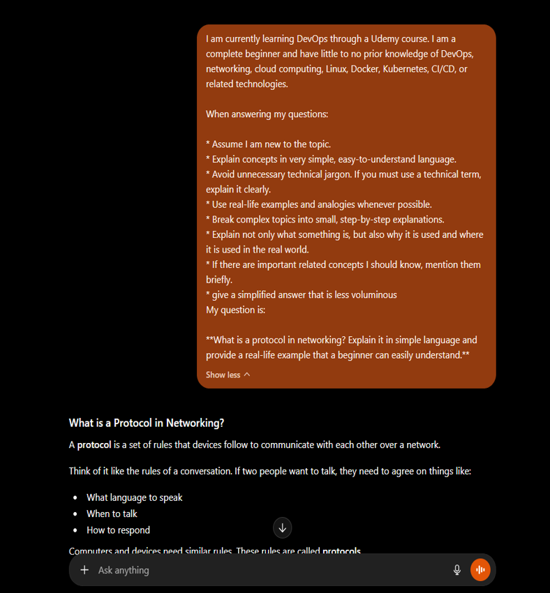
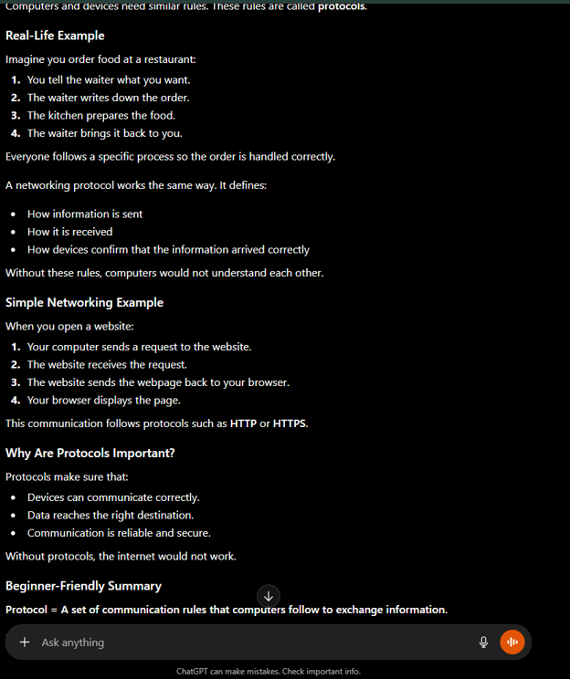
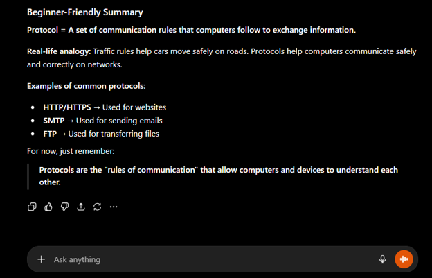
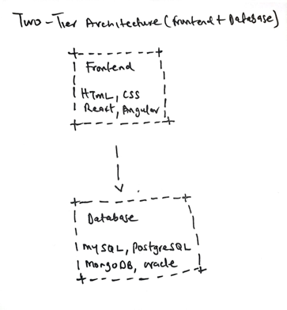
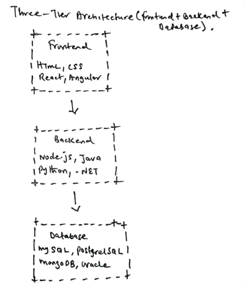
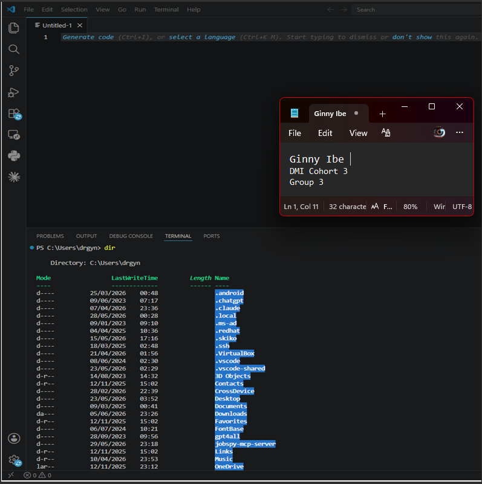

# Week 00 - Internet and Networking

Part of the DevOps Micro Internship (DMI) Cohort 3 with Agentic AI

---

# 🧑‍💻 Task 1: Using ChatGPT as Your Learning Assistant

## Scenario

You're new to DevOps and will frequently encounter technical questions. ChatGPT can be your learning companion.

## Your Task

Write a clear ChatGPT prompt to help you understand:

> "What is a protocol in networking? Explain with a simple real-life example."

Take a screenshot of your interaction showing:

* Your detailed prompt (with clear expectations)
* ChatGPT's simplified response with an example

## Screenshot

Save your screenshot in the `screenshots` folder and update the file name below.

Replace `task-1-chatgpt.png` with your actual screenshot file name.





---

## What I Learned (2–3 lines)

This week, I learned that protocols like TCP/IP ensure data is delivered reliably, while HTTP/HTTPS are used to transfer web pages securely between a browser and a web server.

---

# 🌐 Task 2: Internet and Networking

## Scenario

Your friend is launching an online bookstore named **EpicReads**.

He asked you to explain how users globally can access his website hosted in Finland.

## Your Task

Write a short explanation (**100–150 words**) that includes:

* Packet Switching
* IP Address
* TCP/IP
* HTTP/HTTPS

💡 **Tip:** You may use ChatGPT (as demonstrated in Task 1) to refine your explanation.

## Answer

When a user anywhere in the world visits EpicReads, their computer sends a request to the website hosted in Finland. The website's IP address acts like a home address, helping the request find the correct server.

The data is sent using packet switching, which means the information is broken into small pieces called packets. These packets can travel through different routes on the internet and are reassembled when they reach their destination.
TCP/IP is the set of rules that ensures the packets are sent, received, and put back together correctly. It helps devices communicate reliably over the internet.

HTTP or HTTPS is used to transfer web pages between the user's browser and the EpicReads website. HTTPS is the secure version that encrypts data, helping protect user information such as login details and payments.

---

# 🏗️ Task 3: Application Architecture & Stack

## Scenario

EpicReads bookstore has two application versions:

### Two-Tier Application

* Frontend
* Database

### Three-Tier Application

* Frontend
* Backend
* Database

## Your Task

* Draw simple diagrams (hand-drawn or tool-based such as draw.io)
* Label each layer clearly
* List at least two common technologies or tools used for each layer
* Submit a screenshot or photo clearly showing your own drawing

## Diagram Screenshot / Photo

Save your diagram image in the `screenshots` folder and update the file name below.

Replace `task-3-diagram.png` with your actual diagram file name.




---

## Technologies Used

### Frontend

* HTML (HyperText Markup Language)
* CSS (Cascading Style Sheets)

### Backend

* Node.js
* Python

### Database

* MySQL
* PostgreSQL

---

# 🌍 Task 4: Domain Name & DNS (Basic Concepts)

## Scenario

Your friend's bookstore **EpicReads** is currently accessible through:

```text
52.172.142.222:3000
```

He purchased the domain:

```text
epicreads.com
```

## Your Task

In **50–100 words**, explain in your own words:

1. What is DNS (Domain Name System)?
2. Which DNS record type should be used to connect the domain to the given IP, and why?

## Answer

DNS (Domain Name System) is like the internet's phone book. Instead of remembering a numeric IP address such as 52.172.142.222:3000, users can simply type epicreads.com into their browser. DNS translates the domain name into the correct IP address so the browser can find the website.

To connect epicreads.com to the server, an A Record should be used. An A Record maps a domain name directly to an IPv4 address. This allows visitors who enter epicreads.com to be directed to the server hosting the EpicReads website.

---

# 💻 Task 5: Visual Studio Code Setup (Hands-on)

## Your Task

Install Visual Studio Code (if not already installed).

Take a screenshot of your VS Code environment showing:

* Terminal open inside VS Code
* Running a basic command:

### Windows

```powershell
dir
```

### Linux / macOS

```bash
pwd
ls
```

* Your selected VS Code theme clearly visible

⚠️ **Important:** The screenshot must show your username or another identifiable detail to confirm it is your environment.

## Screenshot

Save your screenshot in the `screenshots` folder and update the file name below.

Replace `task-5-vscode.png` with your actual screenshot file name.



---

# 🔗 Task 6: Publish Your Assignment as a LinkedIn Post

## Objective

Publishing on LinkedIn helps you:

* Build your professional online presence
* Reinforce your learning
* Document your DevOps journey publicly

## Your Task

Summarize your answers from Tasks 1–5 into a LinkedIn post.

Clearly structure your post into the following sections:

* ChatGPT
* Internet & Networking
* App Architecture
* DNS
* VS Code Setup

Add the following credit note at the end of your post:

> **P.S. This post is a part of DevOps Micro Internship with Agentic AI Cohort-3 by Pravin Mishra. You can start your DevOps journey by joining this Discord community: https://discord.pravinmishra.com/**

---

## LinkedIn Post URL

Paste your LinkedIn post URL here:

https://www.linkedin.com/posts/dr-ginny-ibe_devops-cloudcomputing-networking-activity-7468887694417526784-gpUR?utm_source=share&utm_medium=member_desktop&rcm=ACoAAGTqulMBvpSBQMnxbzFBrJkA0C9nlWM_uqM

---

## LinkedIn Post Backup Copy

Paste the full text of your LinkedIn post here:

🚀 **Completed Week 0 of the DevOps Micro Internship (DMI) – Cohort 3!**

As someone who is new to DevOps, this week was all about building a strong foundation and understanding how applications, networks, and the internet work behind the scenes.

📌 ChatGPT
 Learned how effective prompting can help break down complex technical topics into simple, beginner-friendly explanations.

🌐 Internet & Networking
 Explored networking fundamentals, including protocols, packet switching, IP addresses, TCP/IP, and HTTP/HTTPS. These concepts help explain how data travels across the internet securely and reliably.

🏗️ Application Architecture
 Studied the difference between:
 • Two-Tier Architecture (Frontend + Database)
 • Three-Tier Architecture (Frontend + Backend + Database)

Also learned about technologies commonly used in each layer, including React, Node.js, MySQL, and PostgreSQL.

🔎 DNS
 Learned how DNS (Domain Name System) translates human-friendly domain names into IP addresses, making websites easy to access. I also learned how an A Record connects a domain name to an IPv4 address.

💻 VS Code Setup
 Configured Visual Studio Code, explored the integrated terminal, practiced basic command-line commands, and customized my development environment.

Every expert starts as a beginner, and every small step adds to the journey. Looking forward to learning more about Linux, cloud computing, containers, CI/CD, and Kubernetes in the coming weeks.

What was the first technology concept that made everything "click" for you when you started your tech journey?

hashtag#DevOps hashtag#CloudComputing hashtag#Networking hashtag#VSCode hashtag#Linux hashtag#LearningInPublic hashtag#TechLearning hashtag#DevOpsMicroInternship hashtag#BeginnerJourney hashtag#ContinuousLearning

P.S. This post is part of the FREE DevOps Micro Internship Cohort run by Pravin Mishra. You can start your DevOps journey for free from his YouTube Playlist.

You can be part of this learning community too.
JOIN HERE: https://lnkd.in/ebB9mHCD
DMI Cohort 3: https://lnkd.in/eXKqp888
Pravin Mishra Profile: https://lnkd.in/eKE3DDek

---

# Reflection – Week 0

### What did you find easy?

I found it easy to understand the basics of application architecture, especially the difference between two-tier and three-tier architectures. Setting up Visual Studio Code and using the integrated terminal was also straightforward.

---

### What was difficult?

The networking concepts were the most challenging at first, especially understanding how packet switching, TCP/IP, HTTP/HTTPS, DNS, and IP addresses all work together to deliver information over the internet.

---

### What will you improve next week?

Next week, I will spend more time practicing Linux commands and networking concepts through hands-on exercises. I also want to improve my command-line skills and gain more confidence working in the terminal.

---

## 📌 About DMI & CloudAdvisory

DevOps Micro Internship (DMI) is a project-based DevOps program run by Pravin Mishra (The CloudAdvisory) focused on real-world execution, systems thinking, and career readiness.

It helps learners build strong DevOps foundations with hands-on experience.


## 📌 Resources

- 🌐 **DMI Official Website:** https://pravinmishra.com/dmi  
- 🎓 **DevOps for Beginners (Udemy):** https://www.udemy.com/course/devops-for-beginners-docker-k8s-cloud-cicd-4-projects/  
- 🎓 **Ultimate Agentic AI DevOps with Clude Code** https://www.udemy.com/course/ultimate-agentic-ai-devops-with-claude-code/?referralCode=448389767BC96284087B
- 🎓 **DevOps with Claude Code: Terraform, EKS, ArgoCD & Helm** https://www.udemy.com/course/devops-with-claude-code-terraform-eks-argocd-helm/?referralCode=1C5B734505D65A010FA3
- ▶️ **YouTube Playlist (DMI Cohort 3):** https://www.youtube.com/playlist?list=PLFeSNDtI4Cho  
- 🔗 **Pravin Mishra (LinkedIn):** https://www.linkedin.com/in/pravin-mishra-aws-trainer/  
- 🏢 **CloudAdvisory (LinkedIn):** https://www.linkedin.com/company/thecloudadvisory/

---

*This submission is part of DevOps Micro Internship (DMI) Cohort 3 — Agentic AI Track*