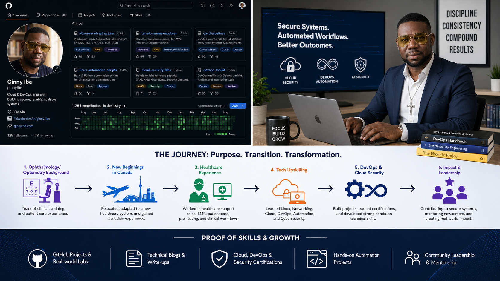
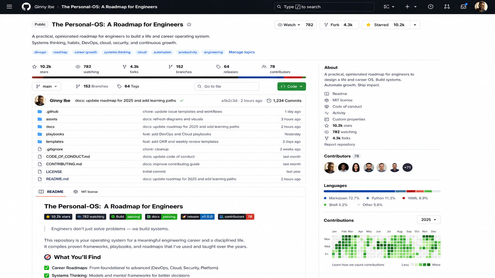
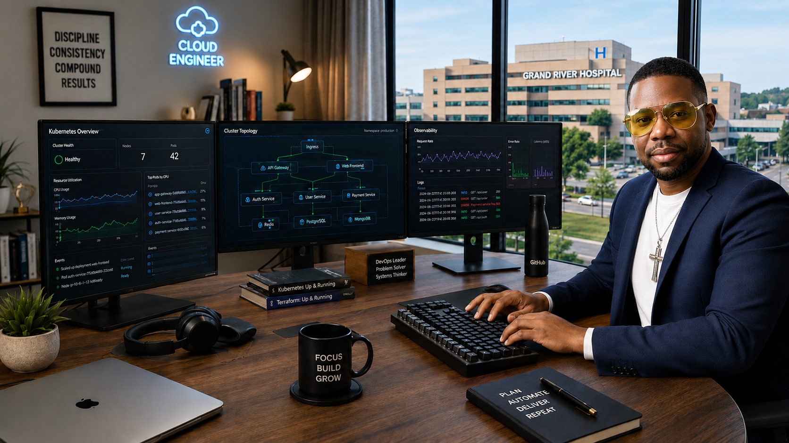
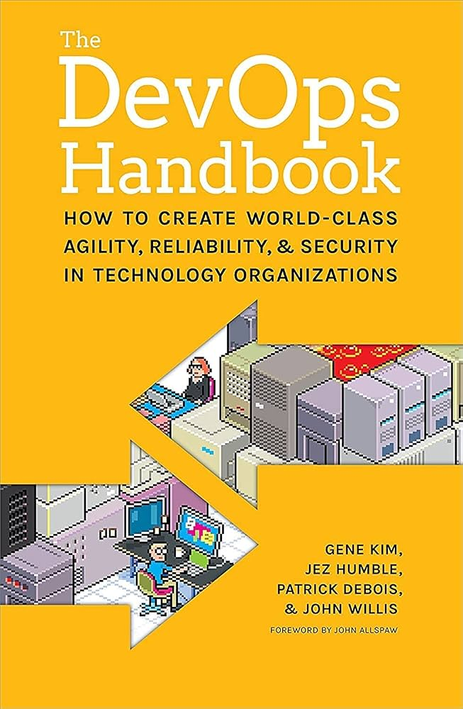
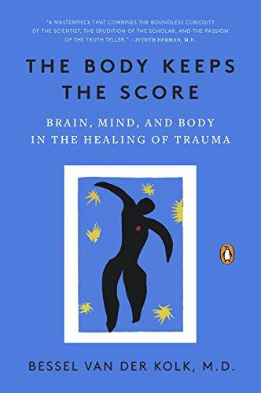
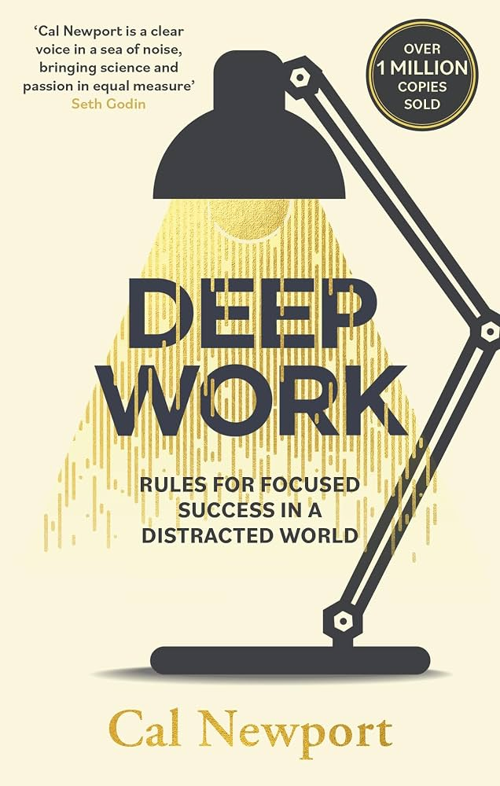
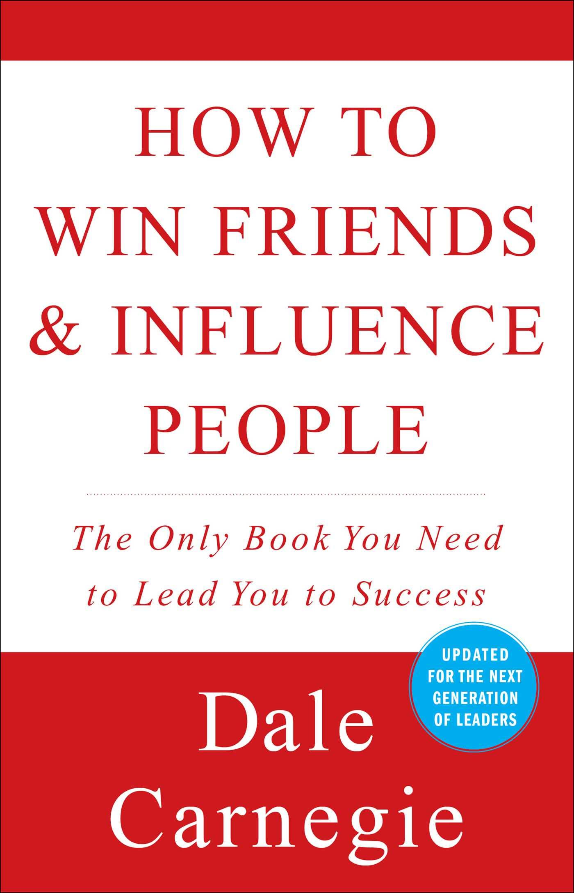
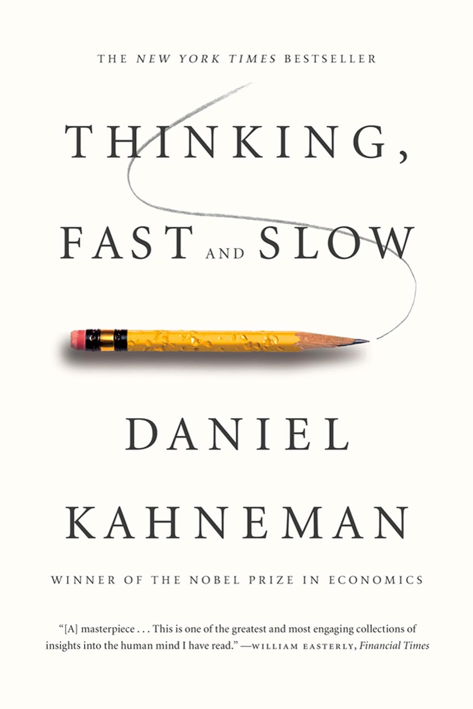
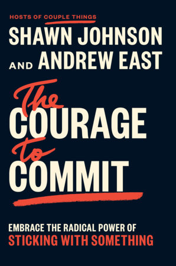

# Week 01 — Success Mindset (Mindset OS)

Part of the DevOps Micro Internship (DMI) Cohort 3 with Agentic AI

---

## Purpose (Read This First)

This week is not motivation homework.

This is you building your **Mindset OS** — the system you will use for the next 5 months (and honestly, for years).

### Expectations

* Be honest.
* Be specific.
* Be practical.
* Write like an adult professional: clear sentences, no one-liners.

You will reuse this in later weeks. So do it properly once.

---

# Assignment 1. What is something you believe to be true that most people around you would disagree with?

### Rules

* No "safe" answers.
* Must be your real belief (not copied from internet).
* Minimum 50 words.

**Hint:** What do you believe about career, money, learning, discipline, relationships, health, success, life, tech industry, etc. that most people don't agree with?

## Answer

I believe starting over is not failure; it is evidence of courage, humility, resilience, and unfinished growth. As a foreign-trained healthcare practitioner rebuilding my career in Canada while learning DevOps, I have learned that smaller roles, quiet seasons, unfamiliar systems, and disciplined repetition can become a powerful foundation for long-term success. Immigration and career transition are not gaps to explain away or hide; they prove adaptability, resilience, and discipline. My path may not look linear, but it is honest, layered, earned, and still moving forward.

---

# Assignment 2. What are the top 3 objective truths you discovered through experimentation and results?

### Definition

Objective truths do not depend on opinions. They hold true regardless of how people feel.

Write each truth in this format:

**Truth:** (1 sentence)

**Evidence from my life:** (2–4 lines: what you tried + what happened)

---

## Truth #1

### Truth

Truth: Consistency produces better results than intensity when you are trying to rebuild your career or learn a new skill.

### Evidence from my life

When I moved abroad, I had to adjust from being an experienced health care professional to learning how the Canadian workplace operates. I did not rebuild everything in one day. I improved gradually by applying for roles, rewriting my resume, preparing for interviews, taking healthcare support jobs, and learning new skills step by step. The same applies to DevOps. When I study consistently, even in small blocks, I understand more than when I try to learn everything at once.

---

## Truth #2

### Truth

Truth: Diagnostic accuracy in clinical work comes from repeated volume of exposure to how much real cases vary, not from how well you have memorizing textbook versions or cases.

### Evidence from my life

In clinical practise and ophthalmic pre-testing, no two patients presented identically even with the exact same condition — variations in cooperation levels, anatomy, or comorbidities all shifted the picture, and meant textbook descriptions only got me partway there. It was repeated exposure to atypical, messy real cases that built actual diagnostic confidence, not the initial coursework.

---

## Truth #3

### Truth

Truth: Humility accelerates learning because it allows you to accept correction, start small, and keep improving.

### Evidence from my life

As a foreign-trained healthcare professional, I had to accept that I could have strong experience and still need to learn new systems in Canada. Taking support roles in healthcare did not reduce my value; it helped me understand the environment better. The same mindset helps me in Devops and tech in general. Instead of pretending to know everything, I am learning to ask better questions, practise consistently, accept feedback, and improve my skills one step at a time. Humility has helped me grow faster than pride ever could.

---

# Assignment 3. What does your 2.0 version look like?

### Instructions

Write as if a journalist is writing about you **3 to 7 years from now** (not 20 years).

**Minimum 300 words.**

### Rules

* Write in past tense, like it already happened.
* Don't use "likes to / wants to / hopes to."
* Use specifics:

  * built
  * shipped
  * led
  * published
  * earned
  * relocated
  * contributed
* Include skills proof:

  * projects
  * portfolios
  * GitHub
  * blogs
  * certifications
  * job role
  * leadership
  * community contribution
* Add 1–3 images if you can (optional but powerful).

### Publish It Publicly On Any ONE

* LinkedIn
* Medium
* WordPress
* Blogspot
* Personal blog
* Portfolio page

Include this line:

> **P.S. This post is part of the DevOps Micro Internship (DMI) with Agentic AI — Cohort 3 — by [Pravin Mishra](https://www.linkedin.com/in/pravin-mishra-aws-trainer/). My graded progress is public: https://dmi.pravinmishra.com/s/YOUR-GITHUB-USERNAME.html · Start your DevOps journey: https://dmi.pravinmishra.com/?utm_source=student&utm_medium=ps-blog&utm_campaign=cohort3**

## Your Article

##### What My 2.0 Version Looked Like by 2030
By 2030, Ginny had become a strong example of what happened when clinical experience, immigrant resilience, DevOps discipline, cloud engineering, cybersecurity, and agentic AI innovation came together with purpose.

His story did not begin in a perfect technology company or a Silicon Valley office. It began with rebuilding. After relocating to Canada as a foreign-trained eye care professional, he stepped into the Canadian healthcare system with humility. He took on support roles, learned new workflows, adapted to Canadian workplace culture, served patients, supported clinical teams, and proved that starting over did not mean starting from zero.

Within a few years, he had successfully transitioned into a healthcare cloud technology and DevOps role. His background in ocular healthcare became an advantage rather than a limitation. He understood patient care, clinical documentation, diagnostic equipment, ophthalmic testing, medical measurements, EMR workflows, privacy concerns, and the daily pressure healthcare workers faced. That clinical insight helped him build technology solutions that were not only technical, but also practical, secure, reliable, and human-centered.

His 2.0 version was built through systems, discipline, and proof of work, not motivation alone. He earned certifications in DevOps, cloud security, cybersecurity, AI security, and agentic AI. He built a public GitHub portfolio that documented Linux labs, Docker projects, CI/CD pipelines, cloud deployment exercises, infrastructure-as-code practice, vulnerability assessments, monitoring dashboards, incident response simulations, and prompt-injection security audits. His portfolio showed evidence of skill, consistency, and career direction.

He also built, shipped, and contributed to cloud-based healthcare application projects focused on ophthalmic testing and measurements. These projects explored how secure cloud platforms collected, organized, stored, and protected OCT scan results, fundus images, visual field results, intraocular pressure readings, autorefraction findings, keratometry measurements, lensometry results, prescriptions, referrals, patient history and medication records. DevOps practices made these applications more reliable through automated testing, continuous integration, continuous deployment, monitoring, rollback planning, and incident response. Cloud engineering made the systems scalable, securely backed up, resilient, and accessible across clinical environments.

Agentic AI became one of the strongest parts of his work. He contributed to AI-assisted workflows that summarized ophthalmic test results, organized patient measurements, flagged missing clinical information, prepared structured draft reports, supported referral documentation, and identified abnormal patterns for clinician review. He understood clearly that AI did not replace nurses, doctors, optometrists, ophthalmologists, other healthcare professionals, or the clinical judgment required to care for patients . Instead, it reduced repetitive administrative burden so eye-care professionals could spend more time making decisions, educating patients, and providing compassionate care.

His work addressed some of healthcare’s biggest challenges: fragmented patient data, slow manual workflows, overworked healthcare workers, cybersecurity risks, system downtime, disconnected clinical tools, and inefficient documentation processes. He helped design systems where security, privacy, uptime, usability, and accessibility were treated as clinical responsibilities, not just technical requirements.

He also led small project initiatives that connected healthcare knowledge with technology execution. He collaborated with peers, reviewed documentation, improved workflows, tested application features, contributed to safer deployment practices, and supported knowledge sharing among newcomers and career changers. His leadership was not based on title alone; it was shown through consistency, service, accountability, and the ability to make complex technical ideas easier for others to understand.

He published technical blogs explaining DevOps, cloud security, cybersecurity, and agentic AI in simple language for healthcare professionals, newcomers, and career changers. Recruiters and mentors no longer had to guess what he could do. They could see his GitHub projects, read his blogs, review his documentation, study his shipped projects, and understand the connection between his eye-care background and his technology skills.

His community contribution also remained part of his 2.0 identity. He used his journey to encourage other immigrants, internationally trained professionals, and healthcare workers who were trying to rebuild their careers in Canada. Through mentoring, volunteering, community learning, and knowledge sharing, he proved that reinvention was not only personal; it could also create value for others.

By 2030, Ginny’s success was not described as luck. It was the result of consistent action, humility, faith, discipline, learning, leadership, and a clear identity upgrade. He had built a career that connected healthcare, ophthalmology, ophthalmic technology, cloud engineering, DevOps, cybersecurity, agentic AI, and community service.

His 2.0 version proved that reinvention was not about abandoning the past. It was about using everything he had survived, practised, learned, built, shipped, led, earned, published, and contributed to create safer, smarter, and more reliable healthcare systems.

## Screenshot

### Public Link

https://medium.com/@ginnyibe/by-2030-ginnys-story-was-no-longer-just-about-starting-over-in-a-new-country-e56ad8a38095?sharedUserId=ginnyibe

---

# Assignment 4. Have you ever cut corners (unethical / dishonest / shortcut behavior — not necessarily illegal)? If yes, how did it make you feel?

### Important

You don't need to write the full story.

Focus on the feeling:

* guilt
* fear
* shame
* stress
* regret
* numbness
* etc.

This is about self-awareness, not judgment.

### Answer Format

Yes

If Yes:

**What emotion did you feel?** (minimum 50–100 words)

## Answer

There have been times when I tried to take shortcuts because I was tired, overwhelmed, or under pressure to move faster. It was never about doing anything illegal, but more about rushing a process, not giving a task my full attention, or wanting the result without fully respecting the discipline behind it.

The main emotion I felt was guilt mixed with stress. Even when no one noticed, I noticed. Deep down, I knew I was not operating at the standard I expected from myself. That made me uncomfortable because I value professionalism, honesty, patient safety, and doing things properly.

What stayed with me was the realization that shortcuts may save time in the moment, but they create a mental burden later. They make you question your discipline, judgment, and identity. I learned that my 2.0 version must be built on patience, integrity, and accuracy, especially when no one is watching. 

---

# Assignment 5. What are 10 non-fiction books you plan to read in the next 1 year?

### Rules

* Mention **Title + Author**
* Any language allowed
* No fiction novels

### Tip

Choose books that improve:

* mindset
* communication
* productivity
* health
* money
* career
* leadership

## Book List

1. The DevOps Handbook — Gene Kim, Jez Humble, Patrick Debois, John Willis, & Nicole Forsgren

2. Body Keeps the Score: Brain, Mind, and Body in the Healing of Trauma - Bessel Van Der Kolk

3. Deep Work — Cal Newport

4. How to Win Friends and Influence People — Dale Carnegie

5. 1873 - Liaquat Ahamed

6. The Algebra of Wealth — Scott Galloway

7. Thinking, Fast and Slow — Daniel Kahneman

8. The Psychology of Money - Morgan Housel

9.  The Courage to Commit: Embrace the Radical Power of Sticking with Something - Andrew East , Shawn Johnson

10. The Four Agreements: A Practical Guide to Personal Freedom - Don Miguel Ruiz

---

# Assignment 6. What are the things you will measure regularly in your life and career?

### Rules

List topics only. No need to share numbers.

### Must Include

* Learning / skill
* Output / proof
* Health / energy
* Time / focus
* Money / finance (personal or business)

### Example

* Learning hours per week
* Deep work sessions per week
* Projects shipped / documented
* Steps / workouts
* Sleep hours
* Spending tracker

## My Metrics

* Learning hours per week
* DevOps Micro-Internship tasks completed
* AI, Agentic AI, Linux, and cloud practice sessions completed
* GitHub commits per week
* Projects shipped, improved, or documented
* Technical write-ups, blogs, or LinkedIn learning posts published
* Certifications completed or actively in progress
* Deep work sessions completed per week
* Resume, LinkedIn, GitHub, and portfolio updates
* Screen time, sleep hours, and focus quality
* Exercise, walking sessions, and weekly energy level
* Weekly spending, savings progress, and bills paid on time
* Community contribution, mentorship, or knowledge-sharing activities

### Public Link
https://www.linkedin.com/posts/dr-ginny-ibe_dmibypravinmishra-devops-agenticai-share-7478325424473903104-TXUb/?utm_source=share&utm_medium=member_desktop&rcm=ACoAAGTqulMBvpSBQMnxbzFBrJkA0C9nlWM_uqM

---

# Assignment 7. Brain Dump + 5-Month System Plan

## Step 1: Brain Dump (Private)

Do a brain dump of everything in your mind into a notebook.

Examples:

* Bills
* Tasks
* Worries
* Goals
* Pending messages
* Ideas
* Responsibilities

### Did You Do It?

 Yes

Answer:

I did a brain dump of the major things on my mind, including my DevOps Micro-Internship tasks, career transition goals, GitHub projects, resume and LinkedIn improvements, Linkedln and blog post and articles, healthcare work responsibilities, bills, personal worries, certification goals, and ideas for technical blogs. Writing everything down helped me reduce mental pressure. It also made me realize that the problem was not lack of ambition; the problem was needing a better system to organize my energy and time.

---

## Step 2: Your 5-Month Routine + Focus Blocks

Create a simple plan you can realistically follow for the next 5 months.

### Weekly Routine

Example:

* Mon–Thu: 60 min deep work
* Sat: DMI session
* Sun: Weekly review

#### My Weekly Routine

Monday:
60 minutes of deep work on Linux, Git, or cloud fundamentals,assignment work.

Tuesday:
60 minutes of DevOps practice, including Docker, CI/CD, GitHub Actions, or Kubernetes basics.

Wednesday:
45–60 minutes of project work, GitHub documentation, README updates, screenshots, or portfolio improvement.

Thursday:
Submit assignments and spend 60 minutes strengthening cloud security, cybersecurity, automation, or Agentic AI skills. Document progress and prepare weekly proof of work for LinkedIn and Medium.

Friday:
Light review day: update notes, clean up GitHub repositories, organize tasks, and watch one technical lesson.

Saturday:
Attend the main DMI session, complete hands-on labs, build projects, improve my portfolio, and publish weekly proof of work through LinkedIn posts and Medium blogs.

Sunday:
Weekly review, planning, rest, church/community/family time, and preparation for the new week.

---

### Focus Blocks

#### When Will You Do DMI Work? (Days + Time)

Monday to Thursday: 9:30 p.m. – 11:30 p.m.
Saturday afternoon or evening: 2–3 hours of focused DMI/project work
Sunday evening: 30–45 minutes weekly review and planning

#### How Many Sessions Per Week?

5 focused sessions per week.

This is realistic because I am balancing work, family, career rebuilding, healthcare experience, and personal responsibilities. I do not need a perfect schedule; I need a repeatable one.

---

### Distraction Rules

Examples:

* Phone rules
* Social media rules
* Environment setup

#### My Distraction Rules

I will keep my phone away during deep work sessions.
I will use my phone and social media only after completing my planned study or project block.
I will not open random YouTube videos during DMI work unless they directly support the topic I am studying.
I will keep only the necessary tabs open: course material, GitHub, terminal, documentation, and notes.
I will prepare my laptop, notebook, charger, and water before each focus session.
I will write down distracting thoughts instead of stopping my work to act on them immediately.
I will work in a clean space because a messy environment increases mental stress and reduces focus.
I will use a timer for 45–60 minute focus blocks.
I will use GitHub as proof of work, not just private notes.
I will review my GitHub and project progress every Sunday.
I will avoid comparing my progress with people who started earlier than me.
I will measure consistency, not perfection.
I will protect my sleep because poor rest affects focus, discipline, and learning quality.
I will remind myself that my future career is being built one focused block at a time.

---

# Reflection – Week 1

### Biggest insight I got about myself this week

My biggest insight this week is that I am not starting from zero; I am rebuilding from experience. My background in ophthalmology/optometry, patient care and treatment, clinical workflows, and healthcare support has already trained me in discipline, documentation, attention to detail, and responsibility. Now I am learning how to transfer those same strengths into DevOps, cloud security, automation, and technical problem-solving.

I also realized that my future will not be built by motivation alone. It will be built by systems. When I look at my journey as a newcomer in Canada, a foreign-trained healthcare professional, and someone transitioning into tech, I can see that small consistent actions matter more than waiting for the perfect time. My 2.0 version will come from showing up repeatedly, documenting my work, building projects, improving my GitHub, and staying patient with the process.

### My biggest weakness/loop I noticed

The biggest loop I noticed is that I sometimes overthink, wait to feel fully ready, or try to perfect everything before taking action. Because I have a strong professional background, it can feel uncomfortable to become a beginner again in a new field. Sometimes I compare my current tech level with people who started earlier, instead of respecting my own transition timeline.

I also noticed that I can consume information without always turning it into visible proof. Watching videos, reading notes, or learning concepts is good, but it is not enough. I need to convert learning into GitHub commits, documented projects, write-ups, and practical outputs. My weakness is not lack of ambition; it is needing a stronger routine that turns effort into proof.

### One system I will implement from this week (exact habit + time)

I commit to one focused hour every Monday to Thursday from 10:00 to 11:00 p.m. dedicated to my DevOps Micro-Internship, Linux, GitHub, cloud security, and hands-on projects. During this time, distractions stay off and learning comes first. Saturdays are for deeper project work, while Sundays are for reflecting on my progress, documenting what I've learned, and planning the week ahead. My goal is simple: learn, build, document, and repeat.

### LinkedIn Post

https://www.linkedin.com/posts/dr-ginny-ibe_dmibypravinmishra-devops-agenticai-activity-7478574053218242560-1mc7?utm_source=share&utm_medium=member_desktop&rcm=ACoAAGTqulMBvpSBQMnxbzFBrJkA0C9nlWM_uqM

---

## 10. Proof of Work

- LinkedIn Post URL1: **https://www.linkedin.com/posts/dr-ginny-ibe_dmibypravinmishra-devops-agenticai-share-7478325424473903104-TXUb/?utm_source=share&utm_medium=member_desktop&rcm=ACoAAGTqulMBvpSBQMnxbzFBrJkA0C9nlWM_uqM**
- LinkedIn Post URL2:
  **https://www.linkedin.com/posts/dr-ginny-ibe_dmibypravinmishra-devops-agenticai-activity-7478574053218242560-1mc7?utm_source=share&utm_medium=member_desktop&rcm=ACoAAGTqulMBvpSBQMnxbzFBrJkA0C9nlWM_uqM**

- Blog / Medium : 
  **https://medium.com/@ginnyibe/by-2030-ginnys-story-was-no-longer-just-about-starting-over-in-a-new-country-e56ad8a38095?sharedUserId=ginnyibe**  

---

## 📌 About DMI & CloudAdvisory

DevOps Micro Internship (DMI) is a project-based DevOps program run by Pravin Mishra (The CloudAdvisory) focused on real-world execution, systems thinking, and career readiness.

It helps learners build strong DevOps foundations with hands-on experience.

## 📌 Resources

- 🌐 **DMI Official Website:** https://pravinmishra.com/dmi  
- 🎓 **DevOps for Beginners (Udemy):** https://www.udemy.com/course/devops-for-beginners-docker-k8s-cloud-cicd-4-projects/  
- 🎓 **Ultimate Agentic AI DevOps with Clude Code** https://www.udemy.com/course/ultimate-agentic-ai-devops-with-claude-code/?referralCode=448389767BC96284087B
- 🎓 **DevOps with Claude Code: Terraform, EKS, ArgoCD & Helm** https://www.udemy.com/course/devops-with-claude-code-terraform-eks-argocd-helm/?referralCode=1C5B734505D65A010FA3
- ▶️ **YouTube Playlist (DMI Cohort 3):** https://www.youtube.com/playlist?list=PLFeSNDtI4Cho  
- 🔗 **Pravin Mishra (LinkedIn):** https://www.linkedin.com/in/pravin-mishra-aws-trainer/  
- 🏢 **CloudAdvisory (LinkedIn):** https://www.linkedin.com/company/thecloudadvisory/

---

*This submission is part of DevOps Micro Internship (DMI) Cohort 3 — Agentic AI Track*