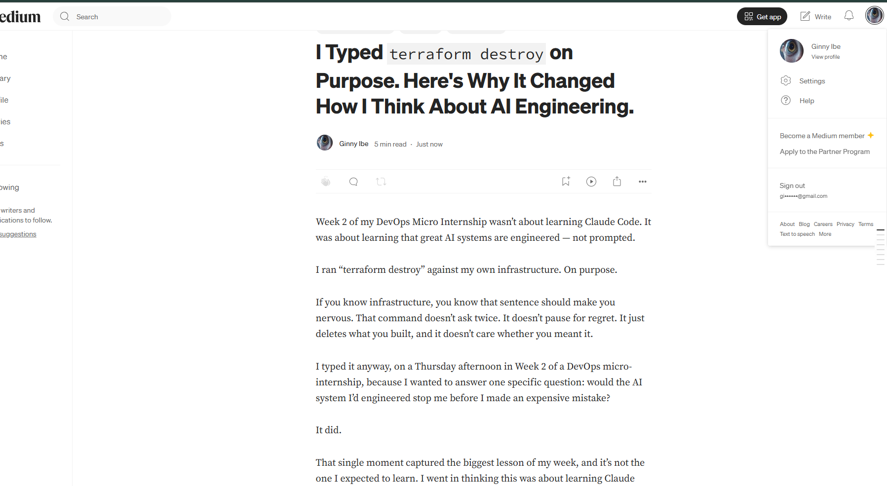
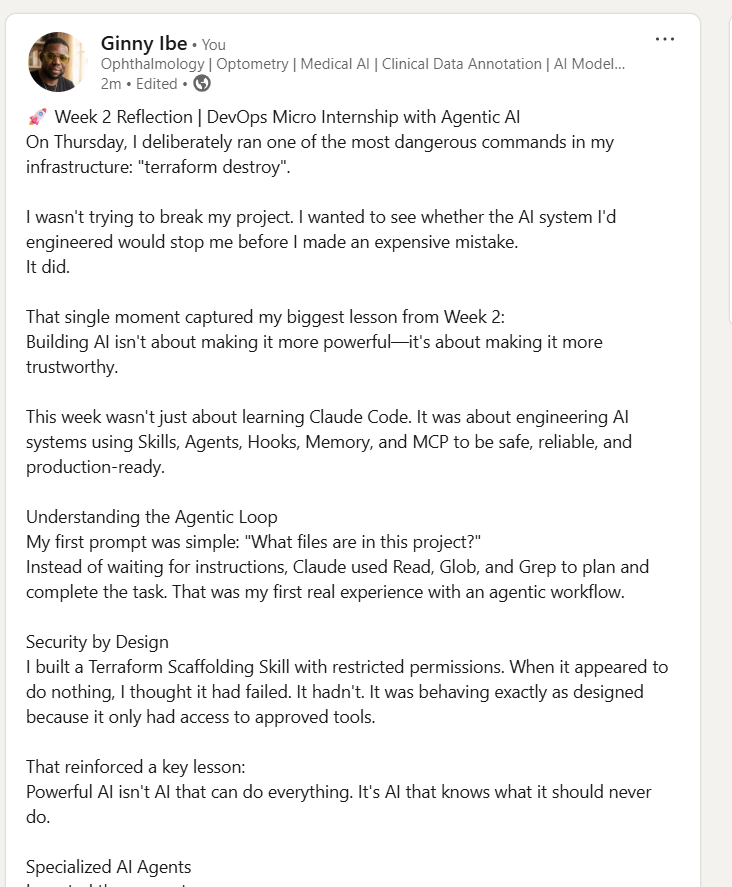

# Assignment 8 — Week 2 Reflection Blog

Part of the DevOps Micro Internship (DMI) Cohort 3 with Agentic AI

---

# Purpose

In this assignment, you will reflect on your Week 2 learning journey and write a short blog capturing your experience working with Agentic AI tools such as Claude Code, Skills, Subagents, MCP, Hooks, Permissions, and Memory.

You will also publish a LinkedIn post summarizing your learning and share both links for evaluation.

---

# Task 1 — Write Your Reflection Blog

## Goal

Write a reflection blog covering your Week 2 learning experience.

### Blog Requirements

Your blog must include:

* Title: **Reflection – Week 2**
* Minimum 300 words
* At least 2–3 topics from Week 2 (Claude Code, Skills, Subagents, MCP, Hooks, Permissions, Memory)
* Honest personal reflection (learning, challenges, mindset)
* One habit/system you plan to implement
* Your full name clearly visible

### Allowed Platforms

You can publish your blog on:

* Hashnode
* Medium
* Dev.to
* LinkedIn Article
* GitHub Markdown file
* Substack

---

### Evidence

#### Screenshot 1 — Blog published and visible



---

### Submission Field

Blog Link:

https://medium.com/@ginnyibe/i-typed-terraform-destroy-on-purpose-heres-why-it-changed-how-i-think-about-ai-engineering-00889e15d42e

---

# Task 2 — Create LinkedIn Post

## Goal

Share your Week 2 learning publicly on LinkedIn.

---

### LinkedIn Post Requirements

Your post must include:

* One screenshot from any Week 2 assignment
* Short reflection (what you learned or built)
* Required P.S. line exactly as given below

---

### Required P.S. Line (Must Include Exactly)

P.S. This post is a part of DevOps Micro Internship with Agentic AI Cohort-3 by Pravin Mishra. You can start your DevOps journey by joining this Discord community ( [https://discord.pravinmishra.com/](https://discord.pravinmishra.com/) ).

---

### Suggested Hashtags

#DMIByPravinMishra #AgenticAI #ClaudeCode #DevOps #LearningInPublic

---

### Evidence

#### Screenshot 2 — LinkedIn post published



---

### Submission Field

LinkedIn Post Content (copy-paste here):

```
🚀 Week 2 Reflection | DevOps Micro Internship with Agentic AI
On Thursday, I deliberately ran one of the most dangerous commands in my infrastructure: "terraform destroy".

I wasn't trying to break my project. I wanted to see whether the AI system I'd engineered would stop me before I made an expensive mistake.
It did.

That single moment captured my biggest lesson from Week 2:
Building AI isn't about making it more powerful—it's about making it more trustworthy.

This week wasn't just about learning Claude Code. It was about engineering AI systems using Skills, Agents, Hooks, Memory, and MCP to be safe, reliable, and production-ready.

Understanding the Agentic Loop
My first prompt was simple: "What files are in this project?"
Instead of waiting for instructions, Claude used Read, Glob, and Grep to plan and complete the task. That was my first real experience with an agentic workflow.

Security by Design
I built a Terraform Scaffolding Skill with restricted permissions. When it appeared to do nothing, I thought it had failed. It hadn't. It was behaving exactly as designed because it only had access to approved tools.

That reinforced a key lesson:
Powerful AI isn't AI that can do everything. It's AI that knows what it should never do.

Specialized AI Agents
I created three agents:
 🔒 Security Auditor
 💰 Cost Optimizer
 🏗️ Terraform Writer

Watching Claude automatically delegate work to the right specialist felt less like prompting a chatbot and more like working with an engineering team.

Engineering AI Safety
I built a pre-tool-use Hook to block destructive commands.
When I intentionally ran terraform destroy, the Hook stopped it immediately.

That changed how I think about AI safety.
The safest AI systems don't rely on good intentions. They rely on good architecture.

Persistent Memory
I stored project preferences and coding constraints in Claude's memory. In a new session, Claude recalled them without me repeating the context, showing how memory creates more consistent collaboration.

My Biggest Takeaways
✅ Agentic AI is about autonomous problem-solving.
✅ Guardrails matter more than raw model capability.
✅ The real product isn't the model—it's the engineering around it.

Skills + Agents + Hooks + Memory + MCP transform an LLM into a dependable engineering assistant.

A huge thank you to Pravin Mishra, Anjana Muthunayake, and all our Group Co-Mentors Ranbir Kaur, Bhupendra Bhati, and Greg Odi for your guidance. for teaching us how to build AI systems that are secure, scalable, and production-ready.

💬 Question: What's one engineering guardrail you've implemented that prevented a costly mistake?

P.S.
 This post is part of my DevOps Micro Internship (DMI) with Agentic AI – Cohort 3, led by Pravin Mishra. Join our Discord community: discord.pravinmishra.com

hashtag#DMIByPravinMishra hashtag#DevOps hashtag#AgenticAI hashtag#ClaudeCode hashtag#Terraform hashtag#DevSecOps hashtag#MCP hashtag#CloudEngineering hashtag#AIEngineering
```

---

### LinkedIn Post Link:

https://www.linkedin.com/posts/dr-ginny-ibe_dmibypravinmishra-devops-agenticai-activity-7482205106373910529-Jved?utm_source=share&utm_medium=member_desktop&rcm=ACoAAGTqulMBvpSBQMnxbzFBrJkA0C9nlWM_uqM

---

# Submission Instructions

* Blog must be publicly accessible
* LinkedIn post must be visible (public or unlisted where applicable)
* All required fields must be filled
* Screenshot proofs must be added to GitHub repository
* Do not include sensitive information in blog or post

---

# Completion Checklist

* [ ] Blog written with required structure
* [ ] Blog includes at least 2–3 Week 2 topics
* [ ] Blog is publicly accessible
* [ ] LinkedIn post created
* [ ] Required P.S. line included
* [ ] LinkedIn post content copied in submission field
* [ ] Blog link added
* [ ] LinkedIn post link added
* [ ] Screenshots added to GitHub repo

---

# About DMI & CloudAdvisory

DevOps Micro Internship (DMI) is a project-based DevOps program run by Pravin Mishra (The CloudAdvisory), focused on real-world execution, systems thinking, and agentic AI workflows.

It helps learners build strong DevOps foundations through hands-on experience.

---

# Resources

* 🌐 DMI Official Website: [https://pravinmishra.com/dmi](https://pravinmishra.com/dmi)
* 🎓 DevOps for Beginners (Udemy): [https://www.udemy.com/course/devops-for-beginners-docker-k8s-cloud-cicd-4-projects/](https://www.udemy.com/course/devops-for-beginners-docker-k8s-cloud-cicd-4-projects/)
* 🎓 Agentic AI DevOps with Claude Code: [https://www.udemy.com/course/ultimate-agentic-ai-devops-with-claude-code/](https://www.udemy.com/course/ultimate-agentic-ai-devops-with-claude-code/)
* 🎓 DevOps with Claude Code: Terraform, EKS, ArgoCD & Helm: [https://www.udemy.com/course/devops-with-claude-code-terraform-eks-argocd-helm/](https://www.udemy.com/course/devops-with-claude-code-terraform-eks-argocd-helm/)
* ▶️ YouTube Playlist: [https://www.youtube.com/playlist?list=PLFeSNDtI4Cho](https://www.youtube.com/playlist?list=PLFeSNDtI4Cho)
* 🔗 Pravin Mishra (LinkedIn): [https://www.linkedin.com/in/pravin-mishra-aws-trainer/](https://www.linkedin.com/in/pravin-mishra-aws-trainer/)
* 🏢 CloudAdvisory (LinkedIn): [https://www.linkedin.com/company/thecloudadvisory/](https://www.linkedin.com/company/thecloudadvisory/)

