# Assignment 5 — Bash Script Automation Drill (OPS Checklist)

Part of the DevOps Micro Internship (DMI) Cohort 3 with Agentic AI

---

## Purpose

In this assignment, you will practice Bash scripting by building a series of small automation scripts covering environment setup, variables, arrays, loops, file conditionals, if-else logic, and functions. These scripts form the foundation of real-world Linux automation used in DevOps, cloud, and production support environments.

---

# Task 1 — Bash Environment & Workspace Setup

## Goal

Verify that Bash is available on your system and create a clean workspace for this assignment.

### Evidence

#### Screenshot 1 — Output of `echo $SHELL` and `bash --version`

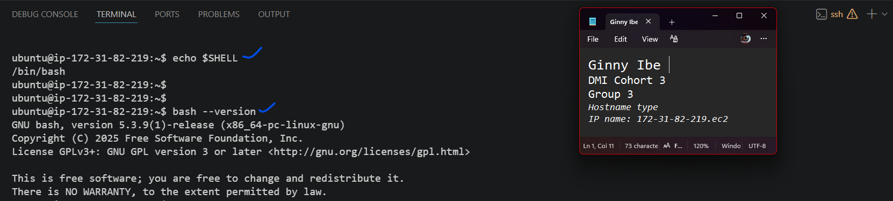

---

#### Screenshot 2 — Output of `pwd` and `ls -lah` showing the scripts directory

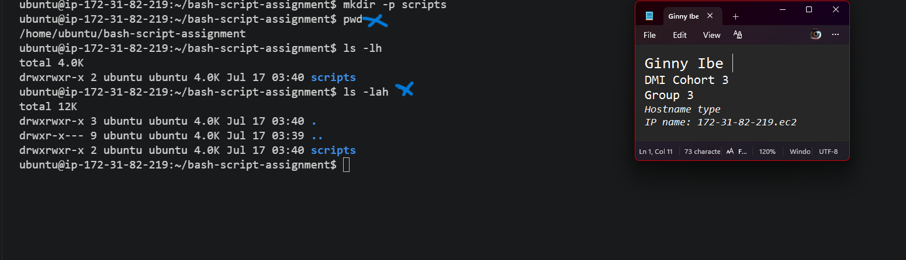

---

### Notes

Answer the following in your own words:

**1. What is Bash?**

Bash (Bourne Again Shell) is a command-line shell and scripting language used to interact with Linux. It allows users to run commands and automate tasks using scripts.

---

**2. What is the difference between shell and Bash?**

A shell is a program that lets you communicate with the operating system. Bash is one type of shell that provides additional features for command execution and scripting.

---

**3. Why is it important to confirm the Bash version before writing scripts?**

Checking the Bash version ensures that the features and syntax used in your script are supported by the installed version of Bash.

---

# Task 2 — Your First Bash Script

## Goal

Create your first Bash script, make it executable, and run it from the terminal.

### Evidence

#### Screenshot 1 — Content of `first-script.sh`

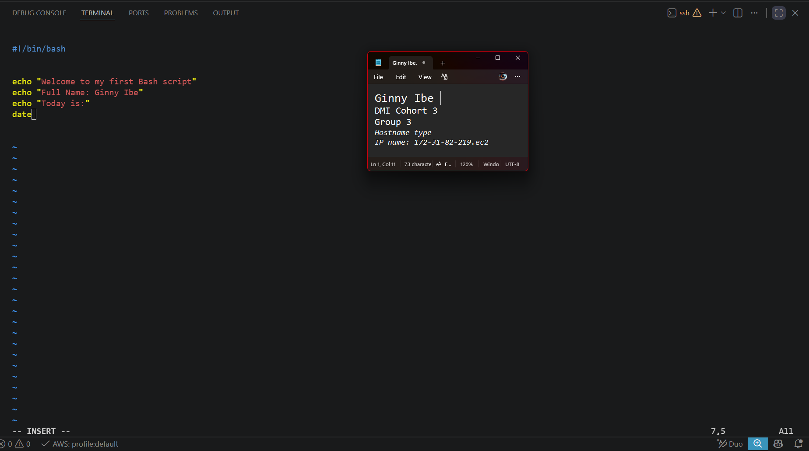

---

#### Screenshot 2 — Output of `./first-script.sh`

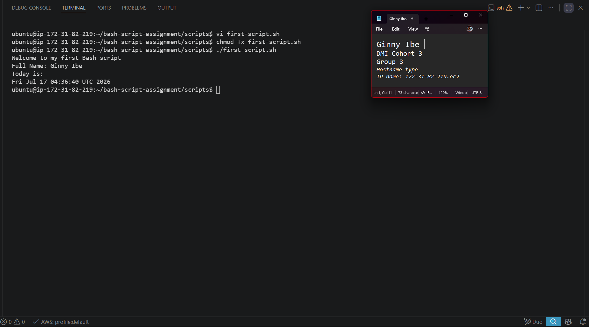

---

#### Screenshot 3 — Output of `ls -l first-script.sh` showing executable permission

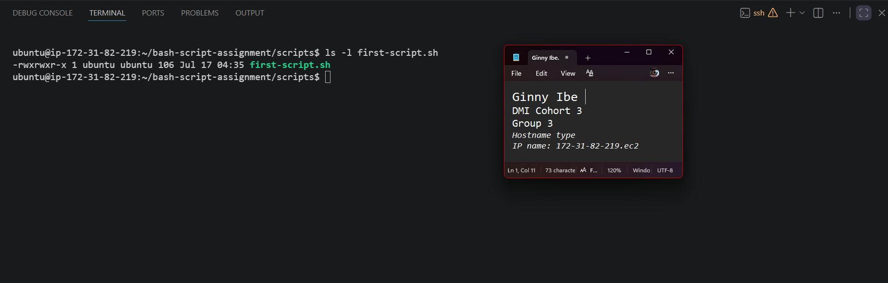

---

### Notes

Answer the following in your own words:

**1. What is the purpose of `#!/bin/bash`?**

It is called the shebang. It tells the operating system to use the Bash interpreter to execute the script.

---

**2. Why do we use `chmod +x` before running a script?**

The `chmod +x` command gives the script execute permission so it can be run directly.

---

**3. What is the difference between running a script using `./script.sh` and `bash script.sh`?**

`./script.sh` runs the script directly and requires execute permission. `bash script.sh` runs the script using Bash and does not require execute permission.

---

# Task 3 — Variables: User Information Script

## Goal

Use variables to store and display user-related information.

### Evidence

#### Screenshot 1 — Content of `user-info.sh`

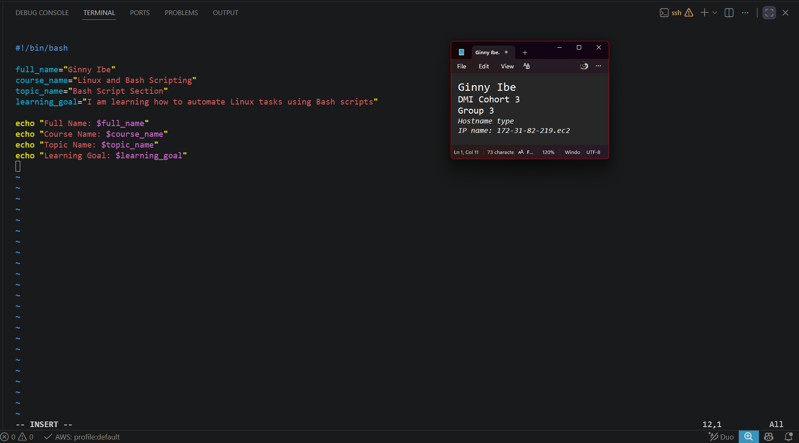

---

#### Screenshot 2 — Output of `./user-info.sh`

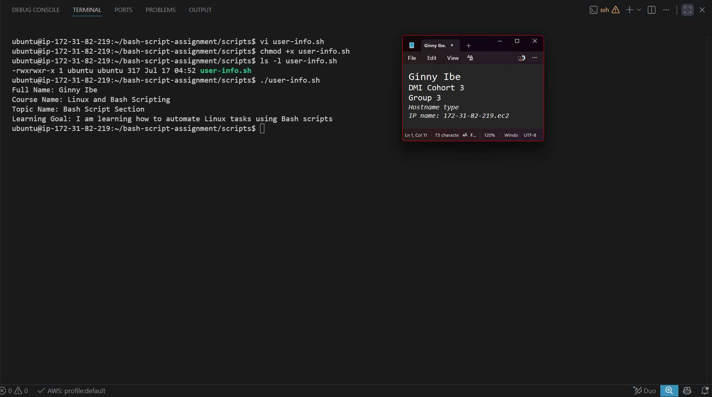

---

### Notes

Answer the following in your own words:

**1. What is a variable in Bash?**

A variable is a named storage location that holds a value which can be used later in the script.

---

**2. Why should we avoid spaces around the `=` sign when creating variables?**

Bash treats spaces as separators. Adding spaces around = causes Bash to interpret the statement incorrectly.

---

**3. How do you access the value stored inside a Bash variable?**

To access the value stored in a Bash variable, place the `$` symbol before the variable name. For example, `echo $name` displays the value stored in the variable.

---

# Task 4 — Arrays & Loops: Tools Checklist Script

## Goal

Use arrays and loops to print a checklist of tools used in Bash scripting.

### Evidence

#### Screenshot 1 — Content of `tools-checklist.sh`

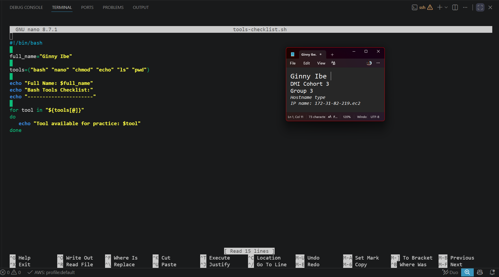

---

#### Screenshot 2 — Output of `./tools-checklist.sh`

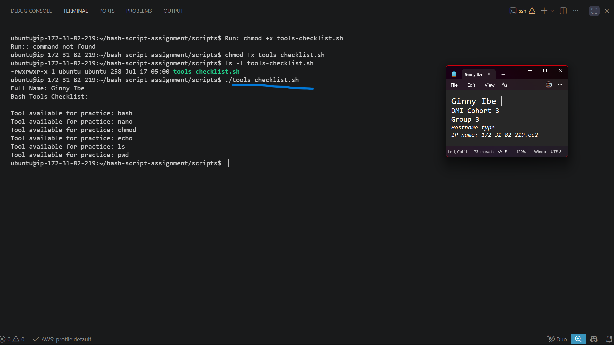

---

### Notes

Answer the following in your own words:

**1. What is an array in Bash?**

An array is a variable that can store multiple values under a single name.

---

**2. Why are arrays useful in scripts?**

Arrays keep related data together and make it easier to process multiple values using loops.

---

**3. What does `"${tools[@]}"` mean?**

It represents all the values stored in the tools array so each item can be processed individually.

---

**4. What is the purpose of the `for` loop in this script?**

The for loop goes through each item in the array and prints it one at a time.

---

# Task 5 — Loops: Number Counter Script

## Goal

Use loops to repeat a task multiple times.

### Evidence

#### Screenshot 1 — Content of `counter.sh`

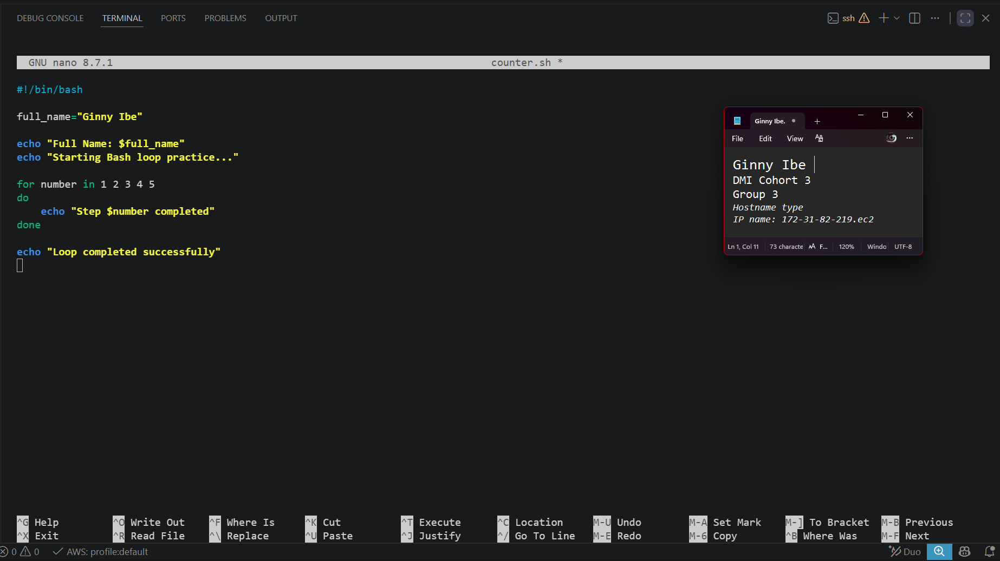

---

#### Screenshot 2 — Output of `./counter.sh`

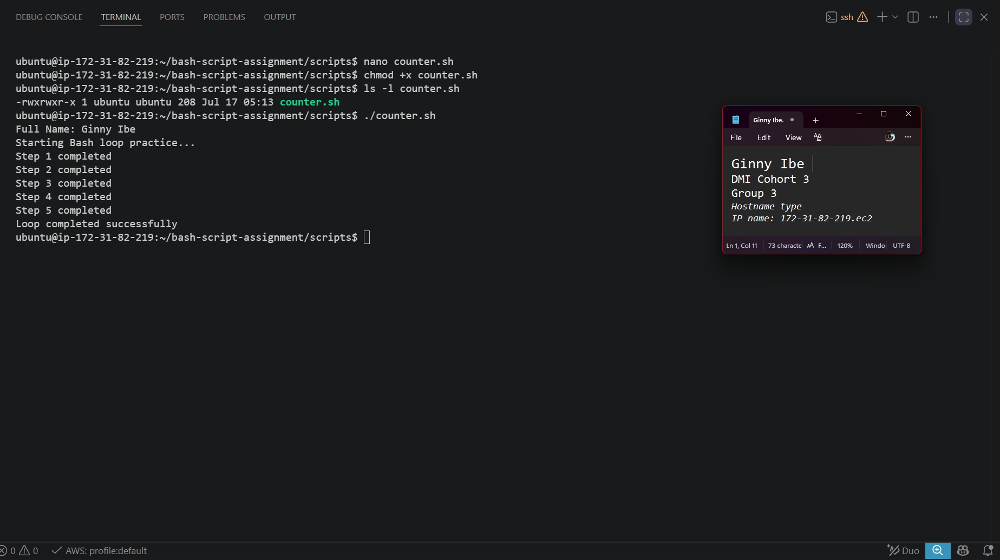

---

### Notes

Answer the following in your own words:

**1. What is a loop?**

A loop is a programming structure that repeats a set of commands until all specified values have been processed.

---

**2. Why do we use loops in Bash scripting?**

Loops automate repetitive tasks, making scripts shorter and more efficient.

---

**3. How many times did the loop run in your script?**

The loop ran five times because it processed the numbers 1 through 5.

---

**4. What would you change if you wanted the loop to run 10 times?**

I would update the loop to include the numbers 1 through 10 or use a range like {1..10}.

---

# Task 6 — Files & Conditionals: File Validation Script

## Goal

Use file checks and conditionals to verify whether files and directories exist.

### Evidence

#### Screenshot 1 — Output of `ls -lah ../test-folder`

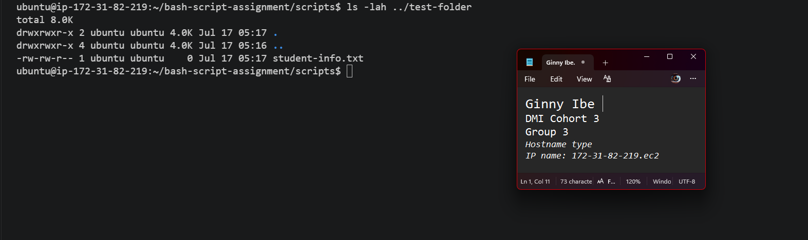

---

#### Screenshot 2 — Content of `file-check.sh`

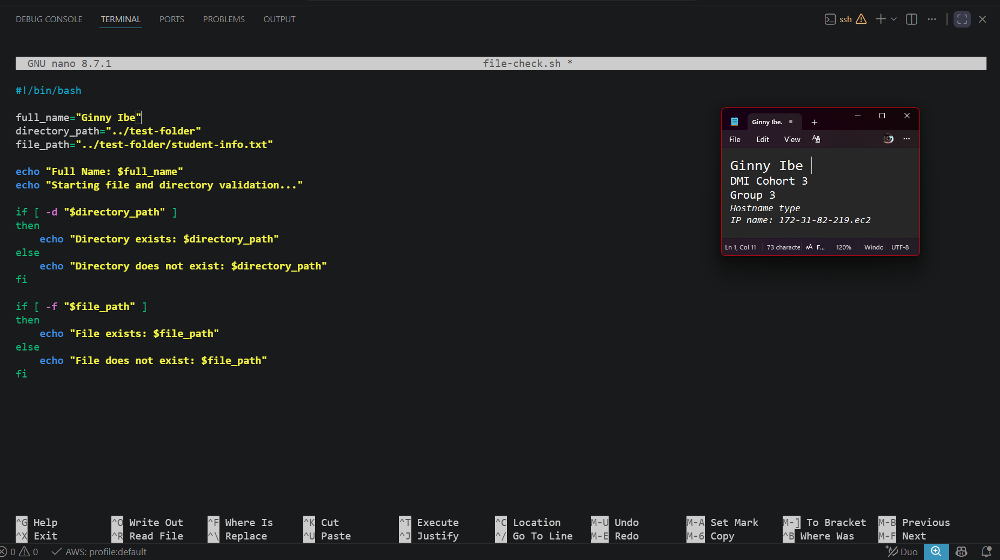

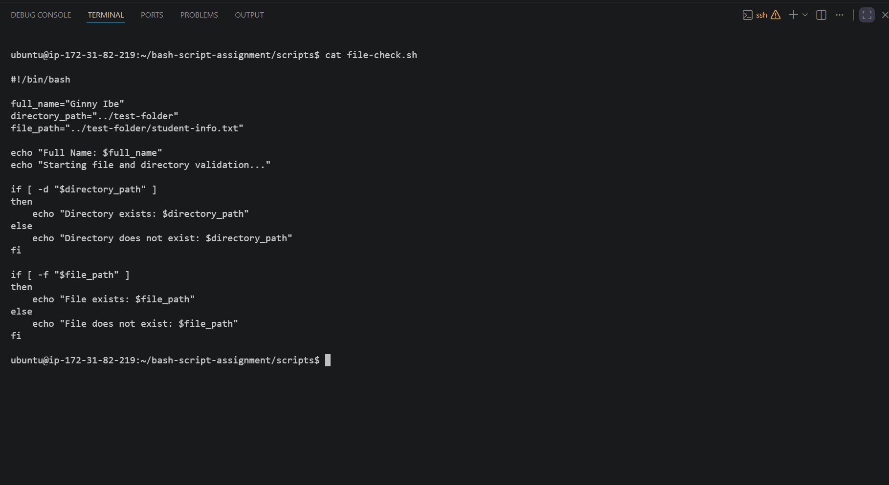

---

#### Screenshot 3 — Output of `./file-check.sh`

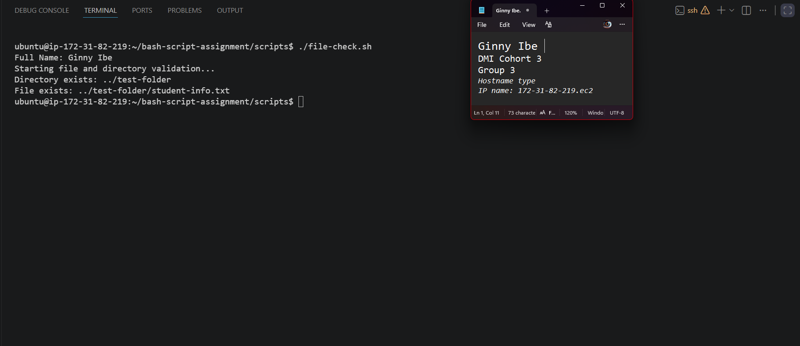

---

### Notes

Answer the following in your own words:

**1. What does `-d` check in Bash?**

The `-d` option checks whether a specified path exists and is a directory.

---

**2. What does `-f` check in Bash?**

The `-f` option checks whether a specified path exists and is a regular file.

---

**3. Why should file and directory paths be stored in variables?**

Using variables makes scripts easier to read, maintain, and update because the path only needs to be changed in one place.

---

**4. What happens if the file does not exist?**

The condition evaluates to false, and the commands inside the else `else` block are executed.

---

# Task 7 — Conditionals: Pass or Retry Script

## Goal

Use if-else conditionals to make decisions based on a variable value.

### Evidence

#### Screenshot 1 — Content of `score-check.sh` with `score=85`
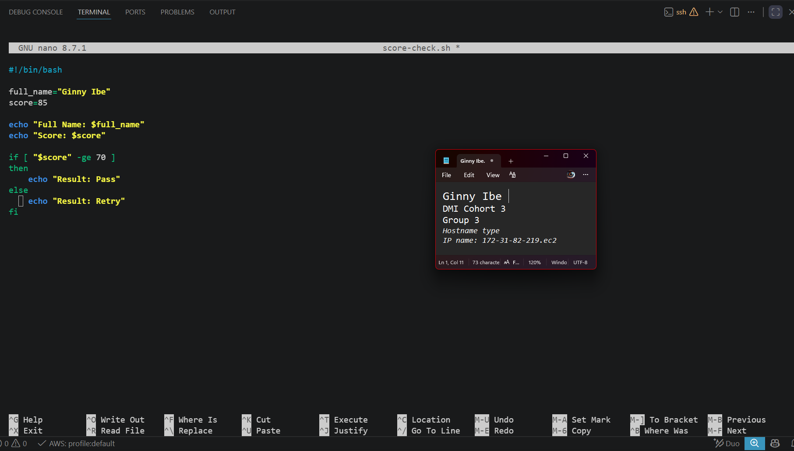

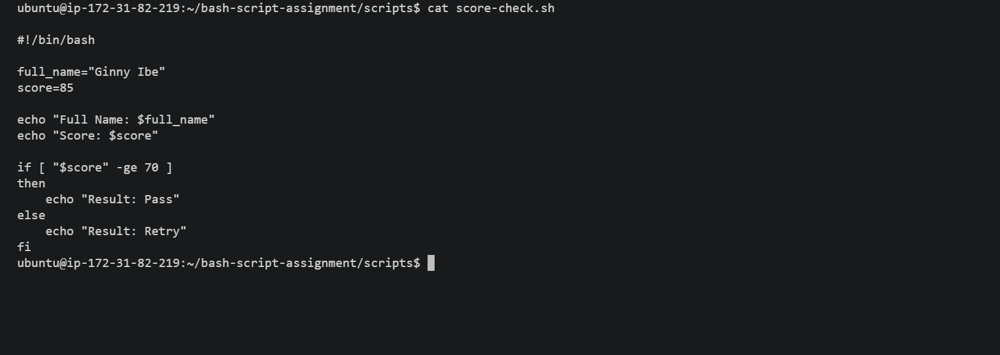

---

#### Screenshot 2 — Output showing `Result: Pass`

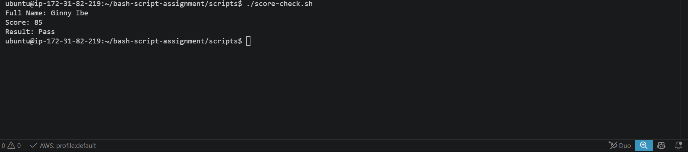

---

#### Screenshot 3 — Content of `score-check.sh` with `score=55`

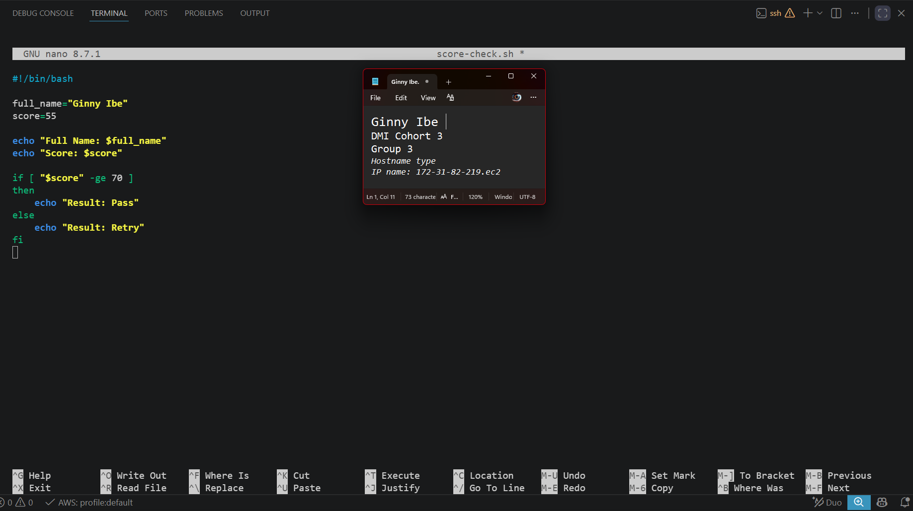

---

#### Screenshot 4 — Output showing `Result: Retry`

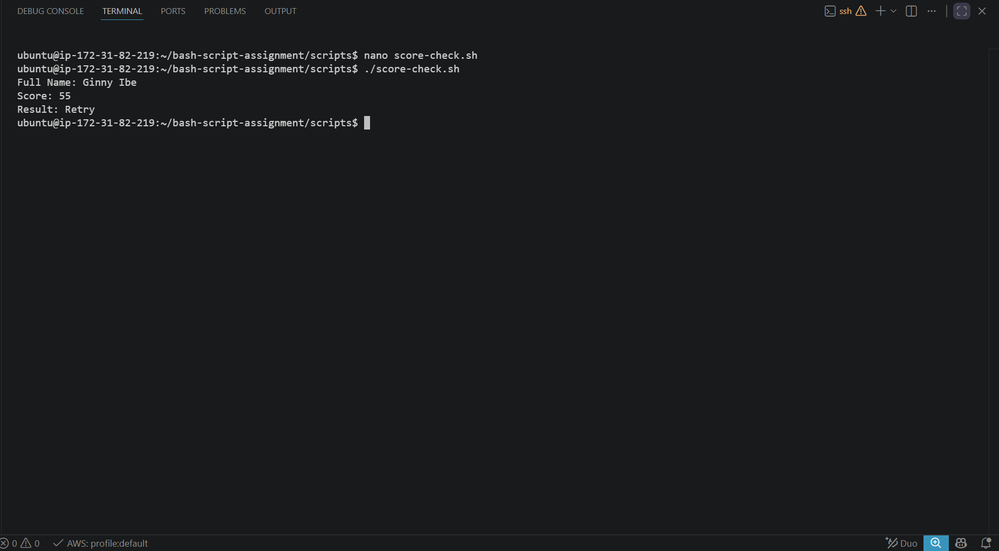

---

### Notes

Answer the following in your own words:

**1. What is the purpose of if-else in Bash?**

An `if-else` statement allows the script to make decisions and execute different commands based on whether a condition is true or false.

---

**2. What does `-ge` mean?**

`-ge` means greater than or equal to. It is used to compare numeric values.

---

**3. Why should conditions be tested with different values?**

Testing different values confirms that both the true and false conditions work correctly and helps identify errors.

---

**4. How can conditionals help in automation scripts?**

Conditionals allow scripts to make decisions automatically based on the current situation, such as checking whether a file exists or a service is running.

---

# Task 8 — Functions: Final Bash Automation Script

## Goal

Create a final Bash script using functions to organize reusable code.

### Evidence

#### Screenshot 1 — Content of `final-automation.sh`

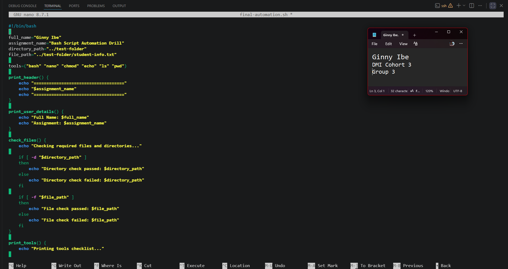

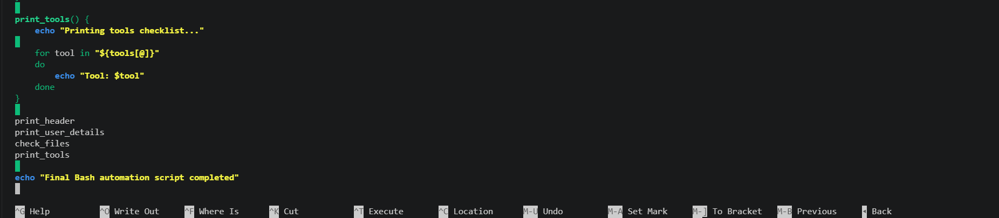

---

#### Screenshot 2 — Output of `./final-automation.sh`

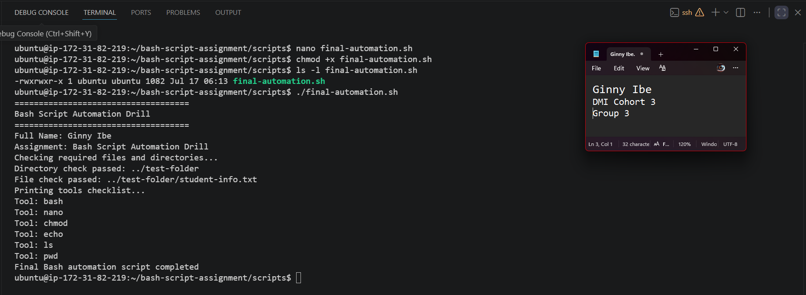

---

#### Screenshot 3 — Output of `ls -lah` showing all created scripts

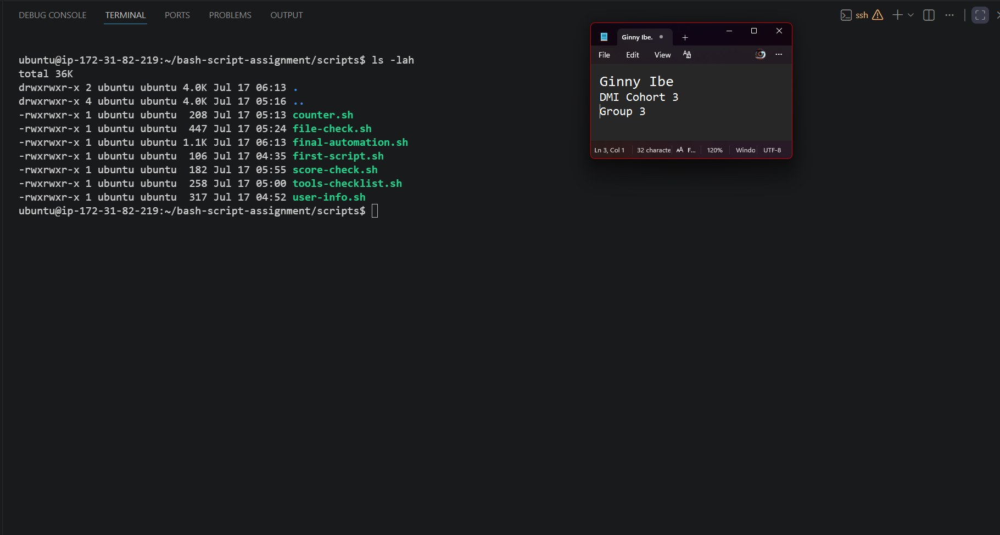

---

### Notes

Answer the following in your own words:

**1. What is a function in Bash?**

A function is a reusable block of commands that performs a specific task when it is called.

---

**2. Why are functions useful in scripts?**

Functions organize code into smaller sections, reduce repetition, and make scripts easier to read and maintain.

---

**3. Which functions did you create in this script?**

The script contains four functions:
- `print_header`
- `print_user_details`
- `check_files`
- `print_tools`

---

**4. How does this final script combine variables, arrays, loops, conditionals, files, and functions?**

The script uses variables to store information such as the user's name and file paths. It uses an array to store tool names, a loop to display each tool, conditionals to check whether the required file and directory exist, and functions to organize the tasks into reusable sections. Together, these features create a structured and automated Bash script.

---

# LinkedIn Post (Required)

## Evidence

#### LinkedIn Post URL

Paste your LinkedIn post URL here:

https://www.linkedin.com/posts/dr-ginny-ibe_devops-linux-bash-share-7484217690522378243-f4qD/?utm_source=share&utm_medium=member_desktop&rcm=ACoAAGTqulMBvpSBQMnxbzFBrJkA0C9nlWM_uqM

---

#### Screenshot — Published LinkedIn post

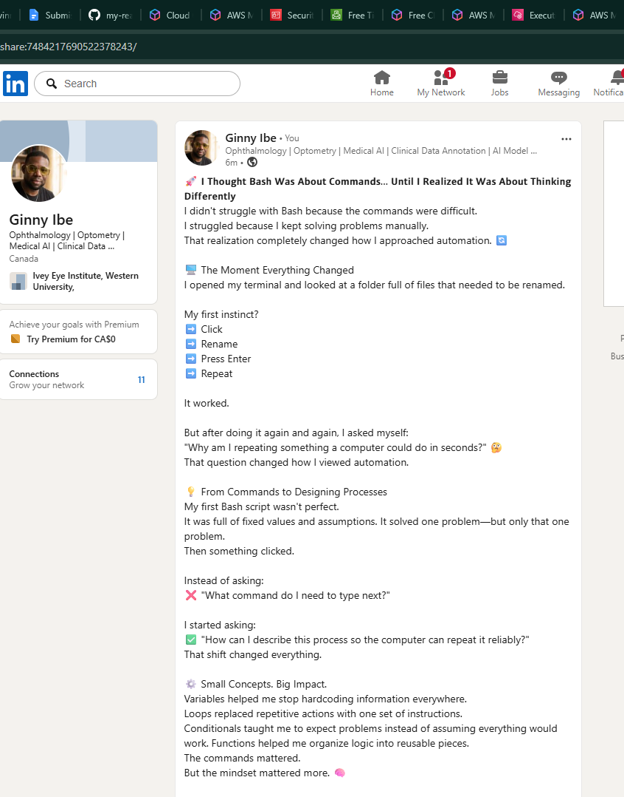

---

# Submission Instructions

- Add all required screenshots in your submission
- Full name must be visible in required screenshots
- All script files must be created and run successfully
- Required notes must be answered clearly for every task
- Do not expose sensitive information (keys, passwords, credentials)

---

# Completion Checklist

- [x] Task 1: Environment setup verified, workspace created (Screenshots 1–2, Notes answered)
- [x] Task 2: First script created, executed, permissions verified (Screenshots 1–3, Notes answered)
- [x] Task 3: Variables script created and run (Screenshots 1–2, Notes answered)
- [x] Task 4: Arrays and loops script created and run (Screenshots 1–2, Notes answered)
- [x] Task 5: Counter loop script created and run (Screenshots 1–2, Notes answered)
- [x] Task 6: File validation script created and run (Screenshots 1–3, Notes answered)
- [x] Task 7: Pass/Retry conditional script tested with both values (Screenshots 1–4, Notes answered)
- [x] Task 8: Final automation script created and run (Screenshots 1–3, Notes answered)
- [x] All scripts run without errors
- [x] Full Name visible in all required screenshots
- [x] LinkedIn post published and URL submitted
- [x] No sensitive data exposed

---

## 📌 About DMI & CloudAdvisory

DevOps Micro Internship (DMI) is a project-based DevOps program run by Pravin Mishra (The CloudAdvisory) focused on real-world execution, systems thinking, and career readiness.

It helps learners build strong DevOps foundations with hands-on experience.

---

## 📌 Resources

- 🌐 DMI Official Website: https://pravinmishra.com/dmi  
- 🎓 DevOps for Beginners (Udemy): https://www.udemy.com/course/devops-for-beginners-docker-k8s-cloud-cicd-4-projects/  
- 🎓 Agentic AI DevOps with Claude Code: https://www.udemy.com/course/ultimate-agentic-ai-devops-with-claude-code/  
- 🎓 DevOps with Claude Code: Terraform, EKS, ArgoCD & Helm: https://www.udemy.com/course/devops-with-claude-code-terraform-eks-argocd-helm/  
- ▶️ YouTube Playlist: https://www.youtube.com/playlist?list=PLFeSNDtI4Cho  
- 🔗 Pravin Mishra (LinkedIn): https://www.linkedin.com/in/pravin-mishra-aws-trainer/  
- 🏢 CloudAdvisory (LinkedIn): https://www.linkedin.com/company/thecloudadvisory/

---

*This submission is part of DevOps Micro Internship (DMI) Cohort 3 — Agentic AI Track.*