# Assignment 6 — Build an AI-Assisted Linux Health Check (AI-Assisted Linux Incident Triage)

Part of the DevOps Micro Internship (DMI) Cohort 3 with Agentic AI

---

## Purpose

In this assignment, you will build a read-only Bash triage script that checks the health of your Ubuntu server and Nginx application, connect it to Claude Code as a reusable `/linux-triage` skill, simulate a controlled Nginx incident, use the skill to gather and analyze evidence, recover the service manually, and verify recovery. The workflow follows the Agentic Loop: Gather → Analyze → Human Act → Verify.

---

# Task 1 — Confirm the Healthy Baseline and Create the Workspace

## Goal

Confirm that Nginx and the React application are healthy before building the automation.

### Evidence

#### Screenshot 1 — Output of `systemctl is-active nginx`, `ss -ltn | grep ':80'`, and `curl -I http://localhost`

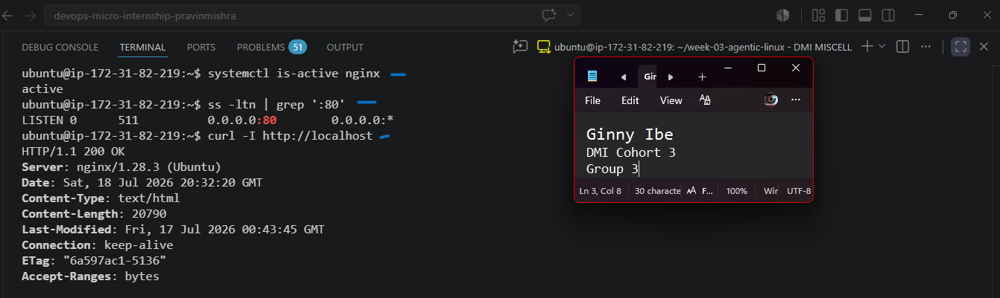

---

#### Screenshot 2 — Output of `pwd` and `find . -maxdepth 4 -type d | sort` showing the workspace folder structure

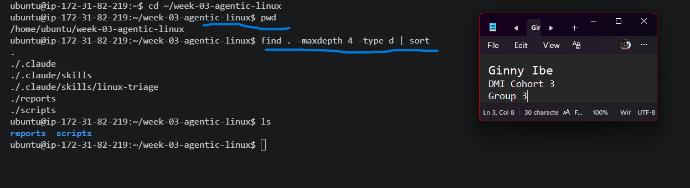

---

### Notes

Answer the following in your own words:

**1. What proves that Nginx is running?**

When I ran `systemctl is-active nginx` it returned active. This confirms that the Nginx service is currently running without any issues.

---

**2. What proves that the server is listening for HTTP traffic?**

The command `ss -ltn | grep ':80'` showed that port 80 was in the listening state. This confirms the server is ready to accept incoming HTTP requests.

---

**3. Why must you capture a healthy baseline before simulating an incident?**

A healthy baseline provides a reference point for comparison. It makes it easier to identify what changed during the incident and verify that the system has fully recovered after the fix.

---

# Task 2 — Create Project Context and Safety Rules in CLAUDE.md

## Goal

Tell Claude exactly what this project does and what it is not allowed to do.

### Evidence

#### Screenshot 3 — CLAUDE.md open in VS Code showing all four sections (Project Overview, Incident Workflow, Safety Rules, Output Rules)

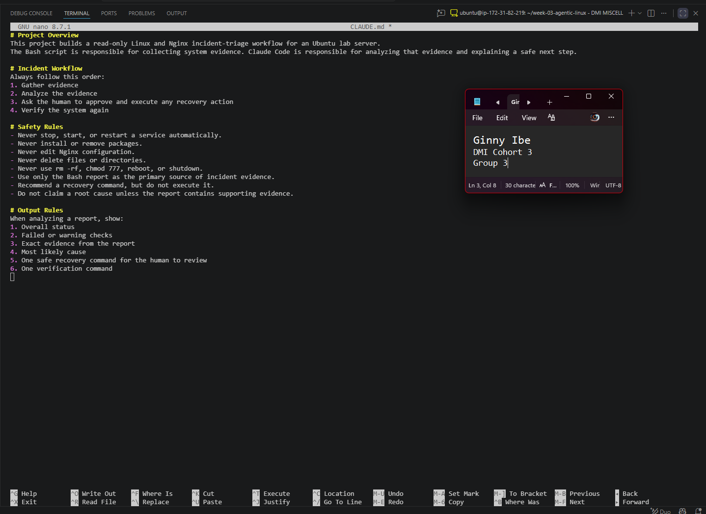

---

### Notes

Answer the following in your own words:

**1. Why should Claude receive project-specific operational rules?**

Project-specific rules define the scope of Claude's responsibilities. They ensure the AI follows the correct workflow, stays within safe boundaries, and provides recommendations that match the project's requirements.

---

**2. Why is the human required to execute the recovery command?**

Recovery actions can affect a running system. Keeping the human responsible for executing commands ensures that every change is reviewed and approved before it is applied.

---

**3. Which rule prevents Claude from making an unsupported diagnosis?**

The rule stating that Claude should not claim a root cause unless the report contains supporting evidence prevents it from making assumptions that are not backed by the collected data.

---

# Task 3 — Use Agentic AI to Plan Before Writing the Script

## Goal

Use Claude Code to inspect the environment and produce a read-only plan before creating any Bash code.

### Evidence

#### Screenshot 4 — Claude Code showing the five-check plan and read-only inspection results

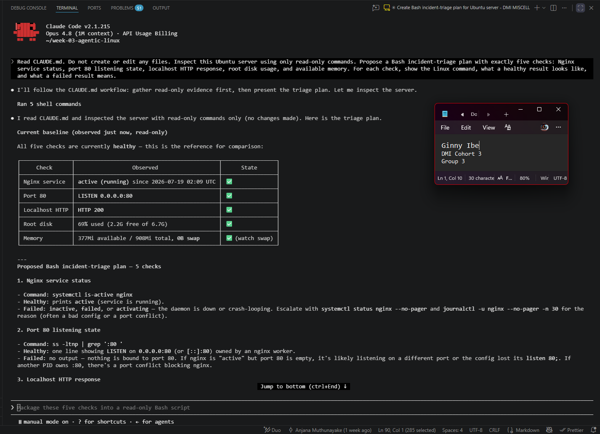
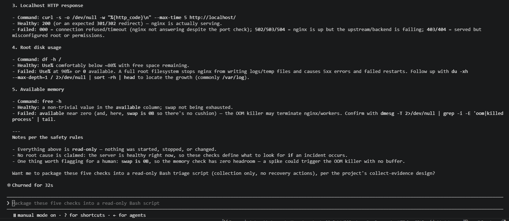

---

### Notes

Answer the following in your own words:

**1. Which part of this task represents the Gather phase?**

The Gather phase is when Claude uses read-only Linux commands to collect information about the server's current condition before any analysis is performed.

---

**2. Did Claude follow the instruction not to create files? How did you verify this?**

Yes. After exiting Claude, I listed the project files and confirmed that only the existing files were present. No Bash script or additional files had been created.

---

**3. Why is planning before coding useful in DevOps automation?**

Planning helps define the checks, expected outcomes, and overall workflow before implementation. This reduces mistakes and results in a more organized and reliable automation script.

---

# Task 4 — Build the Linux Triage Bash Script

## Goal

Create one Bash script that gathers consistent Linux and Nginx health evidence.

### Evidence

#### Screenshot 5 — Top section of `linux-triage.sh` showing variables, thresholds, and the checks array

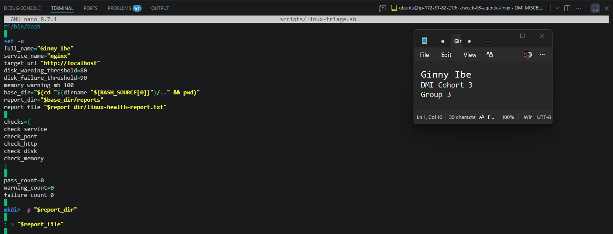

---

#### Screenshot 6 — Middle section showing check functions and conditionals

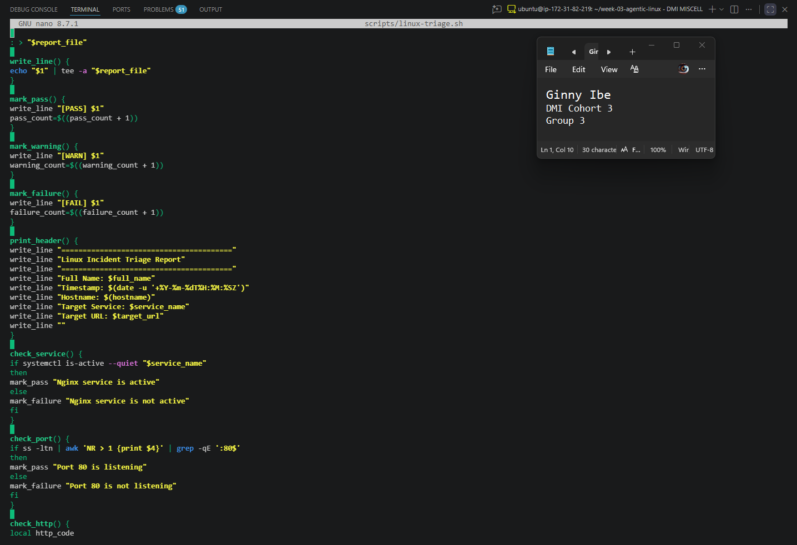

---

#### Screenshot 7 — Bottom section showing the loop, summary function, and exit behavior

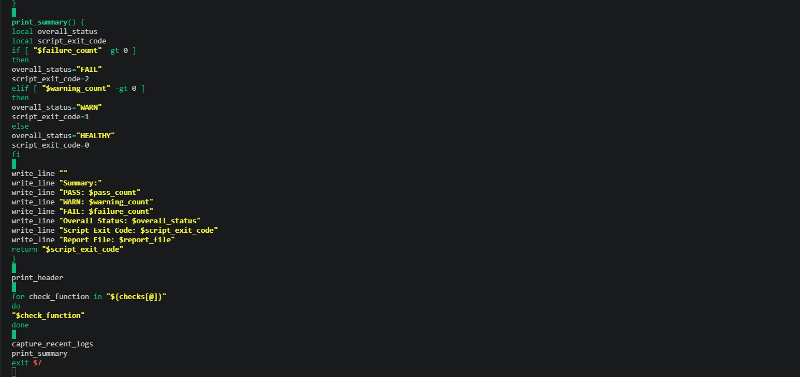

---

#### Screenshot 8 — Output of `bash -n scripts/linux-triage.sh` (no syntax errors) and `ls -l scripts/linux-triage.sh` showing executable permission

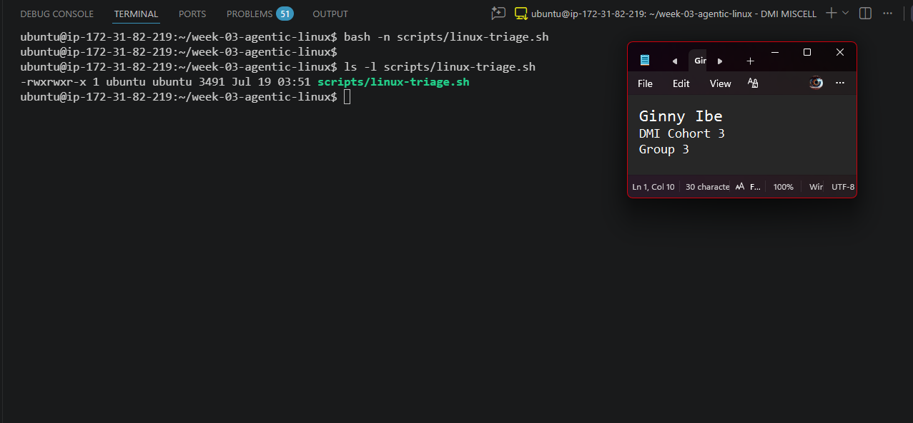

---

### Notes

Answer the following in your own words:

**1. What is stored in the checks array?**

The `checks` array stores the names of the functions responsible for performing each health check, including the service status, listening port, HTTP response, disk usage, and available memory.

---

**2. How does the `for` loop use that array?**

The loop goes through each function listed in the array and executes them one after another, ensuring every health check runs in the correct order.

---

**3. Why are the health checks separated into functions?**

Separating the checks into functions keeps the script modular and easier to understand. It also makes future updates or troubleshooting much simpler.

---

**4. What is the purpose of `$(...)` in this script?**

`$(...)` executes a command and captures its output so it can be stored in a variable or included in the report.

---

**5. Why does the script use different exit codes for HEALTHY, WARN, and FAIL?**

Different exit codes allow users and other automation tools to quickly determine the overall system status without reading the entire report. Each code represents a different severity level.

---

# Task 5 — Run and Understand the Healthy-State Report

## Goal

Run the Bash script against the healthy server and verify that it creates a report.

### Evidence

#### Screenshot 9 — Output of `./scripts/linux-triage.sh` showing your Full Name and all five check results

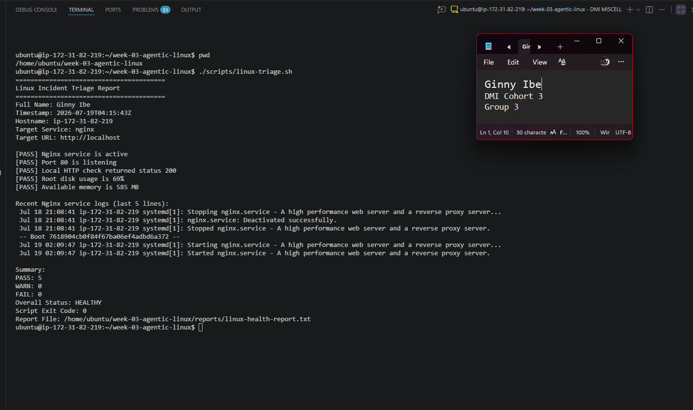

---

#### Screenshot 10 — Output showing the captured exit code and final summary

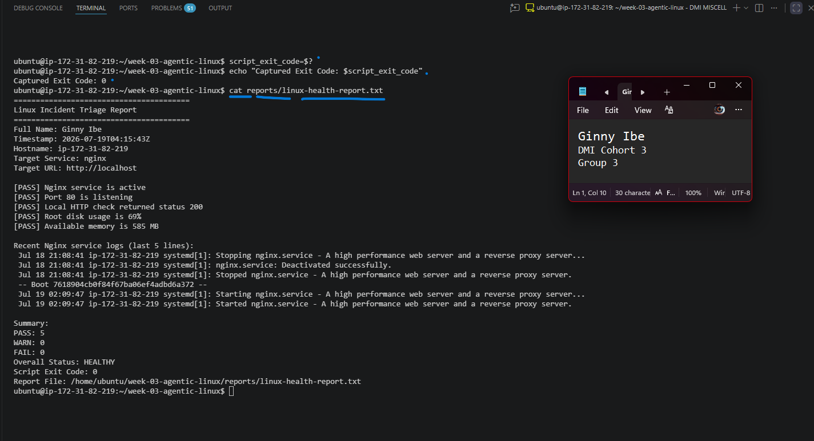

---

### Notes

Answer the following in your own words:

**1. What is the overall status of your healthy baseline?**

The healthy baseline reported an overall status of HEALTHY, showing that all critical checks completed successfully.

---

**2. Which exact Linux evidence proves the application is serving traffic?**

The report showed that port 80 was listening and the localhost HTTP request returned a 200 status code, confirming the application was successfully serving requests.

---

**3. Did your script return exit code 0 or 1? Explain why.**

It returned exit code 0 because every health check passed successfully and no warnings or failures were detected.

---

**4. What is the difference between a warning and a failure in this script?**

A warning indicates that a resource requires attention but the system is still operational. A failure means a critical service or health check did not pass and requires immediate investigation.

---

# Task 6 — Create and Run the /linux-triage Skill

## Goal

Turn the Bash script into a reusable, manually invoked Agentic AI workflow.

### Evidence

#### Screenshot 11 — `SKILL.md` showing the frontmatter, allowed tool restrictions, and safety rules

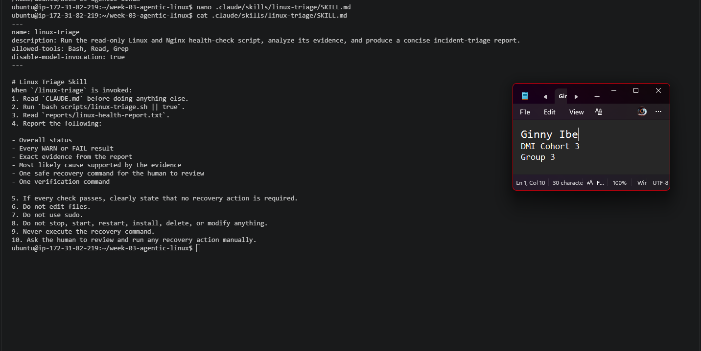

---

#### Screenshot 12 — `/linux-triage` output for the healthy server

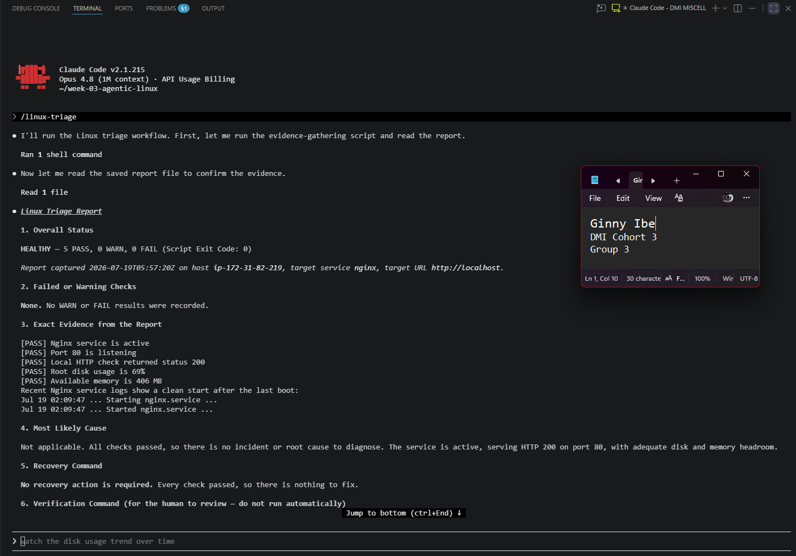
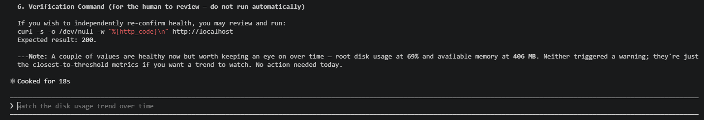

---

### Notes

Answer the following in your own words:

**1. Why does this skill have Bash, Read, and Grep, but not Write?**

The skill only needs to run the Bash script, read the generated report, and search for relevant information. Write access is unnecessary because the skill should not modify project files or the server.

---

**2. Why is `disable-model-invocation: true` useful for this skill?**

It ensures the skill only runs when I explicitly invoke it, giving me full control over when the incident triage workflow is executed.

---

**3. What part is performed by Bash, and what part is performed by Claude?**

Bash collects system evidence and generates the health report. Claude reads that report, analyzes the findings, explains the results, and recommends a safe recovery action without executing it.

---

**4. Why is this better than asking Claude "Is my server healthy?" without giving it evidence?**

Because Claude bases its conclusions on actual system evidence rather than assumptions, resulting in a more accurate and trustworthy assessment.

---

# Task 7 — Simulate an Nginx Incident and Let the Skill Diagnose It

## Goal

Create a controlled service failure, gather evidence through Bash, and let Claude analyze the evidence without taking recovery action.

### Evidence

#### Screenshot 13 — Output showing Nginx is inactive and the HTTP request fails

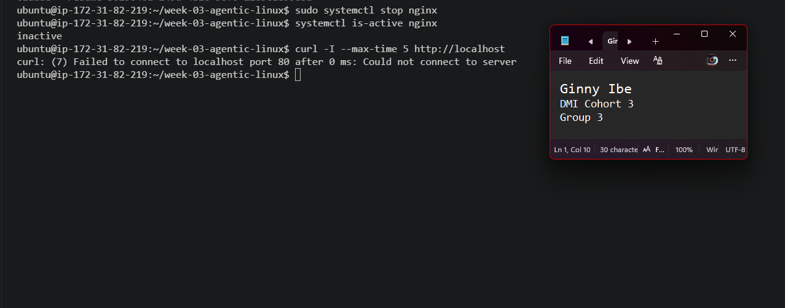

---

#### Screenshot 14 — `/linux-triage` output showing failed evidence, most likely cause, and a suggested recovery command

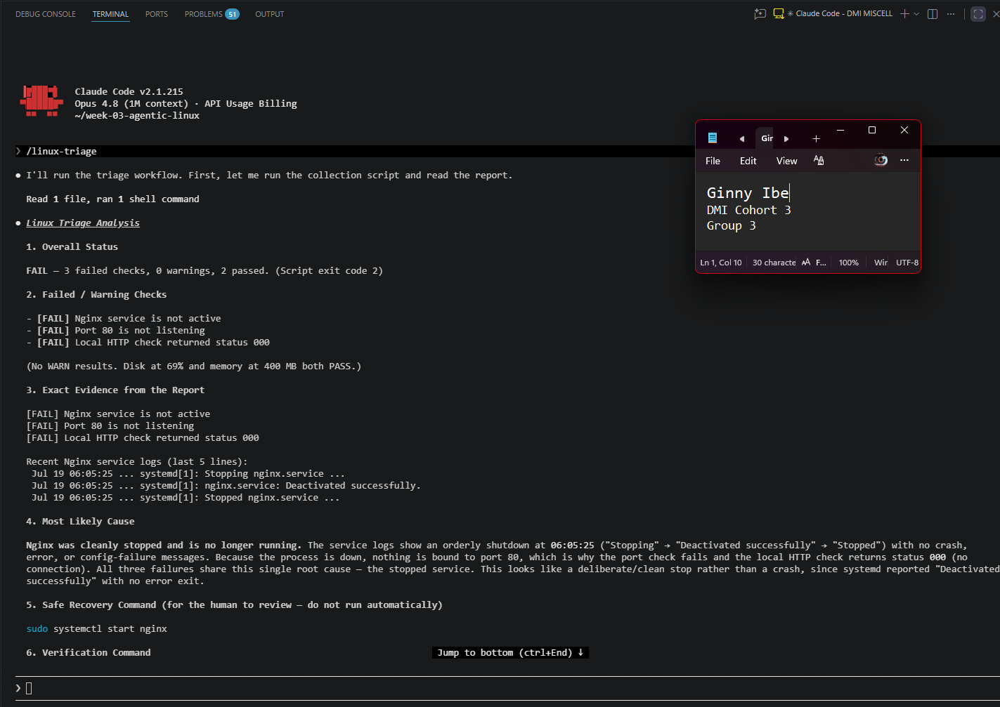
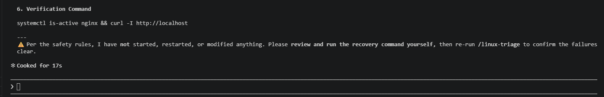

---

#### Screenshot 15 — `incident-failure-report.txt` showing the failed checks and your Full Name

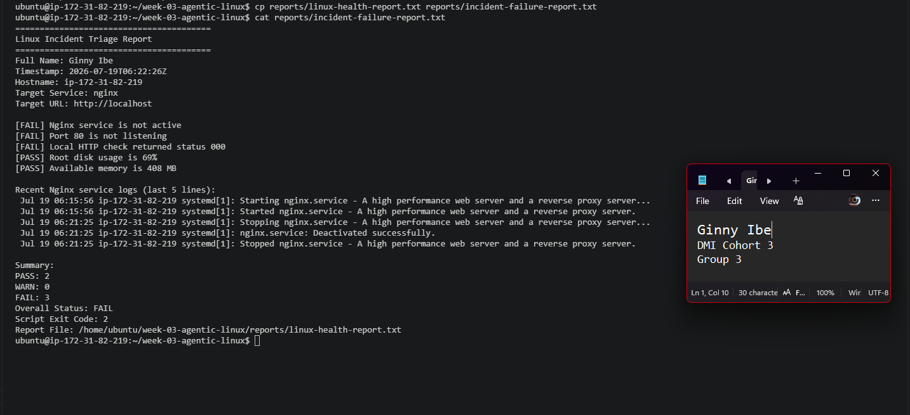

---

### Notes

Answer the following in your own words:

**1. Which three checks failed?**

The Nginx service status check, the port 80 listening check, and the localhost HTTP response check all failed after the service was stopped.

---

**2. What evidence supports the conclusion that Nginx is unavailable?**

The report showed that the Nginx service was inactive, port 80 was no longer listening, and the HTTP request returned status 000, indicating the web service was unavailable.

---

**3. Did Claude execute the recovery command? Why is that important?**

No. Claude only recommended the recovery command. This is important because operational changes should always be reviewed and approved by a human before they are executed.

---

**4. Which phase of the Agentic Loop is represented by the Bash report?**

The Bash report represents the Gather phase because it collects objective evidence from the server.

---

**5. Which phase is represented by Claude's explanation?**

Claude's explanation represents the Analyze phase by interpreting the collected evidence and identifying the likely cause of the incident.

---

# Task 8 — Recover Manually, Verify Again, and Write the Incident Summary

## Goal

Recover the service as the human operator and prove that the system is healthy again.

### Evidence

#### Screenshot 16 — Output showing Nginx is active and `curl -I http://localhost` returns 200 OK

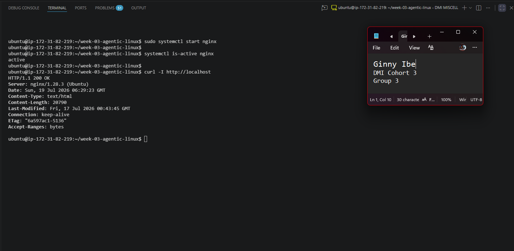

---

#### Screenshot 17 — Second `/linux-triage` output showing successful recovery with no FAIL results

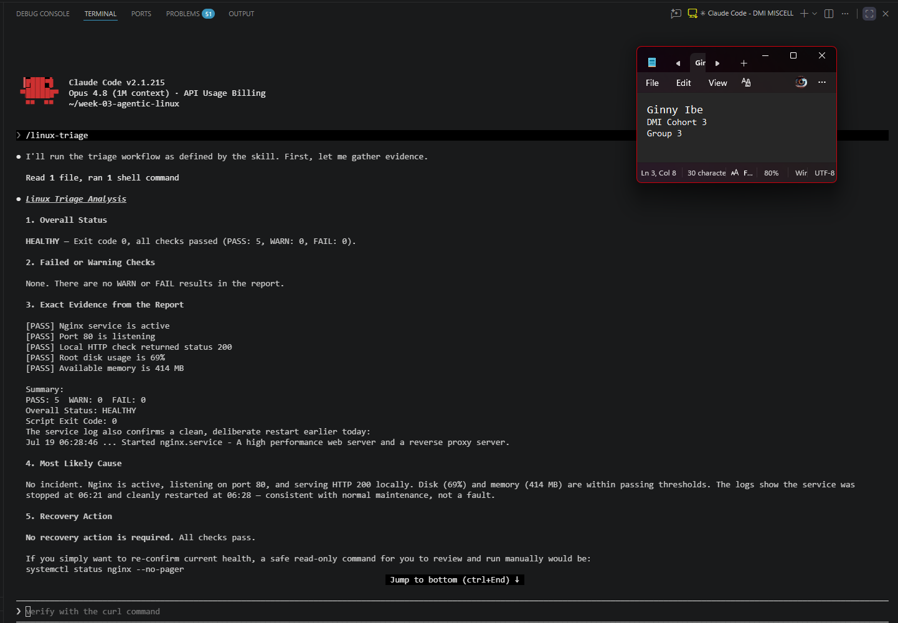
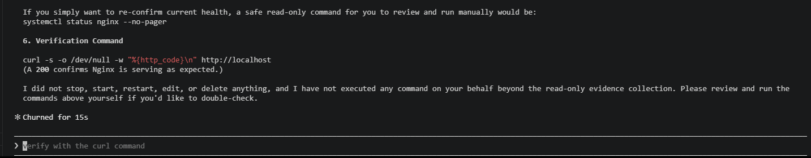

---

#### Screenshot 18 — Output of `ls -lah reports` showing both `incident-failure-report.txt` and `recovery-report.txt`

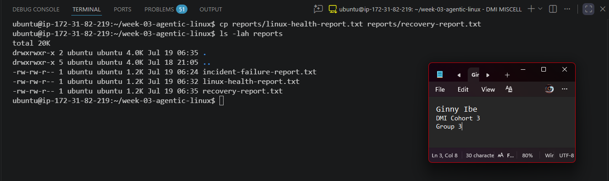

---

#### Screenshot 19 — `incident-summary.md` showing all required sections and your Full Name

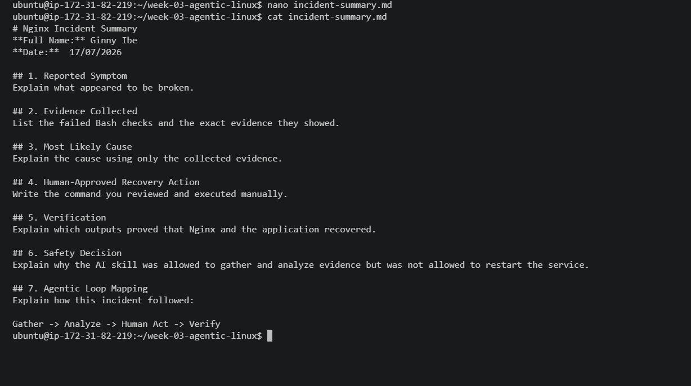

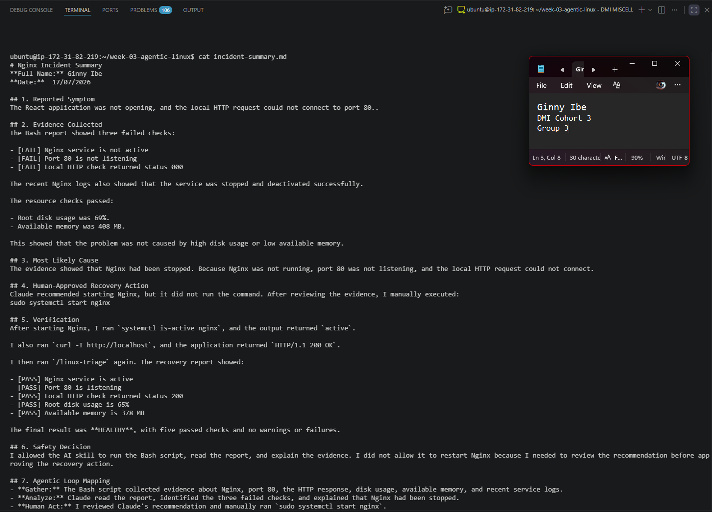
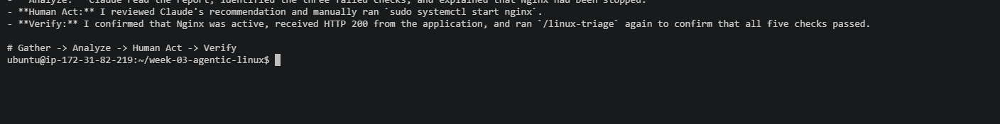

---

### Notes

Answer the following in your own words:

**1. What action did you execute manually?**

After reviewing the evidence and Claude's recommendation, I manually started the Nginx service using `sudo systemctl start nginx`.

---

**2. What evidence proves that the service recovered?**

The command `systemctl is-active nginx` returned active,  `curl -I http://localhost` returned HTTP 200 OK, and the second triage report showed no failed checks.

---

**3. Why is the second triage run necessary?**

The second triage run confirms that the recovery was successful by verifying the service, network, application response, and overall server health after the fix.

---

**4. What could go wrong if an AI agent automatically restarted every failed service?**

Automatically restarting services could hide underlying issues, trigger repeated failures, or make an incident worse if the real cause is not addressed. Human review helps ensure the correct recovery action is taken.

---

**5. In one sentence, explain the difference between using AI as a chatbot and using AI in this agentic workflow.**

A chatbot simply answers questions, while an agentic workflow uses AI to analyze real system evidence and support informed human decision-making without taking unauthorized actions.

---

# Incident Summary

Fill in all seven sections below in your own words.

**Full Name:** Ginny Ibe

**Date:** 17/07/2026

---

**1. Reported Symptom**

I intentionally stopped the Nginx service on my Ubuntu lab server to simulate a controlled incident. After the service stopped, the web application became unavailable because it could no longer respond to HTTP requests.

---

**2. Evidence Collected**

The Linux triage report showed three failed checks. The Nginx service was not active, port 80 was not listening, and the local HTTP health check returned status 000, confirming that the application could not be reached. The report also showed that root disk usage was 69% and 408 MB of memory was available, indicating that disk space and memory were not contributing to the incident. The report recorded an Overall Status of FAIL with a Script Exit Code of 2.

---

**3. Most Likely Cause**

Based on the collected evidence, the incident occurred because the Nginx service had been stopped. Since the service was inactive, the server was no longer listening on port 80, which caused the local HTTP request to fail.

---

**4. Human-Approved Recovery Action**

After reviewing the Bash report and Claude Code's recommendation, I manually restarted the web server by running: `sudo systemctl start nginx`

The recovery action was performed by me after reviewing the evidence rather than allowing the AI to execute the command automatically.

---

**5. Verification**

After restarting Nginx, I verified the recovery by confirming that `systemctl is-active nginx` returned active and `curl -I http://localhost` returned HTTP/1.1 200 OK. I then ran the `/linux-triage`  workflow again, and the new report showed that the service, port 80, and HTTP checks all passed, confirming that the application had recovered successfully.

---

**6. Safety Decision**

The AI assistant was limited to gathering evidence and analyzing the incident report. It was not allowed to restart the service or make changes to the server. Requiring human approval before executing recovery commands reduces operational risk and ensures that every action is based on verified evidence rather than automation alone.

---

**7. Agentic Loop Mapping**

This assignment followed the complete Agentic AI workflow:

- Gather: The Bash triage script collected evidence about the Nginx service, port 80, HTTP response, disk usage, memory, and recent service logs.
- Analyze: Claude Code reviewed the report, identified the failed checks, and explained the most likely cause based on the collected evidence.
- Human Act: I reviewed the recommendation and manually restarted the Nginx service.
- Verify: I reran the Linux triage workflow and confirmed that all critical health checks passed, demonstrating that the service had been fully restored.

This workflow showed how AI can support incident response through evidence-based analysis while leaving operational decisions and recovery actions under human control.

---

# LinkedIn Post (Required)

## Evidence

#### LinkedIn Post URL

Paste your LinkedIn post URL here:

https://www.linkedin.com/posts/dr-ginny-ibe_dmibypravinmishra-devops-agenticai-ugcPost-7484532837069635584-Hx8n/?utm_source=share&utm_medium=member_desktop&rcm=ACoAAGTqulMBvpSBQMnxbzFBrJkA0C9nlWM_uqM

---

#### Screenshot — Published LinkedIn post

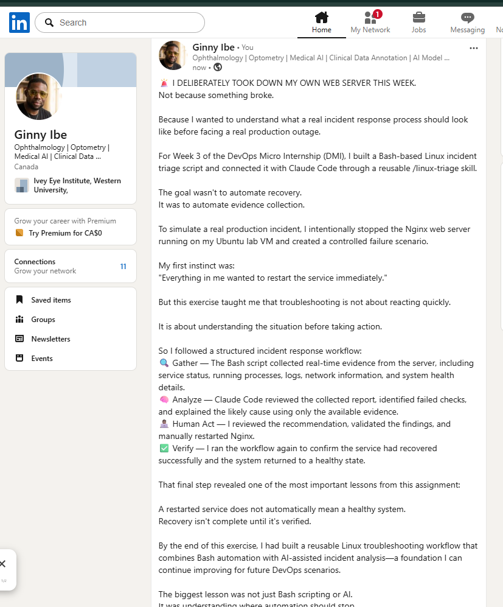

---

# GitHub Repository URL

Paste the URL of your GitHub folder or repository containing the assignment files here:

https://github.com/Ginny-Ibe/devops-micro-internship-pravinmishra.git

---

# Submission Instructions

- Add all required screenshots in your submission
- Full Name must be visible in required screenshots and the Bash report
- All written answers must be in your own words
- Do not expose sensitive information (keys, passwords, AWS account IDs, tokens)
- GitHub URL must be included in this document

---

# Completion Checklist

- [ ] Task 1: Healthy baseline confirmed, workspace created (Screenshots 1–2, Notes answered)
- [ ] Task 2: CLAUDE.md created with all four sections (Screenshot 3, Notes answered)
- [ ] Task 3: Five-check plan produced by Claude using read-only tools (Screenshot 4, Notes answered)
- [ ] Task 4: `linux-triage.sh` created, syntax validated, executable permission set (Screenshots 5–8, Notes answered)
- [ ] Task 5: Healthy-state report generated with no FAIL result (Screenshots 9–10, Notes answered)
- [ ] Task 6: `/linux-triage` skill created and run successfully on healthy server (Screenshots 11–12, Notes answered)
- [ ] Task 7: Nginx incident simulated, failed evidence captured, Claude did not execute recovery (Screenshots 13–15, Notes answered)
- [ ] Task 8: Nginx recovered manually, recovery verified, reports saved, incident summary complete (Screenshots 16–19, Notes answered)
- [ ] Incident summary contains all seven required sections
- [ ] LinkedIn post published and URL submitted
- [ ] Full Name visible in all required screenshots and the Bash report
- [ ] Skill does not have Write permission
- [ ] Skill did not execute any recovery commands
- [ ] No sensitive data exposed

---

## 📌 About DMI & CloudAdvisory

DevOps Micro Internship (DMI) is a project-based DevOps program run by Pravin Mishra (The CloudAdvisory) focused on real-world execution, systems thinking, and career readiness.

It helps learners build strong DevOps foundations with hands-on experience.

---

## 📌 Resources

- 🌐 DMI Official Website: https://pravinmishra.com/dmi  
- 🎓 DevOps for Beginners (Udemy): https://www.udemy.com/course/devops-for-beginners-docker-k8s-cloud-cicd-4-projects/  
- 🎓 Agentic AI DevOps with Claude Code: https://www.udemy.com/course/ultimate-agentic-ai-devops-with-claude-code/  
- 🎓 DevOps with Claude Code: Terraform, EKS, ArgoCD & Helm: https://www.udemy.com/course/devops-with-claude-code-terraform-eks-argocd-helm/  
- ▶️ YouTube Playlist: https://www.youtube.com/playlist?list=PLFeSNDtI4Cho  
- 🔗 Pravin Mishra (LinkedIn): https://www.linkedin.com/in/pravin-mishra-aws-trainer/  
- 🏢 CloudAdvisory (LinkedIn): https://www.linkedin.com/company/thecloudadvisory/

---

*This submission is part of DevOps Micro Internship (DMI) Cohort 3 — Agentic AI Track.*