# Assignment 3 — Production Maintenance Drill (OPS Checklist)

Part of the DevOps Micro Internship (DMI) Cohort 3 with Agentic AI

---

## Purpose

In this assignment, you will treat your already deployed React application (on Ubuntu VM with Nginx) as a live production system. You will perform structured operational checks covering network validation, service health, log analysis, resource monitoring, configuration verification, and incident simulation with recovery — mirroring real on-call DevOps responsibilities.

---

# Task 1 — Server Access & Networking Validation

## Goal

Verify that the deployed React application is reachable from the browser and confirm basic network connectivity of the Ubuntu VM.

### Evidence

#### Screenshot 1 — Browser showing the React app with your Full Name visible on the UI

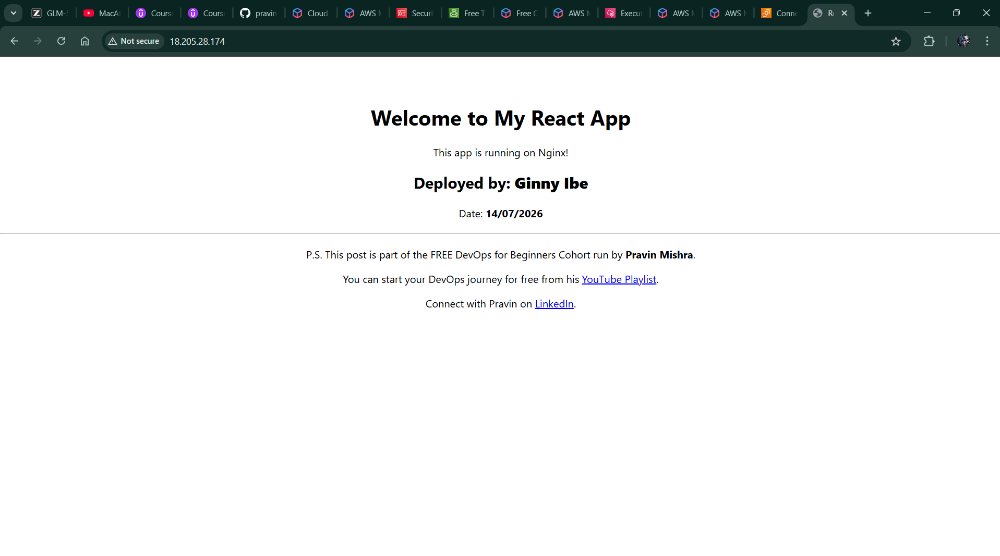

---

#### Screenshot 2 — Output of `ip a`

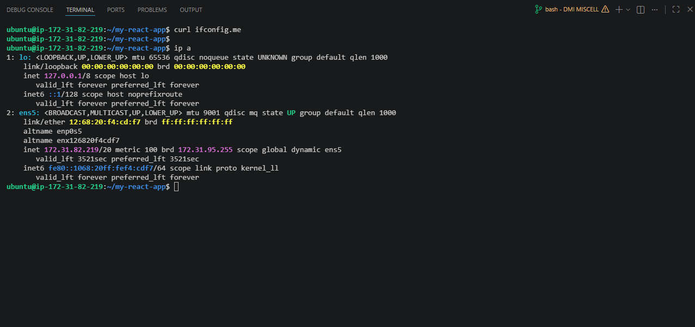

---

#### Screenshot 3 — Output of `sudo ss -tulpen`

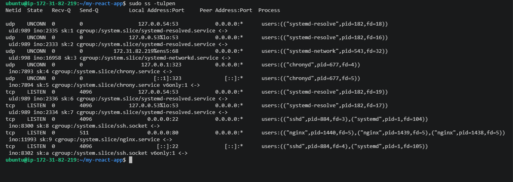

---

#### Screenshot 4 — Output of `sudo ufw status`

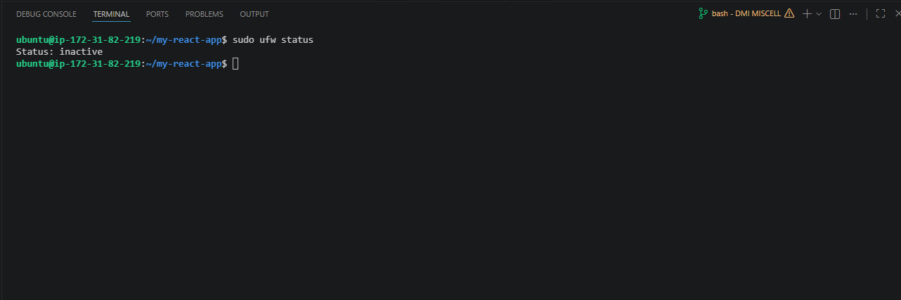

---

### Notes

Answer the following in your own words:

**1. What proves Nginx is listening on 0.0.0.0:80?**

Write your answer here.

The  `sudo ss -tulpen` output shows the line `tcp LISTEN 0.0.0.0:80` with the `nginx` process. This confirms that Nginx is listening on port 80 and is bound to 0.0.0.0, meaning it accepts HTTP connections from all network interfaces, not just localhost. The successful loading of the React application in my browser further confirms that Nginx is serving web traffic correctly.

**2. What proves SSH is active on port 22?**

The same `sudo ss -tulpen` output shows `tcp LISTEN 0.0.0.0:22`  with the `sshd` process. This confirms that the SSH service is actively listening on port 22 and is ready to accept secure remote connections. I also verified this by successfully connecting to my Ubuntu VM using SSH.

---

**3. Did you find any unexpected open ports? Explain briefly.**

No unexpected ports were open. Besides Nginx (port 80) and SSH (port 22), the only other listening services were chronyd (time synchronization) and systemd-resolved (DNS resolution), both of which were bound only to localhost (127.0.0.1). Since these services are not accessible from outside the server, only the intended services—HTTP and SSH—were exposed externally.

---

# Task 2 — Service Health & Systemd Validation (Nginx)

## Goal

Verify that Nginx is properly installed, running, enabled at boot, and safely configured.

### Evidence

#### Screenshot 1 — Output of `systemctl status nginx --no-pager`

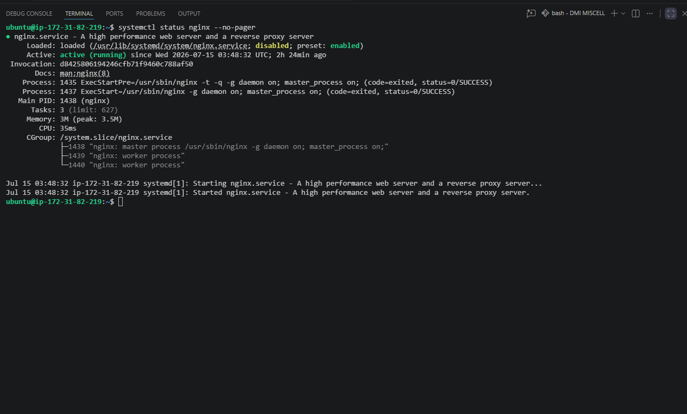

---

#### Screenshot 2 — Output of `sudo nginx -t`

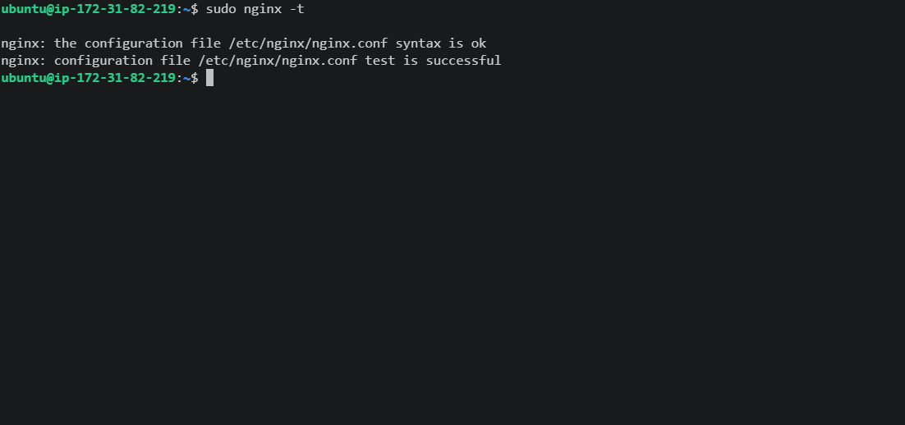

---

#### Screenshot 3 — Output of `sudo ss -lptn '( sport = :80 )'`

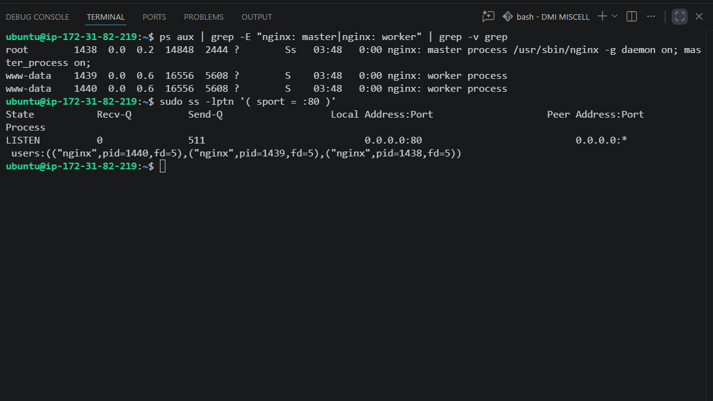

---

### Notes

Answer the following in your own words:

**1. What happens if Nginx fails to restart in production?**

If Nginx fails to restart, users won't be able to access the website because the web server is no longer serving requests. This results in downtime until the issue is fixed.

---

**2. What's your basic rollback plan?**

I would restore the last known working Nginx configuration from a backup or version control, verify it with nginx `nginx -t`, and then restart the service. This minimizes downtime and restores normal operations quickly.

---

# Task 3 — Logs & Request Trace

## Goal

Verify real traffic flow and analyze logs to understand system behavior and errors.

### Evidence

#### Screenshot 1 — Output of `sudo tail -n 30 /var/log/nginx/access.log`

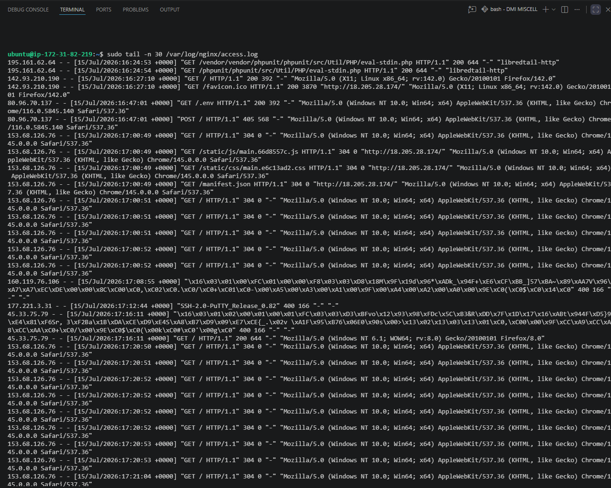
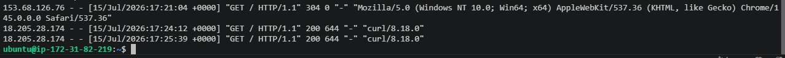

---

#### Screenshot 2 — Output of `sudo tail -n 30 /var/log/nginx/error.log`

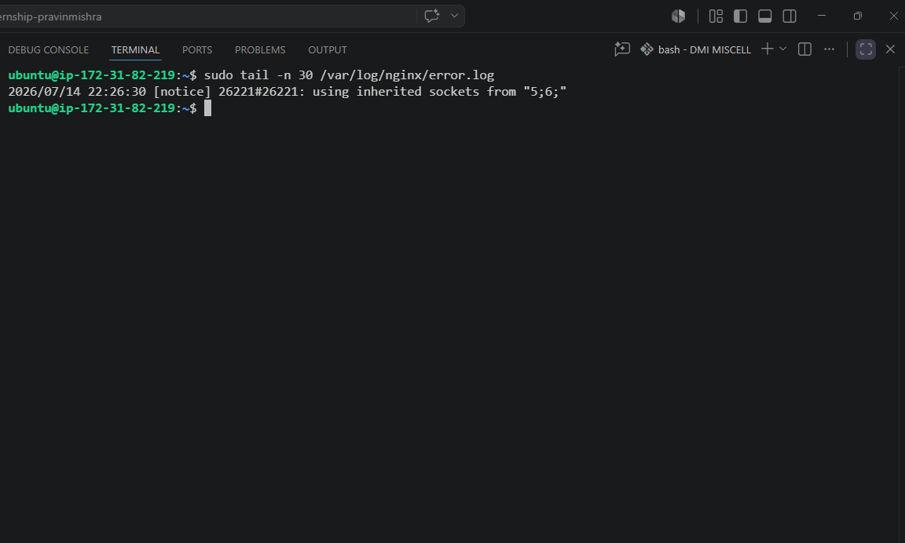

So, based on the output shared, there is no problem indicated. The log is simply telling me that Nginx successfully reused its listening sockets during a reload or restart, which is expected behavior.

---

#### Screenshot 3 — Output of `sudo journalctl -u nginx --no-pager -n 50`

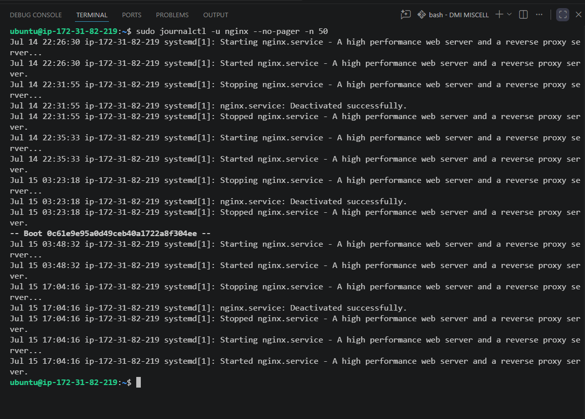

---

### Notes

Answer the following in your own words:

**1. Were there any errors in the logs?**

- If yes, mention 1–2 example error lines from the logs and explain what each one means in simple terms.
- If no, explain what it means if the error log is empty or shows no recent errors during your check.

**ANS** No recent errors appeared in the Nginx error log during my checks. This indicates that the server was operating normally and processing requests without configuration or runtime issues.

---

**2. If there were no errors, what does that indicate about the system?**

It suggests that the web server is healthy, serving requests successfully, and there are no obvious issues affecting the application's availability.

---

**3. Based on the access logs, were your curl requests visible in the log entries? What does that prove about traffic flow?**

Yes. My curl requests appeared in the access log, confirming that requests reached the Nginx server, were processed successfully, and were recorded correctly.

---

# Task 4 — System Resource Health Check (Capacity Red Flags)

## Goal

Assess server capacity and detect potential performance or failure risks.

### Evidence

#### Screenshot 1 — Output of `uptime`

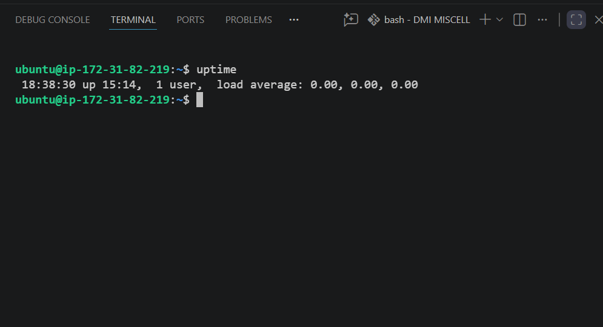

---

#### Screenshot 2 — Output of `free -h`

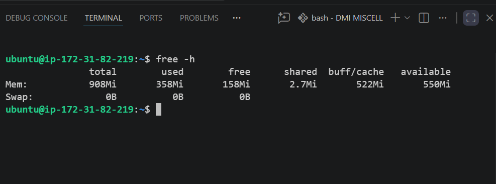

---

#### Screenshot 3 — Output of `df -h`

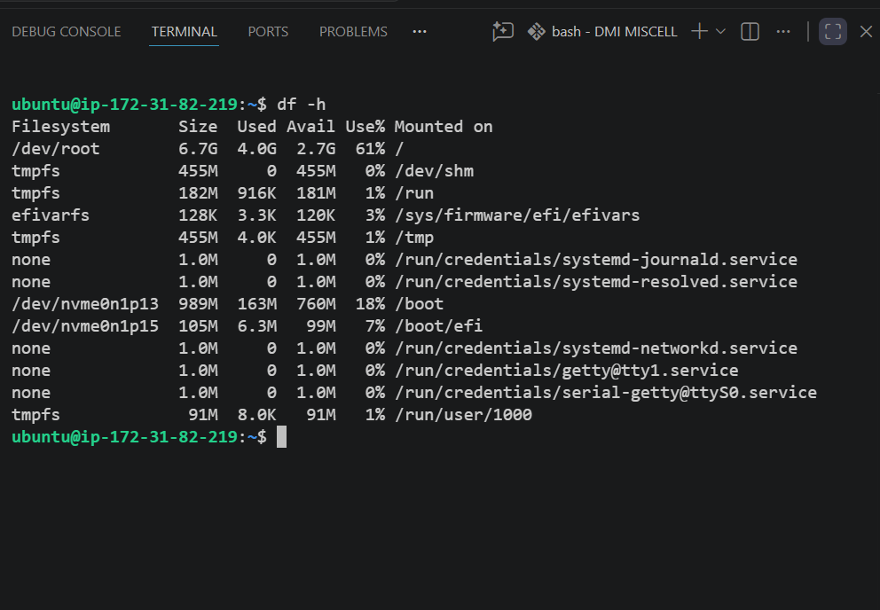

---

#### Screenshot 4 — Output of `sudo du -sh /var/* | sort -h`

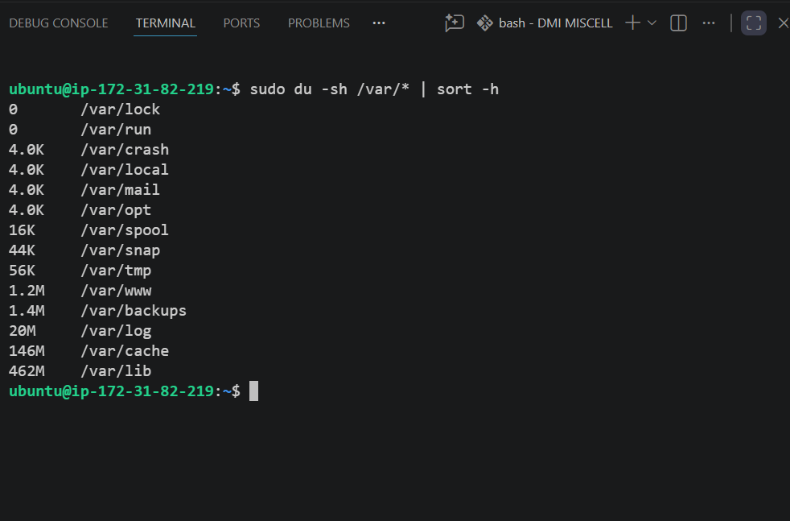

---

### Notes

Answer the following in your own words:

**1. Which resource looks most critical right now? (CPU/load, memory, or disk) Explain why.**

Based on my system checks, none of the resources appeared to be under heavy pressure. However, disk usage is usually the most important to monitor because running out of storage can cause applications and system services to fail.

---

**2. What happens if disk becomes 100% full in a production server?**

If the disk becomes completely full, applications may stop working properly because they cannot write logs, temporary files, or database updates. This can lead to service failures, data corruption, and unexpected downtime.

---

# Task 5 — Configuration & Deployment Verification

## Goal

Ensure the correct React build is deployed and Nginx is serving it properly.

### Evidence

#### Screenshot 1 — Output of `ls -lah /var/www/html | head -n 20`

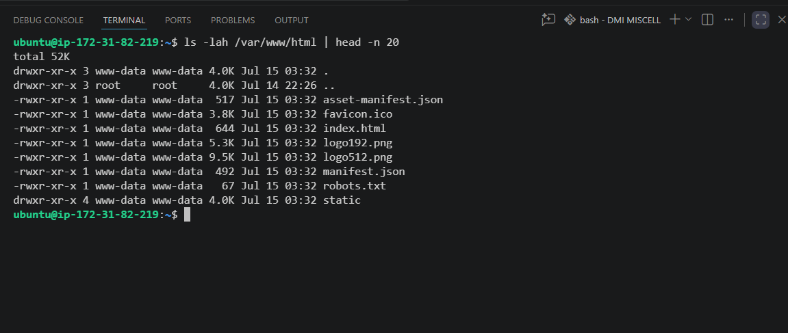

---

#### Screenshot 2 — Output of `grep -R "Deployed by" -n /var/www/html 2>/dev/null | head`

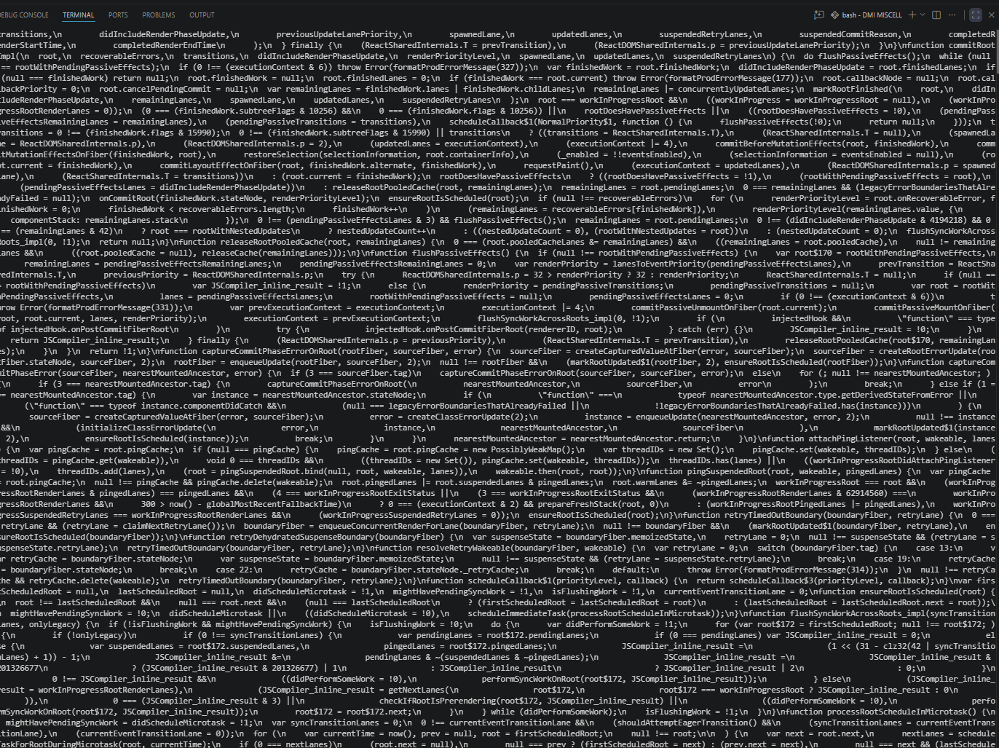

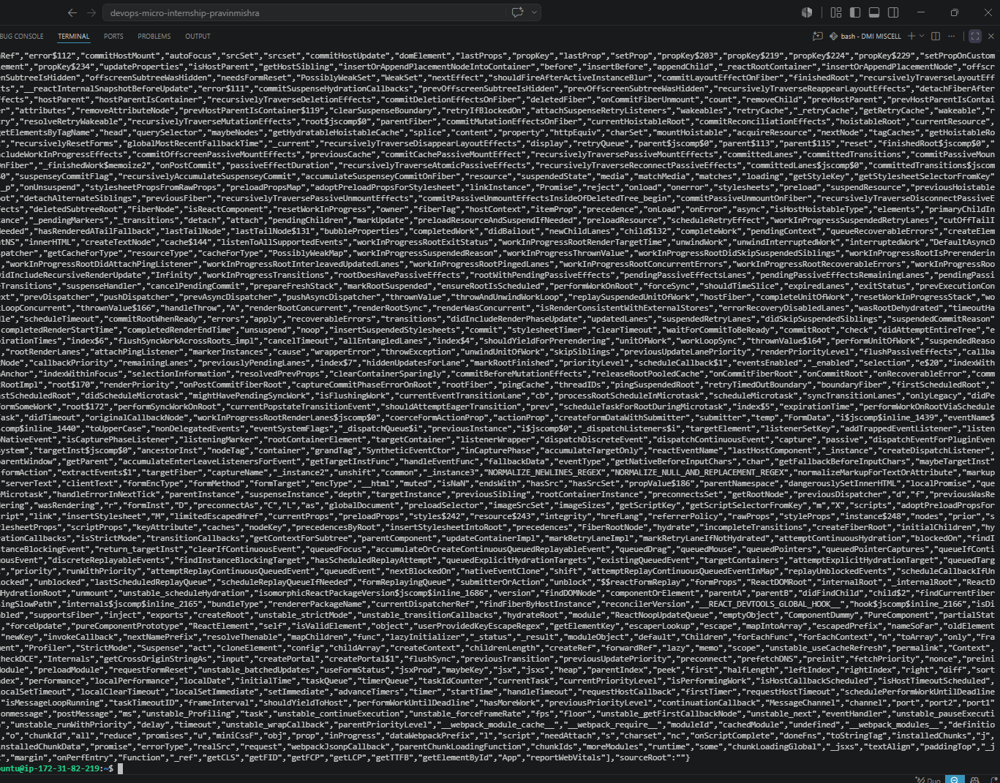

---

#### Screenshot 3 — Output of `grep -n "try_files" /etc/nginx/sites-available/default`

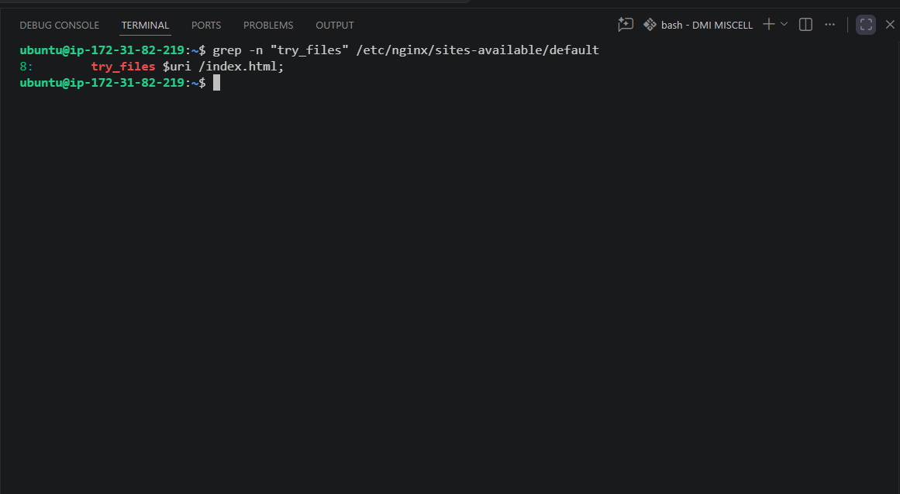

---

### Notes

Answer the following in your own words:

**1. How do you confirm that the correct version of the application is deployed?**

I verify that the correct build files exist in /var/www/html, check for the deployment marker such as "Deployed by", and confirm that the application loads correctly in the browser. Together, these checks confirm the intended version is deployed.

---

# Task 6 — Nginx Configuration Failure Simulation

## Goal

Simulate a real-world Nginx misconfiguration and recover the service safely.

### Evidence

#### Screenshot 1 — Output of `sudo nginx -t` showing the syntax error (broken config)

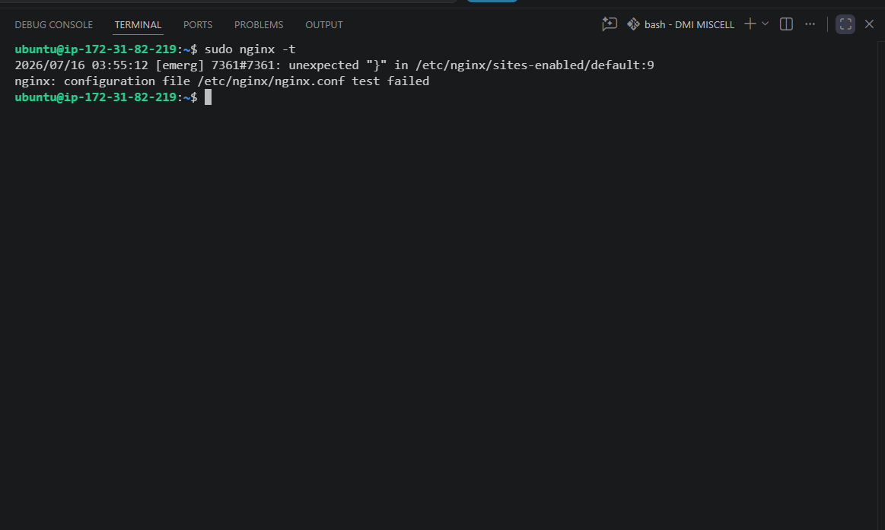

---

#### Screenshot 2 — Output of `sudo nginx -t` showing syntax ok (fixed config)

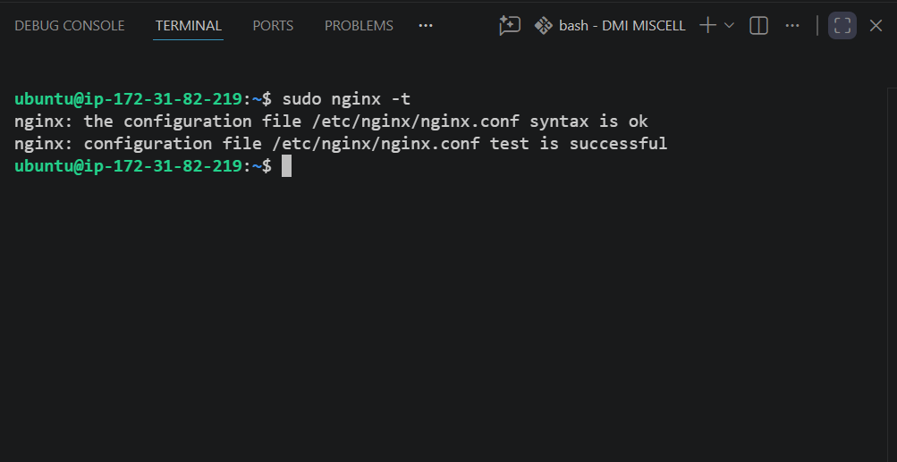

---

#### Screenshot 3 — Output of `curl -I http://<public-ip>` confirming recovery (200 OK)

---

### Notes

Answer the following in your own words:

**1. What caused the configuration failure?**

The failure was caused by an intentional syntax error introduced into the Nginx configuration file. Because the configuration was invalid, Nginx refused to reload it.

---

**2. How did you fix the issue?**

I corrected the configuration error, tested the configuration using nginx -t until it passed successfully, and then restarted Nginx to restore normal service.

---

**3. How can you avoid this kind of issue in real production systems?**

Always validate configuration changes with nginx -t before restarting the service, use version control for configuration files, perform peer reviews, and test changes in a staging environment before deploying to production.

---

# Task 7 — Web Application Failure Simulation

## Goal

Simulate missing deployment content and recover the application safely.

### Evidence

#### Screenshot 1 — Output of `curl -I http://<public-ip>` showing failure (non-200 response)

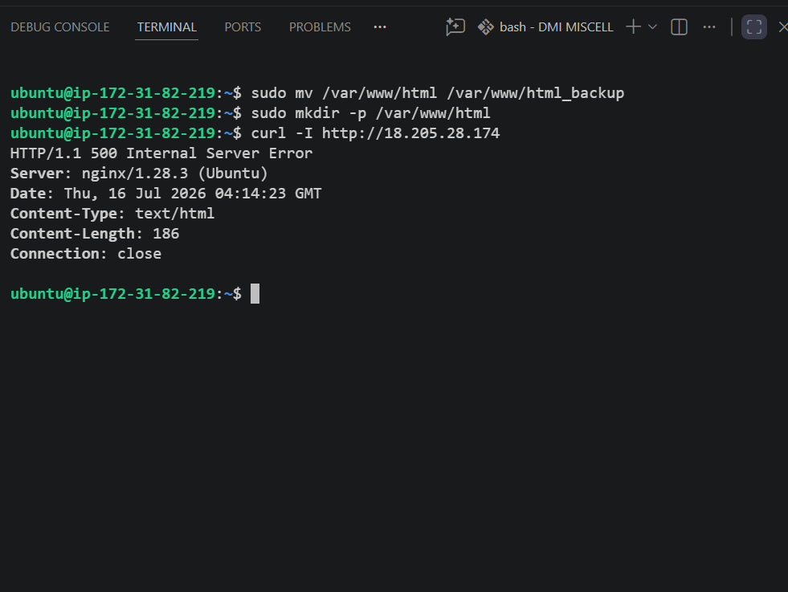
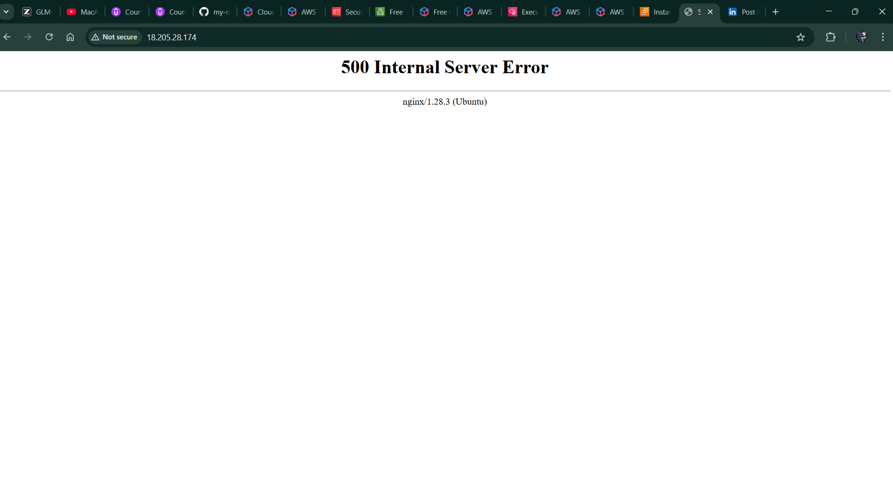

---

#### Screenshot 2 — Output of `curl -I http://<public-ip>` confirming recovery (200 OK)

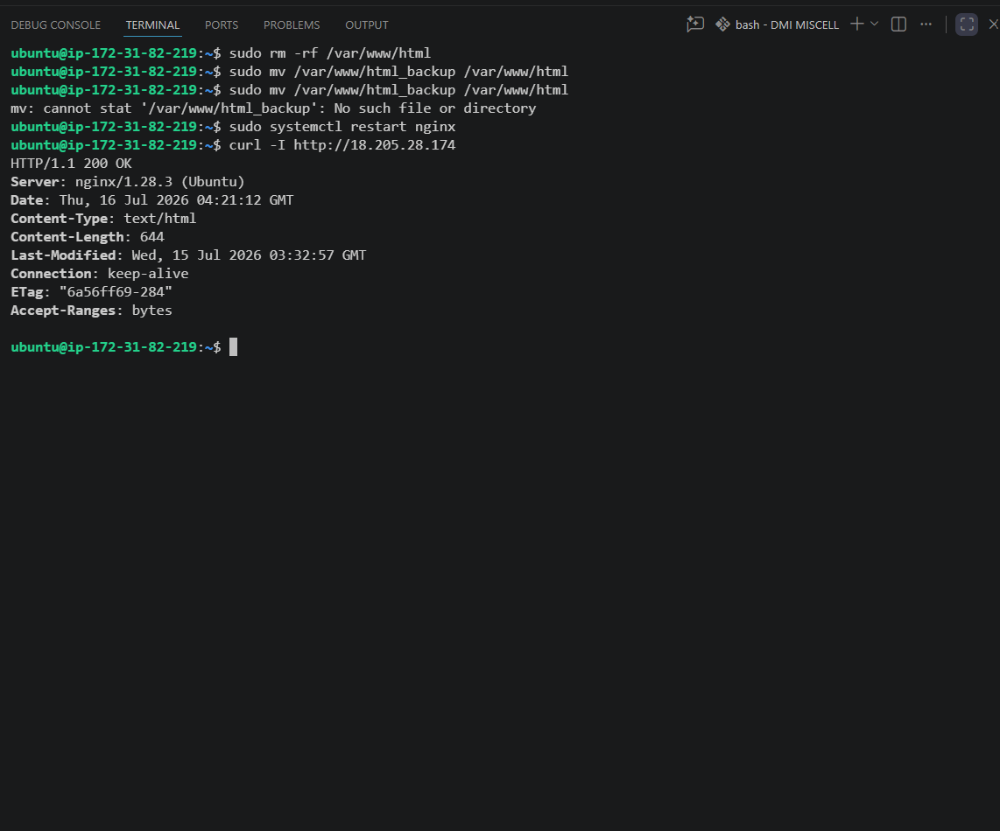

---

### Notes

Answer the following in your own words:

**1. What caused the application to break in this scenario?**

The application failed because the deployed website files were intentionally removed or became unavailable, leaving Nginx without the required content to serve.

---

**2. How did you fix the issue and restore the application?**

I restored the application files to the correct deployment directory and verified that the application returned a successful 200 OK response after recovery.

---

**3. What steps would you take to prevent this kind of issue in real production systems?**

I would automate deployments through a CI/CD pipeline, keep deployment backups, use version control, perform deployment validation, and monitor application health to detect problems quickly.

---

# Task 8 — Security & Reliability Review

## Goal

Review and reflect on the security and reliability practices applied during this assignment.

### Security & Reliability Notes

Answer the following in your own words:

**1. Why is SSH key-based authentication more secure than sharing passwords?**

SSH keys use strong cryptographic authentication that is much harder to crack than passwords. They also eliminate the risk of weak or reused passwords and reduce the chances of brute-force attacks.

---

**2. Why should only required ports be open on a production server?**

Opening only the necessary ports reduces the server's attack surface, making it harder for attackers to exploit unnecessary services or gain unauthorized access.

---

**3. Why is it important for Nginx to be enabled on boot?**

Enabling Nginx on boot ensures the web server starts automatically after a reboot or system restart, helping maintain service availability without manual intervention.

---

**4. What are the risks of sharing secrets, keys, or credentials publicly?**

Exposing secrets or credentials can allow attackers to access cloud resources, steal data, deploy malicious workloads, or generate unexpected costs. Sensitive information should always be stored securely and never committed to public repositories.

---

**5. Why should cloud resources be stopped or terminated when they are no longer needed?**

Stopping or terminating unused resources helps reduce cloud costs, improves security by minimizing exposed infrastructure, and prevents unnecessary resource consumption.

---

# LinkedIn Post (Required)

## Evidence

#### LinkedIn Post URL

Paste your LinkedIn post URL here:

`__________________________`

---

#### Screenshot — Published LinkedIn post

Add your screenshot here.

---

# Submission Instructions

- Add all required screenshots in your submission
- Full name must be visible in required screenshots
- Do not expose sensitive information (keys, passwords, account IDs)

---

# Completion Checklist

- [x] Task 1: Screenshots (browser, ip a, ss -tulpen, ufw status) + Notes answered
- [x] Task 2: Screenshots (nginx status, nginx -t, ss port 80) + Notes answered
- [x] Task 3: Screenshots (access log, error log, journalctl) + Notes answered
- [x] Task 4: Screenshots (uptime, free -h, df -h, du -sh) + Notes answered
- [x] Task 5: Screenshots (ls html, grep deployed by, grep try_files) + Notes answered
- [x] Task 6: Screenshots (nginx -t fail, nginx -t pass, curl recovery) + Notes answered
- [x] Task 7: Screenshots (curl failure, curl recovery) + Notes answered
- [x] Task 8: Security & Reliability Notes answered
- [x] LinkedIn post published and URL submitted
- [x] Full Name visible in all required screenshots
- [x] No sensitive data exposed

---

## 📌 About DMI & CloudAdvisory

DevOps Micro Internship (DMI) is a project-based DevOps program run by Pravin Mishra (The CloudAdvisory) focused on real-world execution, systems thinking, and career readiness.

It helps learners build strong DevOps foundations with hands-on experience.

---

## 📌 Resources

- 🌐 DMI Official Website: https://pravinmishra.com/dmi  
- 🎓 DevOps for Beginners (Udemy): https://www.udemy.com/course/devops-for-beginners-docker-k8s-cloud-cicd-4-projects/  
- 🎓 Agentic AI DevOps with Claude Code: https://www.udemy.com/course/ultimate-agentic-ai-devops-with-claude-code/  
- 🎓 DevOps with Claude Code: Terraform, EKS, ArgoCD & Helm: https://www.udemy.com/course/devops-with-claude-code-terraform-eks-argocd-helm/  
- ▶️ YouTube Playlist: https://www.youtube.com/playlist?list=PLFeSNDtI4Cho  
- 🔗 Pravin Mishra (LinkedIn): https://www.linkedin.com/in/pravin-mishra-aws-trainer/  
- 🏢 CloudAdvisory (LinkedIn): https://www.linkedin.com/company/thecloudadvisory/

---

*This submission is part of DevOps Micro Internship (DMI) Cohort 3 — Agentic AI Track.*