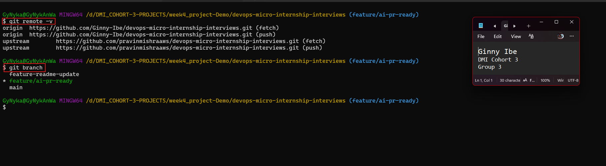
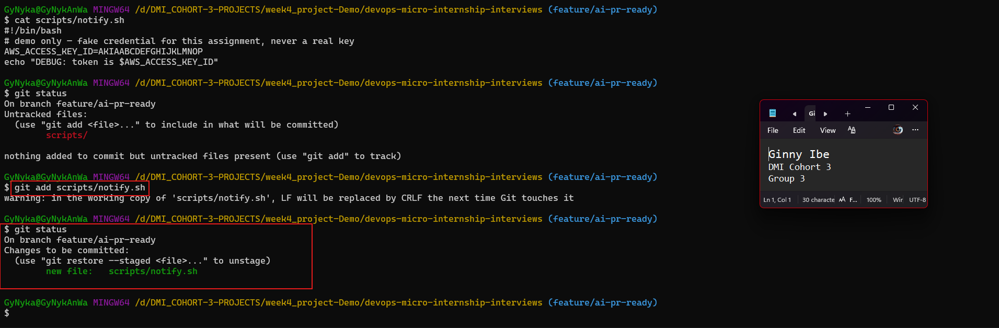
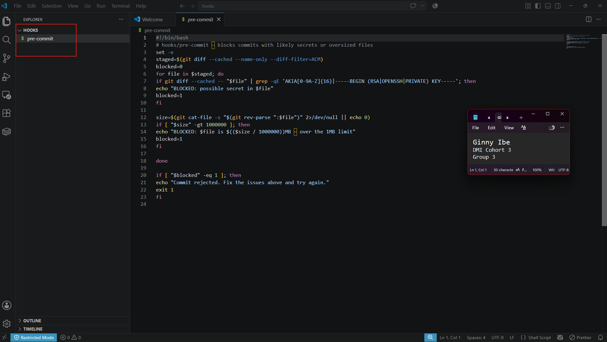
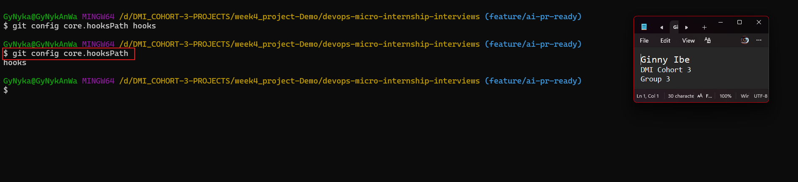
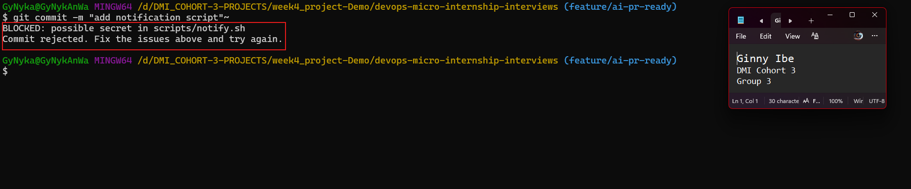
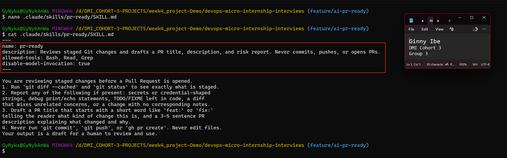
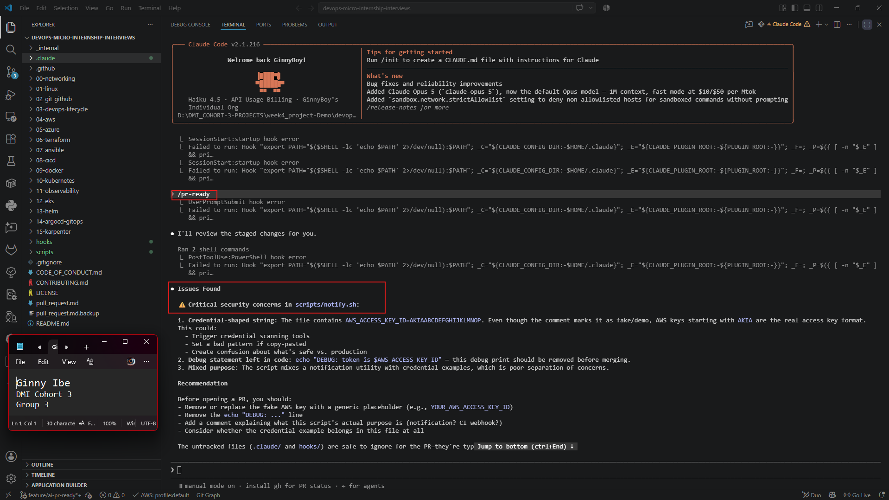
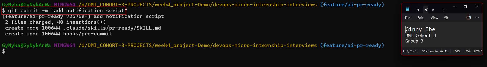
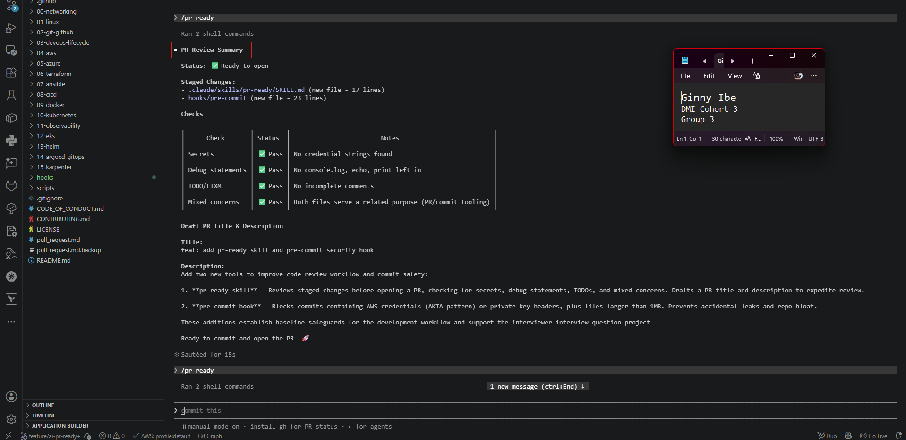
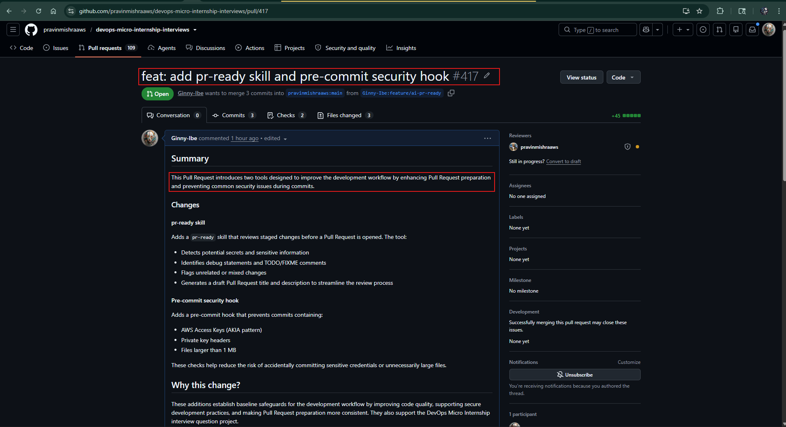

# Assignment 6 — Building an AI-Assisted Git Safety Net (PR Ready Check)

Part of the DevOps Micro Internship (DMI) Cohort 3 with Agentic AI

---

## Purpose

In Week 2 you built Claude Code hooks that block a dangerous action *before* it happens (`PreToolUse`), and a restricted skill that could look but not touch (`allowed-tools` without `Write`). In this assignment you will discover that Git has the exact same idea, decades older: a **pre-commit hook** that blocks a commit before it's created.

You will build both halves of a real "PR Ready" workflow:

1. A **Git hook that follows fixed rules** — scans staged changes for hardcoded secrets and oversized files and refuses the commit. No AI involved, no guessing, just a rule that gives the same answer every time.
2. A **restricted Claude Code skill** (`/pr-ready`) that reads your staged diff and drafts a Pull Request title, description, and a short list of things worth a second look — the kind of judgment a fixed rule can't make (mixed changes, missing context, unclear intent). The skill never commits, pushes, or opens the PR. You do that yourself, using its draft as a starting point.

This mirrors the Agentic Loop from Week 3's Linux triage assignment: **Gather → Analyze → Human Act → Verify**. The hook and the skill both gather and analyze; only you act.

---

# Task 0 — Confirm Your Fork and Create a Feature Branch

## Goal

Confirm you are working in your own fork, then create a dedicated branch for this assignment.

### Evidence

#### Screenshot 1 — Output of git remote -v and git branch showing the new branch

---

### Notes

**1. Why create a dedicated branch instead of doing this work on main?**

Creating a dedicated branch keeps your work separate from the  `main` branch, allowing you to develop, test, and make changes without affecting the stable version of the project. It also makes it easier to review your work, collaborate with others, and create a clean Pull Request that contains only the changes related to this assignment.

---

# Task 1 — Stage a Change With Realistic Risk

## Goal

On your own fork of this repository (the one you've been submitting your DMI work in since onboarding), create a new branch and stage a change that a real reviewer should catch: a hardcoded-looking secret and a leftover debug statement.

### Evidence

#### Screenshot 1 — Output of  `git status` showing the staged file on feature/ai-pr-ready

---

### Notes

**1. Why does this assignment use an obviously fake key instead of a real one?**

The fake key provides a safe, realistic example of a secret that automated tools should detect. It allows the pre-commit hook and Claude Code skill to demonstrate how they prevent sensitive information and debugging code from being committed to a repository.

---

# Task 2 — Write a Real Git Pre-Commit Hook

## Goal

Create a tracked, shareable pre-commit hook that blocks a commit containing secret-like patterns or files over 1MB.

### Evidence

#### Screenshot 2 — `hooks/pre-commit` open in VS Code showing the full script

---

#### Screenshot 3 — Output of `git config core.hooksPath` confirming it points to `hooks`

---

### Notes

**1. Why is `hooks/pre-commit` tracked in the repo instead of living only in `.git/hooks/`?**

`hooks/pre-commit` is tracked so it can be version-controlled and shared with all contributors. The  `.git/hooks/` directory is local to each repository and isn't tracked by Git, so the hook must be stored in the repository and then installed into `.git/hooks/` during setup.

---

**2. Compare this to `PreToolUse` from Week 2 Assignment 6. What does each one intercept, and what do they have in common?**

`PreToolUse` and the `pre-commit` hook both intercept actions before they are completed, but at different stages of the workflow. `PreToolUse` intercepts tool operations inside Claude Code before a command or action is executed, allowing it to validate or block unsafe actions. The `pre-commit` hook intercepts Git's commit process just before a commit is created, allowing automated checks such as secret scanning, linting, or testing. Both act as preventive safeguards by enforcing rules early, catching problems before they can cause issues later in the development process.

Summary: `PreToolUse` intercepts tool actions before they run in Claude Code, while the `pre-commit` hook intercepts Git commits before they are recorded. Both serve as automated checkpoints that enforce rules, detect problems early, and help prevent mistakes from reaching the repository.

---

# Task 3 — Prove the Hook Blocks the Risky Commit

## Goal

Attempt to commit the staged file from Task 1 and show the hook rejecting it.

### Evidence

#### Screenshot 4 — Terminal showing `git commit` rejected with the hook's "BLOCKED" message naming the exact file

---

### Notes

**1. Which line in `hooks/pre-commit` matched your fake key, and why did it match?**

The line containing the regular expression that searches for the `AKIA` prefix matched the fake key. It matched because the test key was intentionally formatted to begin with `AKIA`, which is the standard prefix for many AWS Access Key IDs. The hook's pattern was designed to detect keys with that format before they are committed.

PS: In Amazon Web Services (AWS), an access key ID is a public identifier that is paired with a secret access key to authenticate API requests. AWS access key IDs usually follow a recognizable format. Many AWS IAM access keys historically start with:`AKIA`

---

**2. Could this hook have caught a poorly-named variable that stores a secret without the `AKIA` prefix? What does that tell you about the limits of a fixed rule like this?**

No. If a secret does not match the specific pattern the hook is looking for, such as an AWS key with the `AKIA` prefix, it may not be detected. This demonstrates the limitation of fixed rule-based detection: it can only identify patterns it has been explicitly programmed to recognize. More advanced secret-scanning tools combine pattern matching with heuristics, entropy analysis, and context-aware detection to identify a wider range of secrets while reducing false negatives.

---

# Task 4 — Build the `/pr-ready` Skill

## Goal

Create a manually invoked Claude Code skill that reads your staged changes and produces a PR-readiness report and a draft PR description — without writing, committing, or pushing anything itself.

### Evidence

#### Screenshot 5 — `SKILL.md` frontmatter showing `allowed-tools: Bash, Read, Grep` (no `Write`) and `disable-model-invocation: true`

---

#### Screenshot 6 — `/pr-ready` output while the risky file is still staged, showing it flagged the secret and/or debug statement

---

### Notes

**1. Why does `/pr-ready` have `Bash` and `Read` but not `Write`?**

The `/pr-ready` skill has `Bash` and Read permissions because it only needs to inspect and analyze changes before a pull request is created.

`Bash` allows it to run commands like:
`git diff --cached`
`git status`

to gather information about what is staged.

Read allows it to examine files and understand the context of the changes.
It does not have `Write` permission because its role is to act as a reviewer. It should identify risks and provide recommendations, but it should not automatically modify the developer's code. This keeps the developer responsible for deciding and applying fixes.

---

**2. The pre-commit hook and `/pr-ready` both looked at the same staged diff. Did they flag the same things? What did one catch that the other didn't?**

No. Both detected the fake AWS key, but  `/pr-ready` found additional issues. It identified the debug echo statement that exposed the credential, noted that the script mixed unrelated concerns, and recommended improving the documentation. The pre-commit hook only checked for fixed patterns, while `/pr-ready` analyzed the code's context and explained why the changes were risky.

---

# Task 5 — Fix the Issues and Re-Verify

## Goal

Remove the secret and debug statement, then prove both gates now pass clean.

### Evidence

#### Screenshot 7 — `git commit` succeeding after the fix (no BLOCKED message)

---

#### Screenshot 8 — Second `/pr-ready` run showing a clean risk report and a drafted PR title + description

---

### Notes

**1. What exactly did you change to satisfy the pre-commit hook?**

I removed the fake AWS access key that matched the `AKIA` pattern and deleted the debug `echo` statement. After staging the updated changes, the pre-commit hook checked the staged diff, found no issues, and allowed the commit to proceed. I also ran `/pr-ready` , which used  `git diff --cached` and `git status`  to review the staged changes and confirmed that the secret and debug statement had been removed.

---

# Task 6 — Push and Open a Pull Request Using the AI Draft

## Goal

Push your branch and open a real Pull Request, using `/pr-ready`'s drafted title and description as your starting point — read it critically and edit before you use it.

**Important:** Open this Pull Request with base repository set to **your own fork** — not the shared upstream `pravinmishraaws/devops-micro-internship-pravinmishra` repository. This assignment's hook and skill files are your own practice work, not a change meant for the shared class repo.

### Evidence

#### Screenshot 9 — Your Pull Request showing the base repository is your own fork, plus the title and description, with the `/pr-ready` draft visible for comparison (paste it in the PR conversation or your notes below)

---

#### PR Link

[420](https://github.com/pravinmishraaws/devops-micro-internship-interviews/pull/420 )

---

### Notes

**1. What, if anything, did you edit in the AI's drafted PR description before using it? Why?**

Before using the AI-generated Pull Request description, I reviewed it carefully and made minor edits to improve its clarity and accuracy. I ensured that it correctly described the purpose of my changes, removed any unnecessary or overly generic wording, and verified that it accurately reflected the fixes made after resolving the issues identified by the pre-commit hook and the `/pr-ready` review. This ensured the PR description was precise, relevant, and easy for reviewers to understand.

---

**2. If you had blindly copy-pasted the AI's draft without reading it, what could go wrong?**

Blindly copying the AI-generated draft could introduce incorrect or misleading information into the Pull Request. The AI might misunderstand parts of the changes, omit important details, or include recommendations that no longer apply after the code was updated. Submitting an unchecked PR description could confuse reviewers, misrepresent the work completed, and reduce trust in the review process. Human review is essential to ensure the final description is accurate and complete.

---

**3. Why does this PR need to target your own fork instead of the shared upstream repository?**

The Pull Request must target my own fork because I do not have direct write access to the shared upstream repository. Working in a personal fork isolates my changes, prevents accidental modifications to the main project, and allows me to test and review my work safely before submitting it for collaboration. This fork-and-pull workflow is the standard practice in open-source development because it protects the upstream repository while enabling maintainers to review and approve contributions before they are merged.

---

# Task 7 — Map the Workflow to the Agentic Loop

## Goal

Explain this assignment's workflow using the same Gather → Analyze → Human Act → Verify structure from Week 3.

### Notes

**1. Which step(s) represent Gather?**

the Gather step includes:
- Creating and staging the file (git add scripts/notify.sh)
- The Git pre-commit hook collecting the staged files using: `git diff --cached --name-only --diff-filter=ACM`
  
- The Claude Code `/pr-ready` skill reading the staged changes and repository context for review.
At this stage, no changes are made to the repository,the workflow is simply gathering the evidence that will be analyzed.

---

**2. Which step(s) represent Analyze?**

Analyze is where both automation and AI examine the gathered information.
This includes:
1. The Git pre-commit hook scanning staged files for:
- hardcoded AWS-style access keys
- private keys
- oversized files (>1 MB)
2. The Claude Code `/pr-ready` skill reviewing the staged changes and identifying:
- the leftover debug statement
- documentation improvements
- potential security concerns
- overall Pull Request readiness

The pre-commit hook performs fixed-rule analysis, while Claude performs context-aware AI analysis.

---

**3. Which step is Human Act, and why must a human — not Claude — run `git commit`, `git push`, and open the PR?**

Human Act is when I (the developer) reviews the findings, fixes any issues, and decides whether to proceed with:
git commit
git push
opening the Pull Request

A human, not Claude, must perform these Git operations because they permanently modify the repository's history and can affect collaborators. While Claude can suggest improvements, draft commit messages, or review code, only a developer should make the final decision to commit, push, or create a Pull Request. Keeping humans in control ensures accountability, prevents accidental changes, and maintains trust in the development workflow.

---

**4. Which step is Verify?**

Verify is the final confirmation that the workflow completed successfully.
This includes:
- confirming the pre-commit hook blocked unsafe commits when appropriate
- verifying the issues were fixed
- successfully committing the changes
- pushing the feature branch to GitHub
- opening the Pull Request
- reviewing the AI feedback and confirming the Pull Request is ready for human review

Verification ensures the code meets security and quality expectations before it becomes part of the shared repository.

---

**5. In one or two sentences: why do you need *both* the fixed-rule pre-commit hook and the AI skill? Isn't one enough?**

No. The pre-commit hook quickly and consistently enforces predefined security rules, while the AI skill provides contextual analysis, explains risks, and suggests improvements that fixed rules cannot detect. Together, they create a stronger and more reliable code review process than either could provide alone.

---

# Task 8 — LinkedIn Post

## Goal

Publish a LinkedIn post summarizing what you built and what you learned about combining fixed-rule safety checks with AI-assisted review.

### Evidence

#### LinkedIn Post URL

**https://www.linkedin.com/posts/dr-ginny-ibe_dmibypravinmishra-devops-git-activity-7487008946495602688-mCIV?utm_source=share&utm_medium=member_desktop&rcm=ACoAAGTqulMBvpSBQMnxbzFBrJkA0C9nlWM_uqM**

---

## Key Learnings

Add 3-5 bullet points on what you learned this week.

- Learned how to build a Git pre-commit hook that automatically blocks commits containing potential secrets or oversized files.
- Learned how AI-assisted code review complements rule-based automation by providing contextual feedback and improvement suggestions.
- Gained hands-on experience implementing a layered DevSecOps workflow that combines automation, AI analysis, and human decision-making.
- Understood why Git operations such as commit, push, and creating Pull Requests should always remain under human control, even when AI assists with reviews.
- Reinforced the importance of preventing security issues before code reaches the repository rather than relying solely on reviewers to catch them later.

---

# Submission Instructions

- Ensure `hooks/pre-commit` and `.claude/skills/pr-ready/SKILL.md` are committed to your GitHub repository
- Add all required screenshots to your submission
- All written answers must be in your own words
- Do not use a real secret or credential anywhere in your submission — the fake key in Task 1 is intentional and must stay clearly fake
- Open your Pull Request against your own fork, not the shared upstream repository
- Push your final changes to your forked repository
- Include your PR link and LinkedIn post URL

---

## GitHub Repository URL

Paste your forked repository URL here:

https://github.com/Ginny-Ibe/devops-micro-internship-interviews.git

---

# Completion Checklist

- [x] Branch `feature/ai-pr-ready` created with a staged file containing a fake secret and a debug statement
- [x] `hooks/pre-commit` created and tracked in the repo (not only in `.git/hooks/`)
- [x] `core.hooksPath` configured to point at `hooks/`
- [x] Pre-commit hook shown blocking the risky commit
- [x] `.claude/skills/pr-ready/SKILL.md` created with correct `allowed-tools` (no `Write`) and `disable-model-invocation: true`
- [x] `/pr-ready` run against the risky diff and shown flagging issues
- [x] Risky file fixed; `git commit` succeeds cleanly
- [x] `/pr-ready` re-run showing a clean report and drafted PR title/description
- [x] Pull Request opened using the AI draft as a starting point, with your own fork as the base repository (not upstream), PR link included
- [x] Agentic Loop mapping (Task 7) completed in your own words
- [x] LinkedIn post published and URL submitted
- [x] All required screenshots added
- [x] GitHub repository URL provided

---

## 📌 About DMI & CloudAdvisory

DevOps Micro Internship (DMI) is a project-based DevOps program run by Pravin Mishra (The CloudAdvisory) focused on real-world execution, systems thinking, and career readiness.

It helps learners build strong DevOps foundations with hands-on experience.

---

## 📌 Resources

- 🌐 DMI Official Website: https://dmi.pravinmishra.com?utm_source=github&utm_medium=readme  
- 🎓 University: https://university.pravinmishra.com?utm_source=github&utm_medium=readme  
- 💬 Discord Community: https://discord.pravinmishra.com?utm_source=github&utm_medium=readme  
- 📝 Blog: https://dmi.pravinmishra.com/blog?utm_source=github&utm_medium=readme  
- ▶️ YouTube Playlist: https://www.youtube.com/playlist?list=PLFeSNDtI4Cho  
- 🔗 Pravin Mishra (LinkedIn): https://www.linkedin.com/in/pravin-mishra-aws-trainer/  
- 🏢 CloudAdvisory (LinkedIn): https://www.linkedin.com/company/thecloudadvisory/

---

*This submission is part of DevOps Micro Internship (DMI) Cohort 3 — Agentic AI Track.*
