# Assignment 5 — AI-Assisted Sprint Health Report via Jira MCP

Part of the DevOps Micro Internship (DMI) Cohort 3 with Agentic AI

---

## Purpose

In this assignment, you will connect Claude Code to your Jira board through an MCP server, the same way you connected it to GitHub in Week 2, and build a read-only `/sprint-health` skill. The skill reads your current sprint through Jira's API and reports sprint velocity, stories at risk of missing the sprint, and items missing an estimate — but it must never create, edit, comment on, or transition a single ticket itself. You will prove that boundary holds by making a real change on the board yourself and confirming the skill only ever reports, never acts.

---

# Task 1 — Create a Jira API Token

## Goal

Generate an API token from your Atlassian account that the MCP server will use to authenticate with your Jira site. Do not screenshot the token value itself.

### Evidence

#### Screenshot 1 — Jira API token creation confirmation page showing the token name, with the token value not visible

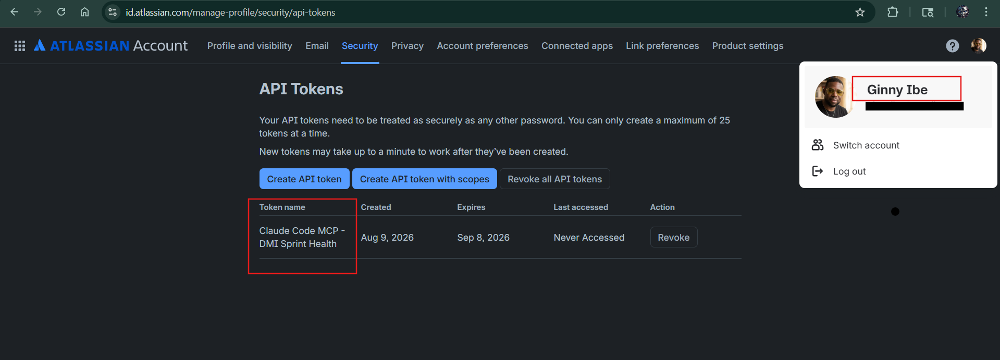

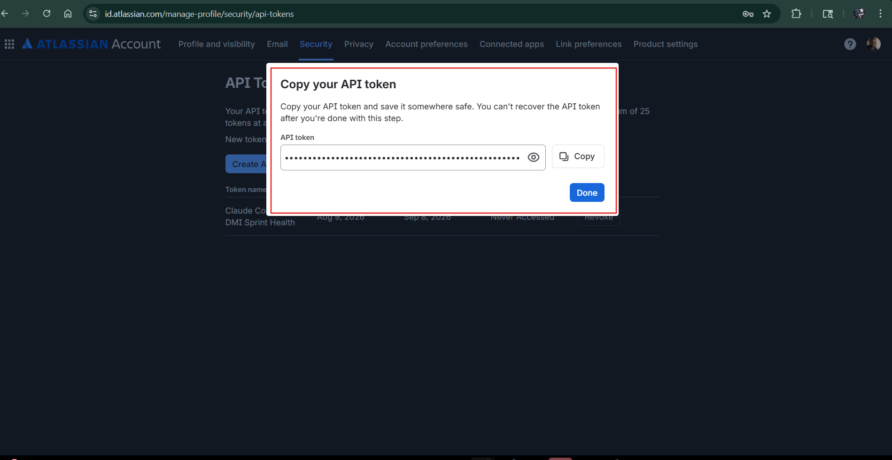


### Notes You Must Write (Very Important):

Why does the MCP server need your site URL and account email in addition to the token?

Answer: The MCP server needs the Jira site URL, account email, and API token because each one has a different role in the connection.

Site URL: Tells the MCP server which Jira instance to connect to.
Account email: Identifies the Jira/Atlassian account being used.
API token: Authenticates the account and allows the MCP server to make authorized Jira API requests.

In practical terms, the URL tells it where to connect, the email tells it who is connecting, and the token verifies that the connection is authorized. All three are needed for the MCP server to interact with the correct Jira account and site securely.

---

# Task 2 — Create .mcp.json at the Project Root

## Goal

Create or update `.mcp.json` at your project root with a Jira MCP server block, following the same shape as the GitHub MCP server you configured in Week 2.

### Evidence

#### Screenshot 2 — `.mcp.json` open in VS Code showing the Jira server configuration

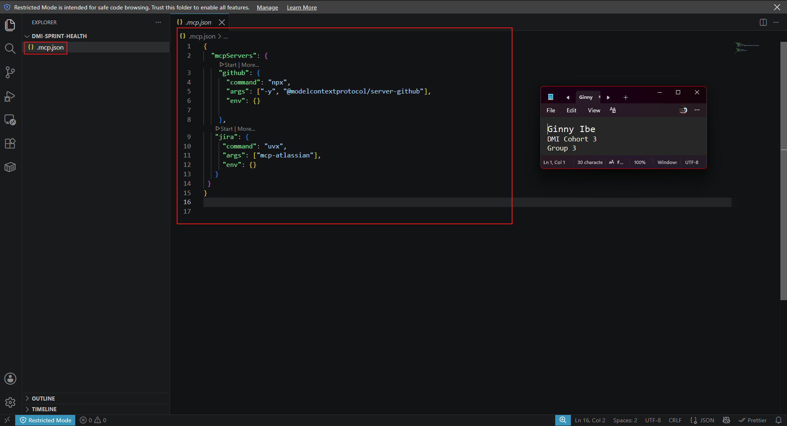


`.mcp.json` with the new `jira` block alongside the `github` block from Week 2. The jira server runs `mcp-atlassian` through `uvx`.

### Notes You Must Write (Very Important):

Compare this jira block to the github block from Week 2 Assignment 5. The GitHub server ran via npx (a Node.js package); this one runs via uvx (a Python package) — what stays exactly the same shape despite that difference, and why doesn't Claude Code care which language a given MCP server is written in?

## Compare the Jira MCP Block to the GitHub MCP Block

The two blocks are structurally identical. Both use the same three configuration keys: `command`, `args`, and `env`.

```json
"github": { "command": "npx", "args": ["-y", "@modelcontextprotocol/server-github"],"env": {} },
"jira": { "command": "uvx", "args": ["mcp-atlassian"],                              "env": {} }
```

What changes is the value of `command` and the package specified in `args`. The overall configuration shape stays the same.

Claude Code does not need to know or understand the language the MCP server was written in. It launches the server process and communicates with it through the MCP protocol, typically over stdin/stdout.

`npx` resolves and runs a Node.js package, while `uvx` resolves and runs a Python package. From Claude Code's perspective, both become processes on the other end of the same MCP communication channel.

That is the value of using a protocol: it defines the communication interface rather than dictating how the server must be implemented. The implementation language can change without changing how Claude Code interacts with the server.

The evidence is visible in `/mcp`, where both `github` and `jira` appear as MCP servers with their available tools, even though they use different runtimes.


---

# Task 3 — Add Your Credentials to settings.local.json

## Goal

Add your Jira site URL, account email, and API token to `.claude/settings.local.json`, and confirm that file is listed in `.gitignore` so it is never committed.

### Evidence

#### Screenshot 3 — `settings.local.json` open in VS Code showing the `env` section, with the actual token value blurred or covered

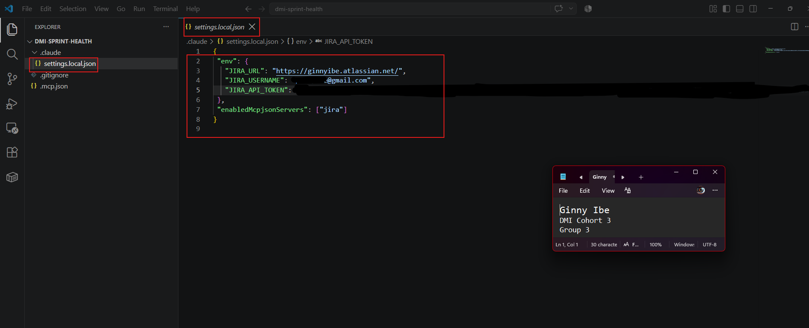


### Notes You Must Write (Very Important):

Why must JIRA_API_TOKEN live in settings.local.json and never in .mcp.json?

The key distinction is configuration vs. secrets.

`JIRA_API_TOKEN` is a credential that grants access to Jira. It should be treated like a password, not like normal MCP configuration.
`JIRA_API_TOKEN` is a **secret credential**, not MCP configuration.

- `.mcp.json` → Defines the MCP server, command, and arguments.
- `settings.local.json` → Suitable for local, user-specific configuration.
- Security → Keeping tokens out of shared configuration prevents credential leaks.
- Git safety → `.mcp.json` may be committed to the repository; secrets should never be committed.
- Team environments → Each developer can use their own Jira credentials.
- Rotation → Tokens can be replaced without modifying shared MCP configuration.

> **Configuration can be shared; secrets must be protected.**
Never commit API tokens to Git. Add local secret files to `.gitignore`.

---

# Task 4 — Verify the Connection with /mcp

## Goal

Restart Claude Code and confirm the Jira MCP server shows as connected.

### Evidence

#### Screenshot 4 — `/mcp` output showing `jira: connected`

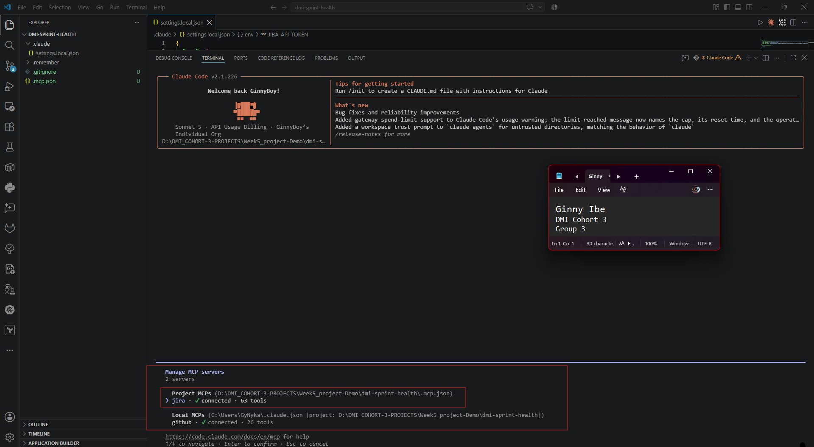


---

# Task 5 — Run a Live Query to Prove Real Board Data

## Goal

Ask Claude to list the issues in your current active sprint through the Jira MCP connection, and confirm the result matches what you see on your live board in the browser.

### Evidence

#### Screenshot 5 — Claude's response showing the live sprint issue list retrieved via Jira MCP

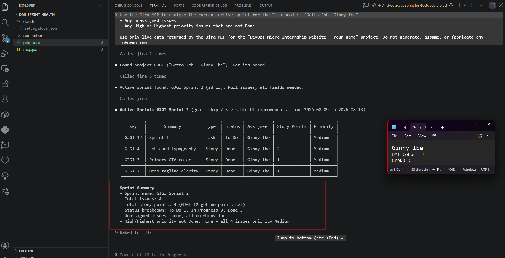


### Notes You Must Write (Very Important):
How did you confirm this was real board data and not something Claude guessed?

fours ways to confirm Claims and verify results
1. Tool calls executed — VERIFIED
Four Jira MCP tool calls were made and returned raw JSON, confirmed by observing the tool_use/tool_result blocks fire in the transcript:
- `mcp__jira__jira_search_projects` → found project GJGI
- `mcp__jira__jira_get_agile_boards` → board id 8
- `mcp__jira__jira_get_sprints_from_board` → sprint id 13, state "active"
- `mcp__jira__jira_get_sprint_issues` → 4 issues

Source: ginnyibe.atlassian.net via Atlassian's REST API, not model-generated text.

2. Internal IDs present in the response — VERIFIED
- Project id: 10007
- Board id: 8
- Sprint id: 13
- Issue ids: 10044, 10036, 10035, 10034
- Account id (Ginny Ibe): 712020:96452aa9-bd89-416b-bdb9-037c012d5bde

IDs were consistent across all four tool calls with no mismatches.

3. Browse URLs clicked and cross-checked against live board — VERIFIED
- https://ginnyibe.atlassian.net/browse/GJGI-12
- https://ginnyibe.atlassian.net/browse/GJGI-4
- https://ginnyibe.atlassian.net/browse/GJGI-3
- https://ginnyibe.atlassian.net/browse/GJGI-2

All 4 clicked and confirmed to match the live board (titles, statuses, assignee).

4. Sprint dates — VERIFIED**
Start 2026-08-09, end 2026-08-13, confirmed against the live sprint record — consistent with "today = 2026-08-10" and state "active."

Verification status

| Claim | Status |
|---|---|
| Tool calls ran (not typed text) | Verified |
| Internal IDs consistent | Verified |
| Browse URLs clicked and matched live board | Verified — ground truth, click-confirmed |
| Sprint dates match reality | Verified against live sprint record |

Bottom line

All 4 claims confirmed true, with claim 3 (click-through against the live board) serving as the ground-truth check that the other three are consistent with. Data is confirmed real, not model-fabricated.

# Task 6 — Build the /sprint-health Skill

## Goal

Create a `/sprint-health` skill restricted to read-only Jira tools plus `Read`, with no issue-mutating tools and no `Write`. Run it and confirm it produces a report covering sprint velocity, at-risk stories, and items missing an estimate.

### Evidence

#### Screenshot 6 — `SKILL.md` frontmatter showing `allowed-tools` limited to read-only Jira tools plus `Read`, with `disable-model-invocation: true`

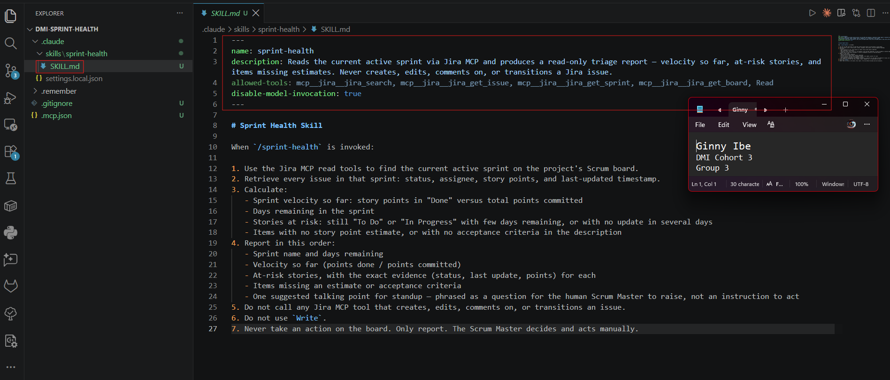


#### Screenshot 7 — `/sprint-health` output showing the full triage report against your real sprint

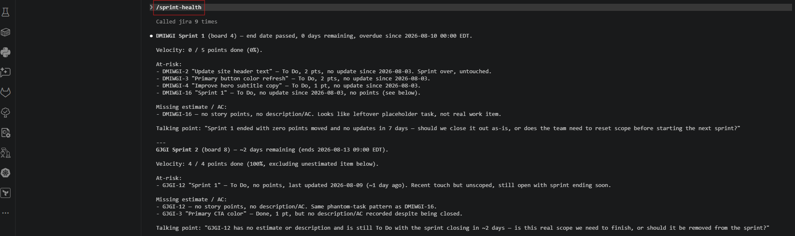
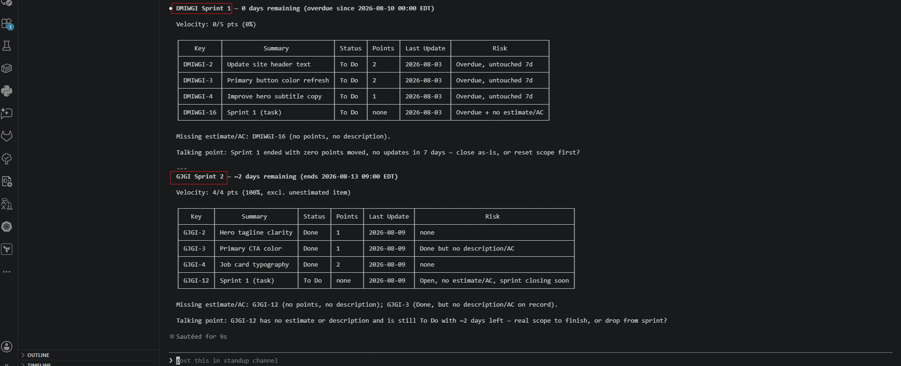


### Notes You Must Write (Very Important):

1. Which Jira MCP tools does this skill's allowed-tools list include, and which mutating tools (create issue, update issue, transition issue, add comment) does it deliberately exclude?

Allowed-tools list (frontmatter):
`mcp__jira__jira_search`, `mcp__jira__jira_get_issue`, `mcp__jira__jira_get_sprint`, `mcp__jira__jira_get_board`, `Read`

Excluded mutating tools (blocked by omission + explicit rule 5):
create issue, edit/update issue, transition issue, add comment — anything that creates, edits, comments on, or transitions a Jira item. `Write` is also explicitly banned (rule 6).

2. Why does a Scrum Master need this restriction more than almost any other role in this course?

The Scrum Master role holds authority over board state (status, assignments, sprint scope), but that authority is meant to stay human-exercised — team members report their own status, and the Scrum Master facilitates and decides; they don't silently rewrite the board.

An agent with write access could transition tickets, add comments, or reassign work based on its own read of "at risk." That looks like automation helping, but it actually erodes the one thing that makes standup data trustworthy: everyone knows a human touched it last.

Other course roles (a dev reading their own tickets, a PM viewing reports) don't carry that same board-of-record authority, so accidental mutation from them has a lower blast radius. The Scrum Master's tool sitting one step from "just fix it for them" is the exact failure mode read-only enforcement is meant to prevent.

---

# Task 7 — Prove the Skill Never Mutates the Board

## Goal

Manually update one ticket on your board in the browser (for example, move a story to "Done" or add a missing estimate), then run `/sprint-health` again and confirm the new report reflects your change — proving the skill only ever reads live state and never wrote to the board itself.

### Evidence

#### Screenshot 8 — Second `/sprint-health` run showing the report now reflects your manual board change

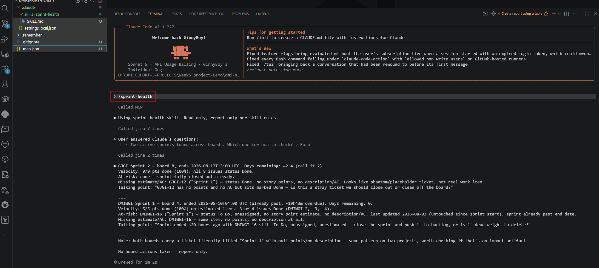
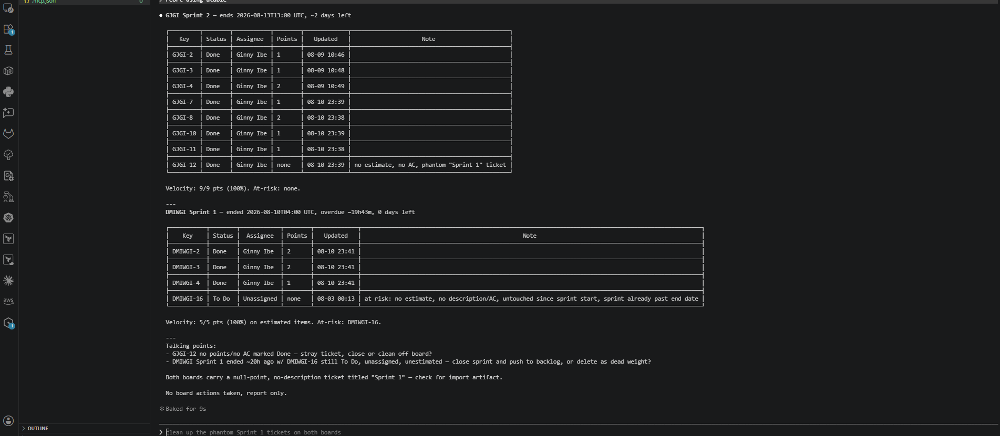


### Notes You Must Write (Very Important):

Map this assignment to Gather → Analyze → Human Act → Verify from Week 3 Assignment 6. Which step did you perform manually in the browser, and why must that step stay human?

The assignment follows the Agentic Loop: **Gather → Analyze → Human Act → Verify**.

Jira MCP performed the **Gather** step by retrieving live sprint data, while the `/sprint-health` skill performed the **Analyze** step by calculating sprint health, identifying at-risk stories, and detecting missing estimates or acceptance criteria. I performed the **Human Act** step manually in the Jira browser by changing an issue on the active sprint. I then ran `/sprint-health` again to perform the **Verify** step and confirm that the skill could detect the updated Jira state.

The Human Act step must remain human because changing the Jira board is a consequential project-management action that requires judgment, context, and accountability. The AI can identify risks and provide evidence, but it should not independently decide whether a story should be moved, assigned, estimated, or modified. This assignment deliberately keeps the `/sprint-health` skill read-only so that the Scrum Master remains in control of all board changes. This demonstrates the principle that AI can gather and analyze evidence, while humans retain authority over consequential actions.

⭐ The key takeaway
- Gather and Analyze can be automated.
- Human Act remains under human control.
- Verify can be automated again.
That is exactly what makes this assignment a strong demonstration of safe Agentic AI rather than unrestricted AI automation.

---

# Submission Instructions

Complete all tasks in sequence.

Your submission must include:
- All 8 required screenshots
- All the required notes

---

# Completion Checklist

- [x] Task 1: Jira API token created, value never screenshotted (Screenshot 1)
- [x] Task 2: `.mcp.json` has the Jira server block (Screenshot 2)
- [x] Task 3: Credentials stored in `settings.local.json`, token blurred, file gitignored (Screenshot 3)
- [x] Task 4: `/mcp` shows the Jira server connected (Screenshot 4)
- [x] Task 5: Live query returned real sprint data, verified against the browser (Screenshot 5)
- [x] Task 6: `/sprint-health` skill created with correct read-only `allowed-tools`, and produced a full report (Screenshots 6–7)
- [x] Task 7: A manual board change was reflected in a second `/sprint-health` run (Screenshot 8)
- [x] Skill never created, edited, transitioned, or commented on any issue
- [x] Reflection answered (Notes)
- [x] No API token value exposed

---

## 📌 About DMI & CloudAdvisory

DevOps Micro Internship (DMI) is a project-based DevOps program run by Pravin Mishra (The CloudAdvisory) focused on real-world execution, systems thinking, and career readiness.

It helps learners build strong DevOps foundations with hands-on experience.

---

## 📌 Resources

- 🌐 DMI Official Website: https://dmi.pravinmishra.com?utm_source=github&utm_medium=readme  
- 🎓 University: https://university.pravinmishra.com?utm_source=github&utm_medium=readme  
- 💬 Discord Community: https://discord.pravinmishra.com?utm_source=github&utm_medium=readme  
- 📝 Blog: https://dmi.pravinmishra.com/blog?utm_source=github&utm_medium=readme  
- ▶️ YouTube Playlist: https://www.youtube.com/playlist?list=PLFeSNDtI4Cho  
- 🔗 Pravin Mishra (LinkedIn): https://www.linkedin.com/in/pravin-mishra-aws-trainer/  
- 🏢 CloudAdvisory (LinkedIn): https://www.linkedin.com/company/thecloudadvisory/

---

*This submission is part of DevOps Micro Internship (DMI) Cohort 3 — Agentic AI Track.*
