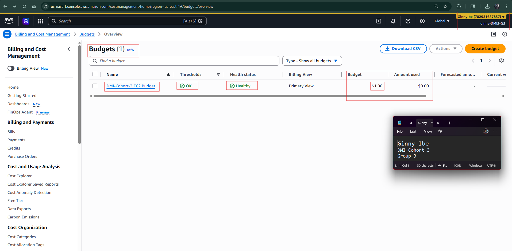
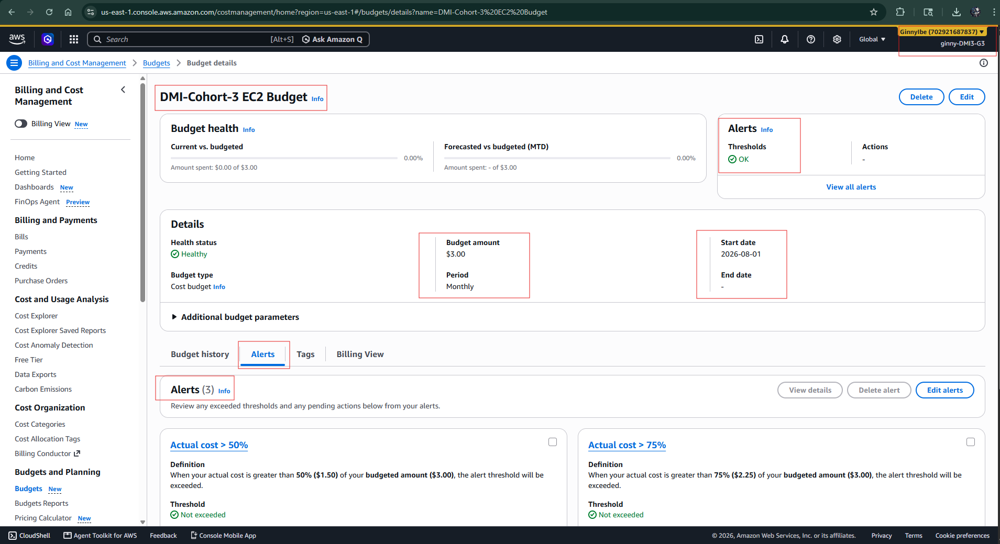
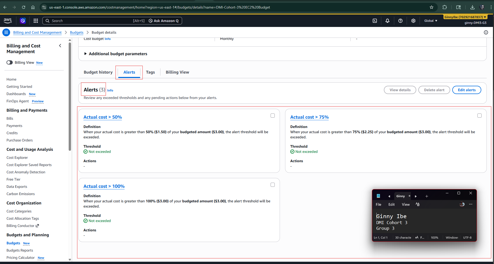

# Assignment 1 — Creating an AWS Free Tier Account & Setting Up Budget Management and Alerts

Part of the DevOps Micro Internship (DMI) Cohort 3 with Agentic AI

---

## Purpose

In this assignment, you will create your own AWS Free Tier account and configure budget management with cost alerts. This is an important first step: it lets you follow along with the rest of the course, and the alerts help ensure you do not exceed your budget.

---

# Task 1 — Sign Up for AWS and Access the Console

## Goal

Create your AWS Free Tier account, select the Basic Support Plan (Free), and log in to the AWS Management Console.

> No screenshot required for this task. Completion is verified through Task 2.

---

# Task 2 — Create a Monthly Cost Budget with Alerts

## Goal

In the Billing Dashboard, create a monthly Cost Budget with a name, amount, and start month, then configure alert thresholds (e.g. 50%, 80%, 100%) and a notification email address.

### Evidence

#### Screenshot 1 — AWS Budget setup page showing the budget name, budget amount, and alert thresholds

---

### Notes

Answer the following in your own words:

**1. Why is it important to set up budget alerts when using an AWS account?**

Budget alerts are important because they help me keep track of my AWS spending and avoid unexpected charges. They notify me when my usage approaches a limit I have set, so I can investigate unusual costs early and take action before the bill grows. This is especially important when learning or testing AWS services, where it is easy to leave resources running accidentally.

Budget alerts are important because AWS uses a pay-as-you-go model, so costs can continue to increase while resources are running. Even when working within the AWS Free Tier, some services have usage limits, and exceeding those limits can result in charges.

Setting up budget alerts gives me an early warning when my spending reaches a specific threshold. This helps me catch things like EC2 instances left running, unused resources, unexpected data-transfer costs, or services that are consuming more than expected.

It’s also a good cloud engineering practice. Instead of waiting until the end of the month to discover an unexpected bill, I can monitor costs proactively and take action early. In a real DevOps environment, this same principle supports cost visibility, accountability, and FinOps practices.

So, budget alerts act as a financial safety net: AWS gives me the flexibility to create resources, while budget alerts help me stay aware of what those resources are costing.

---

# Submission Instructions

- Add the required screenshot in your submission
- Do not expose sensitive billing, card, identity, or account information

---

# Completion Checklist

- [x] AWS Free Tier account created and Basic Support Plan (Free) selected
- [x] Logged in to the AWS Management Console
- [x] Monthly Cost Budget created with name, amount, and start month
- [x] Budget alert thresholds and notification email configured
- [x] Screenshot captured showing budget name, amount, and thresholds (Screenshot 1)
- [x] Notes question answered
- [x] No sensitive billing or account information exposed

---

## 📌 About DMI & CloudAdvisory

DevOps Micro Internship (DMI) is a project-based DevOps program run by Pravin Mishra (The CloudAdvisory) focused on real-world execution, systems thinking, and career readiness.

It helps learners build strong DevOps foundations with hands-on experience.

---

## 📌 Resources

- 🌐 DMI Official Website: https://dmi.pravinmishra.com?utm_source=github&utm_medium=readme  
- 🎓 University: https://university.pravinmishra.com?utm_source=github&utm_medium=readme  
- 💬 Discord Community: https://discord.pravinmishra.com?utm_source=github&utm_medium=readme  
- 📝 Blog: https://dmi.pravinmishra.com/blog?utm_source=github&utm_medium=readme  
- ▶️ YouTube Playlist: https://www.youtube.com/playlist?list=PLFeSNDtI4Cho  
- 🔗 Pravin Mishra (LinkedIn): https://www.linkedin.com/in/pravin-mishra-aws-trainer/  
- 🏢 CloudAdvisory (LinkedIn): https://www.linkedin.com/company/thecloudadvisory/

---

*This submission is part of DevOps Micro Internship (DMI) Cohort 3 — Agentic AI Track.*