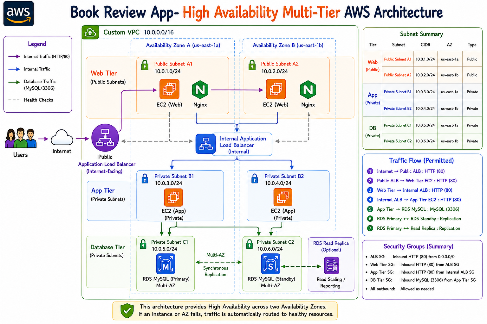
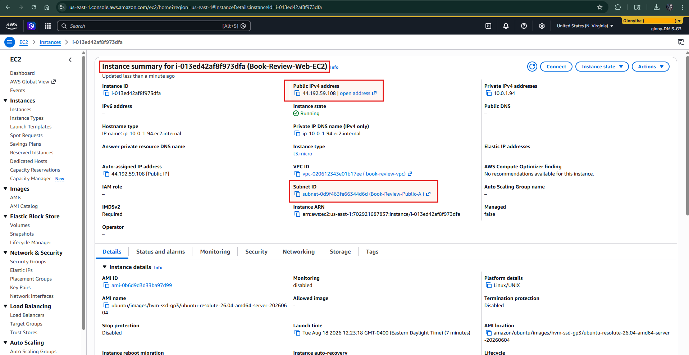
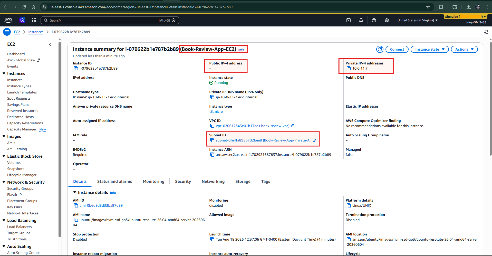
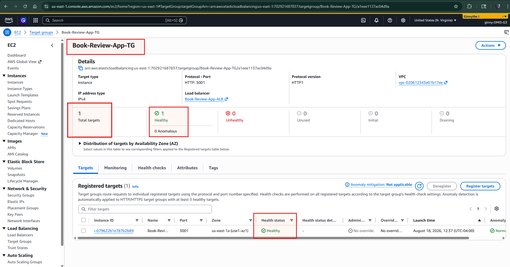
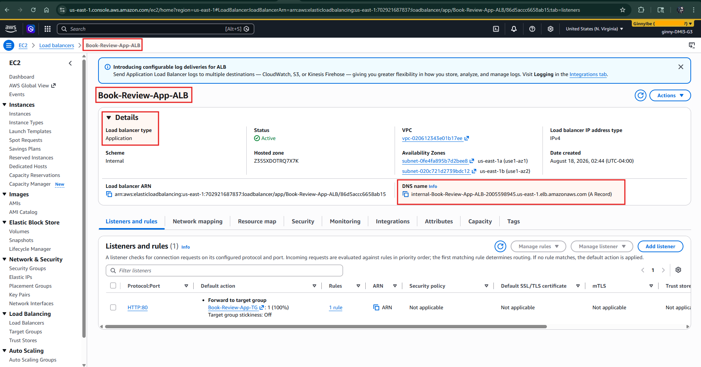
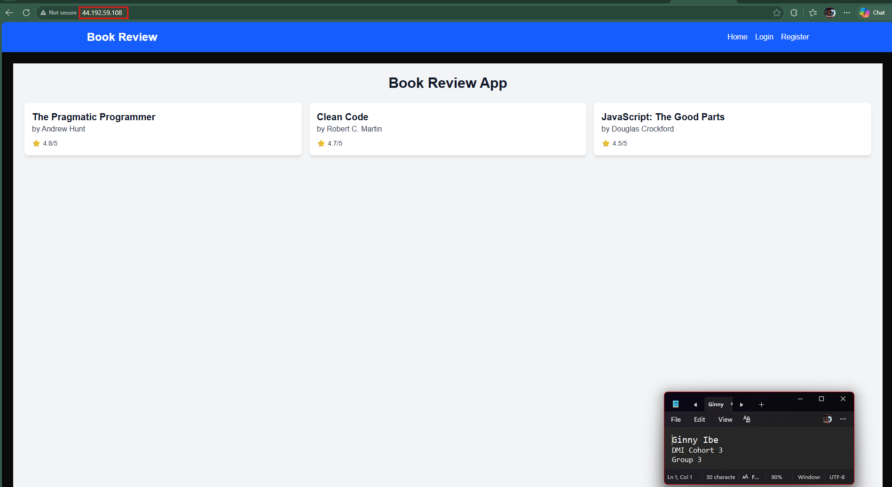
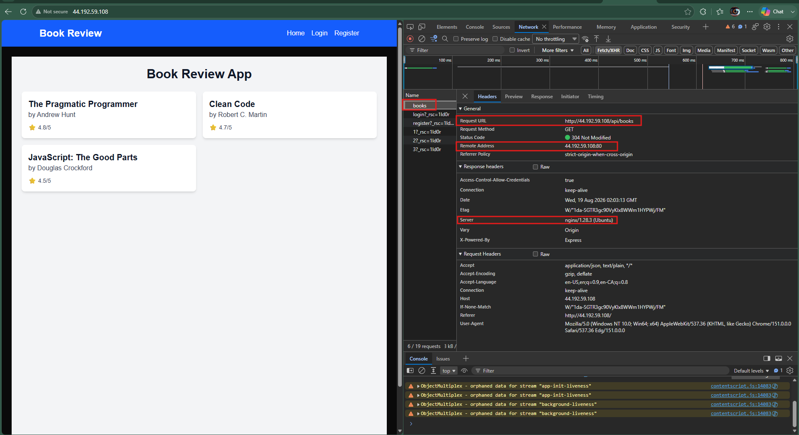
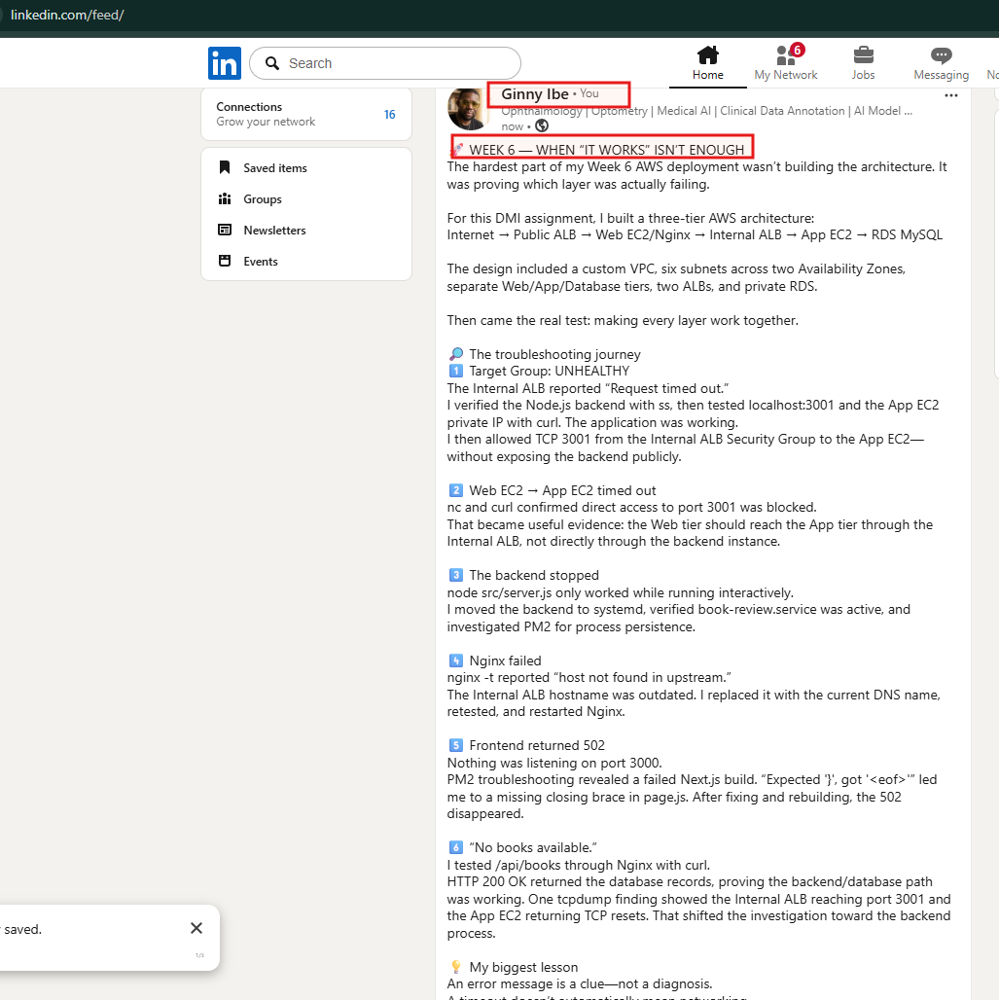

# Assignment 6 — Capstone Assignment — Deploy Book Review App (Three-Tier Architecture) on AWS

Part of the DevOps Micro Internship (DMI) Cohort 3 with Agentic AI

---

## Purpose

This is the most important assignment of the course. You will deploy the Book Review App in a fully production-style three-tier architecture on AWS: a Next.js Web Tier behind Nginx and a public ALB, a private Node.js/Express App Tier behind an internal ALB, and a private Multi-AZ MySQL RDS database with a read replica. You are expected to design, deploy, isolate, debug, and document the result independently.

---

# Task 1 — Architecture Diagram

## Goal

Create an architecture diagram showing the custom VPC (10.0.0.0/16), the six subnets across two Availability Zones (two public Web Tier, two private App Tier, two private Database Tier), the public ALB, Web Tier EC2/Nginx, internal ALB, private App Tier EC2, private Multi-AZ RDS with its read replica, and the permitted traffic flow.

### Evidence

#### Diagram image or link

---

# Task 2 — AWS Region & Services Used

## Goal

Record the AWS Region used and list every AWS service used across networking, compute, load balancing, security, and the database.

### Notes

**Region:**

**US East (N. Virginia) — us-east-1**

---

**Services:**
Networking
- Amazon VPC — Custom VPC (`10.0.0.0/16`)
- Public Subnets — Web Tier across two Availability Zones
- Private Subnets — App Tier and Database Tier across two Availability Zones
- Internet Gateway — Provides internet connectivity for public resources
- Route Tables — Control routing between subnets and the internet
- NAT Gateway — Provides outbound internet access for resources in private subnets, if configured

Compute
- Amazon EC2 — Hosts the Web Tier and App Tier
- EC2 Launch Templates — Defines the configuration used to launch EC2 instances
- EC2 Auto Scaling — Maintains application availability and replaces unhealthy instances

Load Balancing
- Application Load Balancer (ALB) — Internet-facing load balancer for the Web Tier
- Internal Application Load Balancer — Distributes traffic to the private App Tier
- Target Groups — Register EC2 instances and perform health checks

Security
- Security Groups — Control permitted traffic between the ALB, Web Tier, App Tier, and Database Tier
- EC2 Key Pair — Provides secure SSH authentication to EC2 instances

Database
- Amazon RDS for MySQL — Managed relational database
- RDS Multi-AZ Deployment — Provides database high availability and automatic failover
- RDS Read Replica — Provides an additional read-only database copy for read scaling/reporting
- DB Subnet Group — Places RDS resources across private database subnets in multiple Availability Zones

Architecture Summary

The environment runs in **AWS Region `us-east-1`** and uses a custom VPC spanning two Availability Zones. The architecture separates the application into public Web, private App, and private Database tiers.

Traffic follows this path:
`Internet → Public ALB → Web Tier EC2/Nginx → Internal ALB → App Tier EC2 → RDS MySQL`

Security groups restrict communication between tiers, while load balancing, Auto Scaling, Multi-AZ RDS, and the read replica provide availability, resilience, and scalability.

---

# Task 3 — Public Entry Point

## Goal

Confirm the Book Review App loads through the public ALB DNS name.

### Evidence

#### Public ALB DNS

Paste your public ALB DNS name here:

**http://book-review-web-alb-566268157.us-east-1.elb.amazonaws.com/**

---

# Task 4 — Evidence Screenshots

## Goal

Capture visual proof of every tier and load balancer.

### Evidence

#### Web EC2

---

#### App EC2

---

#### Public ALB

---

#### Internal ALB

---

#### RDS + Replica

---

#### App UI proof

**Additional evidence: browser network trace confirming tier isolation**

---

# Task 5 — Summary

## Goal

Summarize what worked in the final deployment, the issues encountered and how each was fixed, and the tools or sources used to research and debug.

### Notes

**What worked:**

The final deployment successfully implemented a three-tier Book Review application on AWS, with clear separation between the public web tier, private application tier, and database tier. The frontend ran as a Next.js application behind Nginx and a public Application Load Balancer, while API requests were routed through Nginx to an internal Application Load Balancer and then to the Node.js/Express backend on port 3001. The backend connected successfully to the MySQL database over SSL and returned the expected book records.

The biggest challenges were not with the application code itself, but with getting communication between the tiers working correctly. Troubleshooting included unhealthy ALB targets, security-group restrictions, backend process availability, an incorrect internal ALB DNS name, Next.js build errors, and Nginx 502 responses. I worked through these issues layer by layer—application, process, port, security group, load balancer, and proxy—rather than changing multiple components at once.

What worked:

The final application successfully loaded the Book Review frontend and retrieved real data from the backend database. The backend /api/books endpoint returned the expected records for The Pragmatic Programmer, Clean Code, and JavaScript: The Good Parts.

The architecture also achieved the intended tier separation:

Internet/User → Public Web ALB → Web EC2/Nginx → Internal App ALB → App EC2:3001 → MySQL database

The application target group eventually changed from Unhealthy to Healthy, confirming that the internal ALB could successfully reach the backend. Nginx successfully proxied /api/ requests to the internal ALB, while the Next.js frontend was served locally on port 3000. The backend was also configured as a persistent service so it did not depend on an open SSH terminal to remain available.

---

**Issues + fixes:**

- Application target group was unhealthy with Request timed out. I first verified that the Node.js backend was actually listening on port 3001 using ss, then tested both localhost:3001 and the instance's private IP with curl. This confirmed the application itself was working. I then reviewed the App EC2 security group and allowed TCP 3001 from the Internal ALB security group. This preserved tier isolation rather than opening the backend port publicly.
- Direct Web EC2 → App EC2 communication timed out. Testing with nc and curl showed that direct access to 10.0.11.7:3001 was blocked. This ultimately became useful evidence of the architecture: the Web tier should communicate with the App tier through the internal ALB, not directly with the backend instance.
- Backend stopped when the manually started Node process ended. Initially, node src/server.js worked only while the process was running interactively. I moved the backend to a persistent service using systemd, verified that book-review.service was active, and confirmed that the service automatically ran /usr/bin/node .../src/server.js. PM2 was also investigated for process persistence.
- Nginx failed because the internal ALB hostname was incorrect. nginx -t reported host not found in upstream. I replaced the outdated internal ALB DNS name with the current internal-Book-Review-App-ALB-2005598945... hostname, then retested and restarted Nginx.
- Frontend returned 502 Bad Gateway. Nginx itself was running, but curl localhost:3000 showed that nothing was listening on port 3000. PM2 troubleshooting revealed that the Next.js production build had failed.
- Next.js build failed with Expected '}', got '<eof>'. The frontend page.js was missing the closing brace for the Home() function. I corrected the JSX/JavaScript structure, removed the old .next build directory, rebuilt the application, and restarted the frontend through PM2. Once port 3000 was listening again, the Nginx 502 disappeared.
- Frontend initially displayed “No books available.” I tested /api/books directly through Nginx with curl http://localhost/api/books. The request returned HTTP/1.1 200 OK and the database records, proving that the backend/database path worked. After correcting the frontend configuration/build, the books appeared correctly in the UI.
- Public ALB DNS troubleshooting exposed an outdated hostname. One DNS name returned Could not resolve host, showing that it was no longer valid. The current ALB DNS resolved successfully with getent hosts. Further connection testing helped distinguish DNS resolution problems from network/listener/security-group problems.

---

**Tools/sources used:**

I relied mainly on AWS Console, Linux networking tools, application logs, and direct HTTP testing rather than guessing where the failure was occurring. AWS Console was used to inspect ALBs, listeners, target groups, health checks, VPC/subnet mappings, Network ACLs, EC2 instances, and security groups. On Ubuntu, I used curl for end-to-end HTTP/API testing, ss to verify listening ports, nc for TCP connectivity testing, tcpdump to observe ALB health-check traffic, systemctl/journalctl for service management, PM2 for Node.js process management, and Nginx's nginx -t and logs for reverse-proxy troubleshooting.

One of the most useful debugging moments came from tcpdump. It showed SYN packets from the internal ALB reaching the App EC2 on port 3001 and the instance returning TCP resets. That moved the investigation away from assumptions about AWS networking and toward the availability of the backend process itself.

I also used Microsoft Edge DevTools → Network → Fetch/XHR to inspect the /api/books request from the browser. This provided application-level evidence that the browser was requesting the API through the intended public endpoint. The troubleshooting process followed a practical DevOps approach: verify the application → verify the process → verify the port → verify network access → verify load-balancer health → verify the proxy → test the complete request path.

---

# LinkedIn Post (Required)

## Goal

Publish a LinkedIn post sharing the capstone deployment, including the public ALB DNS (or a redacted screenshot), three to five lines on what you built and why it is production-style, and one proof screenshot.

## Evidence

#### LinkedIn Post URL

Paste your LinkedIn post URL here:

**https://www.linkedin.com/posts/dr-ginny-ibe_dmibypravinmishra-devops-agenticai-ugcPost-7495686784727752704-vL8J/?utm_source=share&utm_medium=member_desktop&rcm=ACoAAGTqulMBvpSBQMnxbzFBrJkA0C9nlWM_uqM**

---

#### Screenshot of LinkedIn post

---

# Submission Instructions

- Add all required screenshots and links in your submission
- Do not expose passwords, RDS credentials, connection strings, private keys, or account IDs

---

# Completion Checklist

- [x] Task 1: Architecture diagram completed
- [x] Task 2: AWS Region and services documented
- [x] Task 3: Public ALB DNS confirmed working
- [x] Task 4: All six evidence screenshots captured (Web Tier, App Tier, both ALBs, RDS + replica, app UI)
- [x] Task 5: Deployment summary completed (what worked, issues/fixes, tools/sources)
- [x] LinkedIn post published and URL submitted
- [x] App Tier and Database Tier confirmed not publicly accessible
- [x] No sensitive data exposed

---

## 📌 About DMI & CloudAdvisory

DevOps Micro Internship (DMI) is a project-based DevOps program run by Pravin Mishra (The CloudAdvisory) focused on real-world execution, systems thinking, and career readiness.

It helps learners build strong DevOps foundations with hands-on experience.

---

## 📌 Resources

- 🌐 DMI Official Website: https://dmi.pravinmishra.com?utm_source=github&utm_medium=readme  
- 🎓 University: https://university.pravinmishra.com?utm_source=github&utm_medium=readme  
- 💬 Discord Community: https://discord.pravinmishra.com?utm_source=github&utm_medium=readme  
- 📝 Blog: https://dmi.pravinmishra.com/blog?utm_source=github&utm_medium=readme  
- ▶️ YouTube Playlist: https://www.youtube.com/playlist?list=PLFeSNDtI4Cho  
- 🔗 Pravin Mishra (LinkedIn): https://www.linkedin.com/in/pravin-mishra-aws-trainer/  
- 🏢 CloudAdvisory (LinkedIn): https://www.linkedin.com/company/thecloudadvisory/

---

*This submission is part of DevOps Micro Internship (DMI) Cohort 3 — Agentic AI Track.*