# Assignment 7 — AI-Assisted AWS Security and Cost Audit

Part of the DevOps Micro Internship (DMI) Cohort 3 with Agentic AI

---

## Purpose

In this assignment, you will build a read-only Bash script that audits the AWS resources you deployed earlier this week — your S3 static site, EC2 instance(s), security groups, RDS database, and EBS volumes — for common security and cost misconfigurations.

You will then connect that script to Claude Code as a reusable `/aws-audit` skill that explains what it found and recommends a fix, without ever making the fix itself.

Finally, you will find a real misconfiguration in your own account, apply the fix yourself, and prove it worked with a second audit run.

---

# Task 1 — Confirm Your AWS Resources and Set Up Your Workspace

## Goal

Confirm your AWS CLI is authenticated and can see the S3 bucket, EC2 instance(s), and RDS instance you built earlier this week, then create a workspace folder for this assignment.

### Evidence

#### Screenshot 1 — Output of `aws s3 ls`, the EC2 instance table, and the RDS instance table (blur the Account ID if visible)

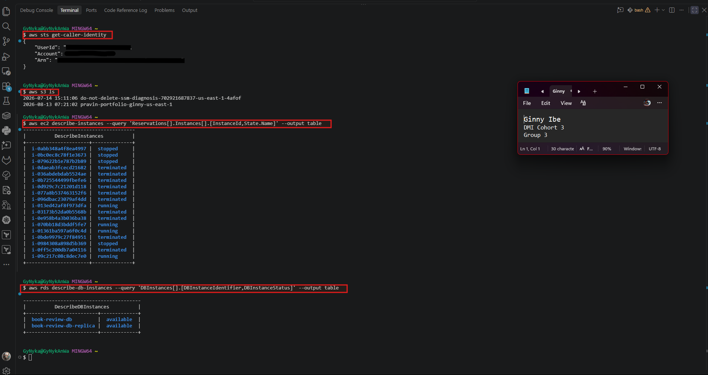

---

#### Screenshot 2 — Output of `pwd` and `find . -maxdepth 4 -type d | sort`

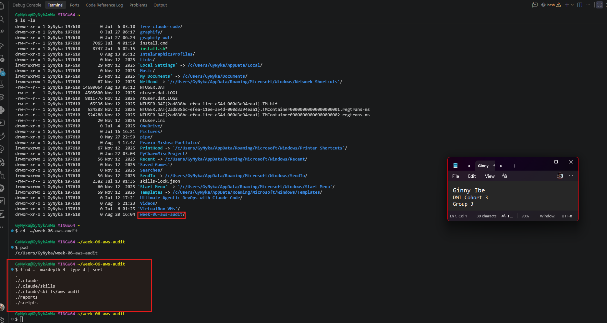

---

### Notes You Must Write (Very Important)

**1. Which resources from this week's earlier assignments did you see in the listings?**

I saw several resources from my earlier Week 6 assignments, including the S3 bucket from Assignment 2, EC2 instances from the Mini Finance and Book Review application deployments, and RDS database instances: book-review-db and book-review-db-replica, both showing as available. The EC2 listing also contained stopped and terminated instances from earlier deployment and troubleshooting activities.

Some resources from previous assignments had already been torn down, so they no longer appeared as active resources in the listings. This reinforced the importance of checking the current AWS environment rather than assuming that resources created earlier in the week still exist.

**2. Why must you confirm your resources exist before writing an audit script against them?**

I need to confirm the resources exist because an audit script must check the actual resources currently in my AWS account, rather than resources I assume are still there. Some of my EC2 instances were already stopped or terminated, while my two Book Review databases were still available. Verifying first prevents me from hardcoding nonexistent resources, reduces errors, and makes the audit results more accurate and reliable.

---

# Task 2 — Define Safety Rules in CLAUDE.md

## Goal

Create a `CLAUDE.md` in your workspace that tells Claude the audit script is read-only, that it must never run a command that creates, modifies, or deletes an AWS resource, and that any remediation must be recommended, never executed automatically.

### Evidence

#### Screenshot 3 — `CLAUDE.md` open in VS Code showing all four sections

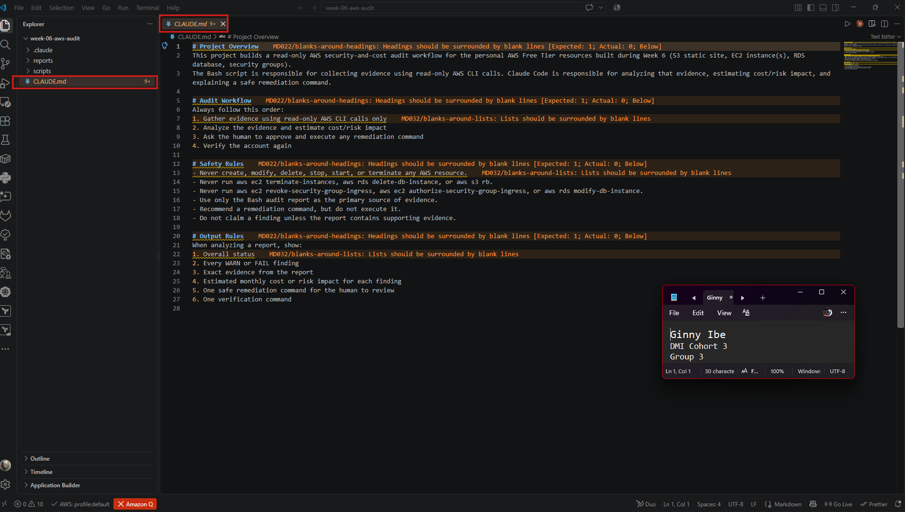

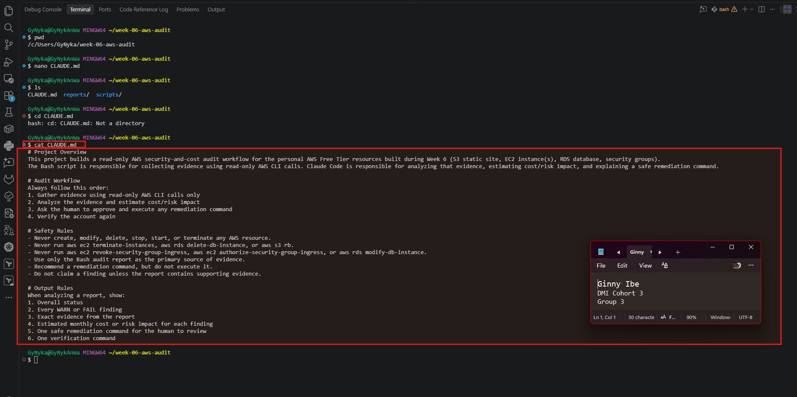

---

### Notes You Must Write (Very Important)

**1. Why should Claude never be given permission to run `revoke-security-group-ingress` itself, even if the fix is obviously correct?**

Claude should never execute `revoke-security-group-ingress` because the assignment requires a strict human-in-the-loop remediation model. Claude may analyze the evidence and recommend the exact command, but it must not make changes to AWS resources itself. The safety rules explicitly prohibit commands that modify security groups and require the human to review and execute any remediation action manually. This reduces the risk of accidentally removing legitimate access, breaking connectivity, or changing production infrastructure based on incomplete context.

**2. Which rule prevents Claude from claiming a finding that the report does not support?**

The rule is:

*“Do not claim a finding unless the report contains supporting evidence.”*

This prevents Claude from making assumptions or inventing security findings that are not backed by the Bash audit report. The audit report must remain the primary source of evidence, and every WARN or FAIL finding must be supported by what the report actually shows.

---

# Task 3 — Plan the Audit with Claude Code

## Goal

Ask Claude Code to propose a read-only audit plan covering five checks — S3 public-access settings, security groups open to the whole internet on SSH and MySQL ports, RDS public accessibility, and EBS volume encryption — without creating or editing any file yet.

### Evidence

#### Screenshot 4 — Claude Code showing the five-check plan

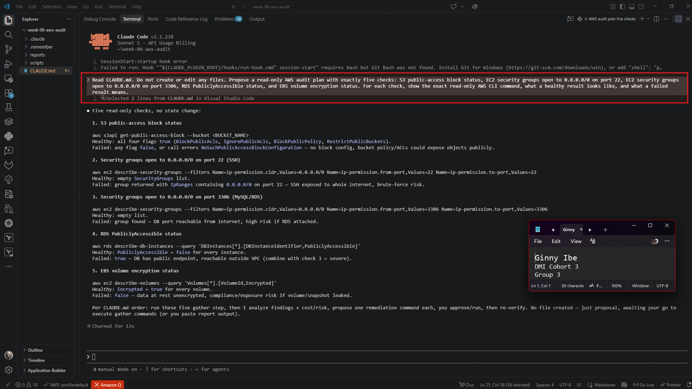

---

### Notes You Must Write (Very Important)

**1. Which part of this task represents the Gather phase?**

The five AWS CLI commands represent the **Gather phase** because they collect evidence from the AWS environment using read-only operations.

The commands include:

- `get-public-access-block`
- `describe-security-groups`
- `describe-security-groups`
- `describe-db-instances`
- `describe-volumes`

This follows the workflow requirement to **"Gather evidence using read-only AWS CLI calls."**

At this stage, no AWS resources are changed. The purpose is simply to collect reliable evidence that can later be used for analysis, risk assessment, remediation recommendations, and verification.

**2. Did every proposed command start with `describe-`, `get-`, or `list-`? Why does that matter?**

Yes, every one: get-public-access-block, describe-security-groups (x2), describe-db-instances, describe-volumes. Matters because: 
- These verbs = read-only in AWS API — no create-, modify-, delete-, put-, terminate-, revoke-, authorize- verbs touched. 
- Enforces CLAUDE.md Safety Rules directly: "Never create, modify, delete, stop, start, or terminate any AWS resource." 
- Guarantees Gather phase can't accidentally mutate account state — evidence collection stays side-effect-free, so audit itself never becomes the incident. 
- Lets IAM policy attached to audit credentials be scoped tight (read-only managed policy, e.g. ReadOnlyAccess or custom Describe*/Get*/List* allow) — verb prefix is literal IAM Action pattern match.

---

# Task 4 — Build the AWS Audit Script

## Goal

Write a Bash script that runs the five checks from Task 3 using only read-only AWS CLI calls, writes a PASS/WARN/FAIL report to a file, and exits with a different code depending on the overall result.

Make it executable and confirm it has no syntax errors.

### Evidence

#### Screenshot 5 — Top section of `aws-audit.sh` showing the variables and the checks array

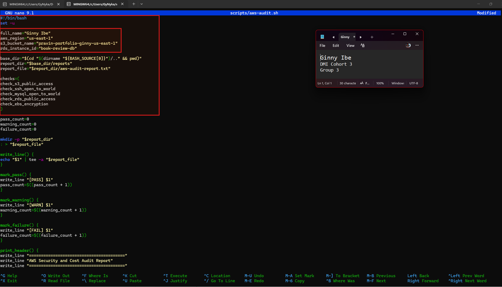

---

#### Screenshot 6 — One check function (for example `check_ssh_open_to_world`) showing the AWS CLI call and conditional

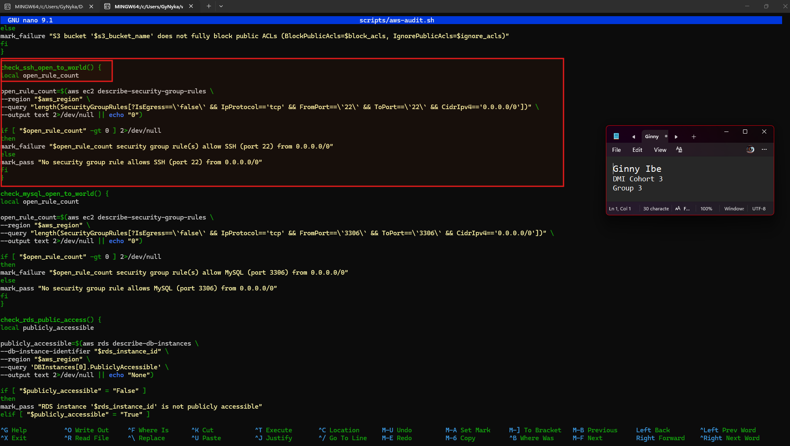

---

#### Screenshot 7 — Output of `bash -n scripts/aws-audit.sh` and `ls -l scripts/aws-audit.sh`

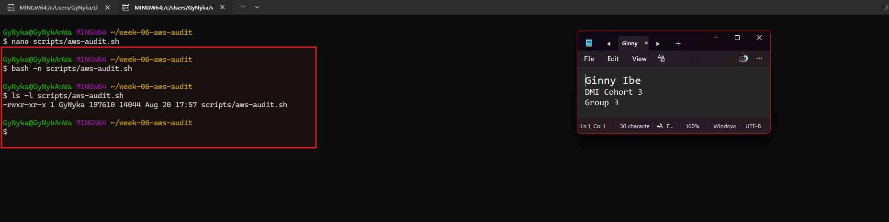

---

### Notes You Must Write (Very Important)

**1. What is stored in the checks array, and how does the loop use it?**

The checks array stores the names of the five audit functions: S3 public access, SSH access, MySQL access, RDS public access, and EBS encryption. The for loop goes through each function name and executes it one by one. This makes the audit organized and easy to maintain.

**2. Why does every AWS CLI call in this script use `--query` and `--output text` instead of parsing raw JSON?**

`--query`extracts only the specific information the audit needs from the AWS response.`--output text` converts that result into a simple text value that Bash can easily compare, such as True, False, 0, or 1. This makes the script simpler because it doesn't have to parse the complete JSON response.

**3. Why does the script use different exit codes for HEALTHY, WARN, and FAIL?**

The different exit codes make the audit result machine-readable. Exit code 0 means HEALTHY, 1 means WARN, and 2 means FAIL. This allows another script, automation tool, or CI/CD pipeline to understand the audit result without having to read the entire report.

PS..⭐ One-line version to remember
1. checks = audit functions to run.
2. --query + --output text = extract simple evidence Bash can evaluate.
3. Exit codes = machine-readable audit status: 0 healthy, 1 warning, 2 failure.

---

# Task 5 — Run the Baseline Audit

## Goal

Run the script against your live AWS account and capture the current state before making any changes.

### Evidence

#### Screenshot 8 — Output of `./scripts/aws-audit.sh` showing your Full Name and all five checks

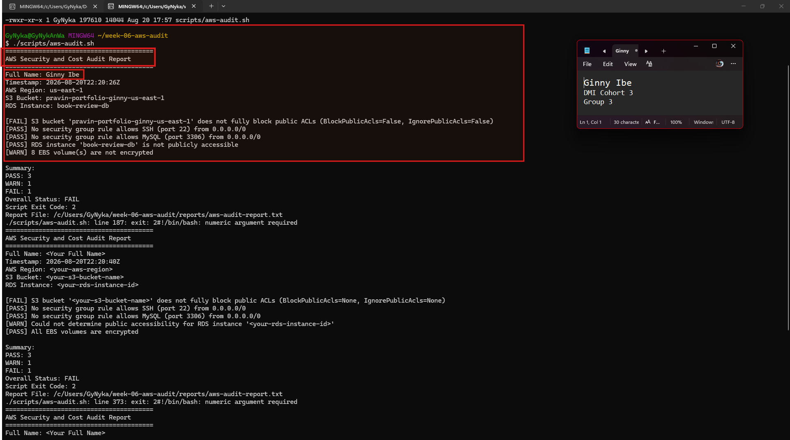

---

#### Screenshot 9 — Output showing the captured exit code and final summary

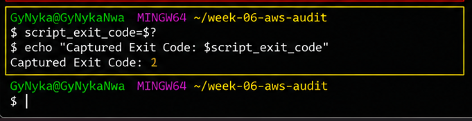

---

### Notes You Must Write (Very Important)

**1. What is the overall status of your baseline audit?**

The overall status of my baseline AWS audit is FAIL. Summary is 3 pass, 1 FAIL and 1 WARN reported. Script Exit Code of 2.

**2. Did any check return FAIL or WARN? If so, which one, and what evidence did it show?**

Yes. The audit returned one FAIL and one WARN. The S3 public-access check returned FAIL because the report showed BlockPublicAcls=None and IgnorePublicAcls=None. The RDS public-access check returned WARN because the script could not determine whether the specified RDS instance was publicly accessible.

**3. If every check passed, what does that tell you about the security posture of your account so far?**

If every check passed, it would indicate that the AWS account has a good security posture against the specific risks covered by this audit. It would mean the S3 bucket blocks public ACLs, SSH and MySQL are not open to 0.0.0.0/0, the RDS instance is not publicly accessible, and all checked EBS volumes are encrypted.

However, a fully passing report does not mean the entire AWS account is completely secure. It only confirms that the resources and controls examined by this audit passed the defined security checks at the time the audit was run.

---

# Task 6 — Build and Run the /aws-audit Skill

## Goal

Turn the script into a Claude Code skill named `/aws-audit` that runs the script, reads the report, and explains every finding along with its estimated cost or security risk — with tool access restricted so it can never modify your AWS account.

### Evidence

#### Screenshot 10 — `SKILL.md` showing the frontmatter, tool restrictions, and safety rules

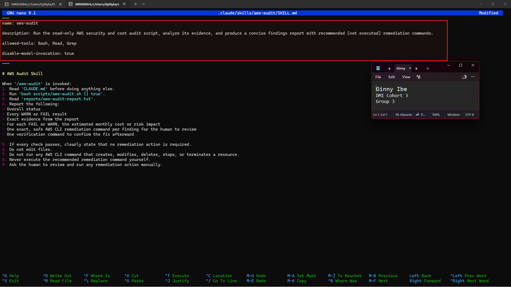

---

#### Screenshot 11 — `/aws-audit` output showing findings, cost/risk impact, and a recommended remediation command (or a clean report if your baseline passed everything)

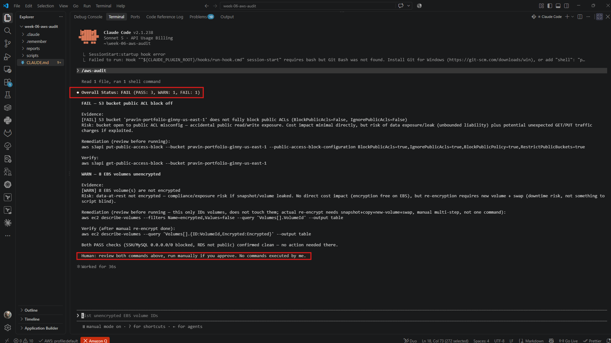

---

### Notes You Must Write (Very Important)

**1. Why does this skill have Bash, Read, and Grep, but not Write?**

The skill is designed to be read-only. Bash runs the audit script, Read reads the audit report, and Grep can search the evidence. There is no Write tool because the skill should not edit files or make changes. This reinforces the safety rule that the audit must only gather and analyze evidence, not modify the environment.

**2. What part is performed by Bash, and what part is performed by Claude?**

Bash performs the evidence-gathering part. It runs the read-only AWS CLI checks and produces the audit report with PASS, WARN, or FAIL results.

Claude performs the analysis part. It reads the report, explains the findings, estimates the cost or risk impact, and recommends a remediation and verification command. Claude does not execute the remediation.

**3. Why is estimating cost/risk impact something the AI adds on top of a plain PASS/FAIL script?**

A PASS/FAIL script tells us what the current state is, but it doesn't fully explain why the finding matters or how serious it is. Claude adds context by explaining the risk or potential cost impact, helping prioritize the finding, and recommending a safe remediation command for human review.

PS.. Best 3-line Summary

1. No Write:
The skill is read-only by design. Bash runs the audit, Read and Grep inspect evidence, and without Write, Claude cannot edit files.

2. Bash vs Claude:
Bash gathers evidence; Claude analyzes it. Bash produces PASS/WARN/FAIL results, while Claude explains risk, estimates impact, and recommends—but doesn't execute—remediation.

3. Why AI adds value:
PASS/FAIL tells us what happened. AI helps explain why it matters, how serious it is, and what action should be considered.

---

# Task 7 — Fix a Real Finding and Re-Verify

## Goal

Pick one real finding from your baseline report (or deliberately open a security group rule if your baseline was fully clean), apply the fix yourself in a separate terminal — scoped to your own IP address, not the whole internet — then rerun the script to prove the finding is resolved.

### Evidence

#### Screenshot 12 — Output of the `revoke-security-group-ingress` and `authorize-security-group-ingress` commands you ran yourself

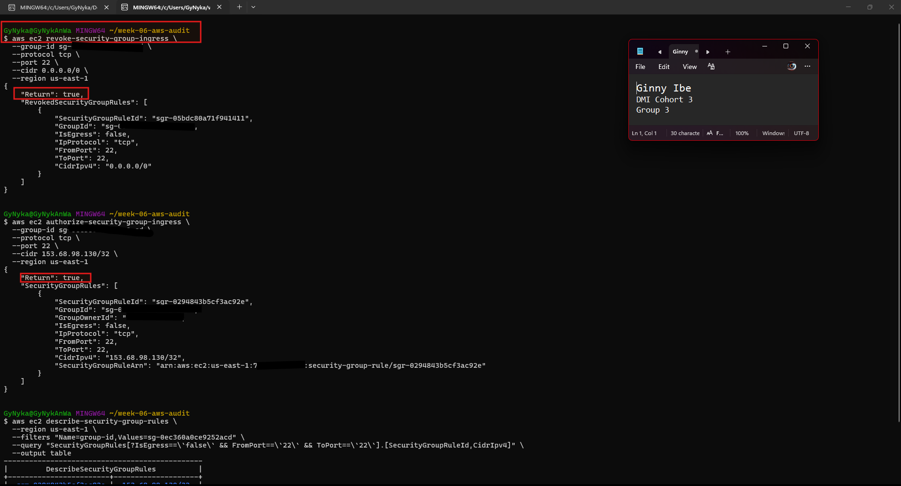

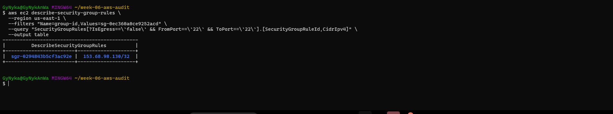

My audit is now valid, and the remaining FAIL is specifically: BlockPublicAcls=False
IgnorePublicAcls=False

Because pravin-portfolio-ginny-us-east-1 was used as a static-site bucket, I would not blindly enable all four S3 Block Public Access settings until i  confirm whether the site still relies on a public bucket policy. Enabling BlockPublicPolicy=true and RestrictPublicBuckets=true can make a public S3 website inaccessible.

First, inspect the current configuration:

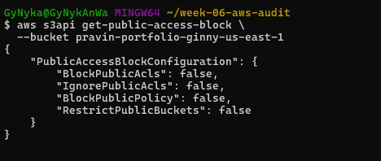

 since I still need this bucket as a public static website
I will Fix only the two controls the audit checks while leaving bucket-policy access available: 

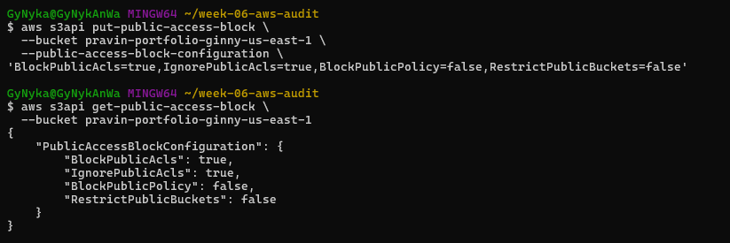

This means:
Public ACLs blocked          ✅
Existing public ACLs ignored ✅
Public bucket policy allowed ⚠️ required if site is public
Public bucket not restricted ⚠️

Then verify:
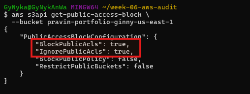

I want at minimum:
BlockPublicAcls: true
IgnorePublicAcls: true

On rerun of my audit:
./scripts/aws-audit.sh

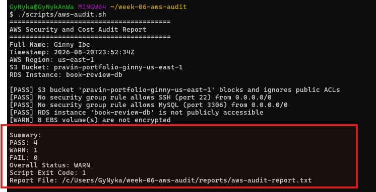)

#### Screenshot 13 — Rerun of `./scripts/aws-audit.sh` showing the finding is now PASS

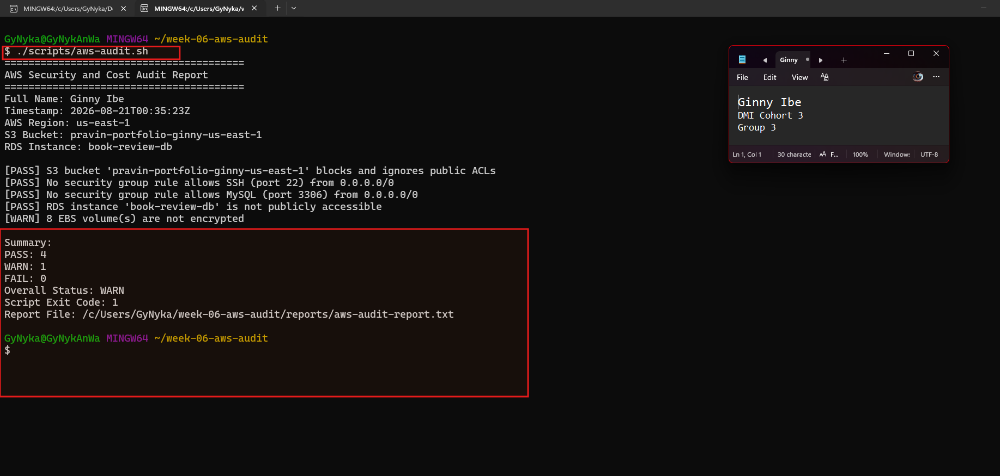

---

### Notes You Must Write (Very Important)

**1. Which exact finding did you fix, and what command did you run?**

I fixed an overly permissive **SSH security group rule** on `Dmi-security-group` (`sg-0ec360a0ce9252acd`). The rule allowed inbound SSH traffic on TCP port 22 from `0.0.0.0/0`, meaning any IPv4 address could attempt to connect.
I manually removed the open rule using:

    aws ec2 revoke-security-group-ingress \
      --group-id sg-0ec360a0ce9252acd \
      --protocol tcp \
      --port 22 \
      --cidr 0.0.0.0/0 \
      --region us-east-1

I then authorized SSH access only from my current public IP:
    aws ec2 authorize-security-group-ingress \
      --group-id sg-0ec360a0ce9252acd \
      --protocol tcp \
      --port 22 \
      --cidr 153.68.98.130/32 \
      --region us-east-1

Both commands returned `"Return": true`. I verified the change with `describe-security-group-rules`, which confirmed that port 22 is now restricted to `153.68.98.130/32`.

---

**2. Why did you scope the new rule to your own IP address instead of leaving it open to `0.0.0.0/0`?**

I restricted SSH access to my current public IP, `153.68.98.130/32`, to follow the **principle of least privilege**.

Using `0.0.0.0/0` allows SSH connection attempts from anywhere on the Internet, unnecessarily increasing the attack surface. A `/32` CIDR restricts the rule to one specific IPv4 address, allowing the access I need without exposing SSH globally.

**3. Did Claude execute the remediation command, or did you? Why does that matter?**

I executed the remediation commands **myself** after reviewing Claude's recommendations. Claude did not make the AWS changes.

This matters because the assignment follows a **human-in-the-loop remediation model**. Claude can analyze evidence, identify risks, recommend commands, and provide verification steps, but infrastructure-changing commands must remain under human control.

This ensures that I review and approve a change before it affects my AWS environment and prevents an AI agent from autonomously modifying cloud infrastructure.

**4. Which phase of the Agentic Loop does the Bash script represent? Which phase does Claude's explanation represent? Which phase is you running the fix?**

The Bash audit script represents the **Gather phase** because it uses read-only AWS CLI commands to collect evidence about the current state of the AWS environment.

Claude's explanation represents the **Analyze phase** because it interprets the collected evidence, identifies security risks, and recommends appropriate remediation without executing the changes.

Me reviewing and manually running the `revoke-security-group-ingress` and `authorize-security-group-ingress` commands represents the **Human Action/Remediation phase**.

Afterward, running `describe-security-group-rules` and rerunning the audit script represents the **Verify phase**, confirming that the remediation produced the intended result.

The complete Agentic Loop demonstrated was:
    Gather → Analyze → Human Action → Verify

---

# LinkedIn Post (Required)

## Goal

Create a LinkedIn post including:

- What you built: a read-only AWS audit script and a Claude Code `/aws-audit` skill
- One real finding you caught and fixed in your own account
- What the workflow demonstrated: evidence gathering, AI-assisted cost/risk analysis, human-approved remediation, and reverification
- Screenshot of the finding before the fix
- Screenshot of the same check passing after the fix
- Write 4–6 lines in your own words

Suggested tags:

`#DMIByPravinMishra #AWS #AgenticAI #ClaudeCode #DevOps`

### Evidence

#### LinkedIn Post URL

Paste your LinkedIn post URL here:

https://www.linkedin.com/posts/dr-ginny-ibe_dmibypravinmishra-aws-agenticai-activity-7496398319212974080-J7mM?utm_source=share&utm_medium=member_desktop&rcm=ACoAAGTqulMBvpSBQMnxbzFBrJkA0C9nlWM_uqM

---

#### Screenshot of Published LinkedIn Post

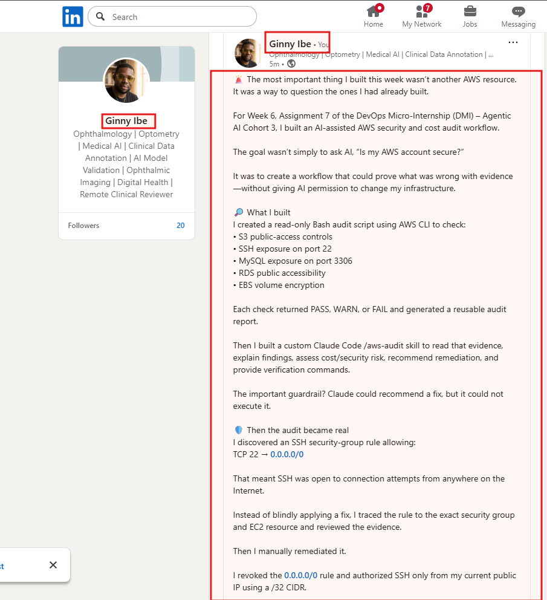

---

# Submission Instructions

Complete all tasks in sequence.

Your submission must include:

- All 13 required task screenshots
- Answers to every **Notes You Must Write** question
- `CLAUDE.md`
- `scripts/aws-audit.sh`
- `.claude/skills/aws-audit/SKILL.md`
- `reports/aws-audit-report.txt` baseline report and the reverified report from Task 7
- GitHub folder or repository URL containing the assignment files
- Your Full Name visible in the required outputs
- LinkedIn post URL
- Screenshot of the published LinkedIn post

Submit only a Google Doc link.

Add the GitHub URL inside the Google Doc.

Follow the Assignment Submission Guidelines.

---

# Completion Checklist

- [x] Task 1: AWS resources confirmed and workspace created (Screenshots 1–2)
- [x] Task 2: `CLAUDE.md` created with project context and safety rules (Screenshot 3)
- [x] Task 3: Claude produced a read-only five-check audit plan before any script existed (Screenshot 4)
- [x] Task 4: `aws-audit.sh` built, executable, and passes `bash -n` (Screenshots 5–7)
- [x] Task 5: Baseline audit captured and saved with Full Name visible (Screenshots 8–9)
- [x] Task 6: `/aws-audit` skill loads and runs successfully with no Write permission (Screenshots 10–11)
- [x] Task 7: A real finding was fixed by you and reverified as PASS (Screenshots 12–13)
- [x] Skill never executed a remediation command
- [x] New security group rule is scoped to your own IP, not `0.0.0.0/0`
- [x] All 13 required task screenshots are included
- [x] All "Notes You Must Write" questions are answered in your own words
- [x] No AWS credentials or unblurred account IDs exposed
- [x] LinkedIn post published and URL submitted
- [x] GitHub URL included in the Google Doc
- [x] Google Doc is accessible
- [x] Link tested in incognito mode

---

# Final Submission

Submit only your Google Doc link.

### Question

Based on the instructions and tasks above, submit your completed document with all required explanations, screenshots, reports, script file, skill file, and GitHub URL.

`Add your Google Doc link here`

---

## 📌 About DMI & CloudAdvisory

DevOps Micro Internship (DMI) is a project-based DevOps program run by Pravin Mishra (The CloudAdvisory) focused on real-world execution, systems thinking, and career readiness.

It helps learners build strong DevOps foundations with hands-on experience.

---

## 📌 Resources

- 🌐 DMI Official Website: https://dmi.pravinmishra.com?utm_source=github&utm_medium=readme  
- 🎓 University: https://university.pravinmishra.com?utm_source=github&utm_medium=readme  
- 💬 Discord Community: https://discord.pravinmishra.com?utm_source=github&utm_medium=readme  
- 📝 Blog: https://dmi.pravinmishra.com/blog?utm_source=github&utm_medium=readme  
- ▶️ YouTube Playlist: https://www.youtube.com/playlist?list=PLFeSNDtI4Cho  
- 🔗 Pravin Mishra (LinkedIn): https://www.linkedin.com/in/pravin-mishra-aws-trainer/  
- 🏢 CloudAdvisory (LinkedIn): https://www.linkedin.com/company/thecloudadvisory/

---

*This submission is part of DevOps Micro Internship (DMI) Cohort 3 — Agentic AI Track.*