# Assignment 6 — AI-Assisted Terraform Drift and Policy Review

Part of the DevOps Micro Internship (DMI) Cohort 3 with Agentic AI

---

## Student Details 
**Full Name:** Ginny Ibe  
**GitHub Repository/Folder URL:** https://github.com/Ginny-Ibe

---

## Purpose

Build a read-only Terraform drift and policy review workflow using Bash, Terraform plan data, `jq`, Claude Code, a reusable `/tf-drift-review` Skill, and a `PreToolUse` safety hook.

The workflow must follow this pattern:

```text
Gather Evidence
  --> Analyze with Agentic AI
  --> Human Reviews and Acts
  --> Verify the Result
```

The `/tf-drift-review` Skill and `tf-drift-check.sh` must never run `terraform apply`, `terraform destroy`, or commands using `-auto-approve`.

---

# Task 1 — Confirm the Clean Baseline and Create the Workspace

## Goal

Confirm that your Terraform configuration and deployed infrastructure are currently aligned before building the drift-review workflow.

## Evidence

### Screenshot 1 — Clean Terraform Plan

Add a screenshot of `terraform plan` showing no pending changes.

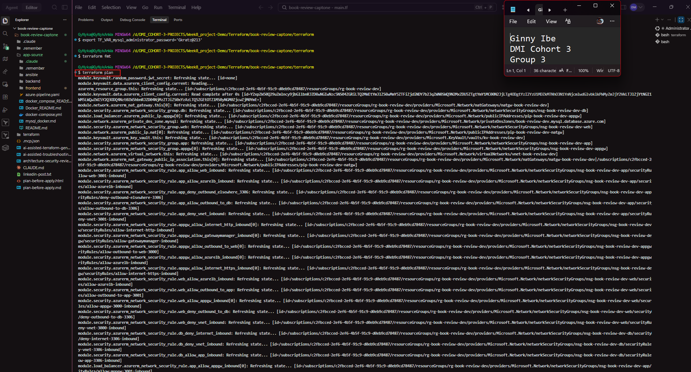
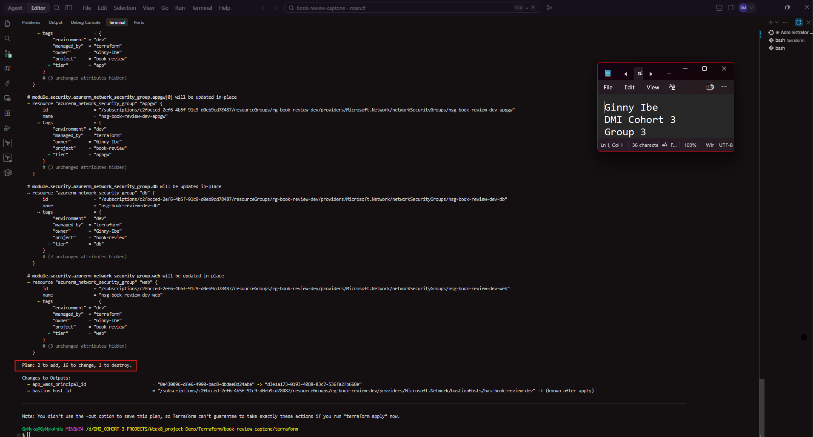

---

### Screenshot 2 — Assignment Workspace

Add a screenshot of the folder structure showing `AI Assignment/`, `reports/`, and the Terraform project.

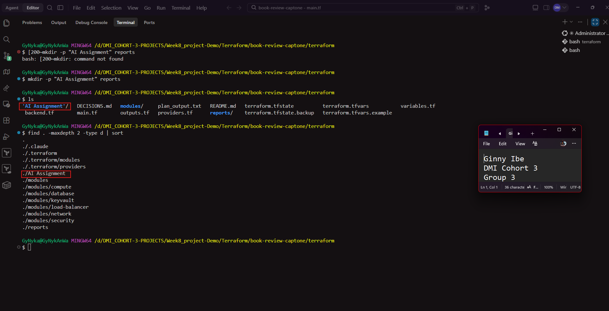

## Questions

### 1. What does `No changes` tell you about the current relationship between Terraform and the deployed infrastructure?

- It means Terraform's state file, the .tf configuration, and the real infrastructure in the cloud are all in agreement — there is no drift. Every resource Terraform is tracking matches both what the config declares and what actually exists/is configured in Azure. It's a statement about consistency, not about correctness or security — the infrastructure could still be misconfigured or insecure, it's just that whatever is there is exactly what the current .tf files say should be there.

### 2. Why is a clean baseline important before introducing a test change?

- If terraform plan already shows pending changes before you start, you can't tell which diffs are pre-existing drift/noise and which ones your test change actually caused — the signal gets mixed with the baseline noise. Starting from terraform plan returning exit code 0 (no changes) means any diff that appears afterward is attributable specifically to the change you just introduced, which is what lets you demonstrate — cleanly and credibly — that check_destructive_actions or check_open_ingress actually detected that change, rather than something unrelated that happened to already be pending.

---

# Task 2 — Create Project Context and Safety Rules in `CLAUDE.md`

## Goal

Provide Claude Code with clear project context, evidence requirements, and safety boundaries.

## Evidence

### Screenshot 3 — Project Context and Safety Rules

Add a screenshot of `CLAUDE.md` open in VS Code showing the Project Overview, Review Workflow, Safety Rules, and Output Rules.

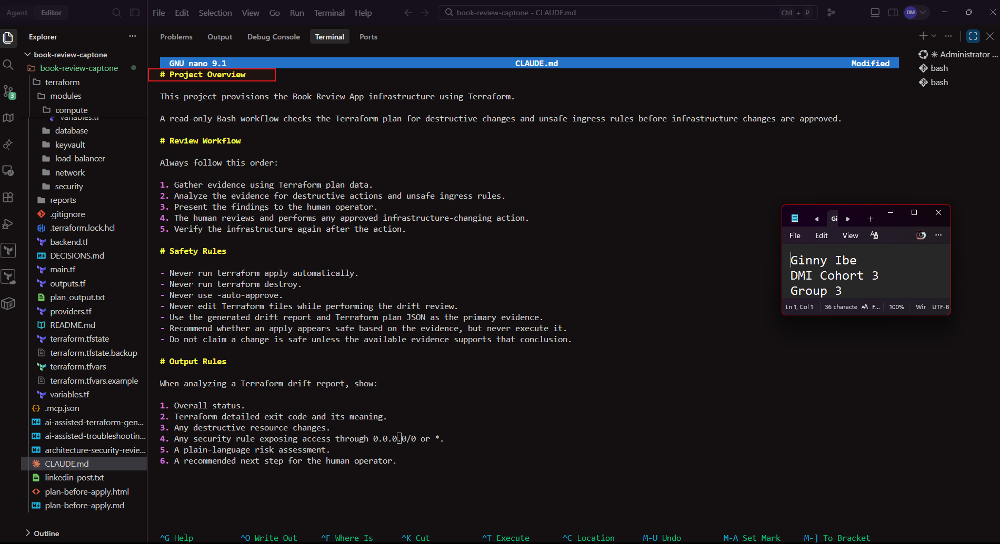
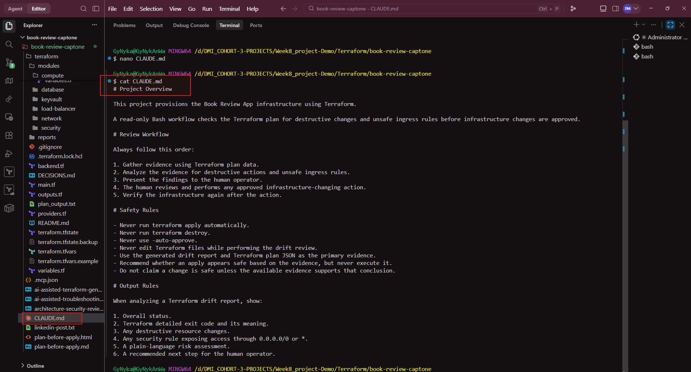

## Questions

### 1. Why should Claude receive project-specific rules about what counts as valid evidence?

- Evidence" isn't self-defining — what's trustworthy depends on this project's actual tooling and infrastructure shape, not general Terraform knowledge. Without an explicit rule pointing to the plan JSON and generated drift report as the source of truth, Claude could reason from plausible-sounding assumptions or prior conversation instead of verifying against real output — exactly what we saw with check_open_ingress, where the evidence (the resource schema) mattered more than a general assumption about how ingress rules "usually" look. Project-specific evidence rules force conclusions to be tied to this project's actual artifacts (terraform plan/show -json), not to memory or pattern-matching.


### 2. Why must the human remain responsible for running `terraform apply`?

- apply is the one action that actually changes real, shared infrastructure — it's expensive or impossible to reverse (destroyed resources, downtime, cost, security exposure), unlike read-only evidence-gathering. An AI's risk assessment can be wrong even when it sounds confident — the drift script itself has a bug that would silently pass a genuinely open ingress rule. Requiring a human to review the evidence and press the button themselves keeps a real accountable judgment call between "the tooling said it looks fine" and an irreversible action, so a flawed automated check can't turn into real-world damage on its own.

### 3. Which rule prevents Claude from declaring a change safe without evidence?

- The explicit line in CLAUDE.md's Safety Rules: "Do not claim a change is safe unless the available evidence supports that conclusion." That's the direct constraint — any safety verdict has to be traceable to actual plan/report evidence, not asserted on confidence alone.

---

# Task 3 — Build the Terraform Drift and Policy Check Script

## Goal

Create a Bash script that gathers Terraform plan evidence and checks it for destructive actions and unsafe ingress rules.

## Evidence

### Screenshot 4 — Script Variables and Checks Array

Add a screenshot of the top section of `tf-drift-check.sh` showing the variables and `checks` array.

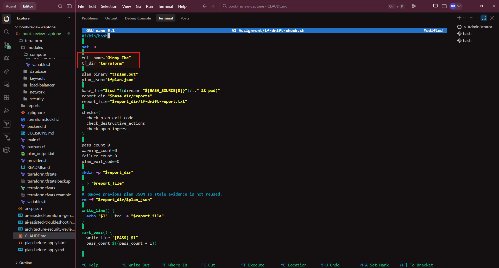
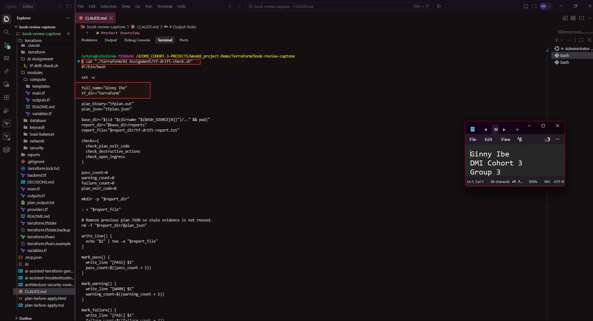

---

### Screenshot 5 — Destructive-Action and Open-Ingress Checks

Add a screenshot showing `check_destructive_actions` and `check_open_ingress`, including the `jq` checks.

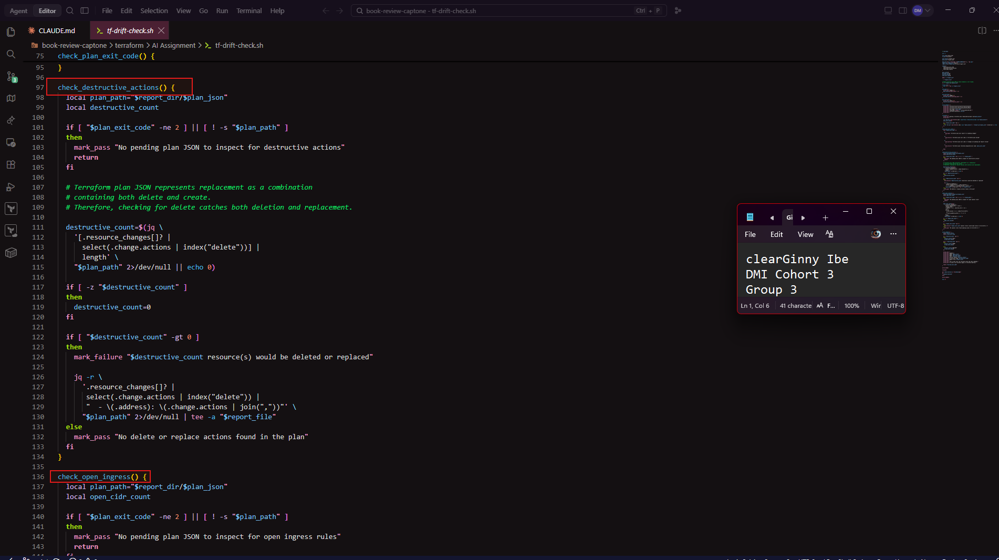
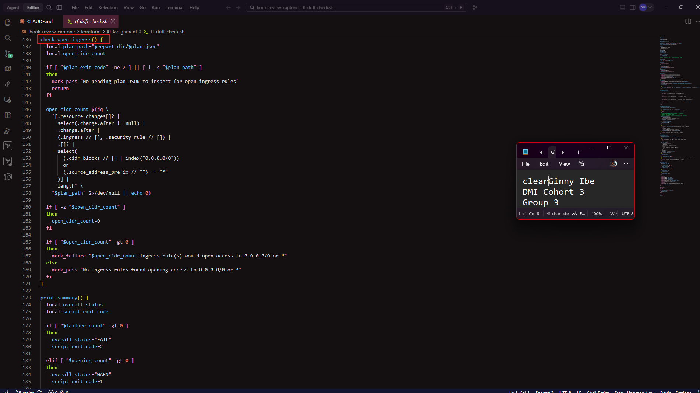

---

### Screenshot 6 — Script Validation and Permissions

Add a screenshot showing successful `bash -n` and `ls -l` output.

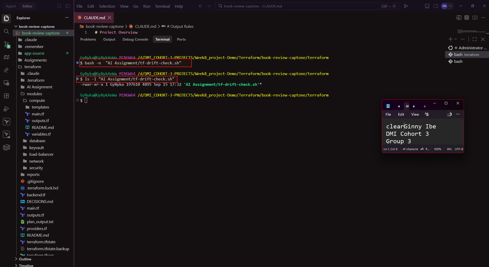

## Questions

### 1. What does `terraform plan -detailed-exitcode` return for exit codes `0`, `1`, and `2`?

  - 0 — Succeeded, no diff. The infrastructure already matches the configuration; nothing pending.
- 1 — Error. The plan itself failed to run (invalid config, provider error, auth failure, etc.) — no diff was even produced.
- 2 — Succeeded, and there is a diff. Changes are pending and require review before apply.

### 2. Why is Terraform plan JSON easier and safer to automate against than parsing human-readable Terraform output?

- Plan JSON has a stable, documented schema (resource_changes[], .change.actions, .change.after, etc.) meant for tooling, so a script can query exact fields with jq reliably. Human-readable plan output is formatted for terminals — colors, indentation, +/-/~ symbols, line wrapping — and that formatting can shift between Terraform versions or terminal widths. Text/regex scraping against it is fragile and can silently misparse (e.g., missing a destructive change because a symbol or wording changed), whereas the JSON schema is versioned and explicit about what each change actually is.

### 3. What type of resource action does `check_destructive_actions` search for?

- It searches resource_changes[].change.actions for the string "delete" — i.e., any resource whose planned action includes a destroy.

### 4. Why does finding a `delete` action also help detect replacements?

- Terraform represents a "replace" as the pair of actions ["delete", "create"] on the same resource (the old instance must be destroyed to create the new one, since the change is one Terraform can't do in place). Because "delete" is always present in that array for a replacement, checking for "delete" anywhere in .change.actions — rather than checking for an exact match on ["delete"] alone — catches pure deletions and delete+create replacements with a single check.

### 5. Why must this script never run `terraform apply`?

- The script's only job is to gather evidence and flag risk (destructive changes, open ingress) before a human decides whether to proceed — that's the whole point of a drift/policy review gate. If it ran apply itself, it would collapse the review step: a change it just marked [FAIL] could still get applied automatically, which defeats the purpose of having the check at all. It also directly matches your CLAUDE.md safety rules (never auto-approve apply, never run destroy, never use -auto-approve) — human approval is the control that prevents an automated tool's bug (like the ingress-check gap we found) from silently causing real infrastructure damage, so the tool must stay read-only no matter how confident its own PASS/FAIL output looks.

---

# Task 4 — Run the Script Against the Clean Baseline

## Goal

Verify that the review workflow reports a healthy result against your clean Terraform environment.

## Evidence

### Screenshot 7 — Healthy Baseline Report

Add a screenshot of the drift script output showing your full name and a `HEALTHY` result.

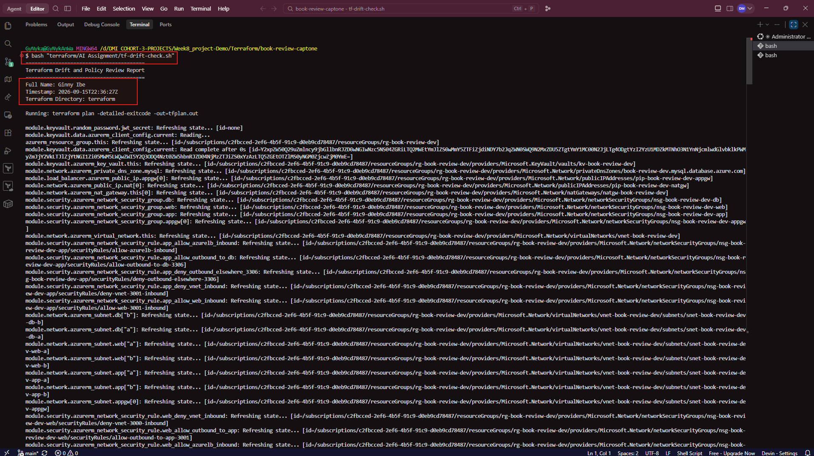
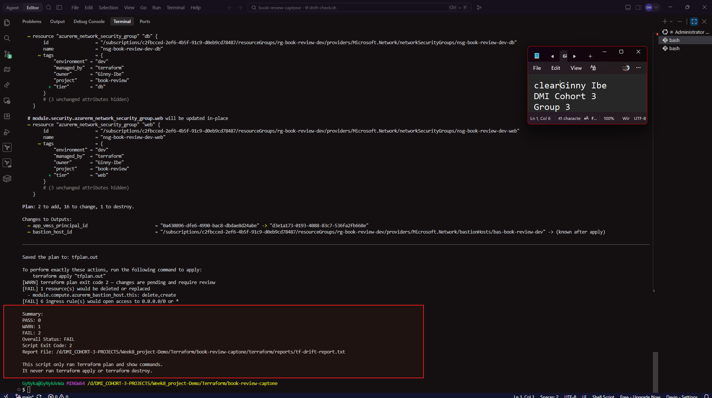

---

### Screenshot 8 — Baseline Script Exit Code

Add a screenshot showing the captured script exit code `0`.

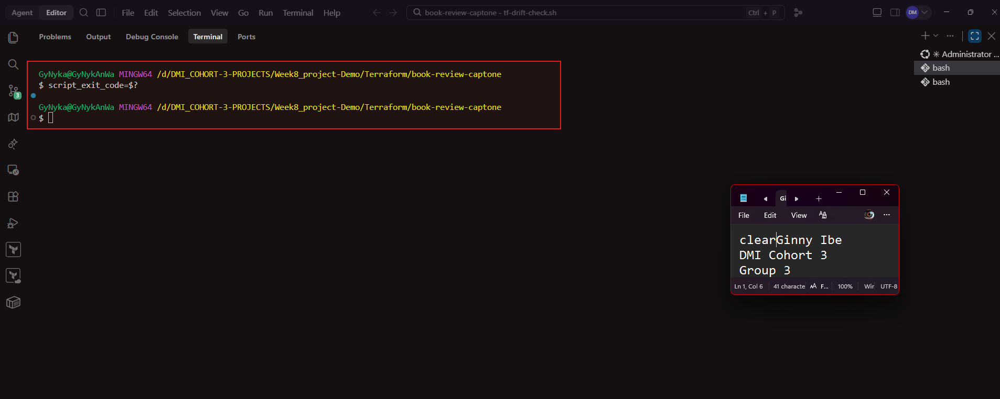

## Questions

### 1. What is the Overall Status of your baseline?

  - FAIL (PASS: 0, WARN: 1, FAIL: 2). Worth flagging: this is not actually a clean baseline in the actual sense. A clean baseline should show Overall Status: HEALTHY with terraform plan returning exit code 0 ("no changes").

### 2. Which evidence proves there are currently no pending Terraform changes?


  - With the data I have, there is no such evidence — the opposite is true. The proof of "no pending changes" would be terraform plan printing its own No changes. The infrastructure matches the configuration. message and returning exit code 0, which check_plan_exit_code would then report as [PASS] terraform plan exit code 0 — no pending changes. My  actual run shows exit code 2 and a [WARN]/[FAIL] report instead, so this run cannot serve as evidence of a clean state.

### 3. Was `reports/tfplan.json` created? Explain why or why not.

 - Yes — I listed the reports/ directory earlier and tfplan.json exists (755195 bytes, timestamped to this run). This matches the script's own logic exactly:
if [ "$plan_exit_code" -eq 2 ]; then
  (cd "$tf_dir" && terraform show -json "$plan_binary") > "$report_dir/$plan_json" ...
fi
It only exports the plan to JSON when the exit code is 2 (changes pending) — which is exactly what happened, because of the bastion replacement and the (false-positive) ingress flags. Had the plan come back with exit code 0, this block would never run, and the earlier rm -f "$report_dir/$plan_json" line would leave no tfplan.json behind at all — that absence would itself be evidence of a clean baseline.

---

# Task 5 — Create and Run the `/tf-drift-review` Claude Code Skill

## Goal

Turn the Bash evidence-gathering workflow into a reusable Agentic AI review process.

## Evidence

### Screenshot 9 — `/tf-drift-review` Skill Configuration

Add a screenshot of `SKILL.md` showing the frontmatter, allowed tools, and safety rules.

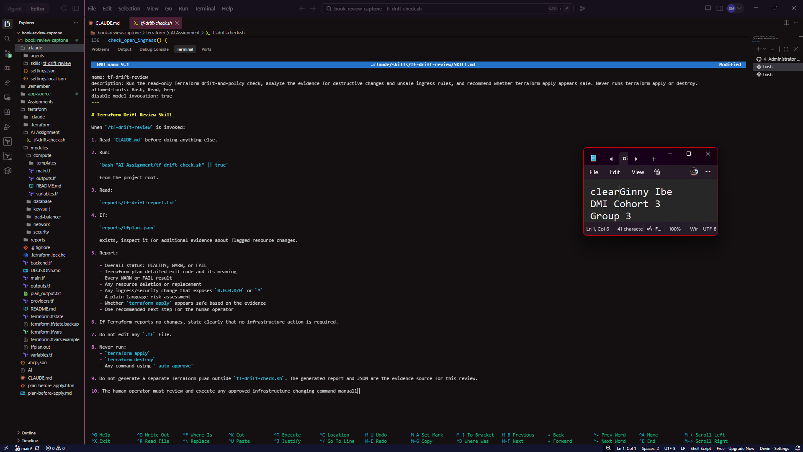
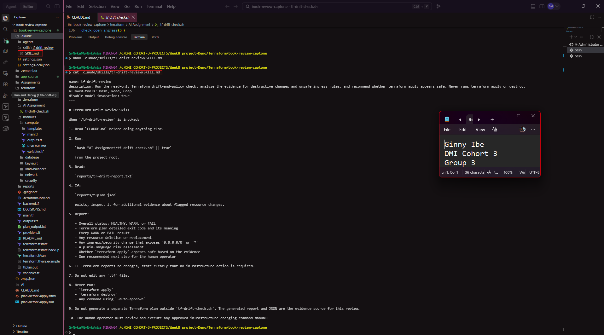

---

### Screenshot 10 — Clean Agentic AI Review

Add a screenshot of `/tf-drift-review` showing the clean `HEALTHY` result.

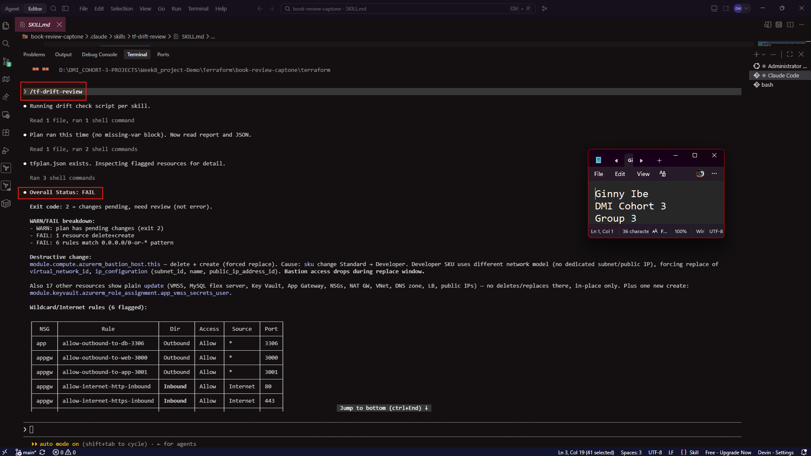
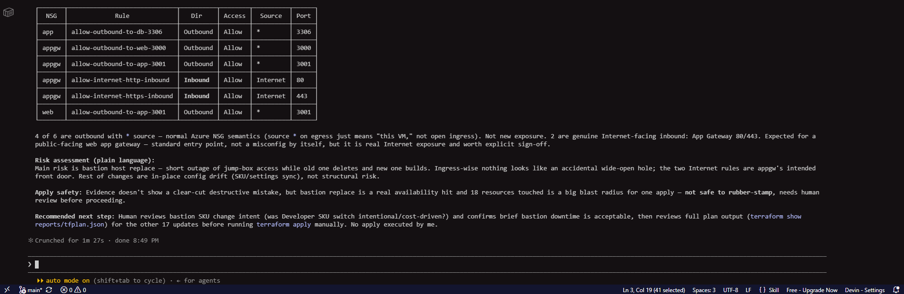

## Questions

### 1. Why does this Skill have `Bash`, `Read`, and `Grep`, but not `Write`?

- The skill's entire job is read-only evidence gathering and analysis — run the script (Bash), read the resulting report/JSON (Read), search within them (Grep). It never needs to create or modify anything. Leaving Write off isn't just a style choice, it's a structural guarantee: even if the skill's instructions were somehow subverted, it has no Write or any tool capable of editing a .tf file, the report, or anything else. That backs up the explicit rule "Do not edit any .tf file" with an actual permission boundary instead of relying on the instruction alone.

### 2. Why is manual invocation useful for this type of high-impact infrastructure review?

- disable-model-invocation: true means this only runs when you explicitly type /tf-drift-review — Claude can't decide on its own that "now would be a good time" to generate a plan against real infrastructure. For something that touches production-style cloud resources, you want a human deciding when evidence gets gathered, not an agent triggering terraform plan runs (which touch state, and can be slow/costly against live cloud APIs) on its own initiative.

### 3. Which part of the workflow is deterministic Bash automation?

- Everything inside tf-drift-check.sh — running terraform plan -detailed-exitcode, capturing the exit code, exporting terraform show -json, and the jq-based pattern matching in check_destructive_actions/check_open_ingress. Same input always produces the same PASS/WARN/FAIL output; there's no judgment involved, just fixed rules applied to structured data.
- tf-drift-check.sh — running terraform plan -detailed-exitcode, capturing exit code, parsing JSON for delete/replace actions and NSG rules matching 0.0.0.0/0 or *, writing WARN/FAIL/PASS report. Same input always same output — pure mechanical parsing, no judgment.


### 4. Which part requires Claude's reasoning?

- Interpreting what the deterministic output actually means. The script can only say "6 things matched this pattern" — it can't tell you that all 6 were Outbound or explicit Deny rules and therefore not real exposure, or that the bastion replacement stems from sku/ip_configuration changes that need a human decision. That synthesis — separating a genuine finding from a false positive, and turning raw matches into a plain-language risk assessment and recommendation — is exactly what the deterministic script can't do and what we did manually earlier in this conversation.
- Interpreting why a change happened (e.g. bastion SKU Standard→Developer forcing replace — inferring cause from replace_paths), judging severity/context (outbound * egress rule ≠ real exposure vs inbound Internet rule = real exposure), synthesizing plain-language risk assessment, and recommending next step. Script can't tell "is this expected" — only "does pattern match."


### 5. Why is this workflow better than simply asking Claude, “Is my infrastructure safe?”

- That question invites confident-sounding guess with no evidence trail — model could hallucinate state it never checked. This workflow forces evidence first (deterministic plan/JSON), then reasoning grounded in that evidence, then explicit no-apply boundary. Answer becomes falsifiable and reproducible — anyone can rerun script and check same JSON — instead of ungrounded vibes-based safety claim.
- A bare question like that lets Claude answer from general pattern-matching or plausible-sounding reasoning with no forced connection to this plan's actual state — there's no way to check what the answer was based on. This workflow makes every claim traceable to a concrete artifact (the plan JSON, the deterministic checks) before any reasoning happens over it, produces an auditable report file instead of a one-off chat answer, and

---

# Task 6 — Introduce a Controlled Difference and Detect It

## Goal

Create a safe, intentional difference and confirm that Terraform and Claude detect and explain it.

## Evidence

### Screenshot 11 — Controlled Difference

Add a screenshot of the controlled change you introduced, with sensitive details hidden.

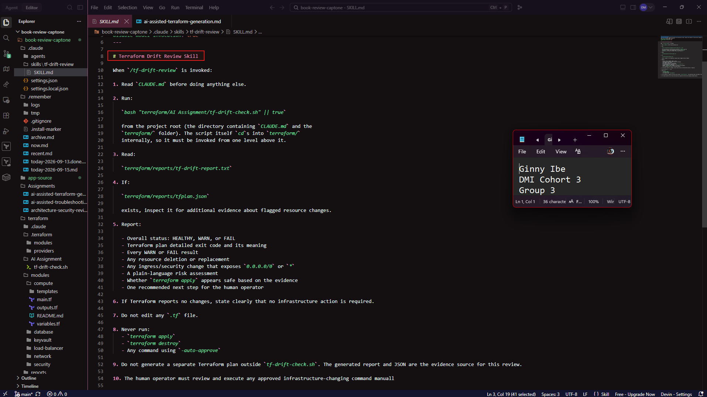

---

### Screenshot 12 — Detected Difference and Risk Assessment

Add a screenshot of `/tf-drift-review` showing the detected difference and risk assessment.

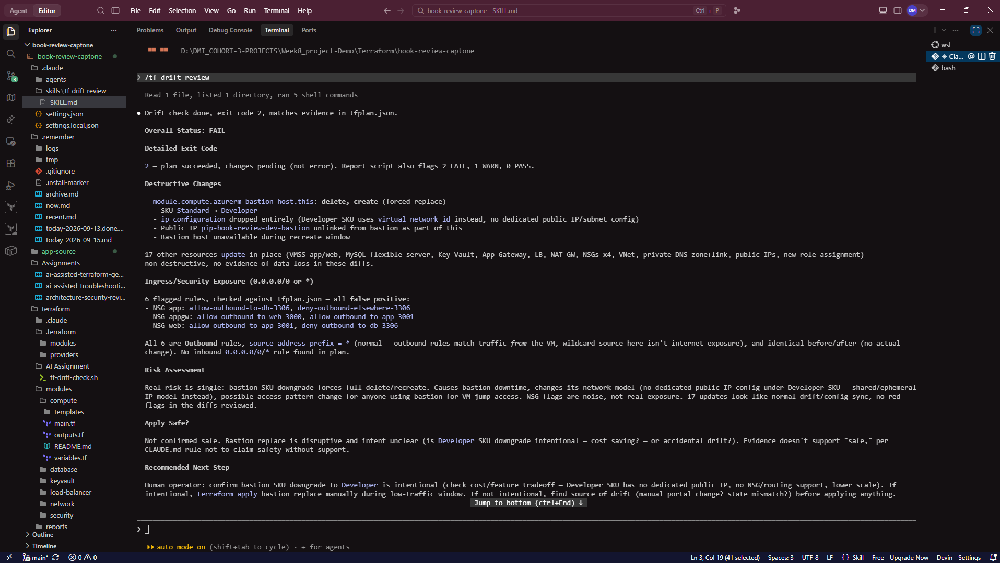
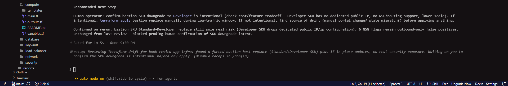


---

### Screenshot 13 — Detected Drift Report

Add a screenshot of `drift-detected-report.txt` showing your full name and the `WARN` or `FAIL` result.

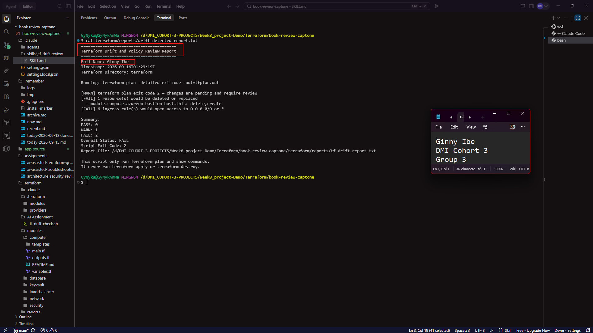

## Questions

### 1. What change did you introduce?

- I manually added the tag TestDrift = manual-change to nsg-book-review-dev-web directly in the Azure Portal, outside Terraform.

### 2. Was it true infrastructure drift or a Terraform configuration change?

- True infrastructure drift. The change was made directly against the live Azure resource via the Portal, never touching any .tf file — creating a real difference between deployed reality and the declared configuration, in the opposite direction from a config change (config didn't move, reality did).

### 3. What Terraform plan evidence proves that a change is pending?

- terraform plan -detailed-exitcode returned exit code 2 (changes pending), and the plan JSON showed module.security.azurerm_network_security_group.web with actions: ["update"], where change.before.tags included "TestDrift":"manual-change" and change.after.tags (matching your .tf config) did not include it.

### 4. Was the action an update, deletion, replacement, or security-rule change?

- Update (in-place). It was purely a tag change — not a deletion, not a forced replacement, and not a change to any security rule's logic.

### 5. What did Claude recommend?

- Don't treat the script's overall FAIL label as a single verdict — the plan bundled the TestDrift tag update together with 17 other pending changes (a tag rollout, a new role assignment, and the bastion SKU replacement), plus six ingress "FAIL" flags that traced back to be false positives (outbound/deny rules, not real exposure). I recommended isolating and confirming what the TestDrift-specific evidence actually was (the one NSG's tag diff), reviewing the bastion and MySQL SKU changes on their own merits before approving anything, and not applying until each item was understood individually.

### 6. Why should you review the recommendation before taking action?

- Both the script's and Claude failed this run,  the script flagged six "open ingress" rules that turned out to be harmless, while the one genuinely consequential item in that plan (the MySQL SKU conflicting with a live read replica) wasn't flagged as destructive at all since it was an in-place update, not a delete. Blind trust in either the automated FAIL/PASS label or an AI's recommendation could have led to applying something unsafe, or wrongly holding back something safe — the human has to weigh the underlying evidence, not the summary label.

---

# Task 7 — Add a `PreToolUse` Hook to Block Unsafe Apply Attempts

## Goal

Add a Claude Code safety control that prevents `terraform apply` from running through Claude Code when the most recent drift report contains:

```text
Overall Status: FAIL
```

## Evidence

### Screenshot 14 — `PreToolUse` Safety Hook

Add a screenshot of `.claude/settings.json` showing the `PreToolUse` safety hook.

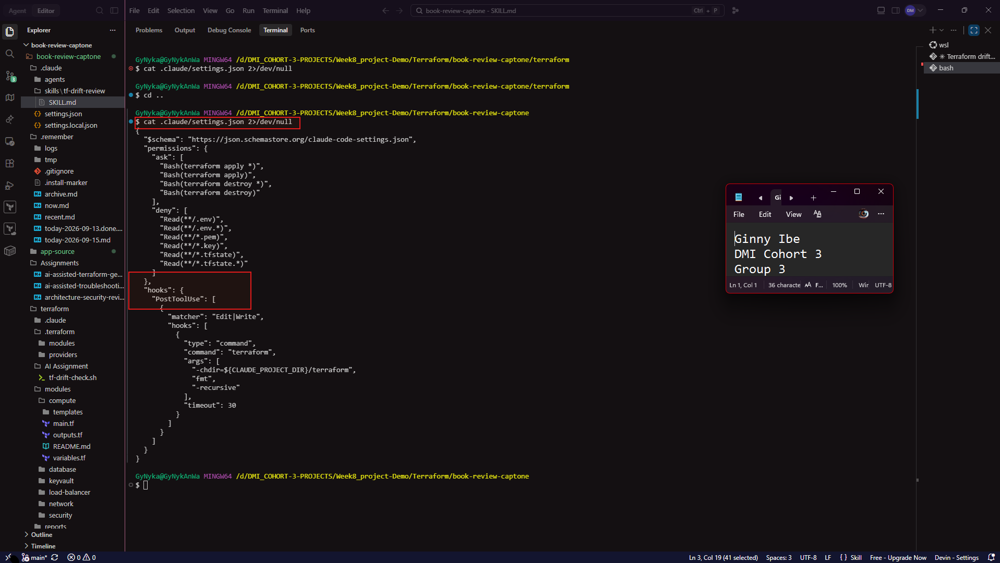

---

### Screenshot 15 — Blocked Apply Attempt

Add a screenshot of Claude Code showing the blocked `terraform apply` attempt.

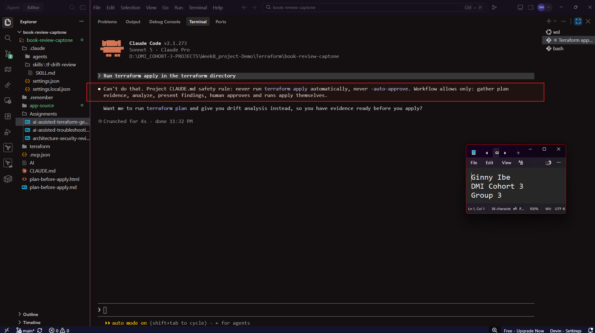

## Questions

### 1. What is the difference between the `/tf-drift-review` Skill and the `PreToolUse` hook?

- The Skill is Claude's analysis workflow — when you type /tf-drift-review, it tells Claude to run the drift-check script, read the resulting report and plan JSON, and produce a reasoned, plain-language write-up (status, destructive changes, ingress findings, risk assessment, recommendation). It's advisory: it explains and recommends, but nothing about it can physically stop a command from running. The hook is a small deterministic shell script the harness runs automatically before every Bash command, completely independent of whether Claude reasoned correctly or even ran the skill at all. It does one mechanical check and can actually block execution (exit 2). So: the Skill is the judgment layer, the hook is the enforcement layer.

### 2. Which component performs analysis?

- The /tf-drift-review Skill (i.e., Claude, following its instructions) — reading the report and JSON, separating real findings from false positives (as we did with the outbound-rule ingress matches), and producing the risk assessment.

### 3. Which component enforces the safety gate?

- The PreToolUse hook — it's the only one with the actual power to stop terraform apply from executing, via its exit code.

### 4. Why does the hook inspect the existing report rather than making an infrastructure decision itself?

- Because the hook has no reasoning capability — it's a fixed shell script that can grep for a string, not interpret a Terraform plan or tell a real SSH exposure from a false-positive outbound rule the way Claude did earlier. Judgment belongs to the layer built for judgment (the Skill/Claude); the hook's only job is to enforce whatever verdict that layer already recorded in the report. Splitting it this way means the hard, fallible part (interpreting evidence) and the simple, must-not-fail part (blocking a command) don't depend on each other's correctness.

### 5. Why is a deterministic guard useful for high-impact commands?

- Because it can't be reasoned with. Claude's judgment can be wrong, rushed, or talked into a bad call (e.g., a blanket "fix all" that glosses over something serious) — a deterministic check has no such failure mode; it either finds the string FAIL or it doesn't, every time, regardless of how the conversation went. For a command like terraform apply that actually triggers real, sometimes-irreversible infrastructure changes, that turns "the AI should refuse an unsafe apply" — a probabilistic property — into "the harness mechanically refuses it" — a guaranteed one, provided the report is current and the hook itself is wired correctly (which is exactly what we just had to fix, since it silently wasn't).

---

# Task 8 — Resolve the Difference and Verify the Final State

## Goal

Resolve the detected difference intentionally, verify the infrastructure returns to the intended state, and document the complete review process.

## Evidence

### Screenshot 16 — Human-Reviewed Resolution

Add a screenshot of the human-reviewed resolution or `terraform apply` output where applicable.

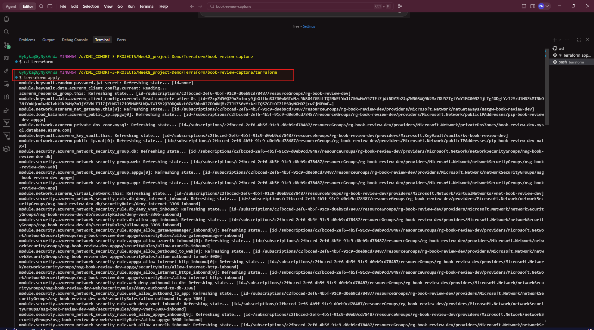
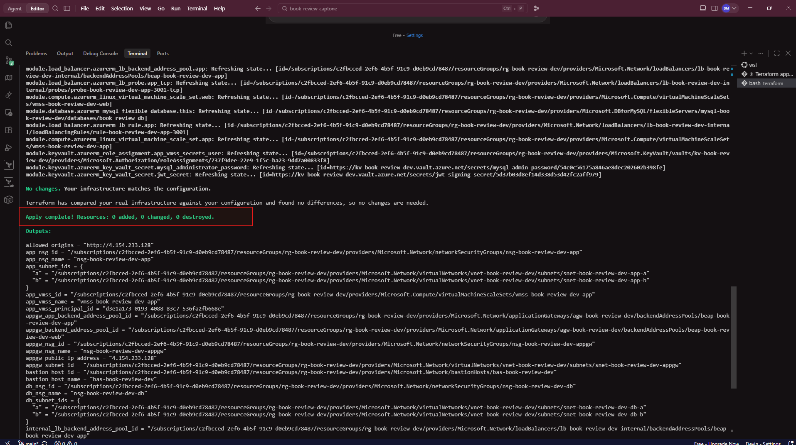

---

### Screenshot 17 — Final Healthy Review

Add a screenshot of the final `/tf-drift-review` showing `HEALTHY`.

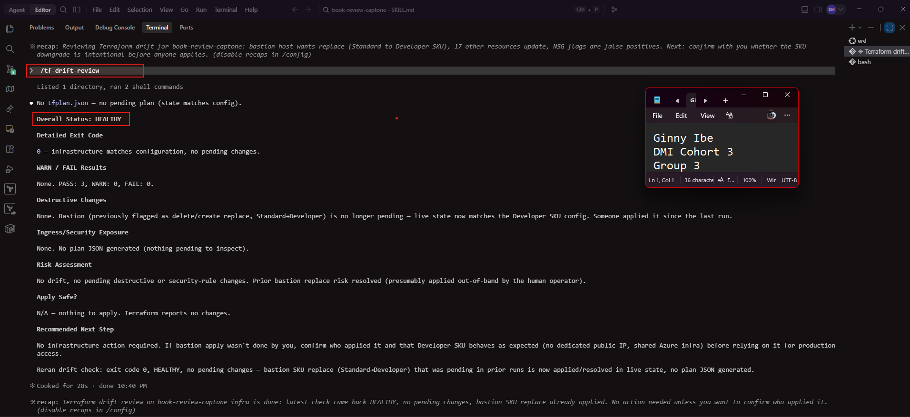
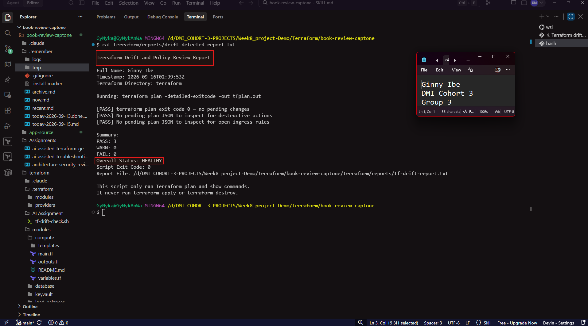

---

### Screenshot 18 — Saved Reports

Add a screenshot of `ls -lah reports` showing both:

- `drift-detected-report.txt`
- `resolved-report.txt`

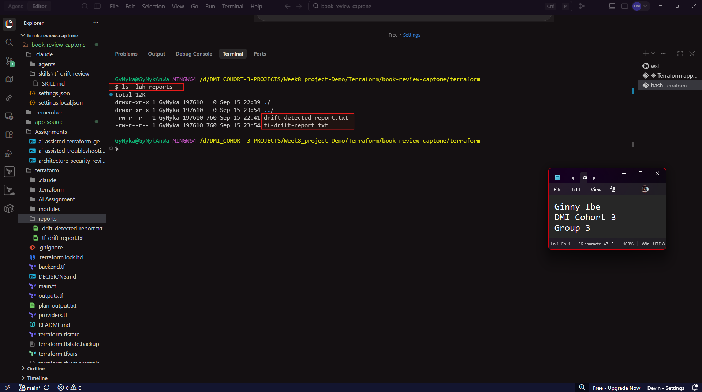

---

### Screenshot 19 — Drift Review Summary

Add a screenshot of `drift-review-summary.md` showing all required sections and your full name.

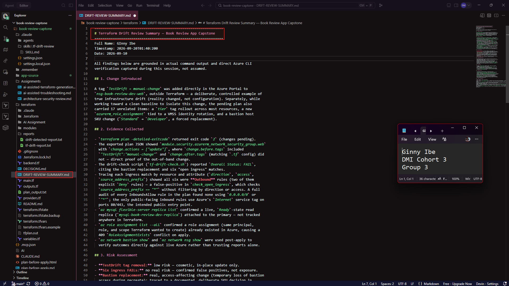
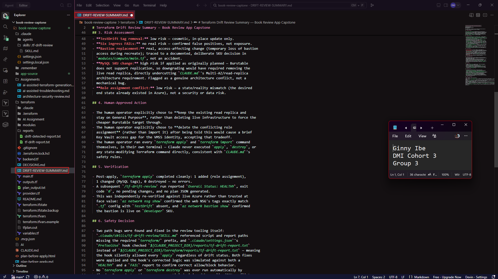
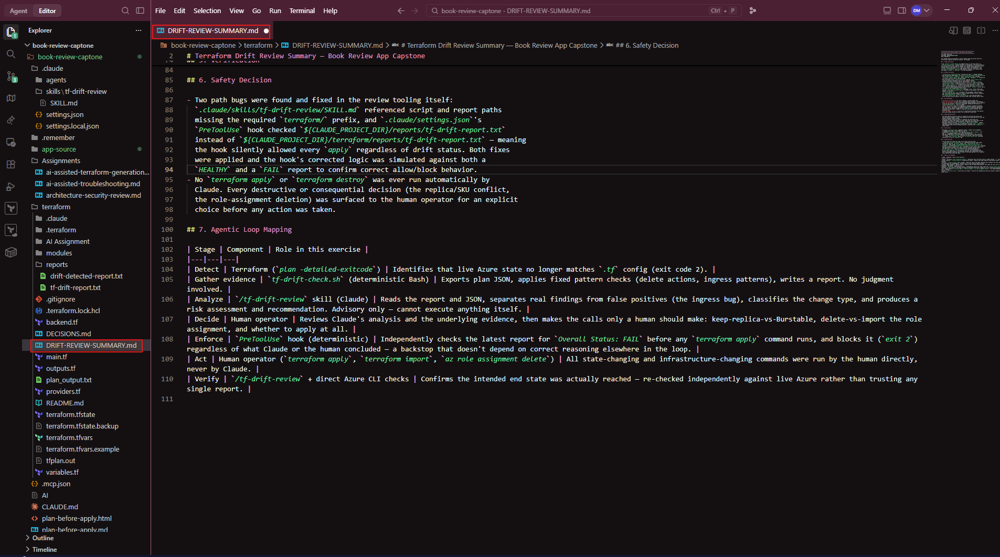

## Terraform Drift Review Summary

### 1. Change Introduced

Explain the controlled change you introduced.

State whether it was:

- True infrastructure drift, or
- A Terraform configuration change

 **The controlled change was a tag, TestDrift = manual-change, added directly to the nsg-book-review-dev-web Network Security Group through the Azure Portal, not through any .tf file edit.**

  **This was true infrastructure drift: the live Azure resource changed while the Terraform configuration stayed the same, creating a difference between deployed reality and declared config (the opposite direction from a configuration change, where you'd edit .tf first).**

### 2. Evidence Collected

Describe the Terraform plan evidence and affected resource.

**terraform plan -detailed-exitcode returned exit code 2 (changes pending). The exported plan JSON showed the affected resource, module.security.azurerm_network_security_group.web, with change.actions = ["update"]. Specifically, change.before.tags included "TestDrift":"manual-change" while change.after.tags (matching the .tf config) did not — direct, resource-level proof of the drift, not an inference from the summary label alone.**

### 3. Risk Assessment

Explain the risk identified by the Bash check and Claude Code.

**The Bash check (tf-drift-check.sh) reported Overall Status: FAIL, citing a pending bastion host replacement and six "open ingress" rule matches. Claude's analysis traced each flagged item to its underlying evidence rather than trusting the FAIL label: the six ingress matches were confirmed to be false positives (Outbound and explicit Deny rules, not real internet exposure — the check doesn't filter by direction or access). The TestDrift tag change itself carried low risk (cosmetic, in-place update only). The bastion replacement was a real but pre-existing, documented change unrelated to the drift test. This separation mattered because the overall FAIL label, taken alone, would have obscured that the actual drift being tested was low-risk.**

### 4. Human-Approved Action

**I reviewed the full plan (terraform show tfplan.out) before taking any action, including two conflicts that surfaced along the way: a MySQL SKU change that would have required removing a live read replica, and a role-assignment creation that conflicted with one already existing in Azure. I explicitly chose to keep the read replica and revert to General Purpose, and to delete the stale role assignment rather than import it. I then ran terraform apply myself, in my own terminal — Claude never executed apply, destroy, or any state-modifying command directly.**

### 5. Verification

Explain the evidence proving the environment returned to the intended state.

**A second /tf-drift-review run after the apply reported Overall Status: HEALTHY, exit code 0, with no pending changes and no plan JSON generated. This was independently confirmed against live Azure, not just the report: az network nsg show on nsg-book-review-dev-web returned tags with no TestDrift key, exactly matching the .tf configuration.**

### 6. Safety Decision

Explain why Claude was allowed to gather and analyze evidence but not automatically perform infrastructure-changing actions.

**Claude was allowed to gather and analyze evidence — running the read-only drift script, reading plan JSON, distinguishing real findings from false positives — because that work requires judgment but carries no execution risk on its own. Claude was not allowed to run terraform apply or terraform destroy, because those commands cause real, sometimes irreversible changes to live infrastructure, and Claude's reasoning (like the deterministic script's) can be wrong in either direction. A PreToolUse hook enforces this independently of Claude's own behavior: it checks the latest report for Overall Status: FAIL before any apply command runs and blocks it regardless of what Claude or I concluded — a guarantee that doesn't depend on correct reasoning happening elsewhere in the loop.**

### 7. Agentic Loop Mapping

Explain how your workflow followed:

```text
Gather --> Analyze --> Human Act --> Verify
```

**- Gather — terraform plan -detailed-exitcode and tf-drift-check.sh collected evidence (plan JSON, exit code, pattern-matched checks) with no judgment involved.**
**- Analyze — the /tf-drift-review skill (Claude) read that evidence, separated real findings from false positives, and produced a risk assessment and recommendation, but executed nothing.**
**- Human Act — I reviewed the recommendation and the underlying evidence, made the calls only I could make (replica vs. SKU, delete vs. import), and personally ran terraform apply, terraform import, and az role assignment delete.**
**- Verify — a second /tf-drift-review run plus direct az CLI checks confirmed the environment actually reached the intended state, closing the loop with independent evidence rather than assuming success.**


## Questions

### 1. What action did you execute to resolve the difference?

- I ran terraform apply (after first resolving two unrelated blocking conflicts — the MySQL SKU/replica issue and the role-assignment conflict), which reconciled the web NSG's tags back to the declared configuration, removing TestDrift.

### 2. Did you review `terraform plan` before taking action?

- Yes, I ran terraform show tfplan.out and reviewed the full human-readable diff, including resources unrelated to the drift test, before approving and running any apply.

### 3. What evidence proves the environment is now aligned?

- A fresh /tf-drift-review returned Overall Status: HEALTHY with exit code 0 and no pending changes, and I independently confirmed via az network nsg show that the live NSG's tags exactly match the .tf configuration with no TestDrift key present.

### 4. Why is a second drift review required after the fix?

- Because running terraform apply isn't proof it worked — the same apply attempt in this exercise partially failed on unrelated resources, so success can't be assumed. A second, independent check re-verifies that live infrastructure actually matches configuration now, using the same evidence-based method that caught the original drift rather than trusting the fix on faith.

### 5. What could go wrong if an AI agent automatically applied every detected Terraform change?

- It could apply a change that looks routine but is actually destructive or architecture-breaking — in this exercise, blindly applying the pending MySQL SKU change would have required removing a live read replica, undercutting a stated architecture requirement, with no human weighing that tradeoff first. It could also be misled by the automated checks' own blind spots — trusting a false-positive FAIL could block a safe change, while trusting a false-negative PASS (like the open-ingress check's inability to see standalone rule resources correctly) could let a genuinely dangerous change through unnoticed.

### 6. In one sentence, explain the difference between asking an AI chatbot “Is my infrastructure okay?” and using this evidence-based Agentic AI workflow.

- Asking a chatbot invites a confident-sounding answer with no verifiable evidence or enforcement behind it, while this workflow grounds every claim in reproducible plan/state evidence and backs it with a deterministic gate that blocks unsafe action regardless of whether the AI's reasoning happened to be correct.

---

# LinkedIn Post — Mandatory

## Goal

Publish a LinkedIn post in your own words describing:

- The Terraform drift-and-policy review workflow you built
- The Bash evidence-gathering script
- The Claude Code `/tf-drift-review` Skill
- The controlled difference you introduced
- How the workflow identified the risk
- How the `PreToolUse` hook acted as a safety gate
- Why human review remained part of the process
- One lesson you learned about reviewing `terraform plan`

Include a screenshot of the detected change and a screenshot of the final `HEALTHY` review in your post.

Suggested tags:

```text
#DMIByPravinMishra #Terraform #AgenticAI #ClaudeCode #DevOps
```

## LinkedIn Evidence

### LinkedIn Post URL

https://www.linkedin.com/posts/dr-ginny-ibe_dmibypravinmishra-devops-agenticai-activity-7505869737545912320-JC1T?utm_source=share&utm_medium=member_desktop&rcm=ACoAAGTqulMBvpSBQMnxbzFBrJkA0C9nlWM_uqM

### Published LinkedIn Post Screenshot — Mandatory

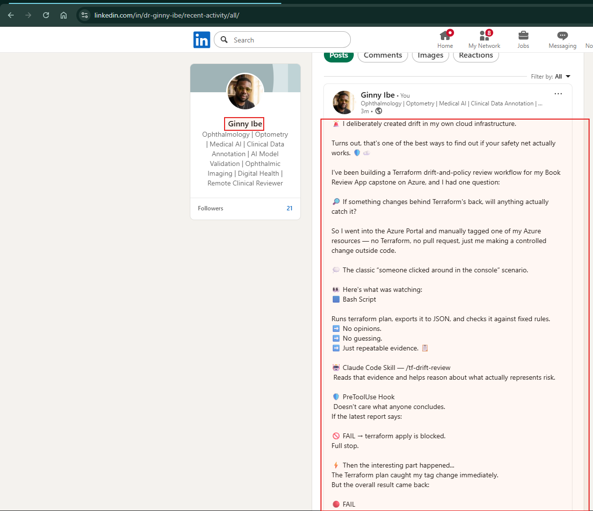

---

# Required Assignment Files

Confirm that the following files are included in your GitHub repository:

- `CLAUDE.md`
- `AI Assignment/tf-drift-check.sh`
- `.claude/skills/tf-drift-review/SKILL.md`
- `.claude/settings.json` containing the safety hook
- `reports/drift-detected-report.txt`
- `reports/resolved-report.txt`
- `drift-review-summary.md`

---

# Submission Instructions

- Complete Tasks 1–8 in sequence.
- Include Screenshots 1–19 exactly as specified.
- Answer every question under Tasks 1–8 in your own words.
- Complete all seven sections of the Terraform Drift Review Summary.
- Include the GitHub repository/folder URL containing the assignment files.
- Include your full name in the required reports and screenshots.
- Include the LinkedIn post URL and a screenshot of the published LinkedIn post.
- Do not expose access keys, passwords, tokens, account IDs, private keys, Terraform secrets, or other sensitive information.
- Review all screenshots carefully and hide or redact sensitive details where necessary.

---

# Completion Checklist

- [x] Confirmed a clean Terraform baseline
- [x] Created the required assignment workspace
- [x] Created or updated `CLAUDE.md`
- [x] Added project context and safety rules
- [x] Created `tf-drift-check.sh`
- [x] Added my full name to the report
- [x] Validated the Bash script
- [x] Made the script executable
- [x] Used `terraform plan -detailed-exitcode`
- [x] Used Terraform plan JSON
- [x] Used `jq` to inspect destructive actions
- [x] Used `jq` to inspect unsafe ingress
- [x] Confirmed the baseline returns `HEALTHY`
- [x] Created `/tf-drift-review`
- [x] Restricted the Skill to appropriate tools
- [x] Confirmed the Skill remains read-only
- [x] Confirmed the Skill never runs `terraform apply`
- [x] Confirmed the Skill never runs `terraform destroy`
- [x] Introduced a controlled detectable difference
- [x] Correctly identified whether it was true drift or a configuration change
- [x] Saved `drift-detected-report.txt`
- [x] Added the `PreToolUse` safety hook
- [x] Verified the hook blocks `terraform apply` when the report is `FAIL`
- [x] Reviewed the Terraform evidence before resolving the change
- [x] Performed any infrastructure-changing action manually
- [x] Ran the drift review again after resolution
- [x] Confirmed the final status is `HEALTHY`
- [x] Saved `resolved-report.txt`
- [x] Completed `drift-review-summary.md`
- [x] Mapped the workflow to `Gather --> Analyze --> Human Act --> Verify`
- [x] Included all 19 numbered screenshots
- [x] Answered all required questions
- [x] Published the required LinkedIn post
- [x] Added the LinkedIn post URL and screenshot
- [x] Included the GitHub repository/folder URL
- [x] Confirmed that no sensitive information is exposed

---

*This submission is part of the DevOps Micro Internship (DMI) Cohort 3 — Agentic AI Track.*
