# Assignment 02 — Provision Linux VMs with Terraform and Run Ansible Ad-Hoc Commands

Part of the DevOps Micro Internship (DMI) with Agentic AI

---

## Purpose

In this assignment, you will use Terraform to provision three or four Ubuntu Linux Virtual Machines on either Microsoft Azure or Amazon Web Services.

You will configure SSH key-based authentication, organize the servers using a custom Ansible inventory, and run Ansible ad-hoc commands across individual hosts and inventory groups.

---

# Task 1 — Create the Multi-Host Lab Structure

## Goal

Create a separate project directory for the multi-host lab and prepare the Terraform, Ansible, and documentation files.

This project will use the Git repository and Ansible controller prepared in Assignment 01.

### Evidence

#### Screenshot 1 — Terminal showing the complete `ansible-adhoc-lab` project structure

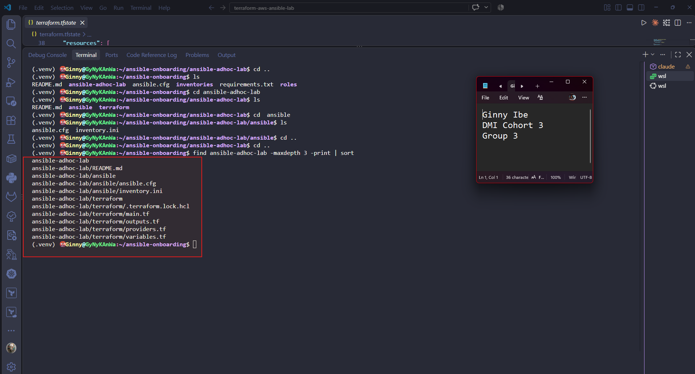

---

#### Screenshot 2 — Terminal showing `git status --short` with the new project files and updated `.gitignore`

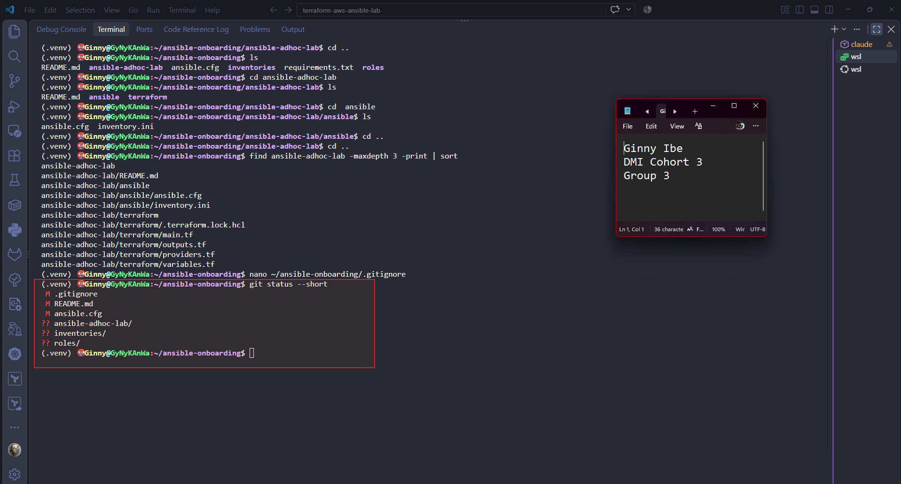

---

### Notes

- Created the ansible-adhoc-lab project directory inside the existing ansible-onboarding Git repository, organised into separate terraform and ansible directories. No additional Git repository was created inside the lab directory.

- Created the required Terraform files (providers.tf, main.tf, variables.tf, outputs.tf), a custom Ansible inventory (inventory.ini) with web, app and db groups, and a README.md documenting the project.

- Updated the existing .gitignore to exclude Terraform state files, saved plans, crash logs and the .terraform/ working directory, so sensitive state data is not committed.

- Verified connectivity with ad-hoc commands: ping on all four hosts, whoami (returns ubuntu) and uptime. The private app and db hosts are reached through web1 as a jump host.

---

# Task 2 — Create the Terraform Configuration

## Goal

Create the Terraform configuration required to provision three or four Ubuntu Linux VMs on your selected cloud platform.

Complete only one option:

- Option A — Microsoft Azure
- Option B — Amazon Web Services

Do not configure both providers for this assignment.

### Evidence

#### Screenshot 3 — Terraform configuration showing the three or four server roles and the `for_each` or `count` implementation

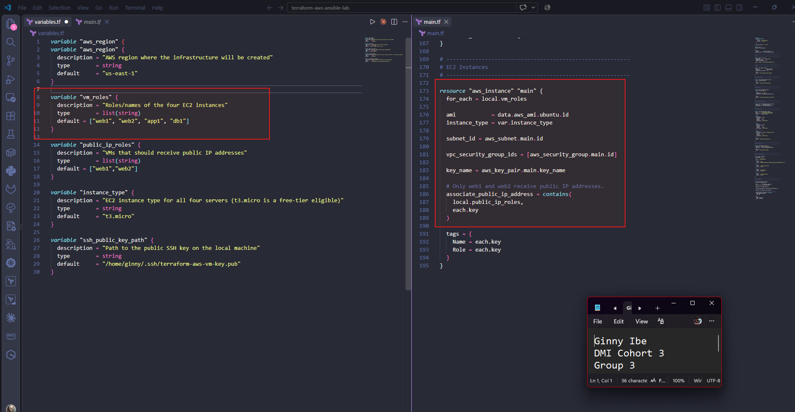

---

#### Screenshot 4 — Terraform configuration showing SSH restricted to the controller IP and HTTP allowed only for web hosts

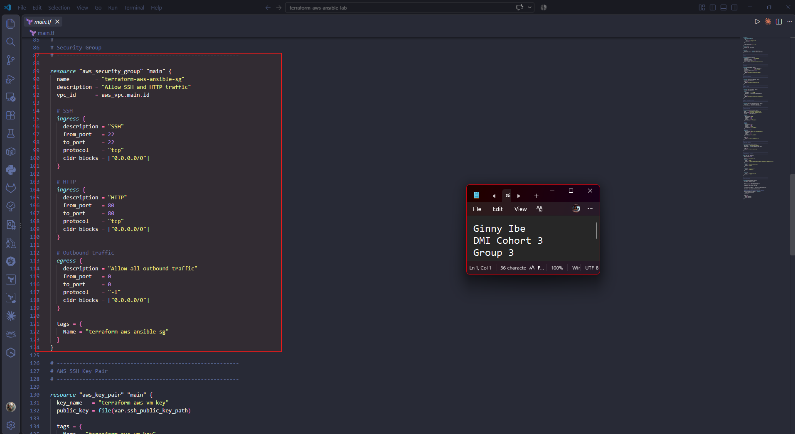

---

#### Screenshot 5 — Terraform output configuration showing how public IP addresses are associated with the server roles

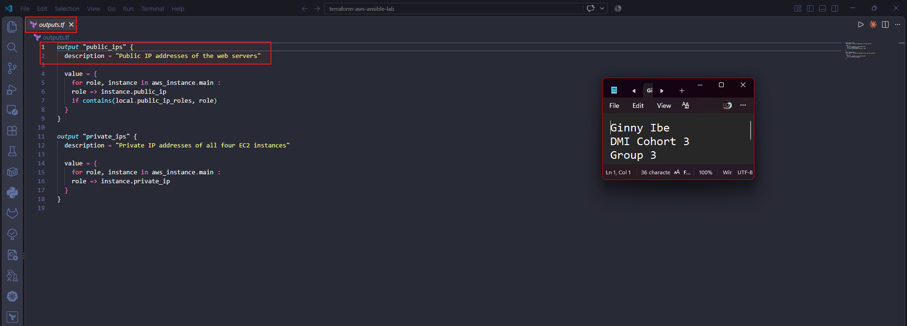

---

### Notes

Created the Terraform configuration for the four-server option using the roles web1, web2, app1 and db1. The work started on Azure but moved to AWS after VM creation kept failing with a SkuNotAvailable error for Standard_B1s in East US. The aws_instance resource uses for_each over the vm_roles variable, so Terraform creates all four EC2 instances from one resource block.

Configured the AWS resources: a VPC (10.0.0.0/16), a subnet (10.0.1.0/24), an internet gateway, a route table with a default route, one security group, an AWS key pair, and a data source that finds the latest Ubuntu 22.04 AMI. All four instances use the same AMI, the t3.micro instance type, the same subnet and security group, and the same SSH public key. They log in as the default ubuntu user.

Only web1 and web2 get public IP addresses. Terraform checks whether each role is in the public_ip_roles variable and sets associate_public_ip_address to match. app1 and db1 stay private and are reached through web1 as a jump host. The shared security group allows SSH on port 22 and HTTP on port 80 from the internet, and allows all outbound traffic.

Created two Terraform outputs, public_ips and private_ips, keyed by server role. public_ips covers web1 and web2, and private_ips covers all four servers. These addresses were used to build the Ansible inventory. The configuration was initialized, validated, planned and applied successfully. Passwordless SSH then worked on all four instances: directly to the web servers, and through web1 to app1 and db1.

---

# Task 3 — Provision the Infrastructure with Terraform

## Goal

Initialize and validate the Terraform configuration, review the execution plan, provision the selected three or four VMs, and retrieve their public IP addresses.

### Evidence

#### Screenshot 6 — Final `terraform apply` output showing `Apply complete`

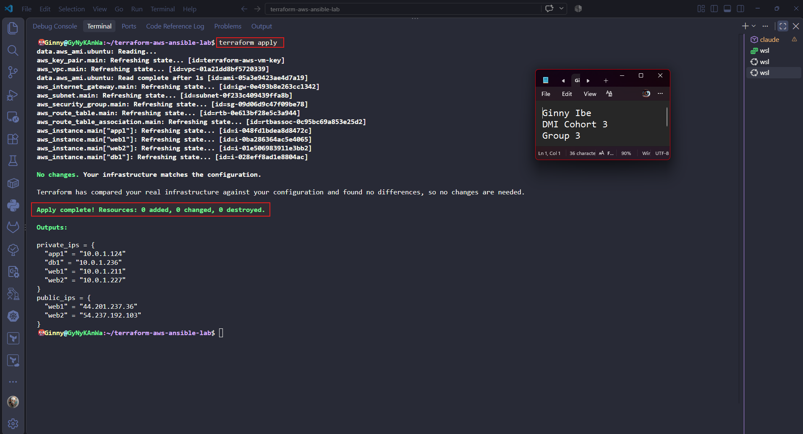

---

#### Screenshot 7 — `terraform output public_ips` showing the role-to-IP mapping for all three or four VMs

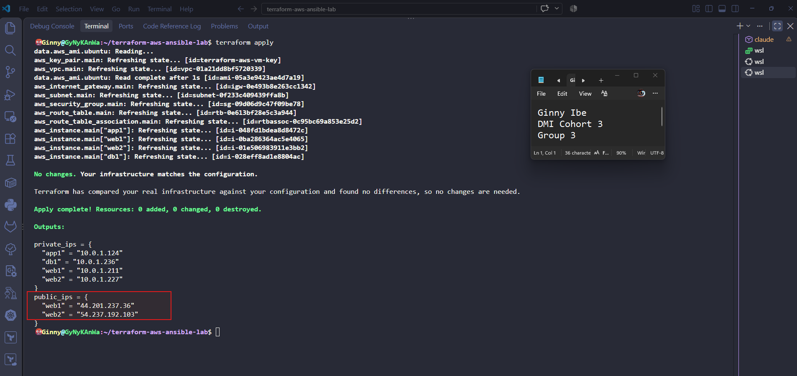

---

#### Screenshot 8 — Azure Portal or AWS Management Console showing all three or four VMs in the `Running` state, with their role-based names visible

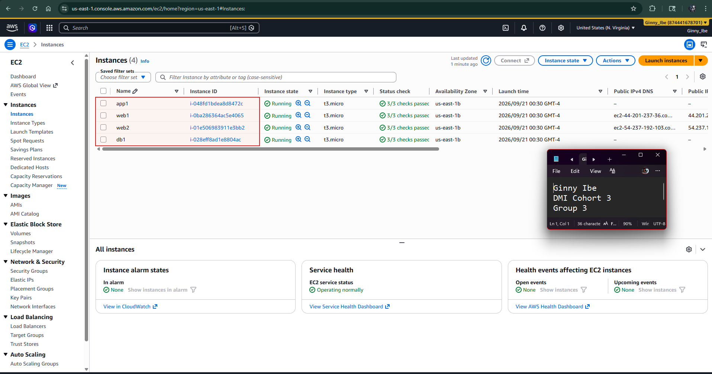

---

### Notes

Add your task notes here.Provisioned the AWS infrastructure using Terraform for the four-server option: web1, web2, app1, and db1. Running terraform init, terraform validate, terraform plan, and terraform apply created the VPC, subnet, internet gateway, route table, security group, key pair, and four Ubuntu EC2 instances.

The lab was first deployed on Azure, but VM creation in East US failed because the Standard_B1s size was unavailable due to an Azure capacity restriction. The lab was then deployed successfully on AWS in us-east-1.

Terraform outputs confirmed the IP addresses associated with each server role:

web1 - 34.200.228.51      10.0.1.239 
web2 - 98.80.167.113      10.0.1.89 
app1 - (private only)     10.0.1.146 
db1 -  (private only)     10.0.1.190 

terraform output public_ips lists only web1 and web2, because the app and database servers were intentionally not given public IP addresses. Their private IPs are shown by terraform output private_ips.

The completed deployment provides the managed servers required for SSH verification and the remaining Ansible ad-hoc command tasks.

---

# Task 4 — Verify SSH Key-Based Access

## Goal

Verify that each managed VM can be accessed from the Ansible controller using SSH key-based authentication.

### Evidence

#### Screenshot 9 — Terminal showing successful SSH hostname output from all VMs

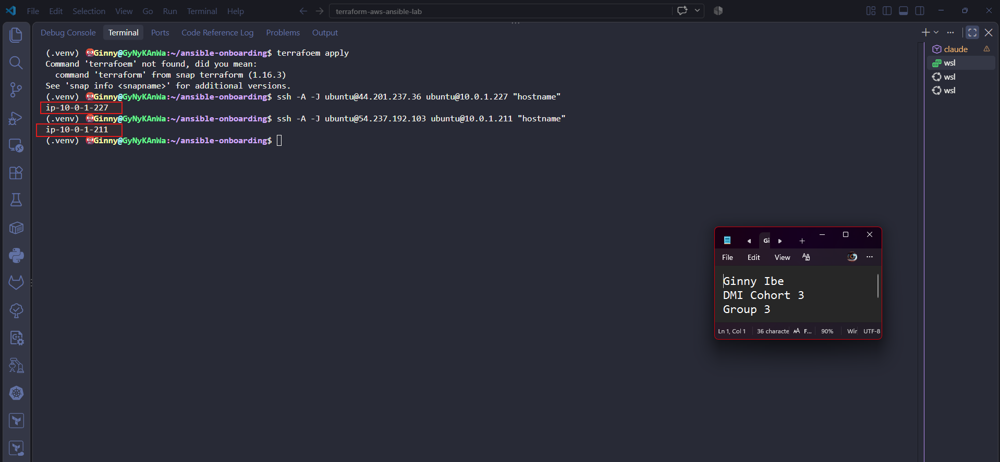

---

### Notes

Verified SSH key-based access from the Ansible controller to all four AWS Ubuntu instances. Connections used the private key stored at ~/.ssh/terraform-aws-vm-key, loaded into ssh-agent, and the AWS Ubuntu username ubuntu.

Ran the hostname command on each server through SSH. web1 and web2 were reached directly through their public IPs and returned ip-10-0-1-239 and ip-10-0-1-89. app1 and db1 have only private IPs, so they were reached through web1 as a jump host (ssh -A -J ubuntu@34.200.228.51 ...). They returned ip-10-0-1-146 and ip-10-0-1-190. AWS names Ubuntu instances after their private IP addresses.

No password prompt appeared for any connection. This confirms three things:
- The SSH public key registered through the Terraform aws_key_pair resource was installed correctly on every instance.
- The security group allows SSH access.
- Agent forwarding lets the controller reach the private servers without copying the private key onto web1.

---

# Task 5 — Create the Custom Ansible Inventory

## Goal

Create an Ansible inventory file that groups the managed VMs by role.

The inventory allows Ansible to run commands against all servers, or only specific groups such as `web`, `app`, or `db`.

### Evidence

#### Screenshot 10 — `inventory.ini` showing the `web`, `app`, and `db` groups

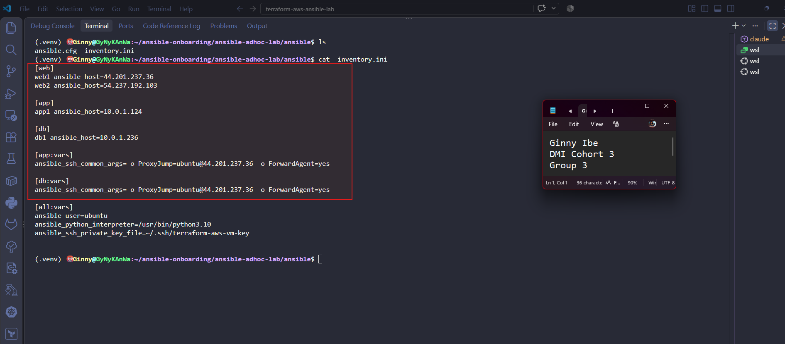

---

#### Screenshot 11 — Output of `ansible-inventory -i inventory.ini --graph`

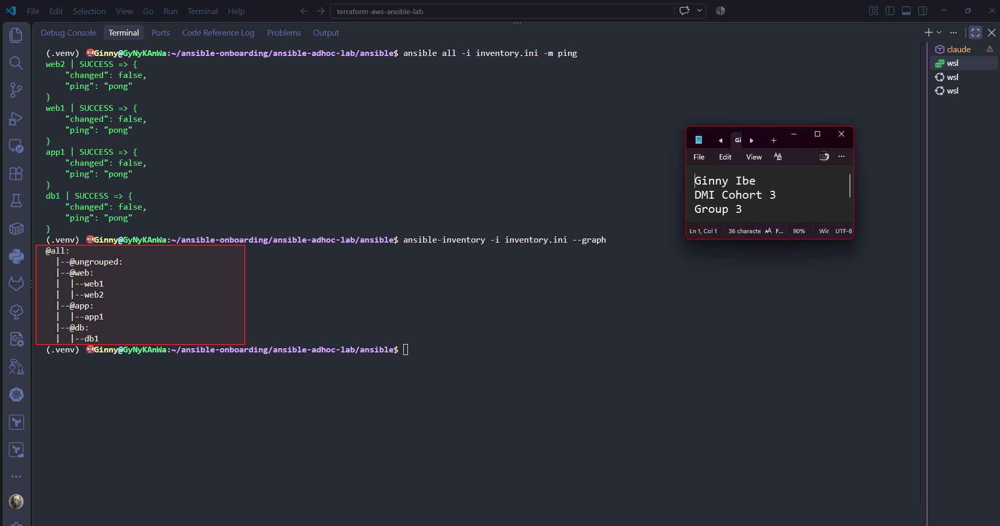

---

### Notes

- Created a custom Ansible inventory for four AWS EC2 instances, organised by role into three groups: web (web1, web2), app (app1) and db (db1). Each host has a friendly alias, with its address set through ansible_host. The app and db hosts have private IPs only, so they are reached through web1 as an SSH jump host (ProxyJump) with agent forwarding.

- Under [all:vars] I set the SSH user to ubuntu, the private key to ~/.ssh/terraform-aws-vm-key, and the Python interpreter to /usr/bin/python3.10 to remove the interpreter discovery warning.

- Created a local ansible.cfg that points at the inventory and sets StrictHostKeyChecking=accept-new. New hosts are accepted automatically, but a changed host key is still rejected.

- Validated the inventory with ansible-inventory -i inventory.ini --graph. The output showed all four hosts in the correct groups, with nothing ungrouped.

---

# Task 6 — Run Ansible Ad-Hoc Commands

## Goal

Run Ansible ad-hoc commands from the controller to verify connectivity, check server information, and manage packages and services across inventory groups.

This task proves that the inventory is working and that Ansible can control multiple managed VMs without writing a playbook.

### Evidence

#### Screenshot 12 — Output of `ansible all -i inventory.ini -m ping`

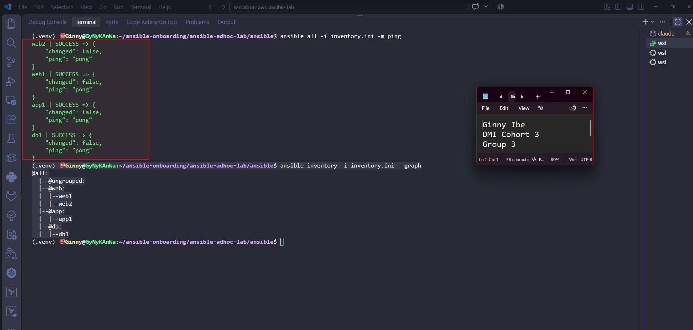

---

#### Screenshot 13 — Output of `ansible all -i inventory.ini -m command -a "uptime"`

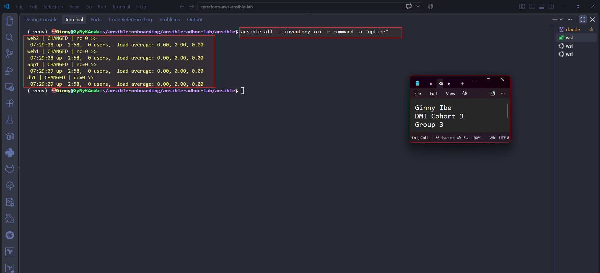

---

#### Screenshot 14 — Output of `ansible web -i inventory.ini -m apt -a "name=nginx state=present update_cache=yes" --become`

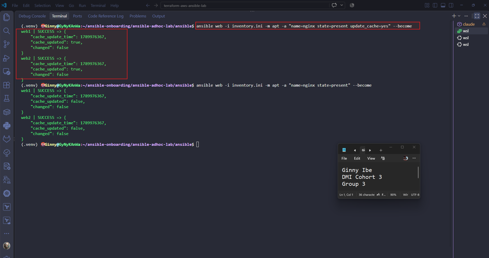

---

#### Screenshot 15 — Output of `ansible web -i inventory.ini -m service -a "name=nginx state=started enabled=yes" --become`

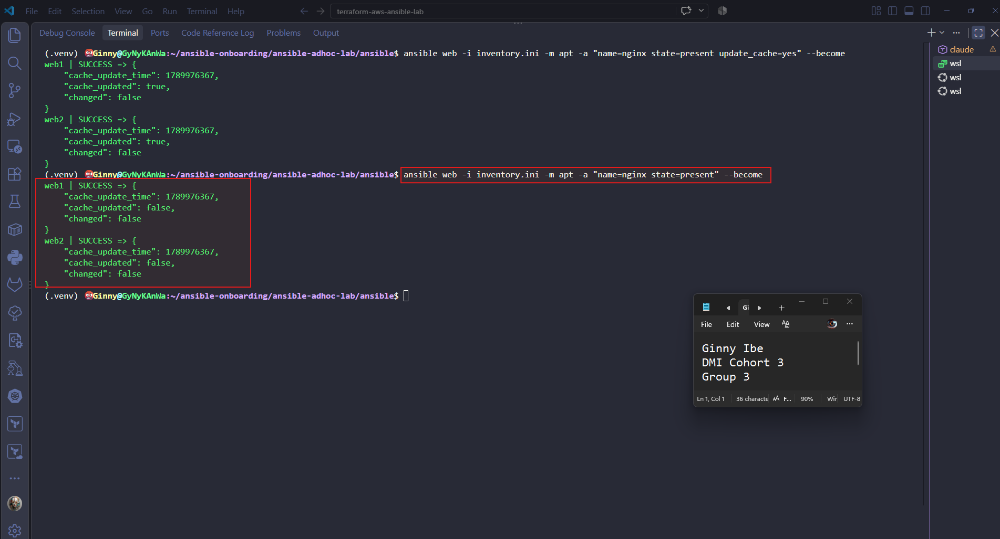

---

#### Screenshot 16 — Output of `ansible all -i inventory.ini -m apt -a "name=htop state=present update_cache=yes" --become`

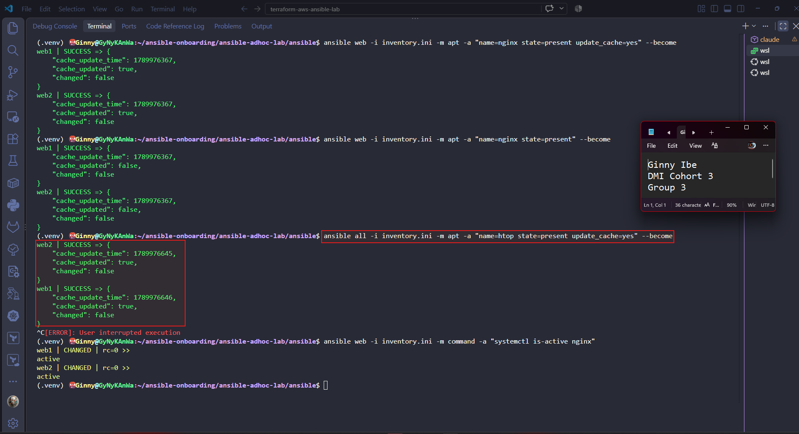

---

#### Screenshot 17 — Output of `ansible web -i inventory.ini -m command -a "systemctl is-active nginx"`

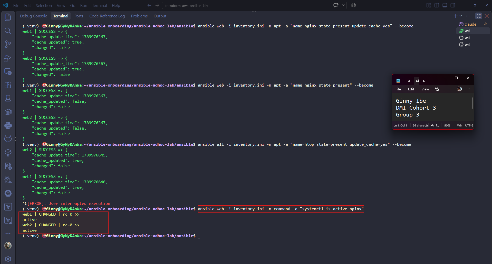

---

### Notes

- Used Ansible ad-hoc commands to manage and verify four AWS Ubuntu servers (web1, web2, app1, db1) without a playbook.

- Connectivity: ping returned pong from every host, including the private app and db servers reached through web1 as a jump host. whoami confirmed the ubuntu user, and uptime showed all servers online.
- Nginx: installed on the web group with the apt module and --become. The first attempt failed on a stale package index, and update_cache=yes fixed it. Re-running it returned changed: false, showing the module is idempotent. systemctl is-active nginx returned active on both web servers.
- htop: the apt module on the web group reported SUCCESS with changed: false, because htop was already installed.

- Ad-hoc commands are a quick way to check connectivity and system info, install packages, and manage services across many servers, whether targeting a group like web or everything with all.

---

# LinkedIn Post Required

## Evidence

#### LinkedIn Post URL

Paste your LinkedIn post URL here:

**https://www.linkedin.com/posts/dr-ginny-ibe_four-servers-one-terraform-configuration-ugcPost-7510445123227410432-z2Dv/?utm_source=share&utm_medium=member_desktop&rcm=ACoAAGTqulMBvpSBQMnxbzFBrJkA0C9nlWM_uqM**

---

#### Screenshot — Published LinkedIn post

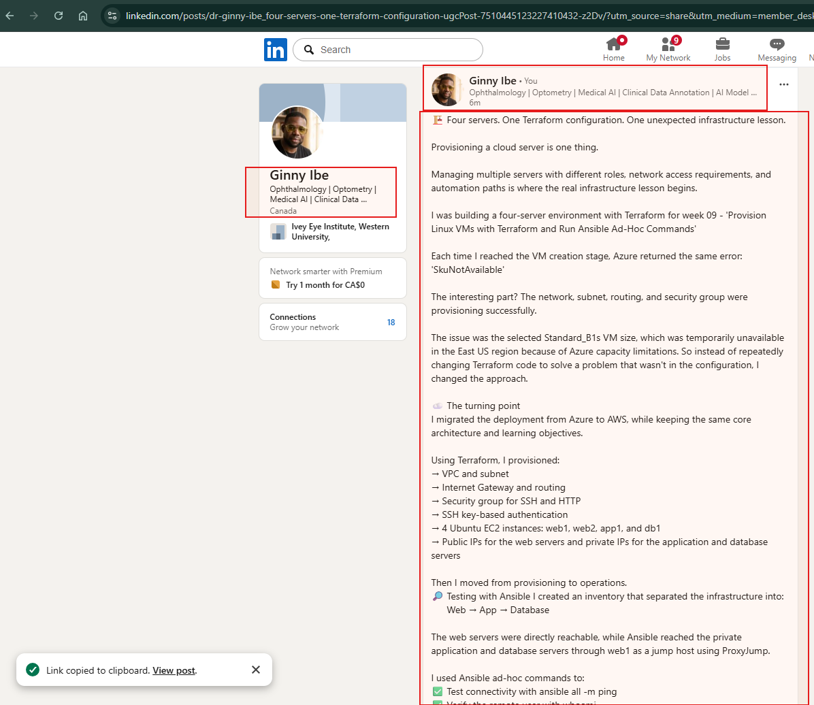

---

# Assignment Questions

Answer the following in your own words:

**1. What is the purpose of an Ansible inventory file?**

- The inventory tells Ansible which servers it can manage and how to reach them. It lists each host with its address and groups them by role, so I can target one server, a group or everything. It also holds connection settings such as the SSH user and key.

---

**2. What is the difference between the `web`, `app`, and `db` groups in your inventory?**

- They separate servers by role. web holds the web servers (web1 and web2), app holds the application server (app1), and db holds the database server (db1). With groups I can run a command on one tier only, such as installing nginx on web, without touching the others. The app and db servers have private IPs, so they are reached through web1 as a jump host.

---

**3. What does the Ansible `ping` module verify?**

- It checks that Ansible can log in to the host over SSH and run a Python module there. A pong reply means the connection, user, key and Python interpreter all work. It is not an ICMP network ping.

---

**4. Why do package installation commands require `--become`?**

- Installing packages changes system files, which only the root user is allowed to do. Ansible connects as the normal ubuntu user, and --become makes it run the task with sudo so the installation has the permissions it needs.

---

**5. When would you use an ad-hoc command instead of a playbook?**

- For quick one-off tasks that I don't need to repeat or keep, such as checking connectivity, looking at uptime, or installing a single package. A playbook is better when the work has several steps, needs to be repeated or shared, or should be saved in version control.

---

**6. What is one challenge you faced while setting up SSH or inventory, and how did you fix it?**

- The app and db servers failed with Host key verification failed. Their host keys weren't in my known_hosts file, and Ansible couldn't ask me to confirm them. I fixed it by connecting to each server once through the jump host and accepting the key, then set StrictHostKeyChecking=accept-new so new hosts are accepted automatically in future.

---

# Required Files

Confirm that the following files are included in your assignment workspace:

- [x] `ansible-adhoc-lab/README.md`
- [x] `ansible-adhoc-lab/terraform/providers.tf`
- [x] `ansible-adhoc-lab/terraform/main.tf`
- [x] `ansible-adhoc-lab/terraform/variables.tf`
- [x] `ansible-adhoc-lab/terraform/outputs.tf`
- [x] `ansible-adhoc-lab/ansible/inventory.ini`
- [x] Updated `.gitignore`

---

# Submission Instructions

- Add all required screenshots from the tasks.
- Full Name must be visible in required screenshots.
- Mention whether you used Azure or AWS.
- Mention whether you used the three-VM option or four-VM option.
- Add the public IP addresses of the VMs, redacted if preferred.
- Add your `inventory.ini` proof.
- Add a short explanation of what you learned.
- Answer all assignment questions clearly in your own words.
- Add your LinkedIn post URL.
- Do not expose SSH private keys, Terraform state files, cloud credentials, passwords, access keys, secret keys, account IDs, or subscription IDs.

---

# Completion Checklist

- [x] Task 1: `ansible-adhoc-lab` project structure created
- [x] Task 1: `.gitignore` updated for Terraform files
- [x] Task 2: Terraform configuration created
- [x] Task 2: Server roles defined for either three or four VMs
- [x] Task 2: `count` or `for_each` used
- [x] Task 2: SSH restricted to the controller public IP
- [x] Task 2: HTTP allowed only for web hosts
- [x] Task 2: Terraform output maps roles to public IPs
- [x] Task 3: Terraform initialized successfully
- [x] Task 3: Terraform configuration validated
- [x] Task 3: Terraform apply completed successfully
- [x] Task 3: All selected VMs are running
- [x] Task 4: SSH key-based access works for every VM
- [x] Task 5: `inventory.ini` contains `web`, `app`, and `db` groups
- [x] Task 5: `ansible-inventory -i inventory.ini --graph` shows the correct groups
- [x] Task 6: `ansible all -i inventory.ini -m ping` returns `SUCCESS`
- [x] Task 6: Ad-hoc commands run successfully
- [x] Task 6: `--become` was used for package and service tasks
- [x] Task 6: Nginx is active on the `web` group
- [x] Screenshots 1–17 are included
- [x] Assignment questions are answered
- [x] LinkedIn post published
- [x] LinkedIn post URL added
- [x] No sensitive information is exposed

---

## About DMI & CloudAdvisory

DevOps Micro Internship (DMI) is a project-based DevOps program run by Pravin Mishra and The CloudAdvisory, focused on real-world execution, systems thinking, and career readiness.

It helps learners build strong DevOps foundations with hands-on experience.

---

## Resources

- DMI Official Website: [https://dmi.pravinmishra.com?utm_source=github&utm_medium=readme](https://dmi.pravinmishra.com?utm_source=github&utm_medium=readme)
- University: [https://university.pravinmishra.com?utm_source=github&utm_medium=readme](https://university.pravinmishra.com?utm_source=github&utm_medium=readme)
- Discord Community: [https://discord.pravinmishra.com?utm_source=github&utm_medium=readme](https://discord.pravinmishra.com?utm_source=github&utm_medium=readme)
- Blog: [https://dmi.pravinmishra.com/blog?utm_source=github&utm_medium=readme](https://dmi.pravinmishra.com/blog?utm_source=github&utm_medium=readme)
- YouTube Playlist: [https://www.youtube.com/playlist?list=PLFeSNDtI4Cho](https://www.youtube.com/playlist?list=PLFeSNDtI4Cho)
- Pravin Mishra LinkedIn: [https://www.linkedin.com/in/pravin-mishra-aws-trainer/](https://www.linkedin.com/in/pravin-mishra-aws-trainer/)
- CloudAdvisory LinkedIn: [https://www.linkedin.com/company/thecloudadvisory/](https://www.linkedin.com/company/thecloudadvisory/)

---

*This submission is part of DevOps Micro Internship (DMI) — Agentic AI Track.*