# Assignment 03 — Deploy a Static Website to Multiple Servers Using a Multi-Play Ansible Playbook

Part of the DevOps Micro Internship (DMI) with Agentic AI

---

## Student Details

**Full Name:** Ginny Ibe  
**Cloud Platform Used:** AWS
**Server 1 URL:** `http://44.201.237.36`  
**Server 2 URL:** `http://54.237.192.103`

---

## Purpose

In this assignment, you will create a multi-play Ansible playbook to install Nginx, deploy a static website to two Ubuntu servers, and verify that the website is accessible from both servers.

You may use either AWS EC2 instances or Azure Virtual Machines as your managed servers.

---

# Task 1 — Create the Project Structure

## Goal

Create the required folders and files for the Ansible project.

## Evidence

### Screenshot 1 — Terminal or VS Code showing the complete `static-web` project structure

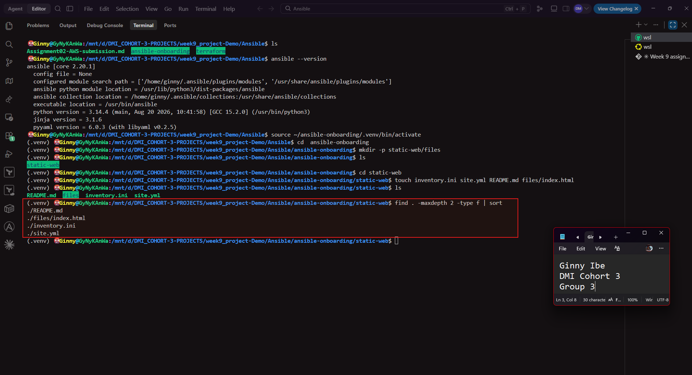

---

# Task 2 — Configure the Ansible Inventory

## Goal

Add both Ubuntu servers to the Ansible inventory.

## Evidence

### Screenshot 2 — Output of `ansible-inventory -i inventory.ini --graph` showing `web1` and `web2`

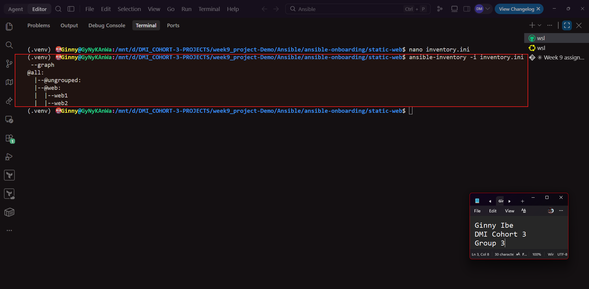

---

## Configuration File

Copy and paste the complete contents of your `inventory.ini` file below:

```ini
[web]
web1 ansible_host="44.201.237.36"
web2 ansible_host="54.237.192.103"
 
[web:vars]
ansible_user=ubuntu
ansible_ssh_private_key_file=~/.ssh/terraform-aws-vm-key
ansible_python_interpreter=/usr/bin/python3.10

```

---

# Task 3 — Verify Ansible Connectivity

## Goal

Confirm that the Ansible controller can connect to both servers.

## Evidence

### Screenshot 3 — Ansible ping output showing `SUCCESS` and `pong` for both servers

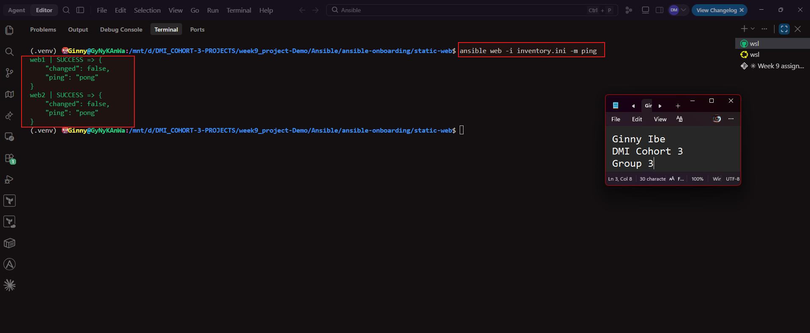

---

# Task 4 — Download and Personalize the Static Website

## Goal

Download `index.html` to the Ansible controller and personalize the website with your full name.

## Evidence

### Screenshot 4 — Edited `files/index.html` showing the footer line with your full name

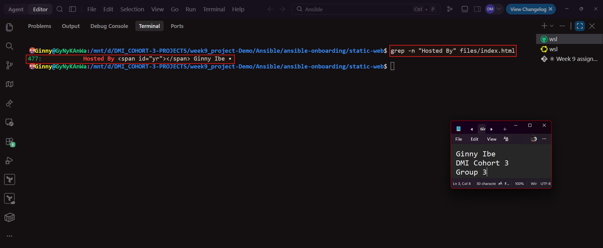

---

# Task 5 — Create the Multi-Play Ansible Playbook

## Goal

Create a single Ansible playbook containing separate plays for installation, deployment, and verification.

## Configuration File

Copy and paste the complete contents of your `site.yml` file below:

```yaml
---
- name: Install and configure Nginx
  hosts: web
  become: true

  tasks:
    - name: Update the APT package cache
      ansible.builtin.apt:
        update_cache: true

    - name: Install Nginx
      ansible.builtin.apt:
        name: nginx
        state: present

    - name: Start and enable Nginx
      ansible.builtin.service:
        name: nginx
        state: started
        enabled: true

- name: Deploy the static website
  hosts: web
  become: true
  tasks:
    - name: Copy index.html to the web root
      ansible.builtin.copy:
        src: files/index.html
        dest: /var/www/html/index.html
        owner: www-data
        group: www-data
        mode: "0644"
      notify: Reload nginx

  handlers:
    - name: Reload nginx
      ansible.builtin.service:
        name: nginx
        state: reloaded

- name: Verify both websites from the controller
  hosts: localhost
  connection: local
  gather_facts: false
  become: false
  tasks:
    - name: Send an HTTP GET request to each web server
      ansible.builtin.uri:
        url: "http://{{ hostvars[item].ansible_host }}"
        status_code: 200
      loop: "{{ groups['web'] }}"
      register: website_checks

    - name: Confirm each server returned HTTP 200
      ansible.builtin.assert:
        that:
          - item.status == 200
        success_msg: "{{ item.item }} returned HTTP {{ item.status }}"
      loop: "{{ website_checks.results }}"
```

---

# Task 6 — Validate the Playbook Syntax

## Goal

Check the playbook for YAML or Ansible syntax errors before running it.

## Evidence

### Screenshot 5 — Successful syntax-check output showing `playbook: site.yml`

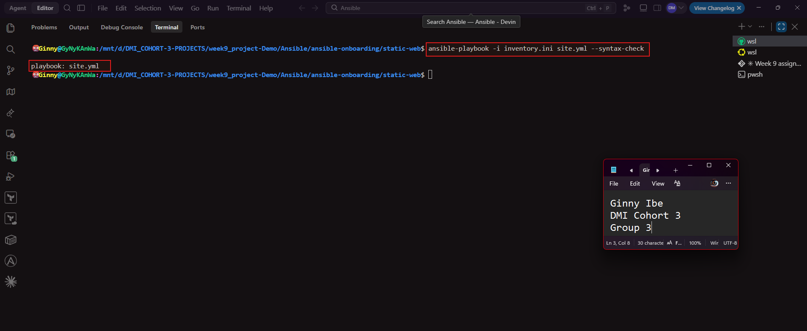

---

# Task 7 — Run the Multi-Play Playbook

## Goal

Install Nginx, deploy the website, and verify both servers in one playbook run.

## Evidence

### Screenshot 6 — Play 3 verification showing HTTP `200` for both servers

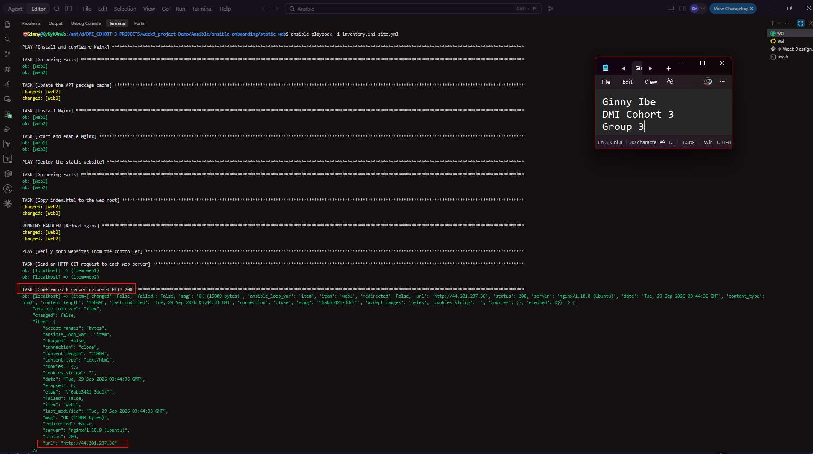
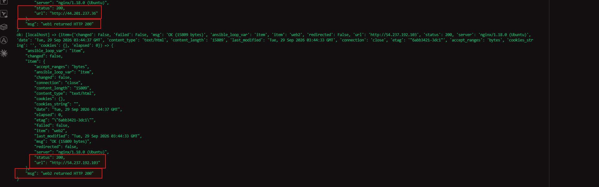

---

### Screenshot 7 — Final play recap showing `unreachable=0` and `failed=0` for `web1`, `web2`, and `localhost`

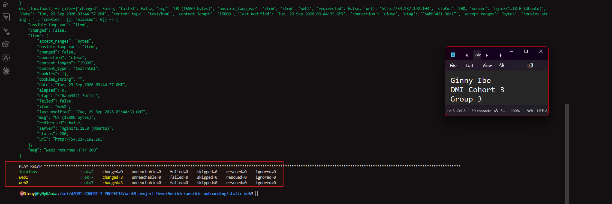

---

# Task 8 — Verify Idempotency

## Goal

Run the playbook again and confirm that it does not make unnecessary changes.

## Evidence

### Screenshot 8 — Second playbook run showing the play recap with `changed=0`, `unreachable=0`, and `failed=0` for both web servers

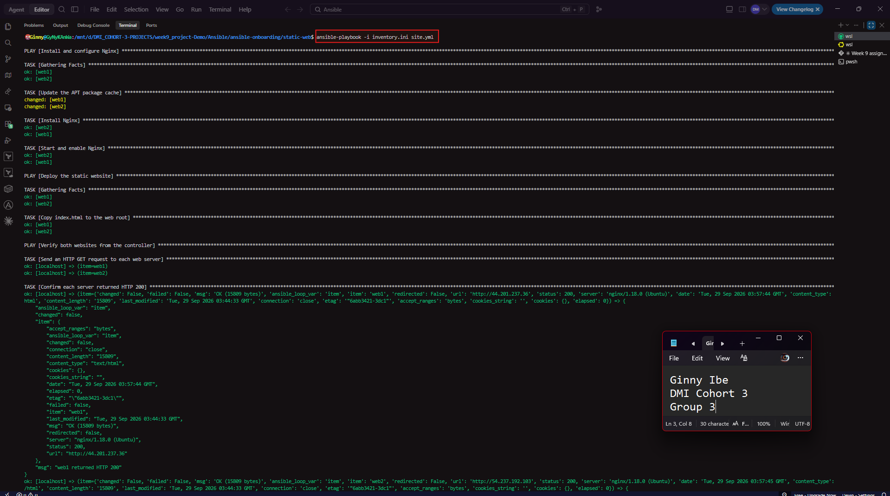
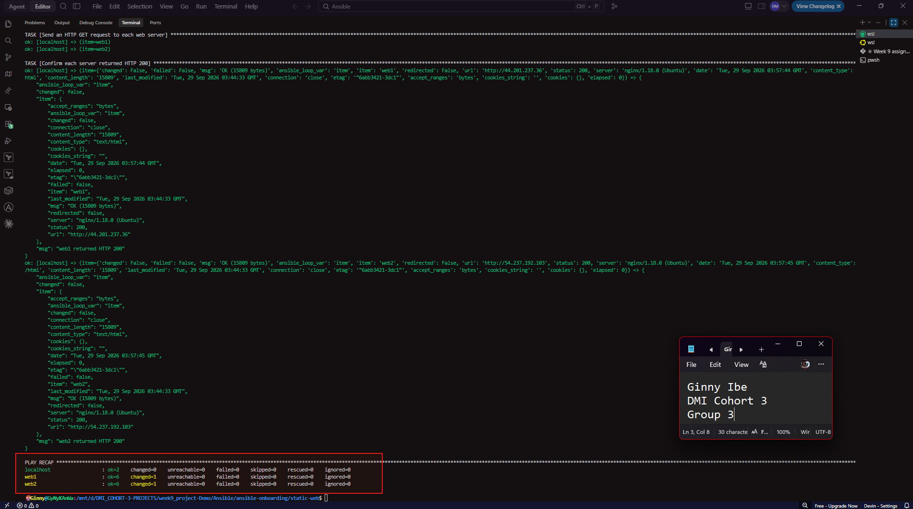

---

# Task 9 — Test Both Websites Manually

## Goal

Confirm that the static website is accessible from both public IP addresses.

## Evidence

### Screenshot 9 — `curl -I` output showing HTTP `200 OK` from both servers

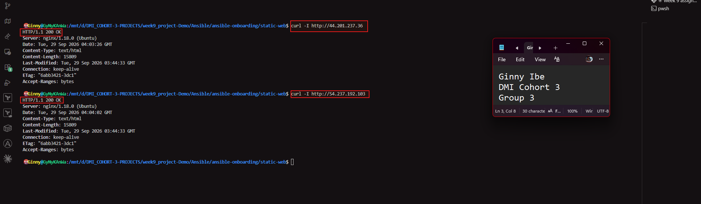

---

### Screenshot 10 — Browser showing the website from Server 1 with the public IP and your full name visible

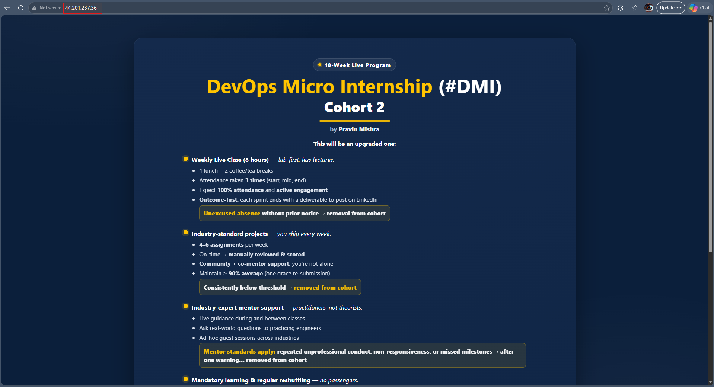
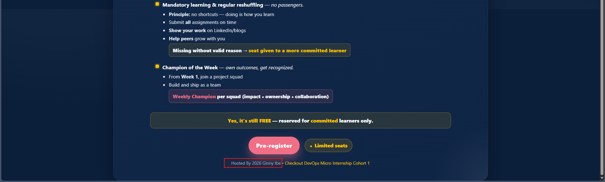

---

### Screenshot 11 — Browser showing the website from Server 2 with the public IP and your full name visible


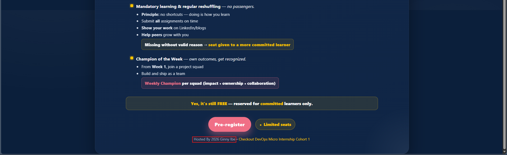

---

## Website URLs

Add both deployed website URLs below:

```text
Server 1: http://44.201.237.36
Server 2: http://54.237.192.103
```

---

# Task 10 — Complete the Project README

## Goal

Document how the project works and record what you learned.

## README Content

Copy and paste the complete contents of your `README.md` file below:

```markdown
# Multi-Play Ansible Static Website Deployment
## Project Overview

A single Ansible playbook (`site.yml`) deploys a static website to two Ubuntu web servers. The playbook is split into three plays:
1. **Install and configure Nginx** — updates the APT cache, installs Nginx, and starts and enables the service on every host in the `web` group.
2. **Deploy the static website** — copies `files/index.html` from the controller to `/var/www/html/index.html` on each web server, with `www-data` ownership and `0644` permissions. A handler reloads Nginx only when the file actually changes.
3. **Verify both websites from the controller** — runs on `localhost`, sends an HTTP GET request to each web server's public IP, and asserts that each one returns HTTP 200.

## Environment
- Cloud platform: Amazon Web Services (AWS), provisioned with Terraform
- Operating system: Ubuntu 22.04 LTS
- Number of managed servers: 2 (`web1` and `web2`)
- Web server: Nginx

## Project Structure
static-web/
├── files/
│   └── index.html    # Static website page
├── inventory.ini     # web group with web1 and web2
├── site.yml          # Multi-play playbook
└── README.md

## How to Run the Playbook
cd ~/ansible-onboarding/static-web
ansible-playbook -i inventory.ini site.yml --syntax-check
ansible-playbook -i inventory.ini site.yml

After the run, open `http://44.201.237.36` and `http://54.237.192.103` in a browser to view the site.

## Issue Faced and Solution
The first syntax check failed with:

[ERROR]: YAML parsing failed: Colons in unquoted values must be followed by a non-space character.
Origin: .../static-web/site.yml:6:6

The `tasks:` key in the first play was indented at the wrong level, so YAML did not treat it as part of the play. Re-indenting `tasks:` to line up with `hosts:` and `become:` fixed it, and `ansible-playbook --syntax-check` then returned `playbook: site.yml` with no errors. This showed that indentation in YAML is structural, not cosmetic, and that running `--syntax-check` before every real run catches these mistakes before they reach live servers.

## What I Learned
- A single playbook can contain several plays, and each play can target different hosts — two plays here target the `web` group, and the last runs on the controller itself (`hosts: localhost`, `connection: local`).
- Handlers only run when a task reports `changed`. Nginx is reloaded when `index.html` changes, not on every run.
- Ansible modules are idempotent: re-running the playbook against servers already in the desired state produces no unnecessary changes.
- The `uri` and `assert` modules let the playbook verify its own result, so each server doesn't need to be checked by hand with `curl`.
- `hostvars` and `groups` let one play use another group's inventory data, e.g. looping over `groups['web']` to build each server's URL.

## Why Installation and Deployment Are Separate
Installing Nginx sets up the server; deploying `index.html` publishes content. The two change at different rates — Nginx is installed once, but website content changes whenever the page is updated.

Keeping them in separate plays makes the playbook easier to read and troubleshoot, since the output clearly shows whether a failure happened during server setup or during content deployment. It also makes each part reusable on its own — for example, the deployment play could later run independently with a tag, updating the website without re-running the installation steps.

## Benefit of the Ansible Copy Module
The `copy` module pushes the file directly from the controller, so managed servers never need Git installed, repository access, or credentials — only the finished `index.html` is sent, and Ansible sets owner, group, and permissions in the same step.

It is also idempotent: Ansible compares the file on the server against the one on the controller and only transfers it when it has changed, which is what lets the `Reload nginx` handler fire only when the content is actually updated.

```

---

# LinkedIn Post Required

## Evidence

### LinkedIn Post URL

Paste your LinkedIn post URL here:

https://www.linkedin.com/posts/dr-ginny-ibe_dmibypravinmishra-devops-agenticai-ugcPost-7510577801876365313-qaXh/?utm_source=share&utm_medium=member_desktop&rcm=ACoAAGTqulMBvpSBQMnxbzFBrJkA0C9nlWM_uqM

---

### Screenshot — Published LinkedIn post

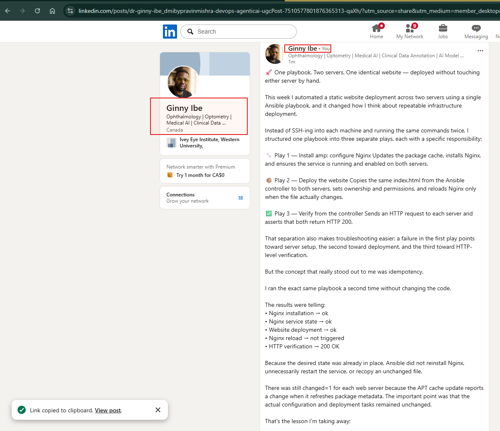

---

# Assignment Questions

Answer the following in your own words:

**1. What issue did you face while completing this assignment, and how did you fix it?**

- My first syntax check failed with YAML parsing failed: Colons in unquoted values must be followed by a non-space character at line 6 of site.yml. The tasks: key in the first play started at column 0 instead of being indented under the play, so YAML didn't treat it as part of the play. I indented tasks: two spaces so it lined up with hosts: and become:. After that, ansible-playbook --syntax-check passed. I learned to run the syntax check before every real run.

---

**2. What did you learn from this assignment?**

- That one playbook can hold multiple plays, each with its own hosts, and Ansible runs them in order, gathering facts separately per play. I also saw idempotency in practice — re-running the same playbook only reports changed where something genuinely changed (like the APT cache), while everything already in the desired state reports ok. Handlers only fire off a changed result, never automatically, which is why the Reload nginx handler stayed silent on the second run. And I learned that a playbook can verify its own work — using uri and assert in a play against localhost — instead of relying on manually curling each server afterward.


---

**3. Why is it useful to split installation, deployment, and verification into separate plays?**

- Each play has one job, and each changes on a different schedule: Nginx gets installed once, the website content changes often, and verification should run every single time regardless of whether anything changed. Splitting them makes failures easy to diagnose — if a run fails, the play recap tells you immediately whether it was a server setup problem, a content deployment problem, or a live-check failure, instead of having to dig through one long undifferentiated task list. It also makes each piece reusable on its own — the deploy play could run independently to push a content update without touching the Nginx install steps at all.

---

**4. What is one benefit of using the Ansible `copy` module instead of cloning the website directly from Git on every managed server?**

- `copy`pushes the finished file straight from the controller, so the managed servers never need Git installed, repo access, or credentials — they just receive the file. It also keeps the servers from doing any work: they don't clone, check out a branch, or resolve anything themselves, they simply get exactly the file the controller has, with ownership and permissions set in the same task.

---

**5. What does idempotency mean in this assignment?**

- It means running the playbook multiple times against the same servers produces the same end state without redoing work that's already done or unnecessarily redisturbing anything. In this run, that showed up as ok instead of changed on the second execution for installing Nginx, starting the service, and copying the file — since all three were already correct — while the Reload nginx handler correctly never fired because nothing had actually changed.

---

**6. What does the Ansible `uri` module verify in Play 3?**

- The `uri` module sends an HTTP GET request from the controller to each web server's public IP, taken from ansible_host in the inventory. It checks that each server returns HTTP 200. That proves Nginx is running, the site is being served, and port 80 is reachable from outside the server. The assert task then confirms the 200 status for each host and prints a success message for it.

- It sends a real HTTP GET request from the controller to each web server's public IP and checks that the response comes back with status code 200. Looped over groups['web'], it independently confirms — outside of just trusting the earlier plays succeeded — that both servers are actually running Nginx, actually reachable over HTTP, and actually serving the deployed page.

---

# Required Files

Confirm that the following files are included in your assignment folder:

- [x] `inventory.ini`
- [x] `site.yml`
- [x] `files/index.html`
- [x] `README.md`

---

# Submission Instructions

- Add all required screenshots in the correct order.
- Full Name must be visible in required screenshots.
- Include both deployed website URLs.
- Paste `inventory.ini`, `site.yml`, and `README.md` as editable text.
- Answer all assignment questions clearly in your own words.
- Add your LinkedIn post URL.
- Do not expose SSH private keys, passwords, cloud account IDs, or other sensitive information.

---

# Completion Checklist

- [x] Task 1: `static-web` folder structure is complete
- [x] Task 2: Both servers are listed under the `[web]` group in `inventory.ini`
- [x] Task 2: Inventory graph shows `web1` and `web2`
- [x] Task 3: Ansible ping returns `SUCCESS` and `pong` for both servers
- [x] Task 4: `files/index.html` contains your full name
- [x] Task 5: `site.yml` contains three separate plays
- [x] Task 5: Play 1 installs, starts, and enables Nginx
- [x] Task 5: Play 2 deploys `index.html` using the `copy` module
- [x] Task 5: Nginx reload handler is included
- [x] Task 5: Play 3 verifies both web servers from the controller
- [x] Task 6: Playbook syntax check passes
- [x] Task 7: First playbook run completes with `unreachable=0` and `failed=0`
- [x] Task 7: URI verification returns HTTP `200` for both servers
- [x] Task 8: Second playbook run demonstrates idempotency
- [x] Task 8: Second run shows `changed=0` for both web servers
- [x] Task 9: Both `curl -I` commands return HTTP `200 OK`
- [x] Task 9: Website loads from Server 1
- [x] Task 9: Website loads from Server 2
- [x] Task 9: Full name is visible on both deployed websites
- [x] Task 10: `README.md` contains all required explanations
- [x] Screenshots 1–11 are included
- [x] `inventory.ini`, `site.yml`, and `README.md` are pasted as editable text
- [x] Both website URLs are included
- [x] Assignment questions are answered
- [x] LinkedIn post published
- [x] LinkedIn post URL added
- [x] No sensitive information is exposed

---

## About DMI & CloudAdvisory

DevOps Micro Internship (DMI) is a project-based DevOps program run by Pravin Mishra and The CloudAdvisory, focused on real-world execution, systems thinking, and career readiness.

It helps learners build strong DevOps foundations with hands-on experience.

---

## Resources

- DMI Official Website: [https://dmi.pravinmishra.com?utm_source=github&utm_medium=readme](https://dmi.pravinmishra.com?utm_source=github&utm_medium=readme)
- University: [https://university.pravinmishra.com?utm_source=github&utm_medium=readme](https://university.pravinmishra.com?utm_source=github&utm_medium=readme)
- Discord Community: [https://discord.pravinmishra.com?utm_source=github&utm_medium=readme](https://discord.pravinmishra.com?utm_source=github&utm_medium=readme)
- Blog: [https://dmi.pravinmishra.com/blog?utm_source=github&utm_medium=readme](https://dmi.pravinmishra.com/blog?utm_source=github&utm_medium=readme)
- YouTube Playlist: [https://www.youtube.com/playlist?list=PLFeSNDtI4Cho](https://www.youtube.com/playlist?list=PLFeSNDtI4Cho)
- Pravin Mishra LinkedIn: [https://www.linkedin.com/in/pravin-mishra-aws-trainer/](https://www.linkedin.com/in/pravin-mishra-aws-trainer/)
- CloudAdvisory LinkedIn: [https://www.linkedin.com/company/thecloudadvisory/](https://www.linkedin.com/company/thecloudadvisory/)

---

*This submission is part of DevOps Micro Internship (DMI) — Agentic AI Track.*