# Assignment 04 — Deploy Mini Finance on Azure Using Terraform and Ansible

Part of the DevOps Micro Internship (DMI) with Agentic AI

---

## Purpose

In this assignment, you will provision Azure infrastructure using Terraform and deploy the Mini Finance website using an Ansible multi-play playbook.

Terraform will create the Azure Virtual Machine and networking resources. Ansible will install Nginx, clone the Mini Finance repository, deploy the website, and verify the deployment.

---

# Task 1 — Create the Project Structure

## Goal

Create separate directories and files for the Terraform infrastructure and Ansible configuration.

### Evidence

#### Screenshot 1 — Terminal or VS Code showing the complete `mini-finance` project structure

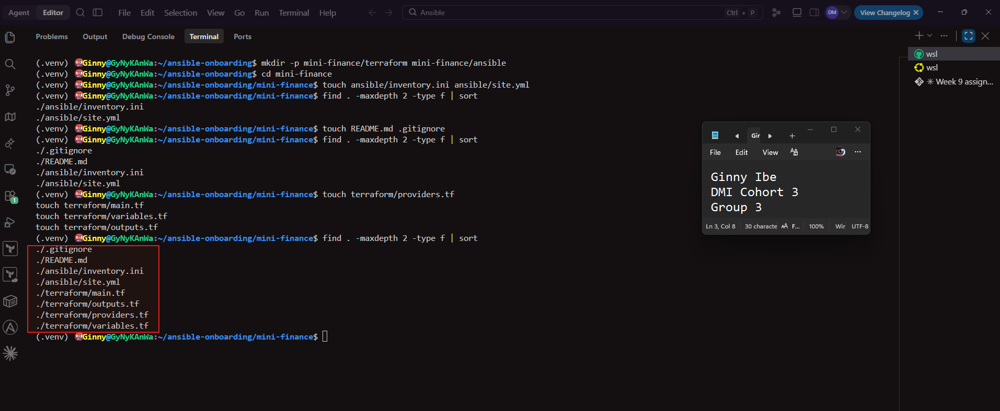


---

### Notes

- The mini-finance-aws/ project keeps infrastructure and configuration in separate folders. terraform/ holds the AWS provisioning code: providers.tf, main.tf, variables.tf, outputs.tf, terraform.tfvars and cloud-init.sh, which makes sure python3 is on the instance for Ansible. ansible/ holds inventory.ini and site.yml, which configure the instance and deploy the website after Terraform creates it. At the project root, README.md documents the project. .gitignore keeps state files, the .terraform/ folder, plan files and private keys out of version control. With Terraform and Ansible in separate folders, each tool owns one part of the workflow: Terraform builds the server and Ansible configures it.

---

# Task 2 — Create the Azure Infrastructure Using Terraform

## Goal

Use Terraform to provision an Ubuntu Virtual Machine with the required Azure networking and security resources.

### Evidence

#### Screenshot 2 — Terraform code showing the `Allow-SSH` rule for port `22` and the `Allow-HTTP` rule for port `80`

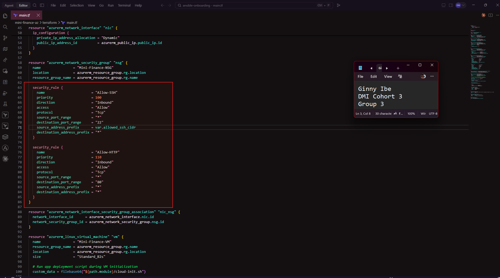

---

#### Screenshot 3 — Terraform code showing the association between `nsg-mini-finance` and `nic-mini-finance`

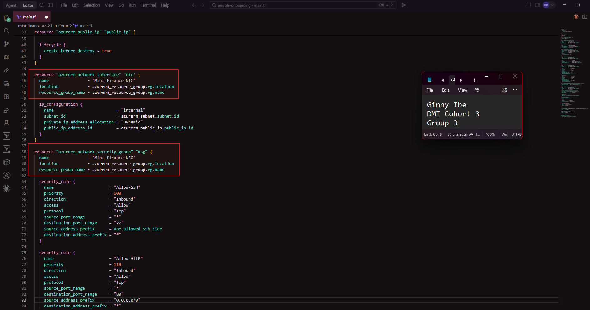

---

### Notes

- Screenshot shows the Allow-SSH (port 22) and Allow-HTTP (port 80) security rules
The network security group Mini-Finance-NSG has two inbound rules. Allow-SSH (priority 100) opens TCP port 22 only to var.allowed_ssh_cidr, which is my own public IP as a /32. That lets the Ansible controller connect over SSH while blocking everyone else. Allow-HTTP (priority 110) opens TCP port 80 to 0.0.0.0/0 so anyone can reach the Mini Finance website in a browser. A lower priority number is checked first. Azure denies any traffic these rules don't match through its default deny rule.

- Screenshot shows the association between the NSG and the NIC
The azurerm_network_interface_security_group_association resource attaches Mini-Finance-NSG to the VM's network interface, Mini-Finance-NIC. The rules have no effect until the NSG is attached to something, so this is the step that applies the SSH and HTTP rules to the VM's traffic. Both IDs are references (azurerm_network_interface.nic.id and azurerm_network_security_group.nsg.id), so Terraform creates the NIC and NSG before it creates the association.


---

# Task 3 — Initialize and Apply the Terraform Configuration

## Goal

Format and validate the Terraform configuration, review the execution plan, and provision the Azure infrastructure.

### Evidence

#### Screenshot 4 — End of the `terraform apply` output showing `Apply complete!` with no errors

**AWS**
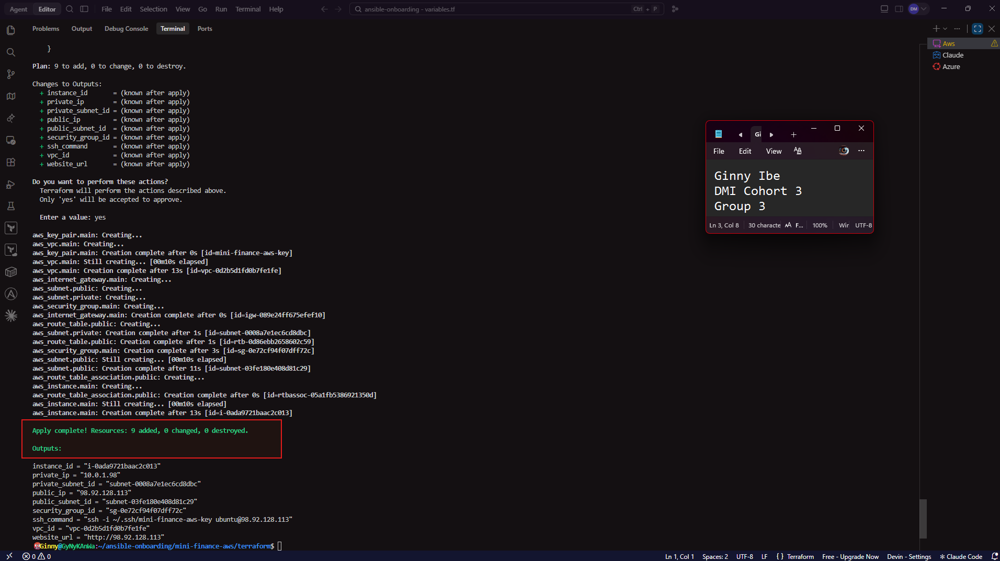

**Azure**
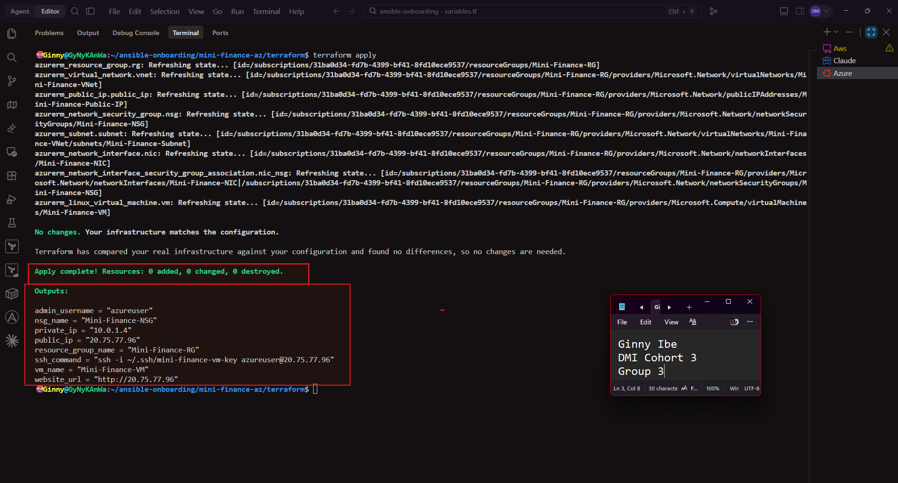

---

#### Screenshot 5 — Output of `terraform output public_ip` showing the VM’s public IP address

**AWS**
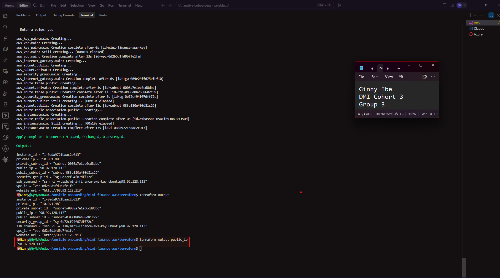

**Azure**
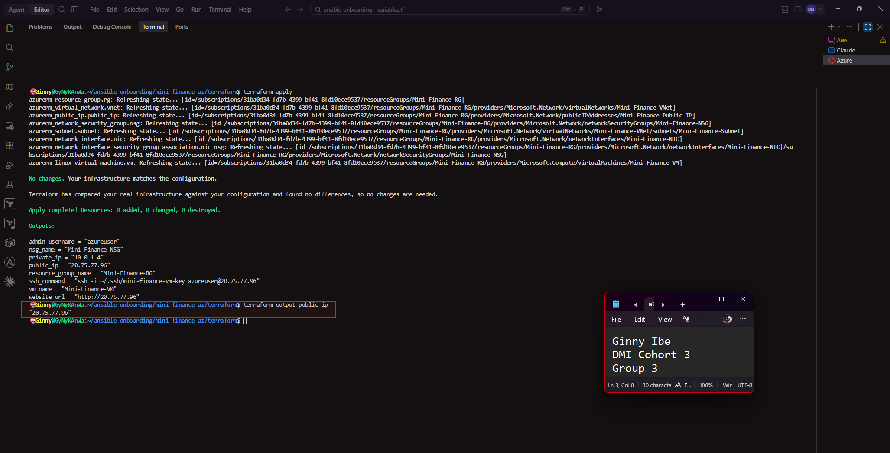

---

### Notes

- The end of terraform apply with "Apply complete!
  "terraform apply finished with Apply complete! Resources: 9 added, 0 changed, 0 destroyed. Terraform created the full AWS environment for Mini Finance: a VPC, public and private subnets, an internet gateway, a public route table and its subnet association, a security group allowing SSH (22) and HTTP (80), an SSH key pair, and an Ubuntu EC2 instance. The "0 changed, 0 destroyed" part confirms this was a clean, fresh deployment with no unexpected changes or deletions. The outputs defined in outputs.tf were printed at the end, ready for the next tasks.

-  terraform output public_ip returning the VM's public IP
terraform output public_ip returned 98.92.128.113, the public IP AWS gave the mini-finance-vm instance. This command reads the value from Terraform's state, so I don't have to look it up in the AWS console. This IP is used for the SSH test, the Ansible inventory and the browser check later in the assignment.

---

# Task 4 — Verify Passwordless SSH Access

## Goal

Confirm that the Ansible controller can connect to the Terraform-provisioned Azure VM using SSH key authentication.

### Evidence

#### Screenshot 6 — Passwordless SSH command and the returned `mini-finance` hostname

**AWS**
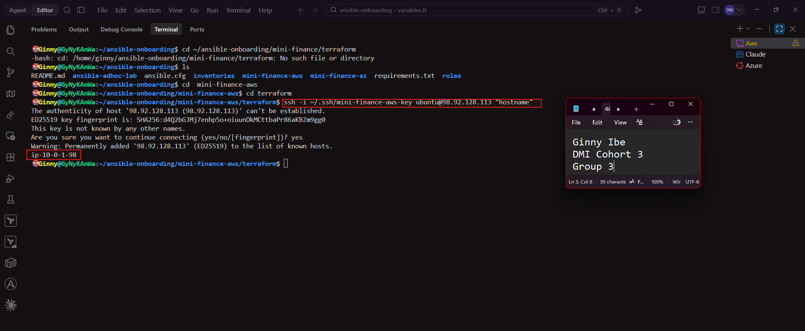

**Azure**
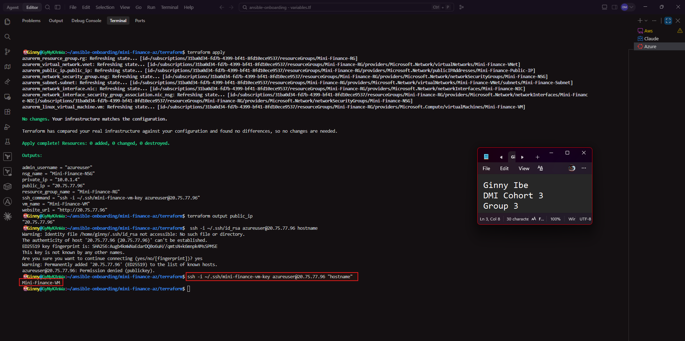

---

### Notes

- passwordless SSH returning the VM's hostname
ssh -i ~/.ssh/mini-finance-aws-key ubuntu@98.92.128.113 "hostname" returned ip-10-0-1-98 without asking for a password. The -i flag tells SSH to use the private key that matches the public key Terraform uploaded to AWS as mini-finance-aws-key. ubuntu is the default user on Ubuntu EC2 images. AWS names each instance after its private IP (10.0.1.98), so the hostname also confirms I reached the right VM. The successful login proves the key pair, the security group rule allowing SSH from my IP, and the instance itself are all working, so Ansible can now connect over SSH.

---

# Task 5 — Create the Ansible Inventory and Verify Connectivity

## Goal

Add the Terraform-provisioned Azure VM to the Ansible inventory and confirm that Ansible can connect to it.

### Evidence

#### Screenshot 7 — Ansible ping output showing `SUCCESS` and `pong` from the Azure VM

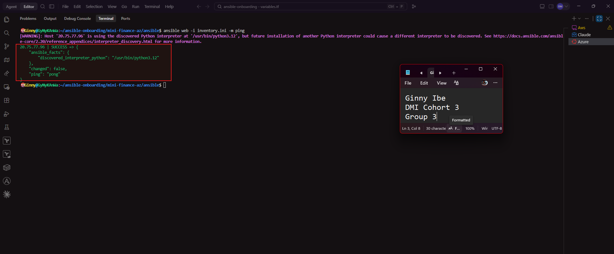

---

### Configuration File

Copy and paste the complete contents of your `ansible/inventory.ini` file below:

```ini
[web]
98.92.128.113
 
[web:vars]
ansible_user=ubuntu
ansible_ssh_private_key_file=~/.ssh/mini-finance-aws-key

[web]
20.75.77.96
 
[web:vars]
ansible_user=azureuser
ansible_ssh_private_key_file=~/.ssh/mini-finance-vm-key


```

---

# Task 6 — Create the Multi-Play Ansible Playbook

## Goal

Create one Ansible playbook containing separate plays to install Nginx, deploy the Mini Finance website, and verify the deployment.

### Evidence

#### Screenshot 8 — `site.yml` showing Play 1 and the beginning of Play 2

Screenshot must show:

- Play 1 targeting the `web` group
- Installation of `nginx`, `git`, and `rsync`
- Nginx service configured as started and enabled
- Beginning of Play 2 with the Git repository URL and synchronization task

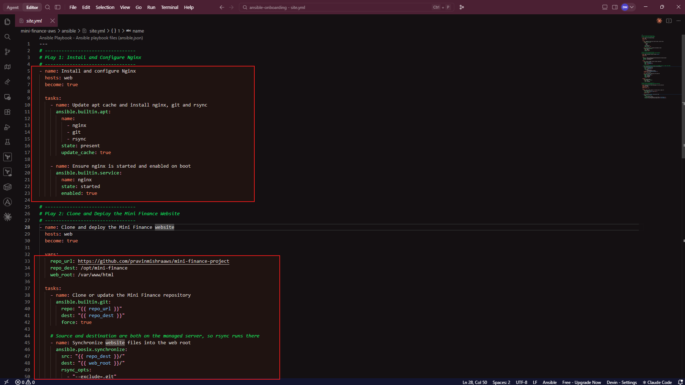

---

#### Screenshot 9 — `site.yml` showing the deployment destination, handler, and Play 3 verification

Screenshot must show:

- Website destination `/var/www/html/`
- Ownership set to `www-data:www-data`
- Nginx reload handler
- Play 3 targeting `localhost`
- The `uri` verification and `assert` condition

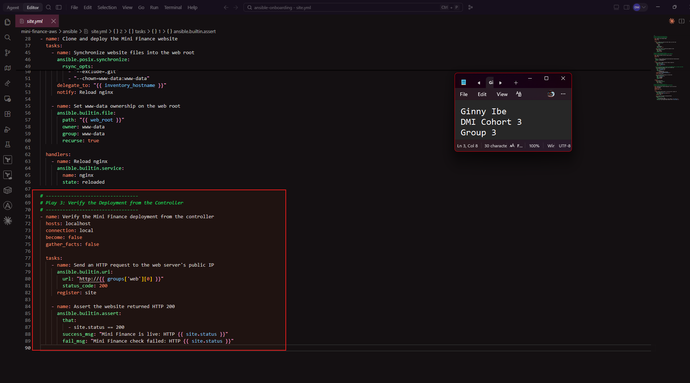

---

### Configuration File

Copy and paste the complete contents of your `ansible/site.yml` file below:

```yaml
---
# ---------------------------------
# Play 1: Install and Configure Nginx
# ---------------------------------
- name: Install and configure Nginx
  hosts: web
  become: true

  tasks:
    - name: Update apt cache and install nginx, git and rsync
      ansible.builtin.apt:
        name:
          - nginx
          - git
          - rsync
        state: present
        update_cache: true

    - name: Ensure nginx is started and enabled on boot
      ansible.builtin.service:
        name: nginx
        state: started
        enabled: true

# ---------------------------------
# Play 2: Clone and Deploy the Mini Finance Website
# ---------------------------------
- name: Clone and deploy the Mini Finance website
  hosts: web
  become: true

  vars:
    repo_url: https://github.com/pravinmishraaws/mini-finance-project
    repo_dest: /opt/mini-finance
    web_root: /var/www/html

  tasks:
    - name: Clone or update the Mini Finance repository
      ansible.builtin.git:
        repo: "{{ repo_url }}"
        dest: "{{ repo_dest }}"
        force: true

    # Source and destination are both on the managed server, so rsync runs there
    - name: Synchronize website files into the web root
      ansible.posix.synchronize:
        src: "{{ repo_dest }}/"
        dest: "{{ web_root }}/"
        rsync_opts:
          - "--exclude=.git"
          - "--chown=www-data:www-data"
      delegate_to: "{{ inventory_hostname }}"
      notify: Reload nginx

    - name: Set www-data ownership on the web root
      ansible.builtin.file:
        path: "{{ web_root }}"
        owner: www-data
        group: www-data
        recurse: true

  handlers:
    - name: Reload nginx
      ansible.builtin.service:
        name: nginx
        state: reloaded

# ---------------------------------
# Play 3: Verify the Deployment from the Controller
# ---------------------------------
- name: Verify the Mini Finance deployment from the controller
  hosts: localhost
  connection: local
  become: false
  gather_facts: false

  tasks:
    - name: Send an HTTP request to the web server's public IP
      ansible.builtin.uri:
        url: "http://{{ groups['web'][0] }}"
        status_code: 200
      register: site

    - name: Assert the website returned HTTP 200
      ansible.builtin.assert:
        that:
          - site.status == 200
        success_msg: "Mini Finance is live: HTTP {{ site.status }}"
        fail_msg: "Mini Finance check failed: HTTP {{ site.status }}"
```

---

# Task 7 — Validate and Run the Ansible Playbook

## Goal

Validate the syntax of the multi-play Ansible playbook and run it to install Nginx, deploy the Mini Finance website, and verify the deployment.

### Evidence

#### Screenshot 10 — Successful playbook syntax check showing `playbook: site.yml`

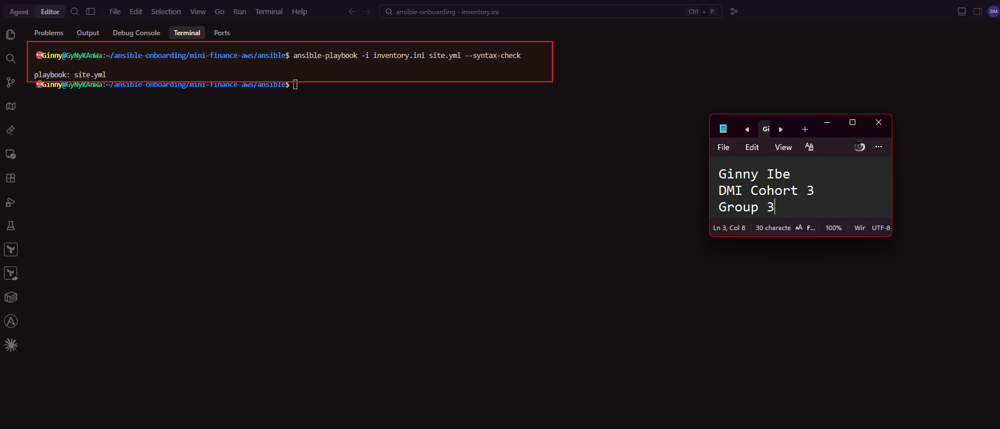

---

#### Screenshot 11 — Play 3 output showing the successful HTTP verification and assertion

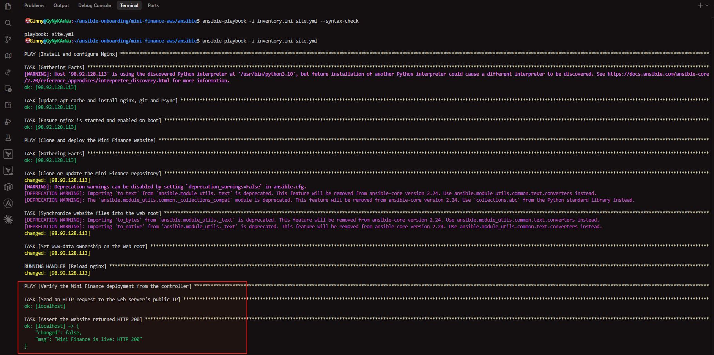

---

#### Screenshot 12 — Final `PLAY RECAP` showing `failed=0` and `unreachable=0`

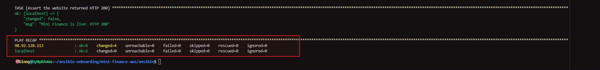

---

### Notes

- Successful syntax check
Running ansible-playbook -i inventory.ini site.yml --syntax-check printed playbook: site.yml with no errors. This means the YAML, all three plays, every task and the handler are written correctly. The check doesn't connect to the server or change anything, so it's a safe test before the real run.

-  Play 3 verifying the website
Play 3 runs on the controller (localhost) and sends an HTTP request to the web server's public IP using ansible.builtin.uri. The site returned HTTP 200, and ansible.builtin.assert confirmed site.status == 200. This proves the Mini Finance website is live and reachable from outside the server.

- The final PLAY RECAP
The PLAY RECAP shows failed=0 and unreachable=0 for both the web server and localhost. Every task in all three plays completed, and Ansible stayed connected to the server for the whole run. Nginx is installed and running, the Mini Finance site is deployed, and the deployment has been verified.


---

# Task 8 — Test the Mini Finance Website in a Browser

## Goal

Confirm that the Mini Finance website is publicly accessible through the Azure VM’s public IP address.

### Evidence

#### Screenshot 13 — Mini Finance website successfully loading in the browser, with the Azure VM’s public IP address visible in the address bar

**AWS**
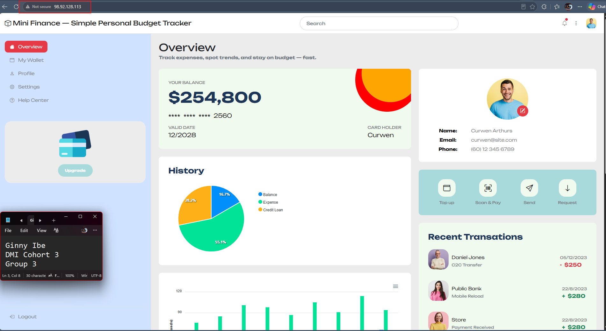

**Azure**
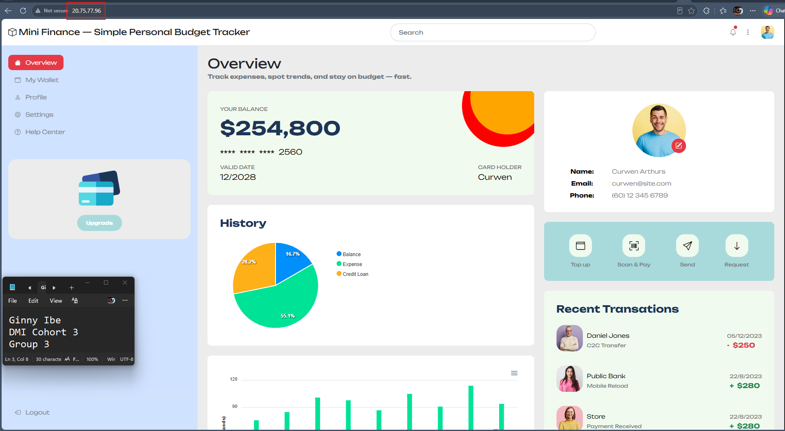

---

### Website URL

Add your deployed website URL below:

```text
Azure
http://20.75.77.96/

AWS
http://98.92.128.113/
```

---

# Task 9 — Create the Project README

## Goal

Create a `README.md` file to document the Mini Finance infrastructure and deployment project.

### Evidence

#### Screenshot 14 — Completed `README.md` displayed in the VS Code Markdown preview or terminal

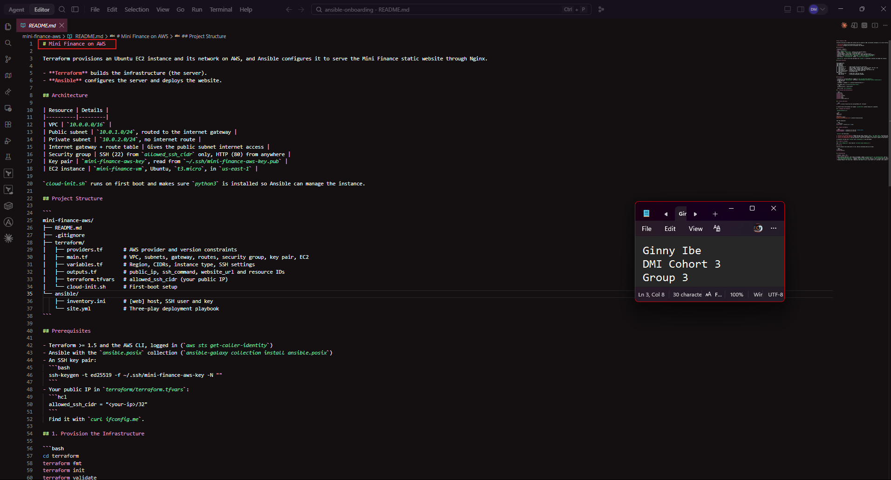
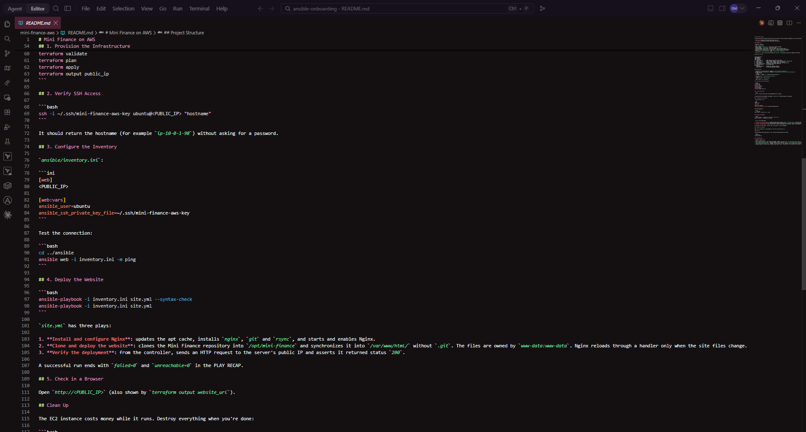
---

### README Content

Copy and paste the complete contents of your `README.md` file below:

```markdown
# Mini Finance: Automated Azure Deployment with Terraform and Ansible

## Project Objective
In this project I deployed the Mini Finance static website to a Linux virtual machine on Microsoft Azure without configuring anything by hand.

Terraform built the cloud infrastructure, and Ansible turned the empty Ubuntu VM into a working web server and deployed the site. The assignment demonstrates the hand-off between the two tools: Terraform provisions the server and outputs its public IP, and Ansible uses that IP to configure the server and deploy the application. It ends with an automated check that proves the website is live.

## Tools and Technologies

| Tool | How I used it |
|------|---------------|
| **Terraform** | Defined and provisioned all Azure resources as code (`main.tf`, `variables.tf`, `outputs.tf`) |
| **Microsoft Azure** | Cloud platform hosting the network and the virtual machine (East US 2) |
| **Ansible** | Configured the VM and deployed the website with a three-play playbook (`site.yml`) |
| **Nginx** | Web server that serves the Mini Finance site on port 80 |
| **Git** | Cloned the Mini Finance website repository onto the VM |
| **rsync** | Synchronized the website files into Nginx's web root, excluding `.git` |

## Infrastructure Created
Terraform created the following resources:

| Resource | Name | Purpose |
|----------|------|---------|
| Resource Group | `Mini-Finance-RG` | Container that holds every resource for the project, so they can be managed and deleted together |
| Virtual Network | `Mini-Finance-VNet` | Private network for the project (`10.0.0.0/16`) |
| Subnet | `Mini-Finance-Subnet` | Section of the VNet where the VM lives (`10.0.1.0/24`) |
| Network Security Group | `Mini-Finance-NSG` | Firewall with two inbound rules: **Allow-SSH** (port 22) from my public IP only, and **Allow-HTTP** (port 80) from anywhere. It is attached to the network interface. |
| Public IP address | `Mini-Finance-Public-IP` | Static IP so the VM can be reached from the internet |
| Network Interface | `Mini-Finance-NIC` | Connects the VM to the subnet and the public IP |
| Ubuntu Virtual Machine | `Mini-Finance-VM` | Ubuntu 24.04 server (`Standard_D2als_v7`), user `azureuser`, SSH key login only with passwords disabled |

SSH is restricted to my own IP because it gives full control of the server. HTTP is open to everyone because the website is meant to be public.

Terraform outputs the VM's `public_ip`, `ssh_command` and `website_url` after deployment. These feed straight into the next steps.

## Ansible Deployment Workflow
The playbook `site.yml` contains three separate plays that run in order, and each has a single responsibility.

### 1. Install and configure Nginx
Targets the `web` inventory group with `become: true`:
- Updates the apt package cache
- Installs `nginx`, `git` and `rsync`
- Ensures Nginx is **started** and **enabled** to start automatically after a reboot

### 2. Clone and deploy the Mini Finance website
Targets the `web` group with `become: true`:
- Clones the Mini Finance repository into `/opt/mini-finance` using `ansible.builtin.git`
- Synchronizes `/opt/mini-finance/` into `/var/www/html/` using `ansible.posix.synchronize`, excluding the `.git` folder. Both folders are on the VM, so the task runs on the server itself with `delegate_to: "{{ inventory_hostname }}"`.
- Sets the owner and group of `/var/www/html/` to `www-data:www-data` so Nginx can serve the files
- Notifies a handler that gracefully reloads Nginx, but only when the synchronization actually changed something

### 3. Verify that the website returns HTTP status code 200
Targets `localhost` with `connection: local` and no privilege escalation:
- Sends an HTTP request to the VM's public IP using `ansible.builtin.uri`, expecting status code `200`
- Registers the result and uses `ansible.builtin.assert` to confirm `status == 200`

The inventory file (`inventory.ini`) places the VM's public IP in the `[web]` group and sets the SSH user (`azureuser`) and private key (`~/.ssh/mini-finance-vm-key`).

## Verification
I verified the deployment at every stage:
1. **Terraform:** `terraform apply` finished with `Apply complete!`, and `terraform output public_ip` returned the VM's IP.
2. **SSH:** `ssh -i ~/.ssh/mini-finance-vm-key azureuser@<PUBLIC_IP> "hostname"` returned the VM's hostname without asking for a password.
3. **Ansible connectivity:** `ansible web -i inventory.ini -m ping` returned `SUCCESS` and `pong`.
4. **Playbook:** `ansible-playbook -i inventory.ini site.yml --syntax-check` passed. The full run finished with `failed=0` and `unreachable=0` in the PLAY RECAP.
5. **Automated HTTP check:** Play 3 confirmed the site returned **HTTP 200**, and the assertion passed.
6. **Web browser:** I opened `http://<PUBLIC_IP>`. The Mini Finance website loaded with its full content and styling, with the public IP visible in the address bar.

## Challenge and Solution
**Challenge:** the playbook stopped responding at the task *"Clone or update the Mini Finance repository"*. It showed no error and simply never finished.

**Cause:** the repository URL I was given returned **404 Not Found**. GitHub treats a repository that doesn't exist the same as a private one, so it asked for a username. Git on the VM was waiting for someone to type a username into a prompt that Ansible could never answer, so the task hung forever.

**Solution:** I stopped the playbook with `Ctrl+C`. I then confirmed the URL was the problem by checking it directly, which returned 404. I updated `repo_url` in `site.yml` to the public Mini Finance repository and ran the playbook again. The clone finished in seconds, and all three plays completed successfully.

I also hit a few Azure-specific issues along the way:
- The subscription wasn't registered for `Microsoft.Network` and `Microsoft.Compute`, so I registered both with `az provider register`.
- The `Standard_B2s` VM size wasn't available in East US 2, so I switched to `Standard_D2als_v7`.
- Ansible was pointing at the wrong SSH key and got `Permission denied (publickey)`, so I corrected the key path in the inventory.

## What I Learned
Terraform and Ansible each do a different job, and they work best together:
- **Terraform builds; Ansible configures.** Terraform is good at creating and connecting cloud resources such as networks, firewalls and VMs. Ansible is good at what happens inside the server: installing packages, deploying files and managing services.
- **Outputs connect the two tools.** Terraform's `public_ip` output became the host in Ansible's inventory, which links infrastructure and configuration.
- **Both are declarative and safe to rerun.** I describe the result I want, not the steps to get there. Running them again doesn't break anything; unchanged tasks report `ok` instead of `changed`.
- **Verification belongs in the automation.** Adding a play that checks for HTTP 200 means the playbook proves the site works, instead of me assuming it does.
- **Read the error, then check the basics.** Most of my problems came from small mismatches: a wrong key path, an unregistered provider, an unavailable VM size, a bad URL. Checking each one carefully fixed them.
- **Clean up afterwards.** Running `terraform destroy` removes everything, so I don't pay for resources I'm no longer using.

```

---

# LinkedIn Post Required

## Evidence

#### Screenshot 15 — Published LinkedIn post showing the text and at least one deployment screenshot

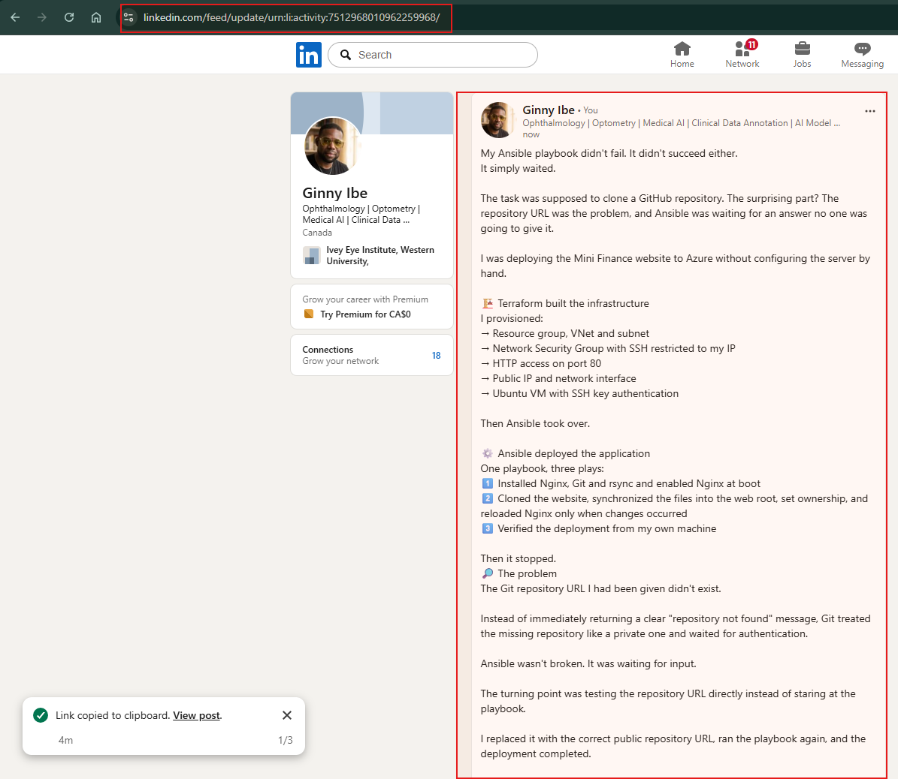


---

#### LinkedIn Post URL

Paste your LinkedIn post URL here:

https://lnkd.in/p/gJ-DcKrK 

---

### LinkedIn Submission Notes

**One challenge you faced and how you fixed it:**

- My Terraform code was valid, but the VM failed to deploy with a SkuNotAvailable error. The Standard_B2s size I requested had no capacity in East US 2. When I checked which sizes my subscription could use in that region, no B-series size was available at all. I switched to Standard_D2als_v7. Because I had put the VM size in variables.tf, the fix was a one-line change. That size also requires NVMe disks, so I added disk_controller_type = "NVMe" to the VM resource. Before that, I also had to register my subscription for the Microsoft.Network and Microsoft.Compute providers, because a new subscription can't create those resources until they're registered. These issues taught me that valid code can still fail because of cloud capacity, quotas or account settings. Now I check availability before I deploy, and I keep values that might change in variables.

---

**One real-world example where you can use this learning:**

- A finance company needs a fresh, identical test environment for every software release. With this workflow, Terraform creates the network, firewall rules and servers in minutes, and Ansible installs the web server and deploys the application. A built-in HTTP check then confirms the application works before the QA team starts testing. Every environment is built from the same code, so there are no "it worked on my machine" surprises. After testing, a single terraform destroy removes everything, so the company only pays for the environment while it's in use. The same approach works for disaster recovery: if a region goes down, the team can rebuild the whole setup in another region from the same code.

---

# Assignment Questions

Answer the following in your own words:

**1. What did you provision using Terraform in this assignment?**

- I used Terraform to build a complete Ubuntu web server environment on AWS, and then the same setup same on Azure.

- AWS: a VPC (10.0.0.0/16) with a public subnet and a private subnet, an internet gateway, and a route table that gives the public subnet internet access. I also created a security group allowing SSH and HTTP, an SSH key pair (mini-finance-aws-key), and a t3.micro EC2 instance (mini-finance-vm). That's 9 resources in total.
- Azure: a resource group, virtual network, subnet, static public IP, network interface, and a network security group attached to the NIC. Last came the Ubuntu 24.04 VM (Mini-Finance-VM).

- I used variables.tf so values aren't hardcoded, and outputs.tf to show the public IP, the SSH command and the website URL after deployment.

---

**2. What did Ansible configure and deploy in this assignment?**

- Ansible configured the server and deployed the website. It updated the apt cache and installed Nginx, Git and rsync, then made sure Nginx was running and would start again after a reboot. It cloned the Mini Finance website repository into /opt/mini-finance and synced the files into /var/www/html/, leaving out .git. It made www-data:www-data the owner so Nginx could serve the files, and reloaded Nginx through a handler when the content changed. Finally, it checked from my controller that the website was live.

---

**3. Why is SSH access on port `22` restricted to your public IP address?**

- SSH gives full control of the server, so it should be open only to people who need it. By setting allowed_ssh_cidr to my own IP as a /32, only my machine can even try to connect. Bots constantly scan the internet for open SSH ports and try to break in, so this greatly reduces the attack surface. The downside is that if my home IP changes, I have to update terraform.tfvars and run terraform apply again, or SSH and Ansible will time out.

---

**4. Why is HTTP port `80` open to the internet?**

- Port `80` serves the Mini Finance website, which is meant to be public. Anyone with a browser needs to reach it, so it's open to 0.0.0.0/0. This is a safe trade-off because port 80 only exposes Nginx serving static files, not control of the server.

---

**5. What is the purpose of the Ansible inventory file?**

- The inventory tells Ansible which servers to manage and how to connect to them. Mine puts the server's public IP in a [web] group, and under [web:vars] it sets the SSH user and private key. That's ubuntu and mini-finance-aws-key on AWS, and azureuser and mini-finance-vm-key on Azure. Because the playbook targets the web group instead of a specific IP, the same site.yml worked on both clouds without changes.

---

**6. Why does the playbook use separate plays for install, deploy, and verify?**

- Each play has one clear job, which makes the playbook easier to read, troubleshoot and reuse. The install and deploy plays run on the web server with become: true because they need root access. The verify play runs on localhost with a local connection and no privilege escalation, because it tests the site from the outside, the way a real user would. Plays run in order, so the site is deployed only after Nginx is installed, and verified only after it's deployed. If something fails, I can see straight away which stage it was.

---

**7. Why is `rsync` useful when deploying website files?**

- `rsync` copies a whole folder in one step, and it only transfers files that changed, so redeploys are fast. It also lets me exclude folders like .git, which shouldn't be on a public web server. Because it reports whether anything changed, Ansible only triggers the Nginx reload handler when there's new content. I also used --chown=www-data:www-data during the sync so the ownership is right from the start and repeat runs don't report false changes.

---

**8. What does the Ansible `uri` module verify in this assignment?**

- It sends a real HTTP request from my controller to the server's public IP and checks that it returns status code 200. That proves the whole chain works: the VM is running, the firewall allows port 80, Nginx is serving, and the website files are in place. I registered the result and used assert to confirm status == 200, so the playbook proves the site is live instead of just assuming it worked because no task failed.

---

**9. What issue did you face during this assignment, and how did you fix it?**

I hit several issues, and each one taught me something:
- Playbook stuck at the clone task: the repository URL in the assignment returned 404. GitHub treats a missing repo like a private one, so Git on the server waited for a username that never came. I tested the URL, found it didn't exist publicly, and switched to the public Mini Finance repository.
- Permission denied (publickey): my inventory pointed at ~/.ssh/id_ed25519 from the example, but Terraform had registered a different key. I changed the inventory to the right key.
- Azure deployment errors:
  - The subscription wasn't registered for Microsoft.Network and Microsoft.Compute, so I registered both.
  - Standard_B2s wasn't available in East US 2, so I switched to Standard_D2als_v7, which also needed the NVMe disk controller setting.
  - Terraform couldn't find the SSH public key file, so I generated it with ssh-keygen.
- Terraform state lock: I ran terraform apply while another apply was still running. I learned the lock protects the state file, and that I should let the first run finish instead of forcing the lock open.

---

**10. What did you learn from using Terraform and Ansible together?**

- Terraform and Ansible do different jobs that fit together. Terraform builds the infrastructure (network, firewall, VM), and Ansible makes that server do something useful by installing software and deploying the app. Terraform's outputs, like public_ip, feed straight into Ansible's inventory. Both are declarative and idempotent, so I describe the result I want, can rerun them safely, and get the same result every time. Doing it on both AWS and Azure showed me that the Ansible side carried over unchanged, while the Terraform side had to be rewritten for each cloud's resources. I also learned to always terraform destroy when I'm finished, so I don't pay for resources I'm not using.

---

# Required Files

Confirm that the following files are included in your assignment folder:

- [x] `.gitignore`
- [x] `README.md`
- [x] `terraform/providers.tf`
- [x] `terraform/main.tf`
- [x] `terraform/variables.tf`
- [x] `terraform/outputs.tf`
- [x] `ansible/inventory.ini`
- [x] `ansible/site.yml`

---

# Submission Instructions

- Add all required screenshots in the correct order.
- Full Name must be visible in required screenshots.
- Add the Azure VM public IP address.
- Add the final Mini Finance website URL.
- Paste `inventory.ini`, `site.yml`, and `README.md` as editable text.
- Answer all assignment questions clearly in your own words.
- Add your LinkedIn post URL.
- Do not expose SSH private keys, passwords, Azure credentials, subscription IDs, Terraform state contents, or other sensitive information.

---

# Completion Checklist

- [x] Task 1: `mini-finance` project structure created
- [x] Task 1: `.gitignore` created
- [x] Task 2: Terraform Azure infrastructure code created
- [x] Task 2: `Allow-SSH` rule configured for port `22`
- [x] Task 2: `Allow-HTTP` rule configured for port `80`
- [x] Task 2: NSG associated with the Network Interface
- [x] Task 3: `terraform fmt` completed
- [x] Task 3: `terraform init` completed
- [x] Task 3: `terraform validate` completed successfully
- [x] Task 3: `terraform apply` completed successfully
- [x] Task 3: `terraform output public_ip` displayed the VM public IP
- [x] Task 4: Passwordless SSH works from the Ansible controller
- [x] Task 5: `inventory.ini` created
- [x] Task 5: Ansible ping returns `SUCCESS` and `pong`
- [x] Task 6: `site.yml` contains three separate plays
- [x] Task 6: Play 1 installs Nginx, Git, and rsync
- [x] Task 6: Play 2 clones and deploys the Mini Finance website
- [x] Task 6: Play 3 verifies HTTP status code `200`
- [x] Task 7: Playbook syntax check passes
- [x] Task 7: Ansible playbook completes successfully
- [x] Task 7: Final recap shows `failed=0` and `unreachable=0`
- [x] Task 8: Mini Finance website loads in the browser
- [x] Task 8: Azure VM public IP is visible in the browser screenshot
- [x] Task 9: `README.md` completed
- [x] Screenshots 1–15 are included
- [x] `inventory.ini`, `site.yml`, and `README.md` are pasted as editable text
- [x] Assignment questions are answered
- [x] LinkedIn post published with Anyone visibility
- [x] LinkedIn post URL added
- [x] No sensitive information is exposed

---

## About DMI & CloudAdvisory

DevOps Micro Internship (DMI) is a project-based DevOps program run by Pravin Mishra and The CloudAdvisory, focused on real-world execution, systems thinking, and career readiness.

It helps learners build strong DevOps foundations with hands-on experience.

---

## Resources

- DMI Official Website: [https://dmi.pravinmishra.com?utm_source=github&utm_medium=readme](https://dmi.pravinmishra.com?utm_source=github&utm_medium=readme)
- University: [https://university.pravinmishra.com?utm_source=github&utm_medium=readme](https://university.pravinmishra.com?utm_source=github&utm_medium=readme)
- Discord Community: [https://discord.pravinmishra.com?utm_source=github&utm_medium=readme](https://discord.pravinmishra.com?utm_source=github&utm_medium=readme)
- Blog: [https://dmi.pravinmishra.com/blog?utm_source=github&utm_medium=readme](https://dmi.pravinmishra.com/blog?utm_source=github&utm_medium=readme)
- YouTube Playlist: [https://www.youtube.com/playlist?list=PLFeSNDtI4Cho](https://www.youtube.com/playlist?list=PLFeSNDtI4Cho)
- Pravin Mishra LinkedIn: [https://www.linkedin.com/in/pravin-mishra-aws-trainer/](https://www.linkedin.com/in/pravin-mishra-aws-trainer/)
- CloudAdvisory LinkedIn: [https://www.linkedin.com/company/thecloudadvisory/](https://www.linkedin.com/company/thecloudadvisory/)

---

*This submission is part of DevOps Micro Internship (DMI) — Agentic AI Track.*