# Assignment 6 — AI-Assisted Ansible Change Risk Review

Part of the DevOps Micro Internship (DMI) with Agentic AI

---

## Purpose

In this assignment, you will build an AI-assisted Ansible risk-review workflow using `ansible-playbook --check --diff`, Bash scripting, and Claude Code.

You will review possible server changes before applying them, classify risky tasks, and keep the final apply decision under human control.

---

# Task 1 — Confirm EpicBook Connectivity and Create the Workspace

## Goal

Confirm that your previous EpicBook Ansible project is working before creating the risk-review automation.

### Evidence

#### Screenshot 1 — Output of `ansible web -i inventory.ini -m ping`

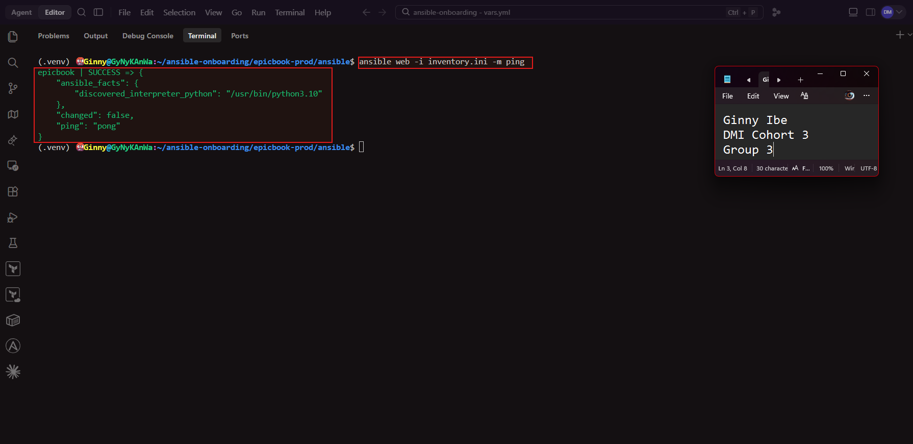

---

#### Screenshot 2 — Output of `ansible-playbook -i inventory.ini site.yml --syntax-check`

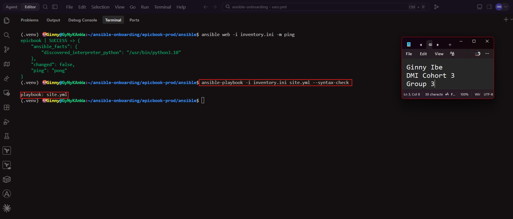

---

#### Screenshot 3 — Output of `pwd` and `find . -maxdepth 4 -type d | sort`

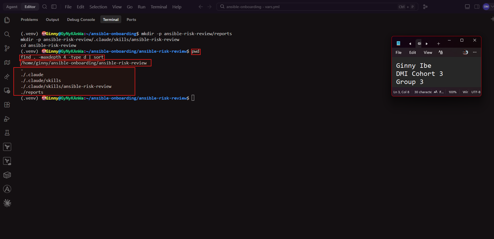
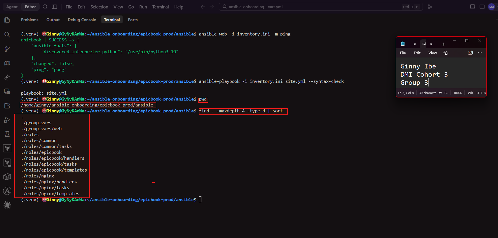

---

### Notes

Answer the following in your own words:

**1. What proves that Ansible can reach your EpicBook VM?**

- Running ansible web -i inventory.ini -m ping against the web group returned epicbook | SUCCESS with "ping": "pong". The Ansible ping module isn't an ICMP network ping. Ansible has to connect over SSH as ubuntu with my private key, find the Python interpreter on the VM (/usr/bin/python3.10) and run a small module there. A pong reply means the IP address, security group rule, SSH key, user and Python all worked. It also showed that Ansible could decrypt the vault, because ping failed with "no vault secrets found" before I set up the vault password file. The run also reported "changed": false, so the check didn't modify the VM.

---

**2. Why should you confirm playbook syntax before building a risk-review script?**

- The risk-review script relies on ansible-playbook --check --diff producing a full run with a PLAY RECAP. If the playbook has a YAML or structural error, the dry run stops before any task runs. The script would then report FAIL because of a broken playbook, not a risky change, and the report would be useless as evidence. Running --syntax-check first (it returned playbook: site.yml) shows the playbook and role structure are valid. After that, any FAIL or WARN from the script reflects what the playbook would change on the server, not a typo in the code. It's like checking your instrument works before you trust its readings.

---

# Task 2 — Create Project Context and Safety Rules in CLAUDE.md

## Goal

Create a `CLAUDE.md` file that tells Claude Code how this project must behave.

### Evidence

#### Screenshot 4 — `CLAUDE.md` open in VS Code or terminal showing the safety rules

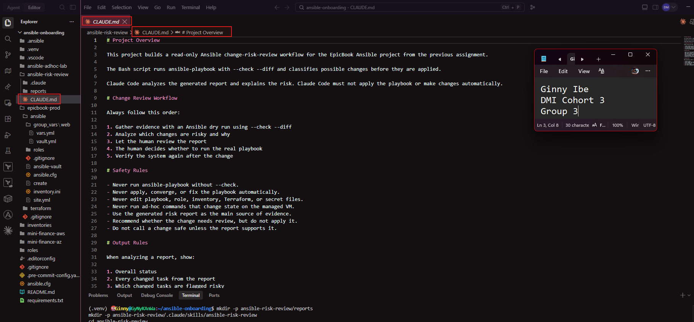

---

### Notes

Answer the following in your own words:

**1. Why should Claude Code have project-specific safety rules?**

Claude Code needs project-specific safety rules to ensure it follows the correct workflow, protects sensitive files, and does not make unauthorized changes to the infrastructure. The rules define what it is allowed to do, such as running Ansible in check mode, reading reports, and identifying risks, while keeping actual changes under human control.

---

**2. Why should the human run the real Ansible playbook manually?**

The human should run the real Ansible playbook manually to review the risk report, confirm that the proposed changes are intentional, and approve the action before it affects the server. This prevents the AI from applying potentially risky changes without human review and keeps the final decision with the human operator.

---

**3. Which rule prevents Claude Code from applying changes automatically?**

The rule stating: “Never apply, converge, or fix the playbook automatically.” This ensures Claude Code only gathers and analyses evidence and recommends actions, while the human decides whether to run the real Ansible playbook.

---

# Task 3 — Ask Claude Code to Plan the Risk Review

## Goal

Use Claude Code to produce a read-only plan before writing the Bash script.

### Evidence

#### Screenshot 5 — Claude Code showing the four-category risk-classification plan

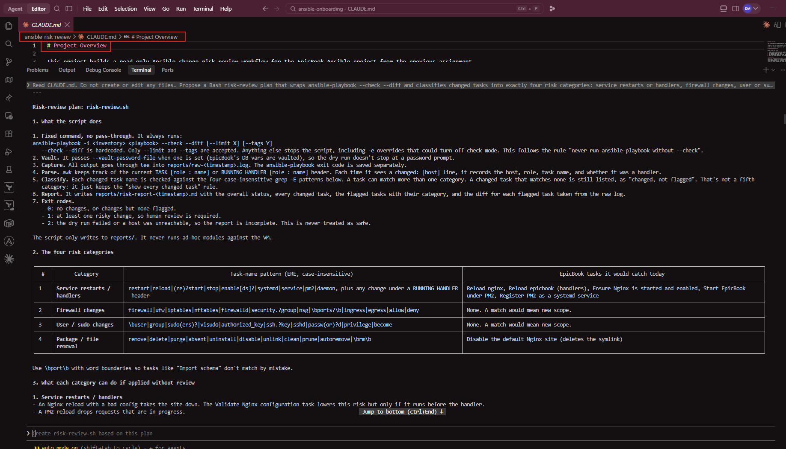
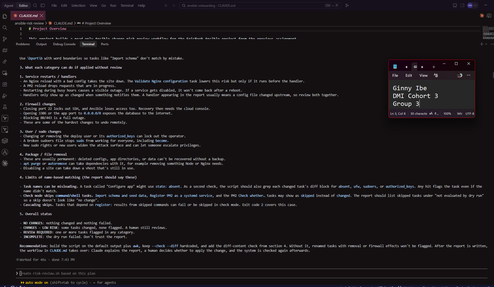

---

### Notes

Answer the following in your own words:

**1. Which part of this task represents the Gather phase?**

Claude Code can run real commands on my machine, and from there it can reach my EpicBook VM over SSH with my key and vault password. General good behaviour isn't enough, because what counts as safe depends on the project. In this project, any ansible-playbook command without --check changes a live server. The CLAUDE.md file is loaded whenever Claude Code starts in this workspace. It sets clear limits: gather and analyse evidence, but never apply changes or edit playbooks, inventory, Terraform or secret files. That makes the AI's behaviour predictable and the same every session. It also doesn't depend on me remembering to repeat the limits in every prompt.

---

**2. Which part represents the Analyze phase?**

Applying the playbook changes production. It can restart services, remove files or change access. If something goes wrong, someone has to be accountable and able to respond. The dry-run report is evidence, but it can be incomplete. For example, the script only matches task names, and check mode skips some command tasks. A person can weigh things the script can't see, such as timing, whether users are on the site, or whether a removal was intended. Keeping the real run as a manual step makes the change a deliberate, approved decision, not a side effect of an AI acting on its own reading of a report.

---

**3. How did you verify Claude Code did not create or edit files?**

Mainly the Safety Rule "Never apply, converge, or fix the playbook automatically." It's backed up by "Never run ansible-playbook without --check," which blocks the actual command that would apply changes, and by "Recommend whether the change needs review, but do not apply it." The project overview says the same thing: "Claude Code must not apply the playbook or make changes automatically."

---

# Task 4 — Build the Ansible Risk Review Script

## Goal

Create a Bash script that runs an Ansible dry run and classifies risky changes.

### Evidence

#### Screenshot 6 — Top section of `ansible-check-review.sh` showing `full_name`, `playbook_path`, `inventory_path`, and the `checks` array

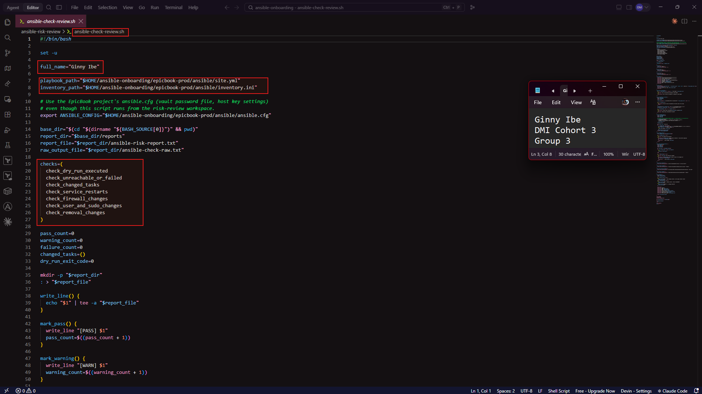

---

#### Screenshot 7 — Middle section showing `extract_changed_tasks` and `check_tasks_matching_pattern`

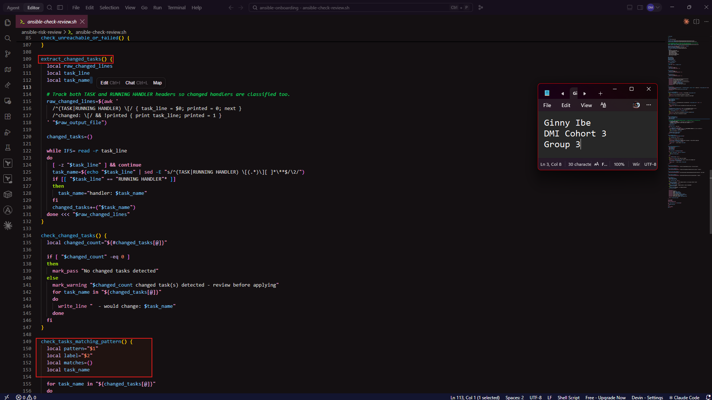

---

#### Screenshot 8 — Bottom section showing the loop, summary, and exit behavior

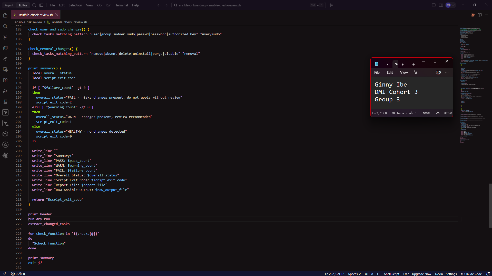

---

#### Screenshot 9 — Output of `bash -n ansible-check-review.sh` and `ls -l ansible-check-review.sh`

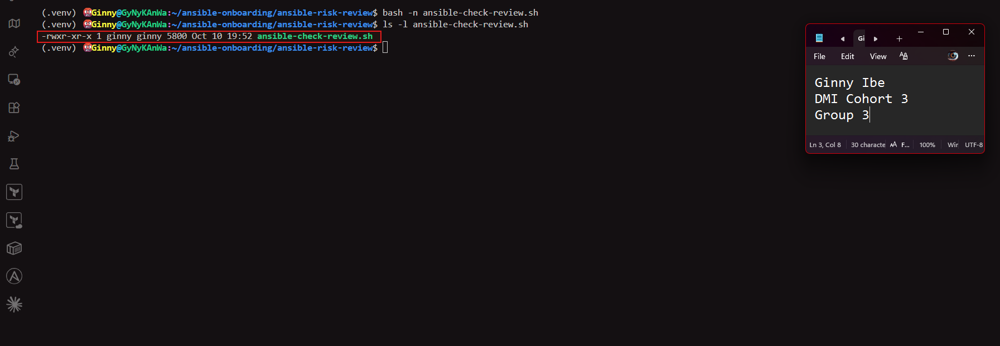

---

### Notes

Answer the following in your own words:

**1. What is stored in the `changed_tasks` array?**

It holds the name of every task, or handler, that Ansible reported as changed during the dry run, once per task. Names are stored in role : task name form, such as common : Update apt cache. The script removes the TASK [ ... ] **** wrapping with sed. Handlers get a handler: prefix, for example handler: nginx : Reload nginx. Tasks that came back ok or skipped aren't stored. The array is the single list that every later check reads from. check_changed_tasks prints it, and the four risk checks match each name against their category patterns.

---

**2. Which function finds changed tasks from the Ansible output?**

extract_changed_tasks(). It reads reports/ansible-check-raw.txt with awk, remembering the most recent TASK [ or RUNNING HANDLER [ header line. When a changed: [host] line follows, it outputs that header once. A while read loop then cleans each header with sed and adds the task name to changed_tasks. It runs once, right after run_dry_run and before any of the checks.

---

**3. Why does the script use `--check --diff`?**

`--check` puts Ansible in dry-run mode. It connects to the VM and works out what each task would do, but it doesn't change anything, so the script can safely gather evidence without touching the live server. --diff adds before-and-after detail, for example the exact lines that would change in the Nginx site config, so a reviewer can see what would change and not just which task. Together they show what the playbook would do before anyone applies it. That's the "Gather" step in CLAUDE.md, and it keeps the script read-only. One limit: check mode can't simulate tasks that depend on earlier changes. I saw this when "Install Node.js" failed because the NodeSource repo was only added in simulation.

---

**4. Why does the script use different exit codes for healthy, warning, and failed results?**

Exit codes let other programs act on the result without parsing the report text:
- 0 (HEALTHY): no changes, so the playbook is a no-op on the current server.
- 1 (WARN): changes exist but none match a risk category, so review is recommended.
- 2 (FAIL): a risky change was found, or the dry run itself failed (unreachable or failed hosts), so don't apply without review.

A CI pipeline, a scheduled job or the Claude Code skill can then decide what to do: continue on 0, pause for a person on 1, block on 2. Checking $? right after the run (Task 5) shows the result clearly. That's more reliable than reading the report, and it follows the Unix convention that 0 means success and anything else needs attention.

---

# Task 5 — Run the Baseline Dry-Run Review

## Goal

Run the script against your current EpicBook playbook and confirm the baseline risk status.

### Evidence

#### Screenshot 10 — Output of `./ansible-check-review.sh`

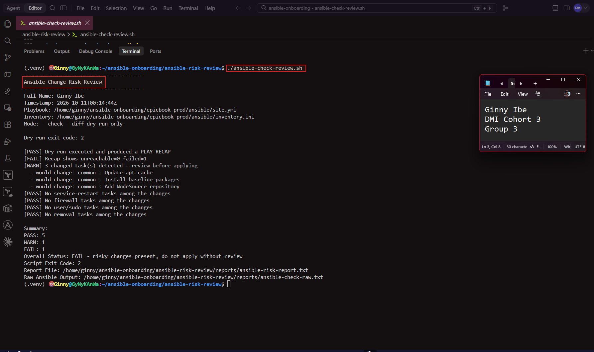

---

#### Screenshot 11 — Output of `echo "Captured Exit Code: $script_exit_code"` and `cat reports/ansible-risk-report.txt`

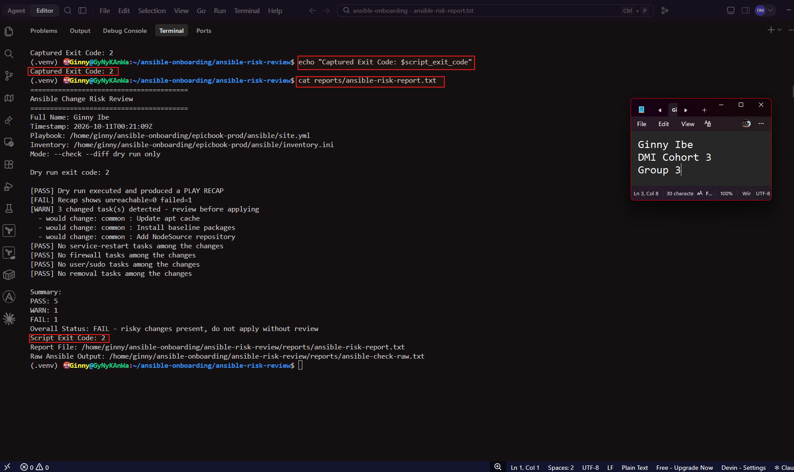

---

### Notes

Answer the following in your own words:

**1. What was the overall status of your baseline run?**

FAIL, with "risky changes present, do not apply without review." The FAIL didn't come from a risky change: all four risk categories passed. It came from the run itself. The recap showed unreachable=0 failed=1 because the common : Install Node.js (includes npm) task failed with "No package matching 'nodejs' is available." The EpicBook VM had been recreated, so it was a fresh Ubuntu server that had never been configured. In check mode, "Add NodeSource repository" only reports that it would add the repo; it doesn't add it. The next task then can't find Node.js. This is a limit of --check on a fresh server, not a problem with the playbook.

---

**2. Did any tasks report `changed`?**

Yes, three tasks, all in the common role:
- common : Update apt cache
- common : Install baseline packages
- common : Add NodeSource repository

These are what you'd expect on a fresh server. The dry run stopped at the Node.js failure, so the nginx and epicbook roles were never evaluated. The report doesn't show everything the playbook would change.

---

**3. Were any changed tasks flagged as risky?**

No. All four risk checks passed: no service restart or handler, firewall, user/sudo or removal tasks were among the changes. Installing packages and adding an apt repository don't match any of the risk patterns. Because the run stopped early, though, this doesn't prove the full playbook is risk-free. Following the CLAUDE.md rule "Do not call a change safe unless the report supports it," I wouldn't call it safe from this report alone.

---

**4. What does the script exit code mean?**

The script exited with 2, its highest level: "do not apply without review." Here it was triggered by failed=1, not a risky task. The script treats a failed or unreachable dry run as a FAIL because incomplete evidence can't support a decision. In general, 0 = HEALTHY (no changes), 1 = WARN (changes, none risky, review recommended), 2 = FAIL (risky changes or a failed dry run). The exit code lets a person or another tool, such as a CI pipeline or the Claude Code skill, act on the result without reading the report.

---

# Task 6 — Create and Run the Claude Code Skill

## Goal

Turn the Bash script into a reusable Claude Code skill called `/ansible-risk-review`.

### Evidence

#### Screenshot 12 — `SKILL.md` showing the frontmatter, allowed tools, and safety rules

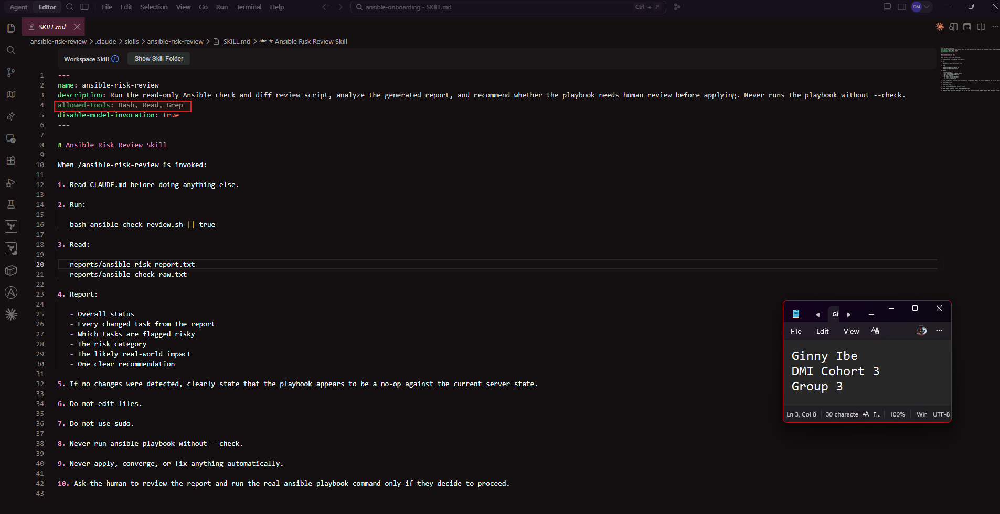

---

#### Screenshot 13 — Claude Code output after running `/ansible-risk-review`

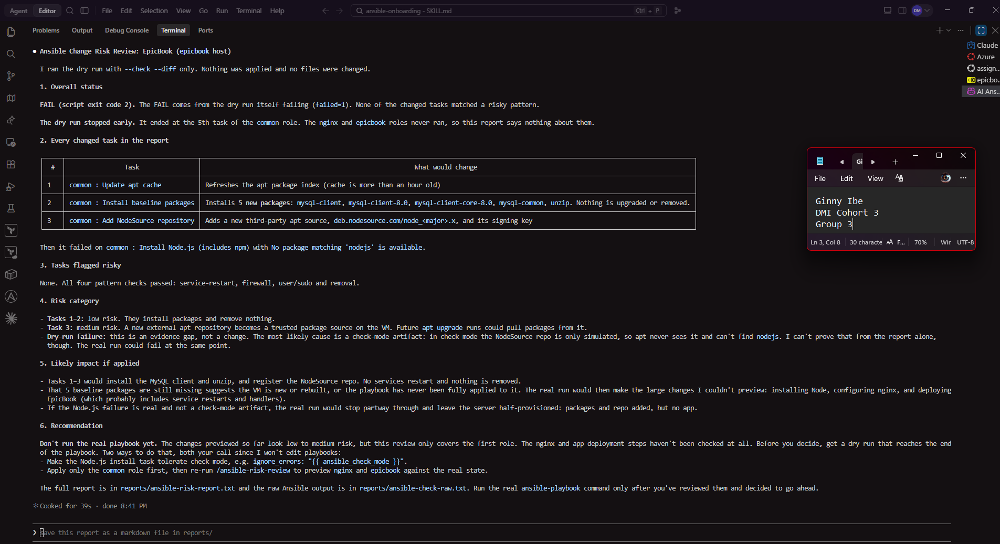

---

### Notes

Answer the following in your own words:

**1. Why does this skill allow `Bash`, `Read`, and `Grep`?**

Those are the only tools the review needs. Bash runs ansible-check-review.sh, which runs the dry run. Read opens the two report files. Grep finds specific lines in the raw output, like the error or the recap. All three only gather or look at evidence; none of them edit files directly. Bash can still change state, so the rules in CLAUDE.md (--check only, no ad-hoc commands) are what keep it safe.

---

**2. Why does this skill not allow file editing?**

The skill's job is to review a change, not to make one. If Claude could edit files, it might "fix" a playbook, role or inventory to make the dry run pass. That would change the very thing being reviewed, without anyone looking at it first. Today's run shows the danger: the Node.js task failed, and an editing tool could have quietly patched it. Without editing, Claude has to report the failure and leave the decision to the human. One caveat: allowed-tools pre-approves the listed tools, but it doesn't strictly block others. The "no edits" rule in the skill and CLAUDE.md is part of what enforces it.

---

**3. What part is handled by Bash?**

Bash collects the evidence the same way every time. The script:
- runs ansible-playbook --check --diff
- saves the raw output
- parses the PLAY RECAP for unreachable and failed counts
- lists every changed task, including handlers
- flags changed tasks whose names match risky keywords (restart, firewall, user/sudo, removal)
- writes a PASS/WARN/FAIL summary and an exit code

This part is fixed rules, so it gives the same result every time and could also run in CI.

---

**4. What part is handled by Claude Code?**

Claude interprets the evidence, which keyword matching can't do. Today the script only said "FAIL, 3 changes, nothing risky." Claude added that:
- the FAIL came from a failed task, not from a risky change
- the failure is probably a check-mode artifact, because the NodeSource repo is only simulated in check mode
- the dry run stopped early, so the nginx and epicbook roles were never previewed
- adding a third-party apt repo is a medium risk that the keyword checks miss

Claude then turned all that into one recommendation for the human.

---

**5. Why is this better than asking Claude Code if the playbook is safe without giving it evidence?**

Without evidence, Claude can only guess from the playbook code. It has no idea what's actually on the server, so it might call the playbook safe based on how the code looks. The dry run shows what would actually change on this server right now. Today, for example, it showed that 5 packages were missing and that the run stopped partway. You couldn't know either of those from reading the YAML. Grounding the answer in the report means every claim can be checked against reports/. It also leaves a record the human can review before deciding to run the real playbook.

---

# Task 7 — Introduce a Controlled Risky Change and Let the Skill Catch It

## Goal

Add a small controlled risky change in your lab playbook and confirm the script and Claude Code catch it before applying.

### Evidence

#### Screenshot 14 — The added risky task inside the role file

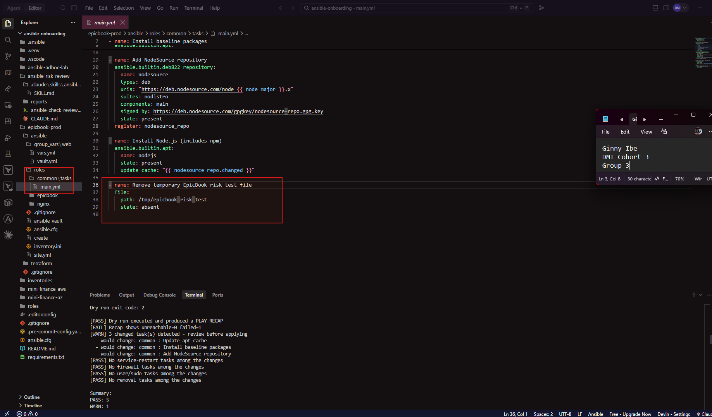

---

#### Screenshot 15 — Output of `./ansible-check-review.sh`

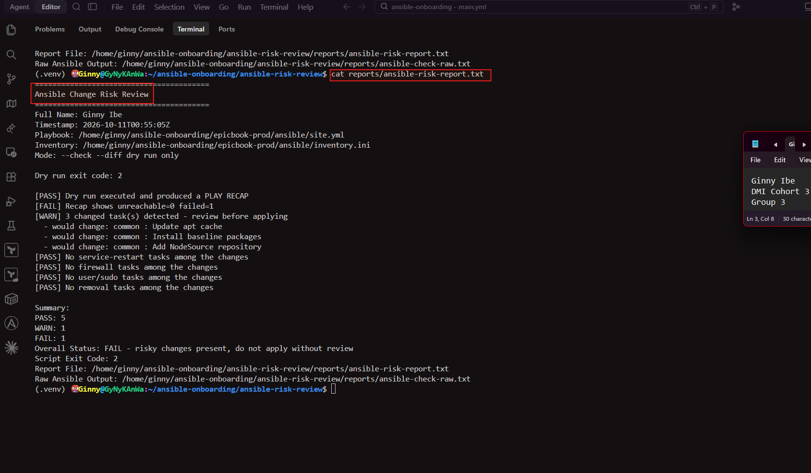

---

#### Screenshot 16 — Claude Code `/ansible-risk-review` output showing the risky finding

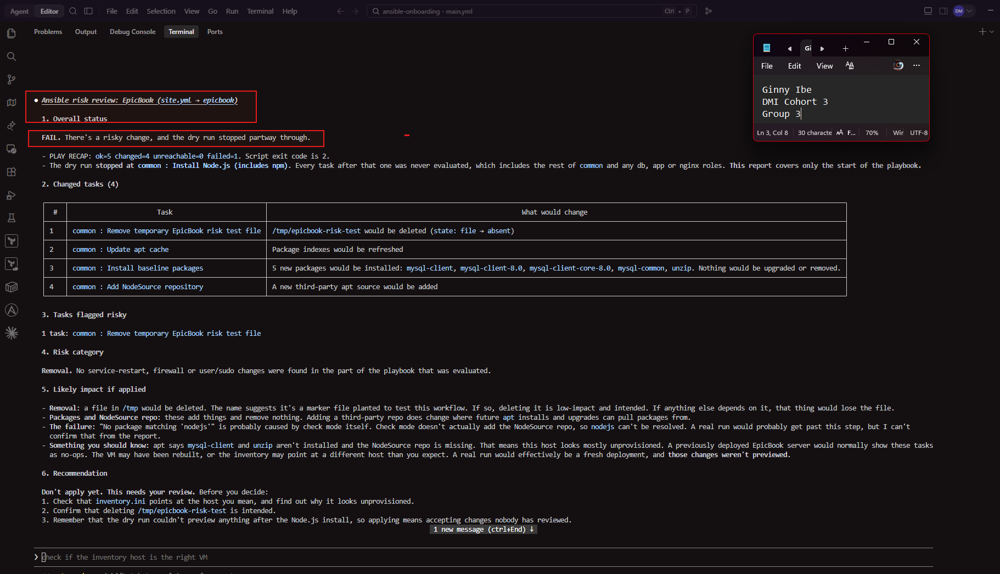
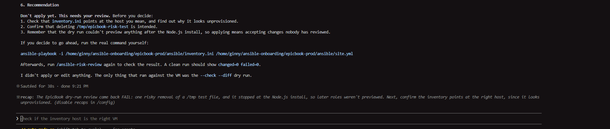

---

#### Screenshot 17 — Output of `cat reports/risky-change-report.txt`

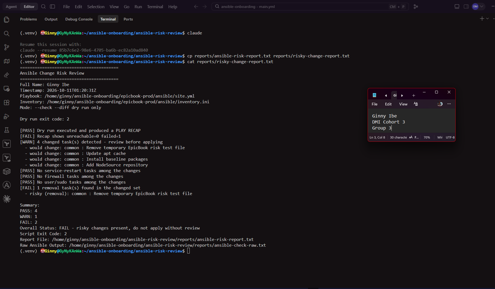

---

### Notes

Answer the following in your own words:

**1. Which risk category did the added task fall into?**

Package or file removal. The task common : Remove temporary EpicBook risk test file uses state: absent, and its name contains "Remove", which matches the removal pattern remove|absent|delete|uninstall|purge|disable. My report showed:
[FAIL] 1 removal task(s) found in the changed set
  - risky (removal): common : Remove temporary EpicBook risk test file
None of the other three categories (service restart, firewall, user/sudo) were triggered.

---

**2. What evidence proves the task would change something?**

The raw dry-run output in reports/ansible-check-raw.txt shows the --diff for the task and its changed result:
TASK [common : Remove temporary EpicBook risk test file] ****
-    "state": "file"
+    "state": "absent"
changed: [epicbook]
The diff shows /tmp/epicbook-risk-test currently exists as a file and would be deleted. risky-change-report.txt also lists it under would change: as one of 4 changed tasks. Before the run I confirmed with stat that the file existed ("exists": true). Without the file, Ansible would have reported ok and nothing would have been flagged.

---

**3. Did Claude Code apply the playbook?**

No. The skill only ran bash ansible-check-review.sh, which always uses --check --diff, and read the report files. The report header says Mode: --check --diff dry run only, and the test file was still on the VM after the review. It's removed only when I run the real playbook myself in Task 8. Claude Code recommended a review and left the decision to me.

---

**4. Why is it important that Claude Code only analyzed the risk?**

Removal is the hardest kind of change to undo, because running the playbook again won't bring a deleted file back. This was a harmless test file, but the same pattern with a wrong path could delete app code, configs or data. The report also had a second FAIL (failed=1 from the Node.js check-mode issue) that needed a person to interpret. Applying the playbook on a FAIL result without understanding it would be risky. Keeping Claude to analysis means a person makes the final decision and is accountable for it. That person can judge whether the deletion was intended and whether the timing is right. It follows CLAUDE.md: "Recommend whether the change needs review, but do not apply it."

---

**5. Which phase of the Agentic Loop is represented by the Bash report?**

Gather. The Bash script collects the evidence: it runs the dry run against the real VM, records what would change, and classifies it into the report. Claude Code explaining the report is Analyze.

---

# Task 8 — Apply as the Human, Verify, and Write the Change Summary

## Goal

Review the risky-change report, apply the playbook manually as the human operator, and verify the result.

### Evidence

#### Screenshot 18 — Output of the real playbook run showing the final recap with `failed=0`

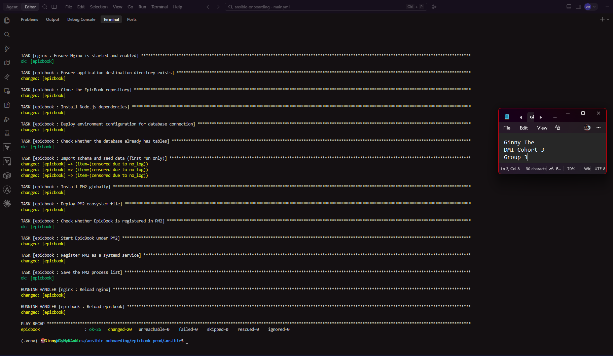

---

#### Screenshot 19 — Output of `ansible web -i inventory.ini -m ping`

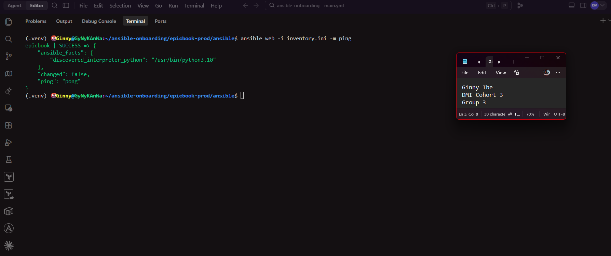

---

#### Screenshot 20 — Second `/ansible-risk-review` output after applying the change

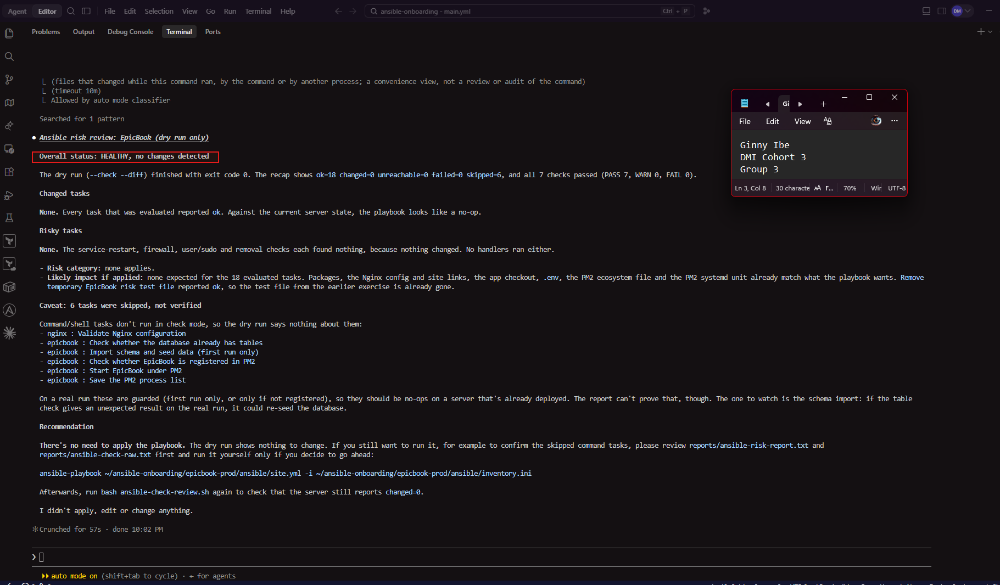

---

#### Screenshot 21 — Output of `ls -lah reports`

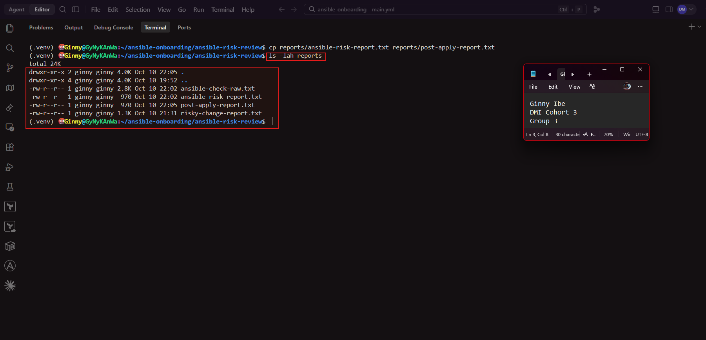

---

#### Screenshot 22 — `change-summary.md` showing all required sections and your Full Name

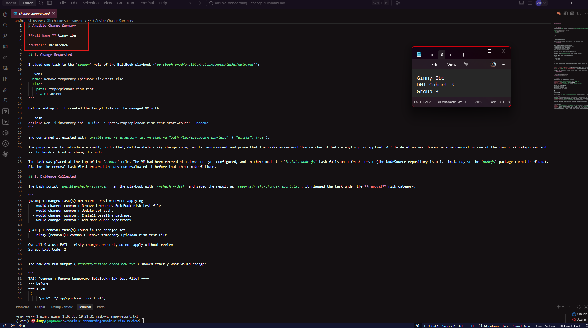
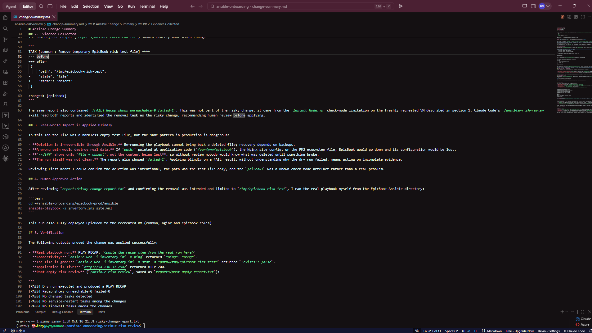
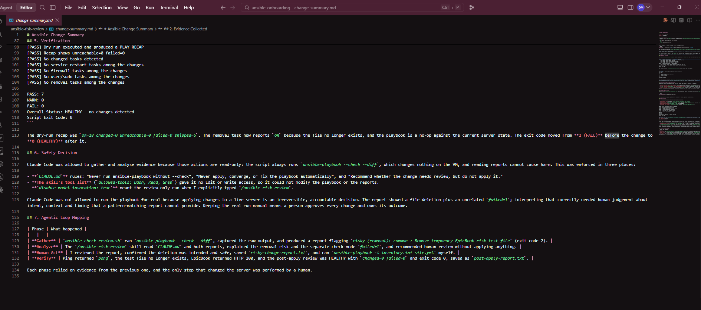
---

### Notes

Answer the following in your own words:

**1. What command did you run to apply the change for real?**

From ~/ansible-onboarding/epicbook-prod/ansible, I ran:
ansible-playbook -i inventory.ini site.yml
It's the same playbook and inventory the risk-review script uses, but without --check --diff, so Ansible actually made the changes. That included deleting /tmp/epicbook-risk-test and deploying EpicBook in full to the recreated VM.

---

**2. Who made the final decision to apply the playbook?**

I did, as the human operator. Claude Code gathered and explained the evidence and recommended a review, but it never ran the playbook without --check. I reviewed risky-change-report.txt and confirmed the removal only affected the intended test file. I also understood that the failed=1 was a check-mode artefact on the fresh VM, not a real problem. Then I chose to run the real command myself.

---

**3. What evidence proves the VM is still reachable?**

ansible web -i inventory.ini -m ping returned "ping": "pong" after the apply, so SSH, the key, the ubuntu user and Python on the VM all still work. The post-apply dry run also connected and finished with unreachable=0 failed=0. EpicBook itself responded with HTTP 200 at http://54.236.37.254/, so the server is reachable and serving the app.

---

**4. Why should the risk review be run again after applying?**

To confirm the server now matches the playbook and nothing unexpected is still pending. My post-apply review returned HEALTHY with changed=0, PASS 7 / WARN 0 / FAIL 0, and exit code 0. The removal task now reports ok because the file is already gone, which proves the change was applied. It also shows the playbook is idempotent: running it again changes nothing. Comparing exit code 2 before with 0 after gives a clear record of the change. Re-running also catches anything the apply might have broken or left half-done. That's the Verify step of the loop.

---

**5. What could go wrong if an AI agent applied Ansible changes automatically?**
- Irreversible damage. A removal task with a wrong or templated path could delete app code, configs or data, and running the playbook again won't restore them.
- Acting on bad evidence. My risky-change report also had failed=1. An agent might have treated it as harmless or "fixed" it by editing roles, without understanding it was a check-mode artefact.
- Outages and lockouts. Service restarts at the wrong time cause downtime. Firewall or sudo changes could lock everyone, including Ansible, out of the VM.
- Confident mistakes. The script matches task names, so a vaguely named dangerous task can get through. An agent that trusts a PASS could apply it, even though CLAUDE.md says "Do not call a change safe unless the report supports it."
- No accountability. Nobody would have approved the change, which makes incidents harder to explain, audit or reverse. Changes would also go out with no review step at all.

---

# LinkedIn Post Required

## Evidence

#### LinkedIn Post URL

Paste your LinkedIn post URL here:

**https://lnkd.in/p/gQE-cEDa**

---

#### Screenshot — Published LinkedIn post

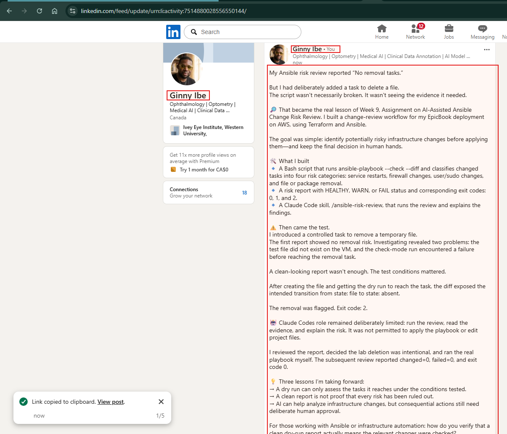

---

# Required Files

Confirm that the following files are included in your GitHub repository or assignment folder:

- [x] `CLAUDE.md`
- [x] `ansible-check-review.sh`
- [x] `.claude/skills/ansible-risk-review/SKILL.md`
- [x] `reports/risky-change-report.txt`
- [x] `reports/post-apply-report.txt`
- [x] `change-summary.md`

---

# Submission Instructions

- Add all required screenshots in your submission.
- Full Name must be visible in required screenshots and reports.
- All required notes must be answered clearly.
- Do not expose SSH private keys, passwords, cloud credentials, database credentials, or secret environment variables.
- Add your GitHub repository or folder URL inside this document.

---

# Completion Checklist

- [x] Task 1: EpicBook connectivity confirmed and workspace created
- [x] Task 2: `CLAUDE.md` created with safety rules
- [x] Task 3: Claude Code produced a read-only risk-review plan
- [x] Task 4: `ansible-check-review.sh` created and syntax checked
- [x] Task 5: Baseline dry-run review completed
- [x] Task 6: Claude Code `/ansible-risk-review` skill created and tested
- [x] Task 7: Controlled risky change introduced and detected
- [x] Task 8: Human applied the change and verified the result
- [x] Risky-change report saved
- [x] Post-apply report saved
- [x] Change summary completed
- [x] All screenshots added
- [x] All notes answered
- [x] LinkedIn post published
- [x] LinkedIn post URL added
- [x] No sensitive information exposed

---

## About DMI & CloudAdvisory

DevOps Micro Internship (DMI) is a project-based DevOps program run by Pravin Mishra and The CloudAdvisory, focused on real-world execution, systems thinking, and career readiness.

It helps learners build strong DevOps foundations with hands-on experience.

---

## Resources

- DMI Official Website: [https://dmi.pravinmishra.com?utm_source=github&utm_medium=readme](https://dmi.pravinmishra.com?utm_source=github&utm_medium=readme)
- University: [https://university.pravinmishra.com?utm_source=github&utm_medium=readme](https://university.pravinmishra.com?utm_source=github&utm_medium=readme)
- Discord Community: [https://discord.pravinmishra.com?utm_source=github&utm_medium=readme](https://discord.pravinmishra.com?utm_source=github&utm_medium=readme)
- Blog: [https://dmi.pravinmishra.com/blog?utm_source=github&utm_medium=readme](https://dmi.pravinmishra.com/blog?utm_source=github&utm_medium=readme)
- YouTube Playlist: [https://www.youtube.com/playlist?list=PLFeSNDtI4Cho](https://www.youtube.com/playlist?list=PLFeSNDtI4Cho)
- Pravin Mishra LinkedIn: [https://www.linkedin.com/in/pravin-mishra-aws-trainer/](https://www.linkedin.com/in/pravin-mishra-aws-trainer/)
- CloudAdvisory LinkedIn: [https://www.linkedin.com/company/thecloudadvisory/](https://www.linkedin.com/company/thecloudadvisory/)

---

*This submission is part of DevOps Micro Internship (DMI) — Agentic AI Track.*